## 入门

低代码引擎是一款为低代码平台开发者提供的，具备强大定制扩展能力的低代码设计器研发框架。

1. 三个关键点
2. 功能
   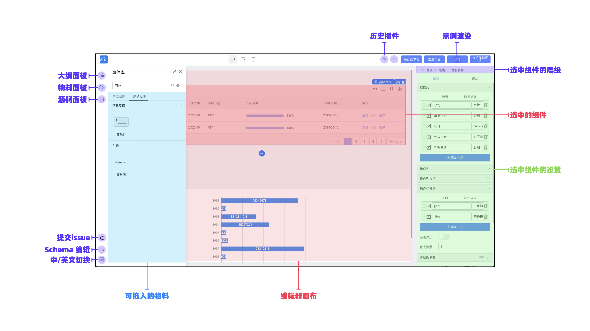
3. Demo 根据不同的设计器所需要的物料不同，分为了下面的 8 个场景
4. 代码
   - 设计器入口文件 src/index.ts 这个文件做了下述几个事情：
     - 通过 plugins.register 注册各种插件，包括官方插件 (已发布 npm 包形式的插件) 和 plugins 目录下内置的示例插件
     - 通过 init 初始化低代码设计器
   - plugins 目录，存放的都是示例插件，方便用户从中看到一个插件是如何实现的
   - services 目录，模拟数据请求、提供默认 schema、默认资产包等，此目录下内容在真实项目中应替换成真实的与服务端交互的服务。
   - 预览页面入口文件 preview.tsx
5. 插件

```tsx
import * as React from 'react'
import { IPublicModelPluginContext } from '@alilc/lowcode-types'

const LowcodePluginPluginDemo = (ctx: IPublicModelPluginContext) => {
  return {
    // 插件对外暴露的数据和方法
    exports() {
      return {
        data: '你可以把插件的数据这样对外暴露',
        func: () => {
          console.log('方法也是一样')
        }
      }
    },
    // 插件的初始化函数，在引擎初始化之后会立刻调用
    init() {
      // 你可以拿到其他插件暴露的方法和属性
      // const { data, func } = ctx.plugins.pluginA;
      // func();

      // console.log(options.name);

      // 往引擎增加面板
      ctx.skeleton.add({
        area: 'leftArea',
        name: 'LowcodePluginPluginDemoPane',
        type: 'PanelDock',
        props: {
          description: 'Demo'
        },
        content: <div>这是一个 Demo 面板</div>
      })

      ctx.logger.log('打个日志')
    }
  }
}

// 插件名，注册环境下唯一
LowcodePluginPluginDemo.pluginName = 'LowcodePluginPluginDemo'
LowcodePluginPluginDemo.meta = {
  // 依赖的插件（插件名数组）
  dependencies: [],
  engines: {
    lowcodeEngine: '^1.0.0' // 插件需要配合 ^1.0.0 的引擎才可运行
  }
}

export default LowcodePluginPluginDemo
```

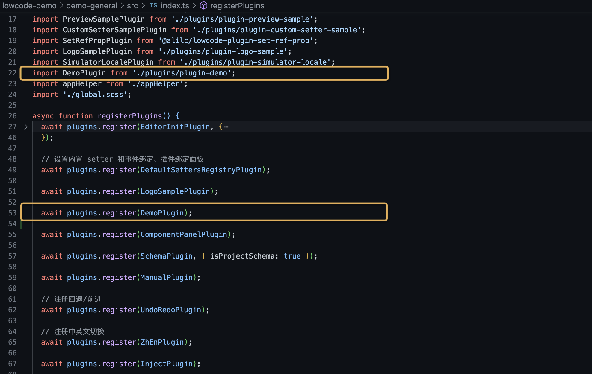

6. 物料

   我们将刚刚发布的组件的 assets-prod.json 的内容放到 demo 的 src/universal/assets.json 中。

## 创建编辑器

### 接入编辑器

- 通过官方命令行工具创建编辑器
- 手工引入低代码 UMD 包，手工配置、打包和启动。适合 Webpack 配置工程师。

### 接入运行时

低代码引擎的`编辑器将产出两份数据`：

资产包数据 assets：包含物料名称、包名及其获取方式，对应协议中的《低代码引擎`资产包协议`规范》
页面数据 schema：包含页面结构信息、生命周期和代码信息，对应协议中的《低代码引擎`搭建协议`规范》

经过上述两份数据，可以直接交由渲染模块或者出码模块来运行，二者的区别在于：

- 渲染模块：使用资产包数据、页面数据和低代码运行时，并且允许维护者在低代码编辑器中用 低代码（LowCode）的方式继续维护；基于官方提供的渲染模块 @alilc/lowcode-react-renderer，你可以在 React 上下文渲染低代码编辑器产出的页面。

  ```tsx
  import React from 'react'
  import ReactRenderer from '@alilc/lowcode-react-renderer'

  const SamplePreview = () => {
    return <ReactRenderer schema={schema} components={components} />
  }
  ```

- 出码模块：不依赖低代码运行时和页面数据，直接`生成可直接运行的代码`，并且允许维护者用 源码（ProCode） 的方式继续维护，但无法再利用低代码编辑器；
  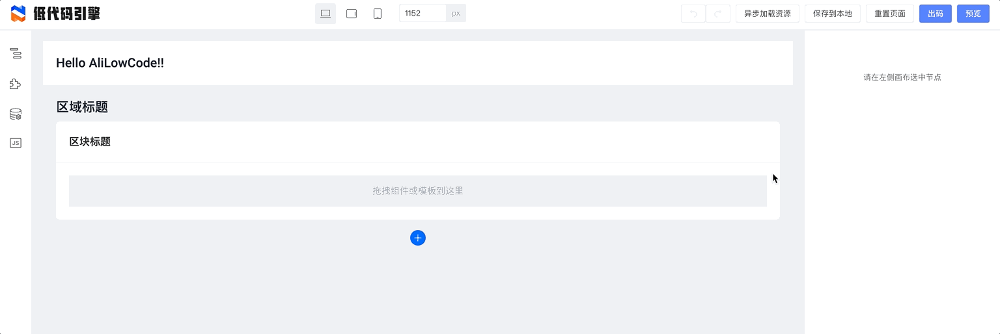

### 低代码的生产和消费流程总览

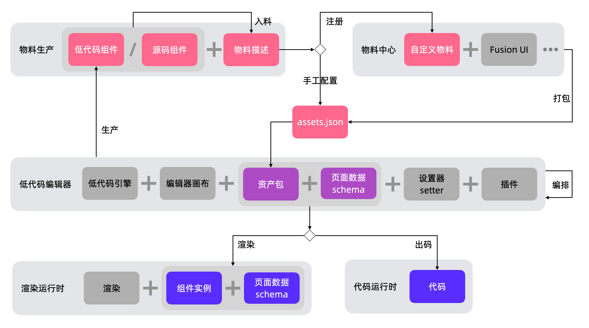

## 扩展编辑器

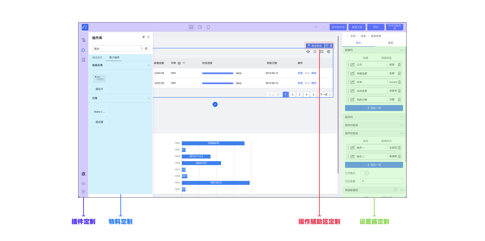

- 插件定制：可以配置低代码编辑器的功能和面板
- 物料定制：可以配置能够拖入的物料
- 操作辅助区定制：可以配置编辑器画布中的操作辅助区功能
- 设置器定制：可以配置编辑器中组件的配置表单

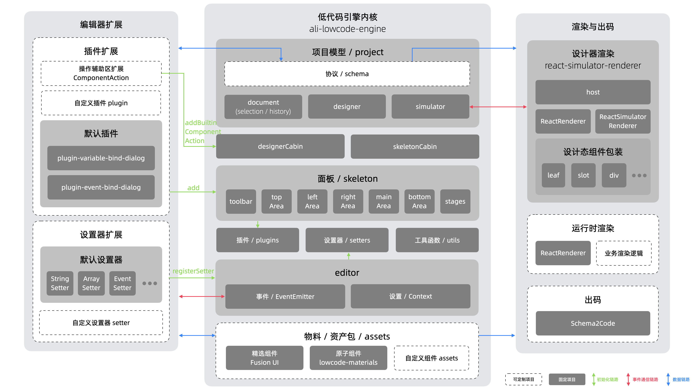

### 物料扩展

物料是页面搭建的原料，按照粒度可分为`组件、区块和模板`：

- 组件：组件是页面搭建最小的可复用单元，其只对外暴露配置项，用户无需感知其内部实现；
- 区块：区块是`一小段符合低代码协议的 schema`，其内部会包含一个或多个组件，用户向设计器中拖入一个区块后可以随意修改其内部内容；
- 模板：模板和区块类似，也是一段符合低代码协议的 schema，`不过其根节点的 componentName 需固定为 Page，它常常用于初始化一个页面；`

低代码编辑器中的物料需要进行一定的配置和处理，才能让用户在低代码平台使用起来。这个过程中，需要`一份配置文件，也就是资产包。`资产包文件中，针对每个物料定义了它们在低代码编辑器中的使用描述。

### 插件扩展

### 设置器扩展

`每个设置器本质上都是一个 React 组件，接受由引擎传入的参数，比如 value 和 onChange，value 是初始传入的值，onChange 是在设置器的值变化时的回传函数，将值写回到引擎中。`

设置器主要用于低代码组件属性值的设置，顾名思义叫"设置器"，又称为 Setter。**由于组件的属性有各种类型，需要有与之对应的设置器支持，每一个设置器对应一个值的类型。**
包含四类设置器：

属性：展示该物料常规的属性
样式：展示该物料样式的属性
事件：如果该物料有声明事件，则会出现事件面板，用于绑定事件。
高级：两个逻辑相关的属性，条件渲染和循环

## 扩展运行时

- 使用渲染模块
  渲染依赖于 schema 和 components。其中 schema 和 components 需要一一对应，schema 中使用到的组件都需要在 components 中进行声明，否则无法正常渲染。
- 使用出码功能
  将低代码编排出的 schema 进行解析并转换成最终可执行的代码的过程。
  - 一般来说在浏览器中出码适合做即时预览功能
  - 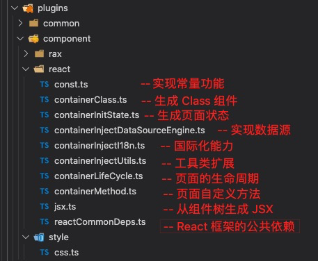

## 设计原理

### 架构综述

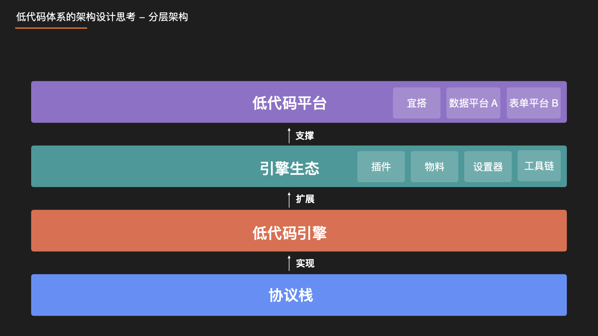
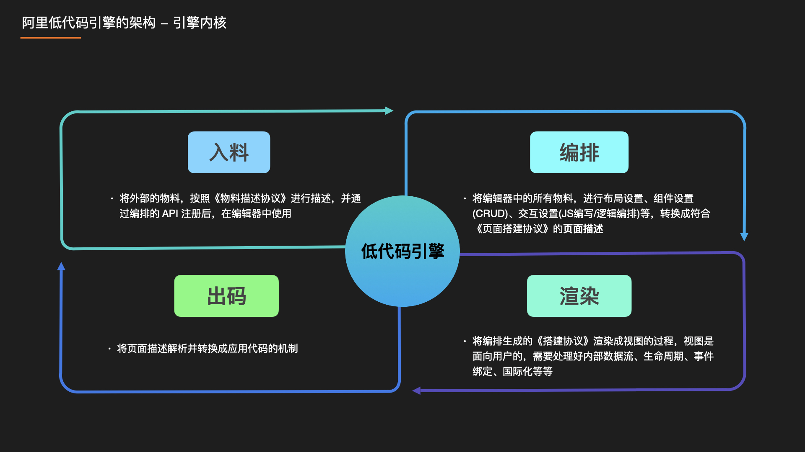
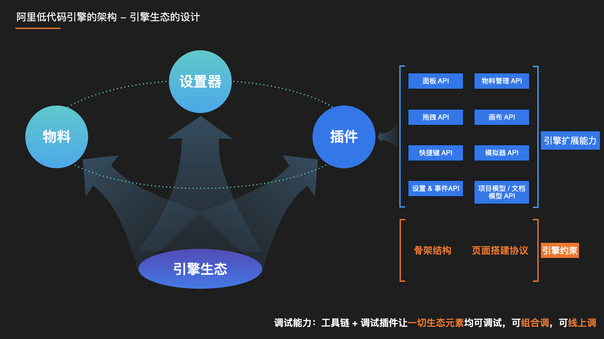

### 协议栈简介

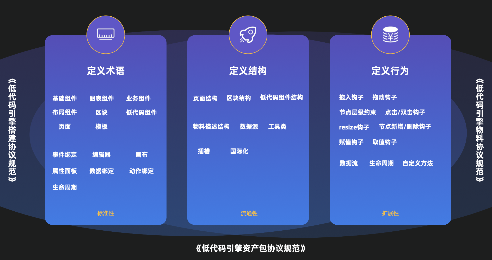

#### 为什么需要协议

建立`统一`的低代码领域`标准化`，是百利而无一害的。于是，在阿里巴巴集团 2020 年进行了讨论，建立了搭建治理&物料流通战役，此战役便产出了上文中的协议规范，成为了低代码引擎和其生态的基础。

### 入料模块设计

入料模块负责物料接入，通过自动扫描、解析源码组件，产出一份符合《中后台低代码组件描述协议》的 JSON Schema。
`@alilc/lowcode-material-parser`

### 编排模块设计

编排的本质是生产符合《阿里巴巴中后台前端搭建协议规范》的数据

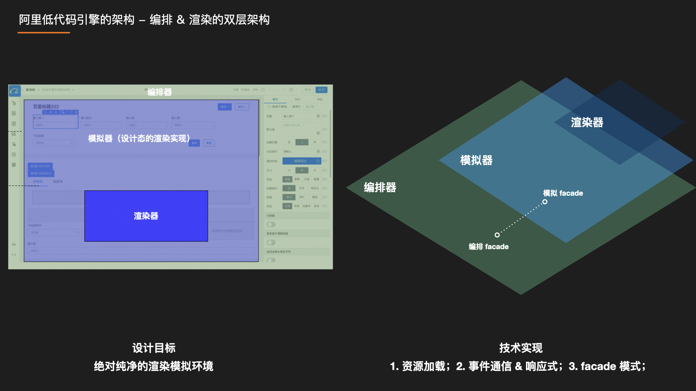
所谓编排，即将设计器中的所有物料，进行布局设置、组件设置、交互设置（JS 编写/逻辑编排）后，形成符合业务诉求的 schema 描述。
在真实场景，节点数可能有成百上千，每个节点都具有新增、删除、修改、移动、插入子节点等操作，同时还有若干约束，`JSON 结构操作起来不是很便利，于是我们仿 DOM 设计了 节点模型 & 属性模型，用更具可编程性的方式来编排，这是编排系统的基石。`

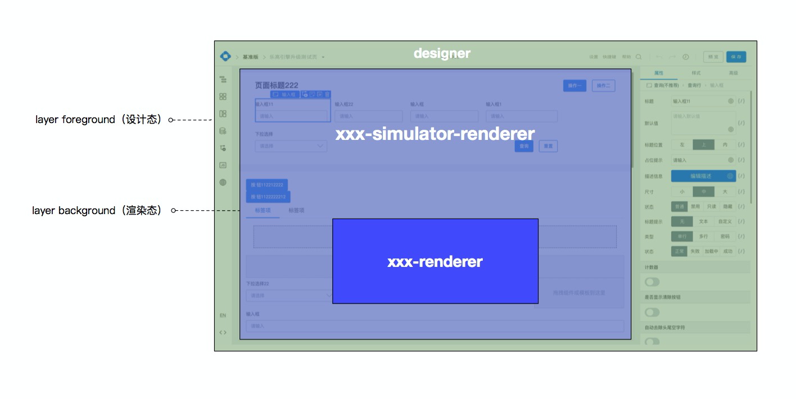
**设计器和渲染器其实处在不同的 Frame 下**，渲染器以单独的 iframe 嵌入。这样做的好处，一是为了给渲染器一个更纯净的运行环境，更贴近生产环境，二是扩展性考虑，让用户基于接口约束自定义自己的渲染器。

- xxx-renderer 是一个纯 renderer，即一个渲染器，通过给定输入 schema、依赖组件和配置参数之后完成渲染。
- xxx-simulator-renderer(`中间层`) 通过和 host 进行通信来和设计器打交道，提供了 DocumentModel 获取 schema 和组件。将其传入 xxx-renderer 来完成渲染。
  simulator-renderer 也需要提供一些方法来供 host 层调用，之后当设计器和用户有交互
  这样，host 和 simulator-renderer 之间便通过相关方法实现了双向通信，能在隔离设计器的基础上完成设计器到画布和画布到设计器的通信流程。
- designer

---

- 拖拽事件处理委托给 Sensor

#### 模型设计

我们将 schema 分成了很多层，每一层有各自的职责。
低代码引擎的模型分为`节点模型、属性模型、文档模型和项目模型。`

#### 画布渲染

画布渲染使用了设计态与渲染态的双层架构。
设计器和渲染器其实处在不同的 Frame 下，渲染器以单独的 iframe 嵌入。这样做的好处，一是为了给渲染器一个更纯净的运行环境，更贴近生产环境，二是扩展性考虑，让用户基于接口约束自定义自己的渲染器。


### 渲染模块设计

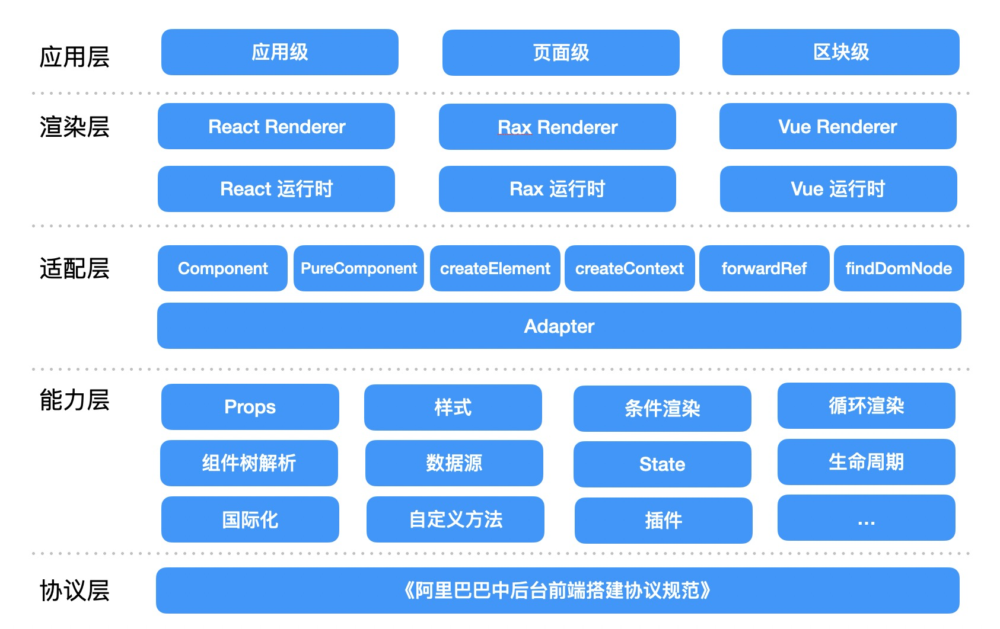

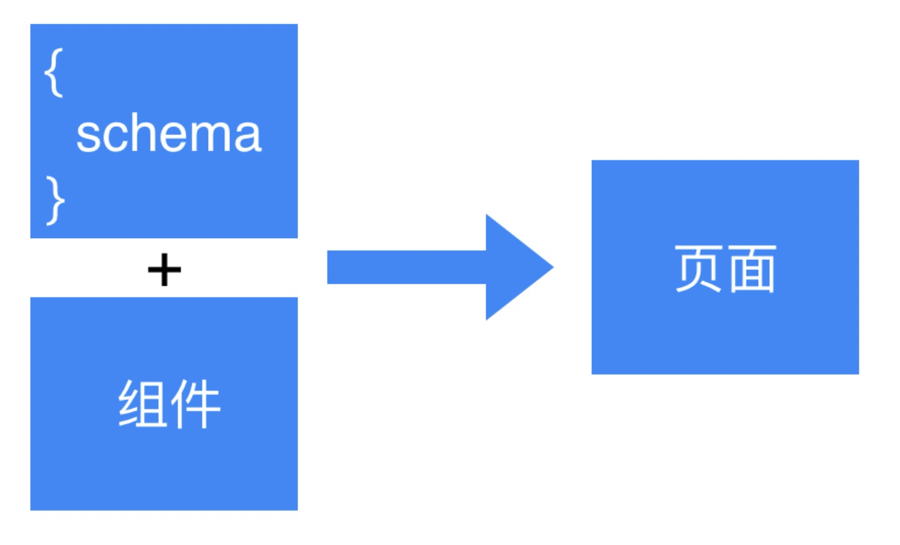
React 框架渲染 npm 包：@alilc/lowcode-react-renderer
仓库：https://github.com/alibaba/lowcode-engine 下的
packages/renderer-core
packages/react-renderer
packages/react-simulator-renderer

---

#### 预览模式渲染

**runtime，与 editor 无交互**

```tsx
import ReactRenderer from '@ali/lowcode-react-renderer'
import ReactDOM from 'react-dom'
import { Button } from '@alifd/next'

const schema = {
  componentName: 'Page',
  props: {},
  children: [
    {
      componentName: 'Button',
      props: {
        type: 'primary',
        style: {
          color: '#2077ff'
        }
      },
      children: '确定'
    }
  ]
}

const components = {
  Button
}

ReactDOM.render(
  <ReactRenderer schema={schema} components={components} />,
  document.getElementById('root')
)
```

#### 设计模式渲染(simulator)

**editor 内，与 editor 有交互，因此需要 simulator**

**模拟器主要承载特定运行时环境的页面渲染及与模型层的通信。**
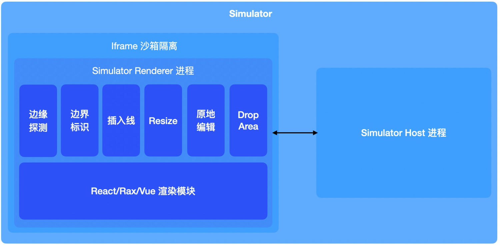

通过`注册不同的运行时环境的渲染模块`，能够实现编辑器从 React 页面搭建到 Rax 页面搭建的迁移。
通过`注册不同的模拟器画布`，你可以基于 G6 或者 mxgraph 来做关系图编排。你可以定制一个流式布局的画布，也可以定制一个自由布局的画布。

### 出码模块设计

### 设置器设计

### 数据源引擎设计

Code 模块

## 其他

---

TODO: 第一遍是跳着看的，需要仔细深入
