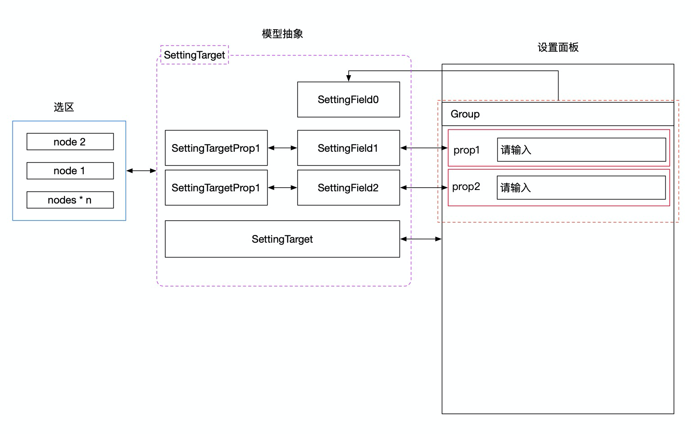

好的，我们来深入讲解这份关于“设置器设计”的文档。

想象一下，你正在驾驶一架非常先进的战斗机（低代码编辑器），“设置器”就是你面前那块**多功能显示仪表盘（MFD）**。通过这个仪表盘，你可以查看和修改飞机的各种参数（组件的属性），比如飞行姿态、引擎推力、武器挂载等。

这份文档的核心就是解释：**这个功能强大的仪表盘是如何设计和工作的？**

### 一、设置器的角色和位置

`@alilc/lowcode-engine-ext`

如文档开篇所示，设置器就是编辑器右侧的属性配置区域。它通常被划分为几个页签：

- **属性**: 组件最常规的配置项，比如按钮的文字、大小、类型。
- **样式**: 控制组件的外观，比如颜色、边距、字体大小。
- **事件**: 为组件绑定交互行为，比如按钮的 `onClick` 事件。
- **高级**: 控制组件的渲染逻辑，比如“条件渲染”（`if`）和“循环渲染”（`for`）。

**设置器的本质**：它是一个**桥梁**，连接着**用户的交互操作**和**底层的数据模型（Schema）**。

### 二、设置器模块原理：三层抽象

为了让这个“仪表盘”既功能强大又易于维护，引擎设计了一套精巧的三层抽象模型。

我们从底层往上看：

#### 1. `SettingTarget` 抽象 - “被操作的目标”

这是最底层的抽象，它代表了“**我们当前正在配置的是什么东西？**”。

- **为什么需要这层抽象？**
  一个简单直接的想法是：如果用户选中了一个按钮，那设置器直接操作这个按钮节点（`Node`）不就行了吗？
  但问题在于，用户可能**同时选中多个按钮**（比如按住 Shift 键多选），然后想把它们的尺寸一次性都改成 `large`。这就是**批量编辑**的场景。
  此时，每个按钮的原始尺寸可能都不同，直接操作单个 `Node` 无法解决这个问题。

- **`SettingTarget` 的作用**：
  它就是为了**屏蔽单选和多选的复杂性**而设计的。无论用户是选中了一个节点还是多个节点，对于上层来说，它看到的永远是一个统一的 `SettingTarget` 对象。
  - `nodes: Node[]`: 内部维护了一个节点数组，即使只选中一个，它也是一个元素的数组。
  - `setPropValue(propName, value)`: 当调用这个方法时，`SettingTarget` 内部会遍历 `nodes` 数组，把**每一个节点**的 `propName` 属性都设置为 `value`。这就优雅地实现了批量设置。
  - `getPropValue(propName)`: 获取属性值。在多选时，如果所有节点该属性值都一样，就返回这个值；如果不一样，通常会返回 `undefined`。

#### 2. `SettingTargetProp` 抽象 - “目标的某个具体属性”

`SettingTarget` 代表了被选中的一个或多个节点，而 `SettingTargetProp` 则代表了这些节点上的**某一个具体的属性**。

- **例子**: 如果你选中了两个按钮，`SettingTarget` 就代表这两个按钮的集合。而当你点击“尺寸”这个配置项时，你操作的就是 `size` 这个属性对应的 `SettingTargetProp` 实例。

- **关键功能**:
  - `propName`: 明确地告诉我们当前操作的是哪个属性，比如 `'size'`。
  - `value`: 获取或设置当前属性的值。
  - `isSameValue()`: **非常重要！** 在多选时，用它来判断所有选中节点的这个属性值是否都相同。如果不同，UI 上通常会显示一个占位符（比如输入框里显示 `multiple values`），而不是显示某个具体的值。
  - `setValue(value)`: 设置当前属性的值。它内部实际上会调用底层的 `settingTarget.setPropValue(this.propName, value)` 来完成批量设置。

#### 3. `SettingField` 抽象 - “仪表盘上的一个显示/输入控件”

这是最顶层的抽象，它代表了你在属性面板上看到的**每一个具体的 UI 控件**，比如一个文本输入框、一个下拉选择框、一个颜色选择器。

- **它是什么**: `SettingField` 本身是一个 React 组件，我们称之为**设置器 (Setter)**。
- **它接收什么**: 当引擎渲染属性面板时，会为每一个配置项创建一个 `SettingField` (Setter) 实例，并把底层的 `SettingTargetProp` 作为 `props` 传给它。
- **它做什么**:

  1.  **读取数据**: 从传入的 `SettingTargetProp` 中读取 `value` 和 `isSameValue()`，来决定自己应该如何展示。比如，一个文本输入框 Setter，如果 `isSameValue()` 为 `true`，就在输入框里显示 `value`；如果为 `false`，就显示一个灰色的占位符。
  2.  **写入数据**: 当用户在这个 UI 控件上进行操作时（比如在输入框里打字），Setter 组件会调用 `SettingTargetProp` 的 `setValue()` 方法，将新的值写回去。
  3.  **数据流**: `setValue()` 会触发底层 `SettingTarget` 的 `setPropValue()`，进而修改所有选中 `Node` 的模型数据，最终导致 Schema 变更和画布重新渲染。

- **`config` 属性**: `SettingField` 还会接收到这个配置项在物料描述协议中的所有配置信息（`SettingConfig`），比如标题、提示、占位符等，用于渲染自身的 UI。

### 总结：一个完整的数据流

我们来串一下当用户修改一个属性时，整个系统内部发生了什么：

1.  **用户操作**: 用户在画布上选中一个或多个按钮，然后在右侧属性面板的“尺寸(size)”输入框里输入了 `large`。
2.  **Setter 响应**: “尺寸”输入框这个 `SettingField` (Setter) 组件的 `onChange` 事件被触发。
3.  **调用模型 API**: Setter 组件调用它 `props` 中接收到的 `settingTargetProp.setValue('large')`。
4.  **批量处理**: `SettingTargetProp` 实例内部调用 `settingTarget.setPropValue('size', 'large')`。
5.  **修改节点**: `SettingTarget` 实例遍历其内部的 `nodes` 数组，对每一个 `Node` 实例调用 `node.setPropValue('size', 'large')`。
6.  **Schema 变更**: `Node` 模型的数据被修改，导致其对应的 Schema 部分发生变化。
7.  **触发重绘**: 引擎监听到 Schema 变化，通知渲染器（Renderer）更新视图。
8.  **画布更新**: 画布上的所有按钮尺寸都变成了 `large`。

**这个三层抽象设计的精妙之处在于：**

- **职责清晰**: `SettingTarget` 负责屏蔽多选的复杂性，`SettingTargetProp` 负责单个属性的读写，`SettingField` (Setter) 只负责 UI 的展示和用户交互的响应。
- **高度解耦**: Setter 组件开发者完全不需要关心底层是单选还是多选，也不需要关心数据是如何存储和更新的。他们只需要面向 `SettingTargetProp` 这个稳定的接口进行开发即可。这使得开发一个自定义的设置器变得非常简单和纯粹。
- **强大的扩展性**: 基于这套机制，可以轻松地开发出各种复杂的设置器，比如一个可视化的 JSON 编辑器、一个逻辑编排面板等，并将它们无缝集成到引擎中。
