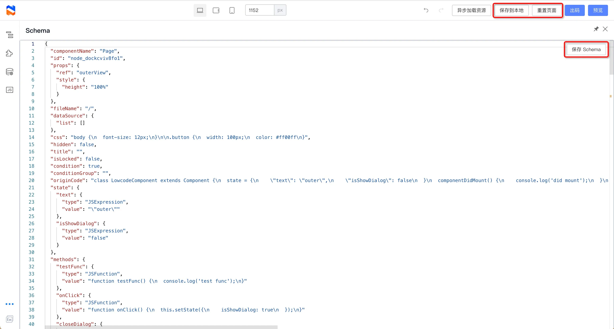

# 低代码产品使用文档

https://www.yuque.com/lce/usage

1. Schema 编辑
   【开发者专属】可以编辑页面的底层 Schema 数据。
   
   搭配顶部操作区的“保存到本地”和“重置页面”功能，可以实验各种 schema 对低代码页面的改变。
2. 中英文切换
   可以切换编辑器的语言；注：需要组件配置配合。

3. **竞品差距写在规划里**、**编排问题理一理**
   - 服务端体验返回结合思考
   - SchemaApi 收益，成功率对比
   - 不要太单点，规划
   - 画布编排结合模型能力，对比写代码：`对话、画布的自动补全`，竞品怎么做的
   - `讲文档慢一点`
   - 百次发布满意度 -> 用户问题是哪些，阻断...，思路
