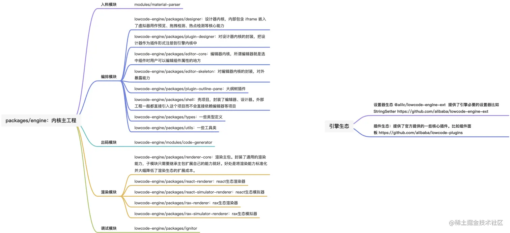

https://juejin.cn/user/3087084378665367/posts
https://juejin.cn/post/7145010646248063006#heading-9

1. MONO-REPO(monolithic repository)：单体式仓库。系统中的各个子 project 存放在同一个仓库的不同目录下，每个 project 独立发布，比如：React, Angular, Babel, Jest, Umijs, Vue ...

优势：`既保留了 mutiple-repo 的关注点分离等松耦合架构，也保留了 monolith 系统中的 changelog`

2. 三流企业做产品、二流企业做品牌、一流企业定标准

3. 《低代码引擎搭建协议规范》：给渲染引擎用的。搭建(编排)的本质是通过用户的拖动产出这份协议
   《低代码引擎物料协议规范》：给低代码引擎用的。程序员通过看组件源码获取组件支持的属性，低代码引擎通过看《物料协议规范》获取组件支持的属性
   《低代码引擎资产包协议规范》：给低代码引擎用的。`《低代码引擎物料协议规范》的集合形式，通常会把多个组件打包成资产包的形式给低代码引擎用`

4. 入料：为现有的组件增加描述后交个低代码引擎
   编排：把用户的拖拽、新增、删除等行为转化成对《低代码引擎搭建协议规范》的操作
   出码：把【编排】产生的协议转化成代码，针对特殊场景程序员可以二次开发
   渲染：把【编排】产生的协议渲染出来

5. 

6. 多模式渲染
   两处涉及到渲染的地方：编辑器内的预览态、生成页面后的渲染。
   这两种渲染大体相似但又不完全相同，`编辑态的预览涉及到跟设计器的交互`。
   低代码引擎为**渲染器增加了一层 Simulator 作为衔接层**，最大程度节省开发资源的同时保证了`预览态与真实渲染的统一`
