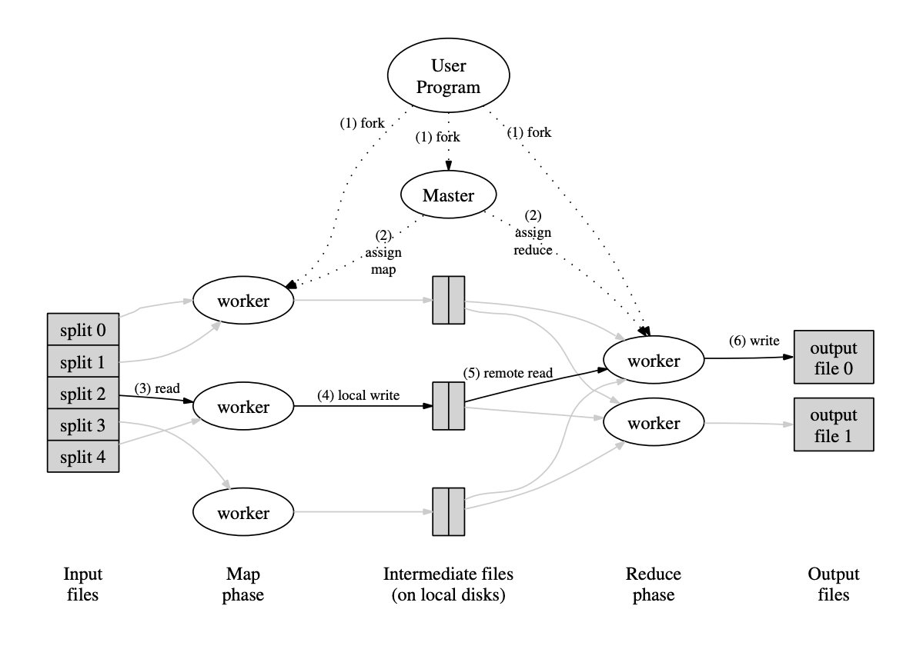
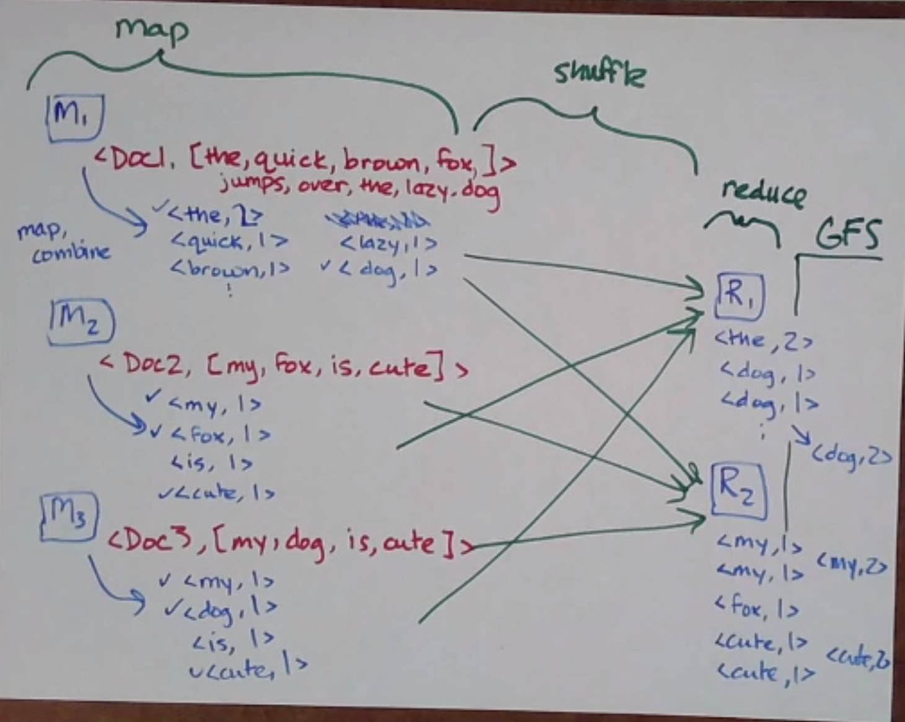

# MapReduce

## Online v. Offline Systems 在线系统与离线系统

- online systems
  aka services

  例如 KVS、Web 服务器、数据库、缓存等。
  这些服务等待来自客户端的请求，然后快速处理它们。
  优先考虑低延迟和可用性。

- offline systems
  aka batch processing systems

  例如 MapReduce、Spark、Hadoop 等。
  这些系统处理大量数据，通常不需要实时响应。
  优先考虑吞吐量和可扩展性。

在在线系统和离线系统之间有一类系统，它必须处理大量数据，但也必须在获取数据时对数据做出响应 - 此类系统是最近出现的，被称为**流系统(streaming systems)** 。它们可能用于 Google Docs 或 Twitch 等系统。

## MapReduce

为什么使用MapReduce？

- `different representations of data`
  相同的底层数据可能需要不同的表示（例如对于数据分析师来说)，在线生成很慢，需要离线处理。

  1. raw data
  2. derived data
     例如：倒排索引(inverted indexes)

- MapReduce 可以执行的其他任务包括：

  1. inverted index 倒排索引
  2. grep
  3. sort
  4. word count

- MapReduce 有 3 个主要阶段
  1. Map：根据输入的KV对生成一组中间KV对，保存在本地
  2. Shuffle：根据某种数据分区方案(例如哈希)将中间KV对发送到不同的Reducer，例如GFS
  3. Reduce：对每个Reducer的输入进行聚合

## WordCount

当操作（例如加法）具有结合律(associative)时，可以这样做！

## What Could Go Wrong

## MapReduce at Google
