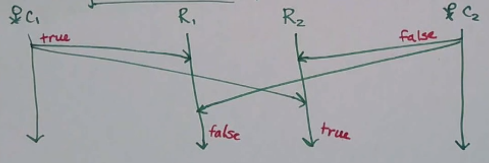
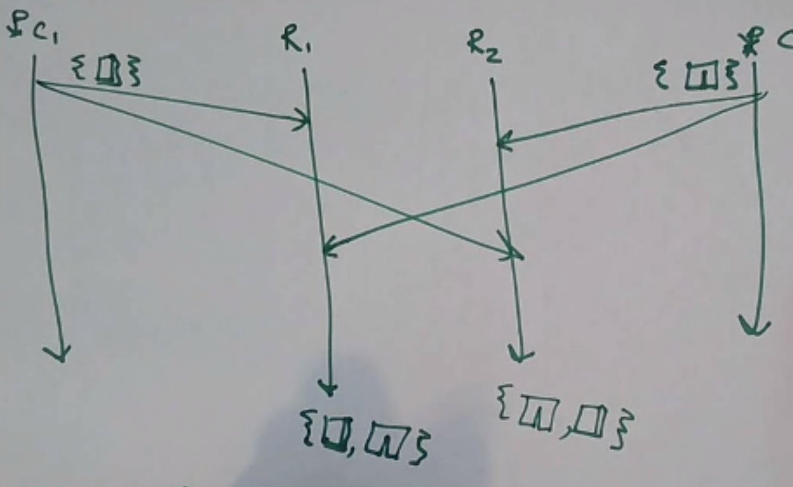
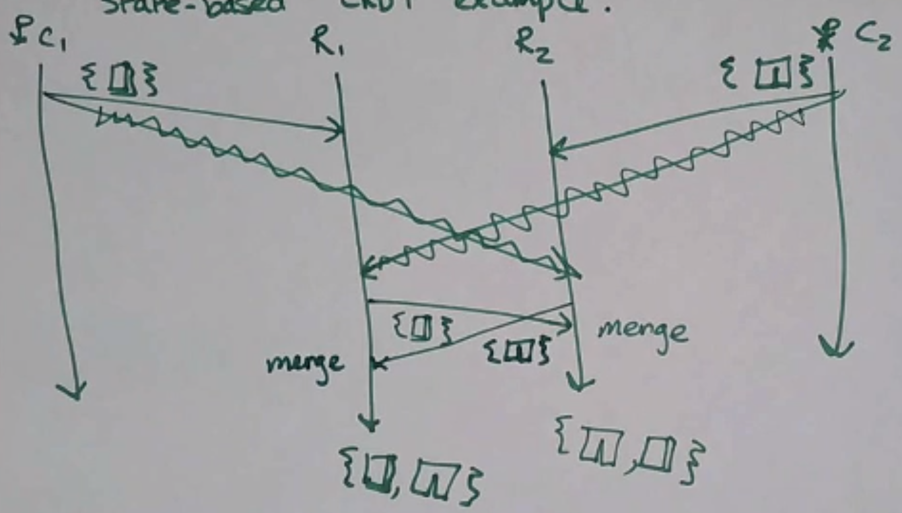

# the math behind replica conflict resolution

## The Cost of Consensus

为了实现强一致性，需要发送非常多的消息。
很多情况下，我们不需要强一致性——只需要强收敛(strong convergence)。

`不需要满足：所有副本按照相同的顺序应用相同的更新。`
只需要确保：
Replicas that have delivered the same set of updates have equivalent state.
已交付相同更新集的副本具有相同的状态。

## Strong Convergence

强收敛背后的数学原理是什么呢？

- partial ordered set 偏序集(poset)
  A set S, together with a binary relation
  - reflexive 自反性
  - transitive 传递性
  - antisymmetric 反对称性

由于偏序具有反对称性，所以 Hasse 图一定是 有向无环图，进而我们可以根据 拓扑排序 `对任意有限偏序集构造全序。`

## 序理论

https://oi-wiki.org/math/order-theory/

- 上界(UB)：偏序集中大于或等于它的子集中一切元素的元素
- 最小上界(LUB)：上界中最小的元素

例如，给定集合 S = {1,2,3}，问题是：{1} 和 {2} 的上界是什么？
答案为：{1,2} 和 {1,2,3}。最小上界是 {1,2}。

- **并半格 (join-semilattice)**
  **任意两个元素都有一个最小上界的偏序集合称为并半格。**
- 交半格 (meet-semilattice)
  任意两个元素都有一个最大下界的偏序集合称为交半格。
- 格 (lattice)
  既是并半格又是交半格的偏序集合称为格。

例如 60 的 正因子构成的集合 S = {1,2,3,4,5,6,10,12,15,20,30,60} 关于整除构成偏序集。
对其上的任意正整数a和b而言，lcm(a,b)为a和b的并，gcd(a,b)为a和b的交。
从而S是一个格。

## Example

Consider a register which can take one of three states `(true, false, empty)`.
考虑一个采用三种状态的寄存器（`true, false, empty`），empty<=false且empty<=true。

```
true   false
  \     /
   empty
```

- 如果两个客户端同时将寄存器设置为不同的非空值，则没有上界，因此您必须使用某种共识来解决冲突。
  

- State-based CRDT Example
  如果元素属于并半格，则有一种自然的方法来解决冲突：**使用最小上界(LUB)。**
  
  `the replicas can build on the estate that they have`

Read more: Conflict-Free Replicated Data Types (the above is an example of a state-based CRDT).
阅读更多内容：无冲突复制数据类型（上面是基于状态的 CRDT 的示例）。

- 如果`每个客户端仅与一个副本通信`，则由副本来**共享状态并使用 LUB 解决冲突**。
  
  The states that replicas can take on are elements of a joined semilattice, whenever a conflict comes up, you can resolve it by taking the least upper bound.
  并半格的元素，每当出现冲突时，可以通过采用最小上限来解决冲突。

## 网络分区恢复

在网络分区恢复之后，如何同步副本之间的状态？

This gets harder to handle when you have to `deal with removing things from a set`, not just adding them! One solution is to track the set of all items that have been deleted **(tombstone sets)**, but this takes space…!
当您必须处理从集合中删除内容而不仅仅是添加它们时，这会变得更难处理！一种解决方案是跟踪已删除的所有项目的集合`（墓碑集）`，但这需要空间......！

**维护两个集合：一个集合用于添加，另一个集合用于删除。**
