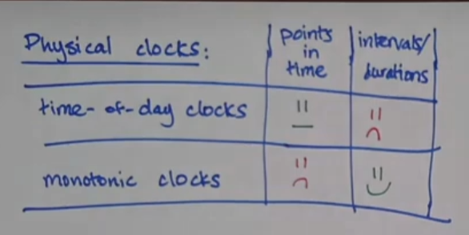
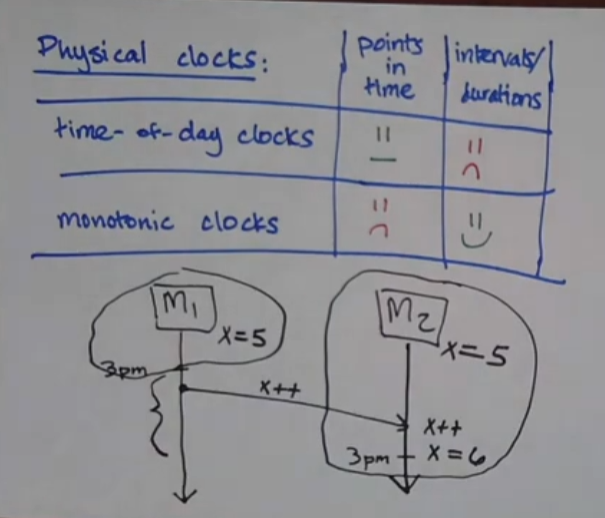
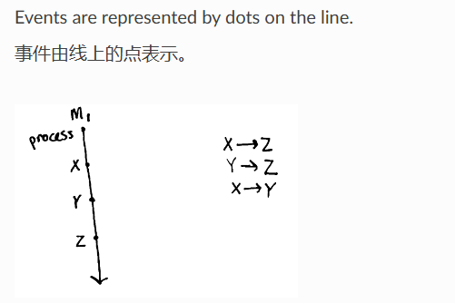
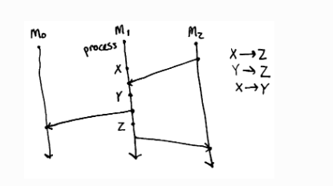
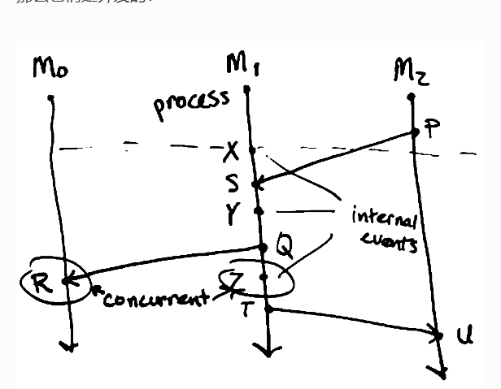
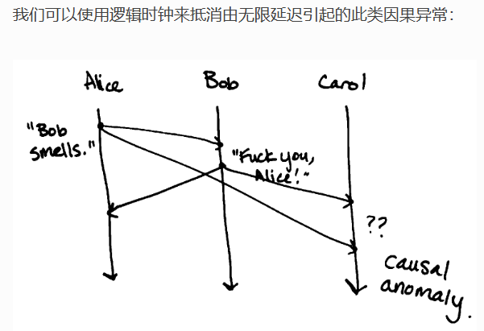
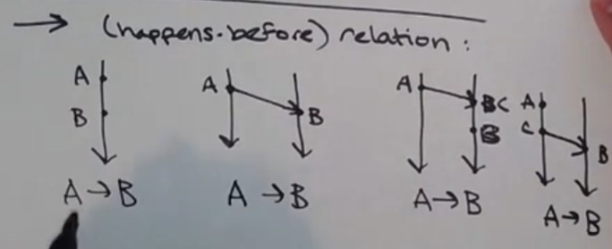
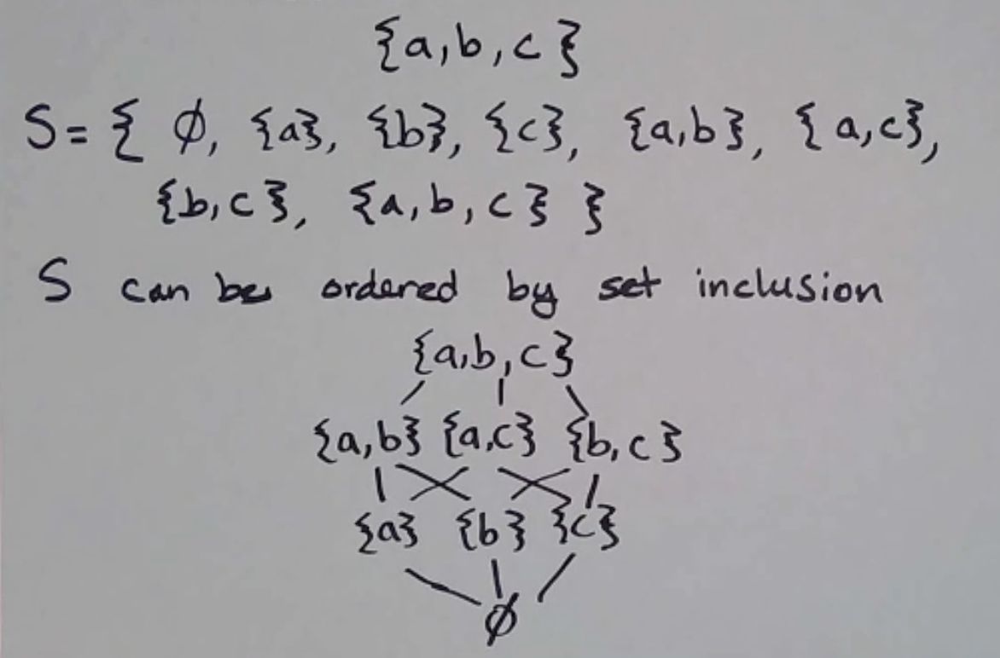
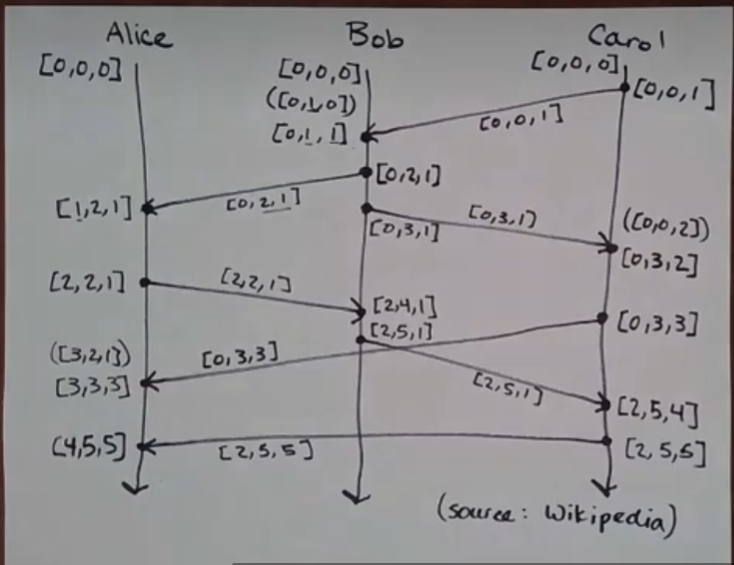

# 时间和时钟

## What do we use clocks for?

我们用时钟来做什么？

### Physical Clocks 物理时钟

1. “scheduling”: marking points in time
   “调度”：标记时间点

   - “this item in cache expires on May 21 at 8pm”
     “缓存中的此项将于 5 月 21 日晚上 8 点过期”

2. durations/intervals
   持续时间段/间隔

   - this request times out in 10 seconds
     此请求将在 10 秒后超时

Computers have 2 kinds of physical clocks:
计算机有两种物理时钟：


- time of day clock 一天中的时间时钟

  - tells you what time of day it is
    告诉你现在是什么时间

  - can be synchronized between machines (e.g. NTP)
    可以在机器之间同步（例如NTP）

  - can jump forward/backward (e.g. moving between time zones, DST, leap seconds)
    可以向前/向后跳跃（例如在时区、DST、闰秒之间移动）

  - not so great for intervals/durations
    对于间隔/持续时间来说不太好

  - ok for points in time, but only ok
    时间点还可以，但也只是还可以(机器的时钟没有完全同步)
    

- monotonic clock 单调时钟

  - only goes forward 只会前进

  - not comparable between machines (e.g. time since boot)
    `机器之间不具有可比性`（例如启动后的时间），返回的是相对时间。

    ```py
    import time
    for i in range(10):
        print(time.monotonic())  # 从机器启动开始的时间
        time.sleep(1)
    ```

  - cannot mark specific points in time
    无法标记特定时间点

`为了解决时间点的问题，我们需要逻辑时钟。`

### Logical Clocks 逻辑时钟

某些场景下(时间点)，物理时钟不能帮助我们了解，发生了什么。
这种时候，我们需要逻辑时钟。
什么导致了x从5变成6？
x++事件导致了x从5变成6。那么x++事件发生在x=6之前。

Logical clocks only measure the `order of events`.
逻辑时钟仅测量`事件的顺序`。

e.g. A -> B: “A happened before B”
例如A -> B ：“A 发生在 B 之前”

This tells us some things about `causality`:
这告诉我们一些关于`因果关系`的事情：

A might have caused B
A可能导致了B

B could not have caused A
B不可能导致A

## Lamport Diagrams 兰波特图

aka spacetime diagrams 又名时空图

Each process is represented by a line. It has a discrete beginning and goes on forever.
每个进程都用一条线表示。它有一个离散的开始并永远持续下去。
Events are represented by dots on the line.
事件由线上的点表示。


You can represent systems of machines and messages with lines and arrows:
您可以用线条和箭头表示机器和消息系统：


If we can’t be sure that given a pair of events, one `happens before` the other, they are `concurrent`:
如果我们不能确定给定一对事件，其中一个发生在另一个之前，那么它们是的：


We can use logical clocks to counteract causal anomalies like this, caused by unbounded latency:
我们可以使用逻辑时钟来抵消由无限延迟引起的此类因果异常：


## happens before


Given events A and B, we say A `happens before` B if:

1. A and B occur on the same process with A before B
2. A is a send event and B is the corresponding receive event
3. A -> B and B -> C then A -> C

## Network Models

网络模型

1. synchronous network 同步网络
   a network where there exists an n such that no message takes longer than n units of time to be delivered.
   存在n，满足：在网络中，消息传递所需的时间不会超过n 个单位。

   We won’t talk about this type of network.
   我们不会谈论这种类型的网络。

2. `asynchronous network 异步网络`
   a network with `unbounded latency`, i.e. there does not exist such n such that no message takes longer than n units of time to be delivered.
   具有无限延迟的网络，即不存在这样的n ，使得没有消息需要比n单位时间更长的时间来传递。

## State and Events 状态和事件

We can determine the current state by looking at the sequence of events leading up to it:
我们可以通过查看导致当前状态的事件顺序来确定当前状态：

## Partial Order and Total Order 偏序和全序

### 偏序和全序是什么

集合上的二元关系

#### 偏序 (Partial Order)


**偏序**是一种在集合上的二元关系，满足以下三个性质：

1. **自反性**（Reflexivity）：对于集合中的任意元素 `a`，有 `a ≤ a`。
2. **反对称性**（Antisymmetry）：对于集合中的任意元素 `a` 和 `b`，如果 `a ≤ b` 且 `b ≤ a`，则 `a = b`。
3. **传递性**（Transitivity）：对于集合中的任意元素 `a`、`b` 和 `c`，如果 `a ≤ b` 且 `b ≤ c`，则 `a ≤ c`。

在偏序关系中，并不是所有的元素都可以进行比较。即，对于某些元素 `a` 和 `b`，可能既不存在 `a ≤ b`，也不存在 `b ≤ a`。

**示例**：

- 集合 `{1, 2, 3}` 上的“整除”关系是一个偏序关系。即 `1 ≤ 2`（因为 1 整除 2），`1 ≤ 3`（因为 1 整除 3），但 `2` 和 `3` 之间没有整除关系。

#### 全序 (Total Order)

**全序**是一种特殊的偏序关系，除了满足偏序的三个性质外，还满足以下性质：

4. **完全性**（Totality）：对于集合中的任意元素 `a` 和 `b`，要么 `a ≤ b`，要么 `b ≤ a`。

在全序关系中，集合中的任意两个元素都是可比较的。

**示例**：

- 集合 `{1, 2, 3}` 上的“≤”关系是一个全序关系。即对于任意两个元素 `a` 和 `b`，要么 `a ≤ b`，要么 `b ≤ a`。

#### 应用场景

- **偏序**：

  - **任务调度**：在并行计算中，任务之间可能存在依赖关系，形成偏序。
  - **版本控制**：在分布式版本控制系统中，不同版本之间的依赖关系可以用偏序表示。

- **全序**：
  - **排序算法**：全序关系用于定义排序算法中的元素比较规则。
  - **优先级队列**：在优先级队列中，元素按照全序关系进行排列和处理。

#### 例子

- **偏序**：

  - 集合 `{a, b, c}` 上的关系 `R = {(a, a), (b, b), (c, c), (a, b), (a, c)}` 是一个偏序关系，因为它满足自反性、反对称性和传递性，但 `b` 和 `c` 之间没有比较关系。

- **全序**：
  - 集合 `{1, 2, 3}` 上的关系 `R = {(1, 1), (2, 2), (3, 3), (1, 2), (1, 3), (2, 3)}` 是一个全序关系，因为它满足自反性、反对称性、传递性和完全性。

---

理解偏序和全序关系对于分析和设计算法、数据结构以及并发系统中的事件顺序至关重要。
**偏序关系允许部分比较，而全序关系则要求所有元素都可以比较。**

## Lamport Clocks 兰波特时钟 (偏序)

为每个事件分配一个时间戳，帮助确定事件的先后顺序，解决因果关系问题。
`拓扑排序中的最大深度 max(local, received) + 1`
**虽然兰波特时钟与因果关系一致，但它们并不表征因果关系。**
`A->B 可以推出 LC(A) < LC(B)，但是 LC(A) < LC(B) 不能推出 A->B。`

```py
class LamportClock:
    """Lamport 时钟"""

    def __init__(self):
        self.clock = 0

    def tick(self):
        """进程内部事件，时钟加1"""
        self.clock += 1

    def send_event(self):
        """发送事件，时钟加1并返回当前时钟"""
        self.tick()
        return self.clock

    def receive_event(self, received_clock: int):
        """接收事件，更新时钟"""
        self.clock = max(self.clock, received_clock) + 1

    def __str__(self):
        return str(self.clock)
```

## Vector Clocks 向量时钟 (全序)


While Lamport clocks don’t character causaility, vector clocks do!
与 Lamport 时钟不同，向量时钟能够区分并发事件，提供更强的因果关系保证。

`A->B <=> VC(A) < VC(B)`

思路：
每个进程维护一个向量时钟，向量的长度等于系统中进程的数量。
向量时钟中的每个元素表示对应进程的逻辑时钟值。

```py
class VectorClock:
    def __init__(self, num_processes, process_id):
        self.clock = [0] * num_processes
        self.process_id = process_id

    def tick(self):
        """进程内部事件，时钟加1"""
        self.clock[self.process_id] += 1

    def send_event(self):
        """发送事件，时钟加1并返回当前时钟"""
        self.tick()
        return self.clock.copy()

    def receive_event(self, received_clock):
        """接收事件，更新时钟"""
        for i in range(len(self.clock)):
            self.clock[i] = max(self.clock[i], received_clock[i])
        self.tick()

    def __str__(self):
        return str(self.clock)
```

向量时钟的比较方法
向量时钟的比较用于确定两个事件之间的因果关系。向量时钟 VC(A) 和 VC(B) 的比较规则如下：

- VC(A) < VC(B)：事件 A 先于事件 B。
- VC(A) > VC(B)：事件 B 先于事件 A。
- VC(A) == VC(B)：事件 A 和事件 B 是同一事件。
- VC(A) || VC(B)：事件 A 和事件 B 是并发的，即它们之间没有因果关系(concurrent)。
