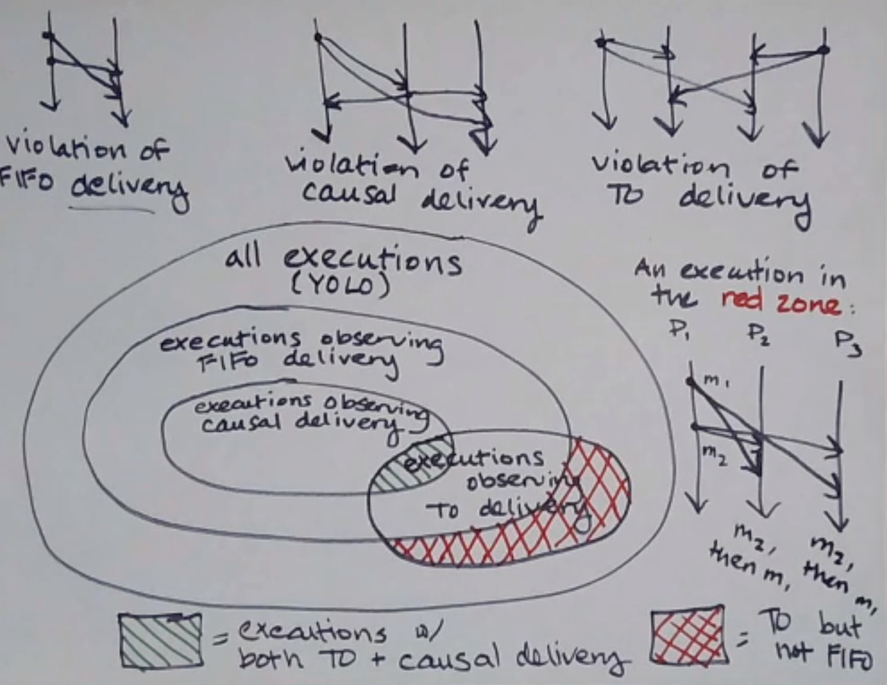
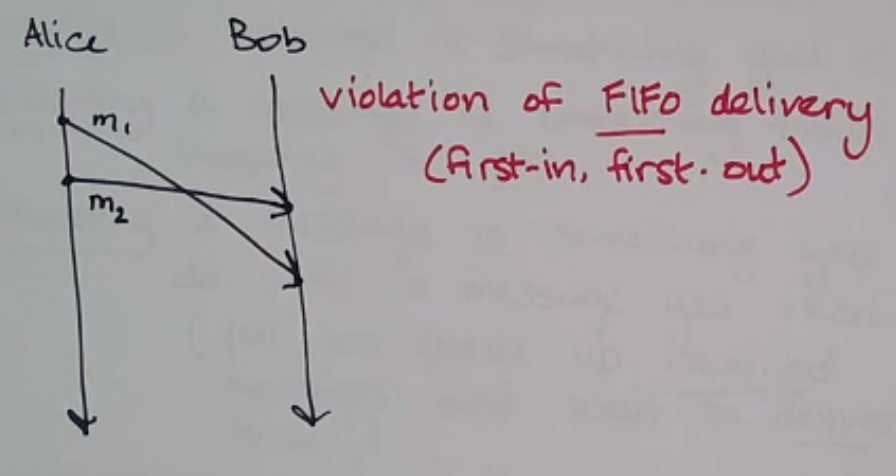
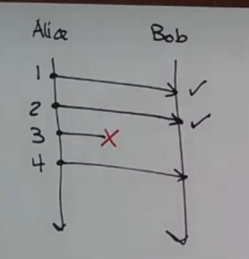
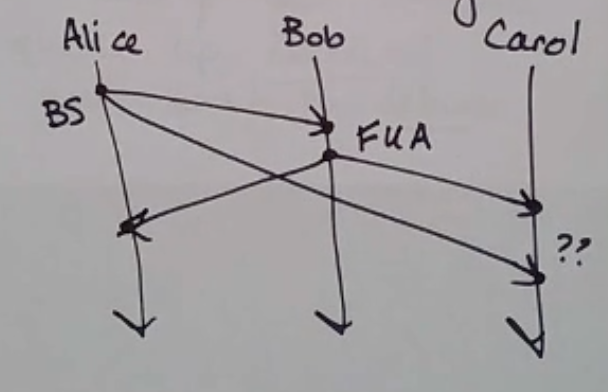
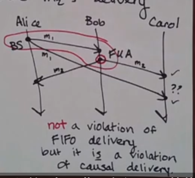
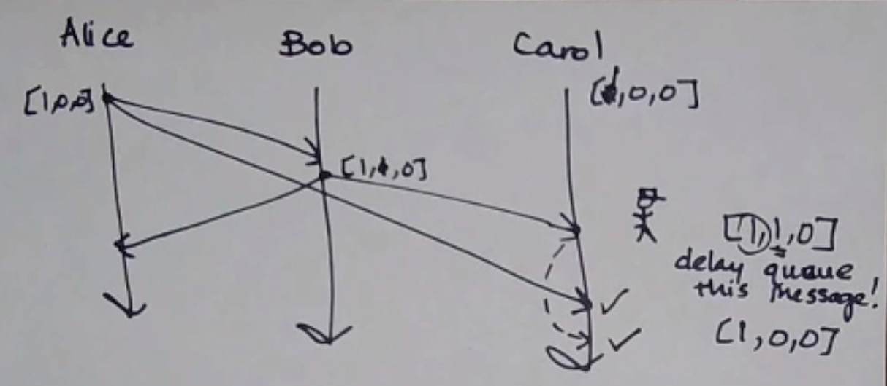
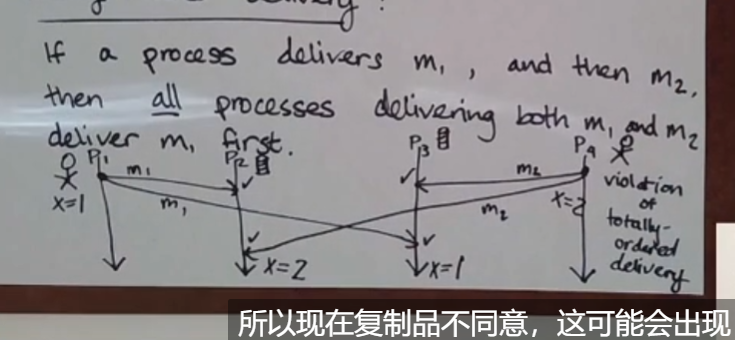

# Protocol 协议

## 什么是协议？

A set of rules that processes use to communicate with each other.
进程用于相互通信的一组`规则`。

"发送者说foo，接收者说bar"，这就是一个协议。

The following are three different correctness properties of executions:
以下是执行的三种不同的正确性属性：


## FIFO Delivery 先进先出交付


If a process sends message m2 after message m1, any process delivering both delivers m1 first.
如果一个进程在消息m1之后发送消息m2，那么任何交付这两个消息的进程都会先交付m1(**不允许交叉**)。

Most systems programmers don’t have to worry about this often - `it’s already part of TCP!`
大多数系统程序员不必经常担心这一点 - 它已经是 TCP 的一部分！

- 实现方式1：Sequence Numbers (序列号)
  [impl](SequenceNumbers.py)

  - 发送消息：

  发送者在发送消息时，会为每条消息分配一个递增的序列号。
  消息包含发送者 ID 和当前序列号。

  - 接收消息：

  接收者维护每个发送者的预期序列号。
  当接收到一条消息时，检查其序列号：
  如果序列号是预期的下一个序列号，则`立即交付并更新预期序列号`。
  如果序列号大于预期序列号，则将消息`缓冲`起来，等待缺失的消息。
  如果序列号小于预期序列号，则该消息被视为`重复或过时，选择丢弃`。

  - 缓冲与丢弃：避免因消息丢失导致的`无限缓冲`：
    
    1. 超时机制：为每个期望的消息设置一个超时时间。如果在超时时间内未收到期望的消息，可以选择跳过该消息，更新预期序列号，并交付缓冲区中的后续消息。注意需要丢弃缓冲区中低于新的预期序列号的消息。
    2. 最大缓冲大小：防止缓冲区无限增长，保护系统资源。
    3. 重传机制：检测到缺失消息时，发送重传请求给发送者。发送者负责重传丢失的消息。
    4. 窗口协议：允许在一定范围内的消息可以无序接收和缓冲。通过窗口大小限制，可以控制缓冲区的大小。实现复杂，需要同步窗口状态。

- 实现方式2：ack 确认
  另一种实现是 ACK——Alice 在发送下一条消息之前等待 Bob 发送确认。
  However, it’s a lot slower since it requires a full round trip per message.
  然而，它的速度要慢得多，因为它`需要每条消息进行完整的往返。`

## Causal Delivery 因果交付




FIFO 传递仅考虑从`单个`进程发送的消息，而因果传递考虑了`多个进程`的消息之间的因果关系。

1. 因果关系维护：`如果消息 A 在消息 B 之前发生并且因果相关，那么接收者必须先接收消息 A，再接收消息 B。`
2. 部分顺序保证：只有存在因果关系的消息对才需要按照特定顺序交付。对于独立的消息，它们的交付顺序不受限制。
3. 通常使用向量时钟（Vector Clocks）来跟踪和维护消息的因果关系。

- Broadcast (广播)

1. unicast：单播
   point to point communication
   1 sender -> 1 receiver
2. multicast：多播
   1 sender -> n receivers
3. broadcast：广播
   1 sender -> all receivers

对于上述所有这些，无论有多少个接收者，每次发送都被视为一条消息。

### causal broadcast 算法

目的:
避免Alice、Bob、Carol 问题，确保消息按因果顺序交付。

定义:
an algorithm that gives you causal delivery in a setting where all messages are broadcast messages
在所有消息都是广播消息的情况下为您提供因果传递。

实现:

1. vector clocks algorithm with a twist：message receives don’t count as events.
   调整后的向量时钟算法：消息接收不计为事件。`这样，时钟的值就表示从每个人发送的消息数量。`
2. define a deliverability condition that tells us whether or not a received message is os is not OK to deliver.
   This deliverability condition will use the vector clock on the message.
   定义一个`可传递条件`，告诉我们收到的消息是否无法传递。
   此可传递性条件将使用消息上的矢量时钟。
   ```ts
     /**
      * 检查是否可以交付消息
      * 确保消息按因果顺序交付。
      */
     canDeliver(msgClock: number[], senderId: number): boolean {
       for (let i = 0; i < this._clock.length; i++) {
         if (i === senderId) {
           if (this._clock[i] + 1 !== msgClock[i]) {
             return false
           }
         } else {
           if (this._clock[i] < msgClock[i]) {
             return false
           }
         }
       }
       return true
     }
   ```
3. 如果消息不可传递，请将其添加到传递队列，并在每次收到新消息时检查是否可传递（更新 VC）。
   
4. 优化

- 减少消息传输延迟：

  批量处理：将多个消息打包成一个批次进行传输，减少网络开销。
  并行处理：利用多线程或异步处理机制，提高消息处理速度。

- 优化消息缓冲：

  高效的数据结构：使用高效的数据结构（如优先队列）管理消息缓冲区，快速查找和删除可交付的消息。
  定期清理：定期清理缓冲区中的过期或无效消息，减少内存占用。

- 减少重复消息：

  去重机制：在接收消息时，使用唯一标识符（如消息ID）去重，避免重复处理相同消息。
  缓存机制：缓存最近处理过的消息ID，快速判断消息是否已处理。

- 优化向量时钟：

  压缩向量时钟：在消息传输时，压缩向量时钟，减少消息大小。
  增量更新：仅传输向量时钟的增量部分，减少传输数据量。

- 动态调整：

  自适应调整：根据网络状况和系统负载，动态调整消息传输和处理策略，提高系统适应性。

## Totally Ordered Delivery 完全有序交付


所有节点按照全局一致的顺序接收和处理消息。无论消息是由哪个节点发送的，所有接收者都会以相同的顺序接收到这些消息。

- 实现方法

1. 全序广播（Total Order Broadcast）：

   确保所有节点以相同的顺序广播和接收消息。常见的实现协议包括 Paxos 和 Raft。

2. 全局时钟（Global Clock）：

   使用一个全局时钟或协调者节点来分配全序的时间戳，确保所有消息都有唯一的顺序标识。

3. 顺序协议（Sequencer-based Protocol）：

   引入一个专门的序列器节点，负责为所有消息分配全局唯一的序列号，接收者根据序列号排序消息。

- 与其他交付机制的比较

1. FIFO交付：

   仅保证`来自单一发送者`的消息按发送顺序接收。
   无法保证来自不同发送者的消息之间的全局顺序。

2. 因果交付：

   `保证因果相关的消息`按因果顺序接收。
   不保证所有消息之间的全局顺序，`独立消息的顺序可能不一致。`

3. 完全有序交付：
   保证`所有消息`按照全局一致的顺序接收和处理，无论消息的发送来源和时间。
   较为严格，通常需要更多的通信开销和协调。

三者之间的关系：


- causal delivery 包含于 FIFO delivery，更强
- totally ordered delivery 与其他两者无包含关系
