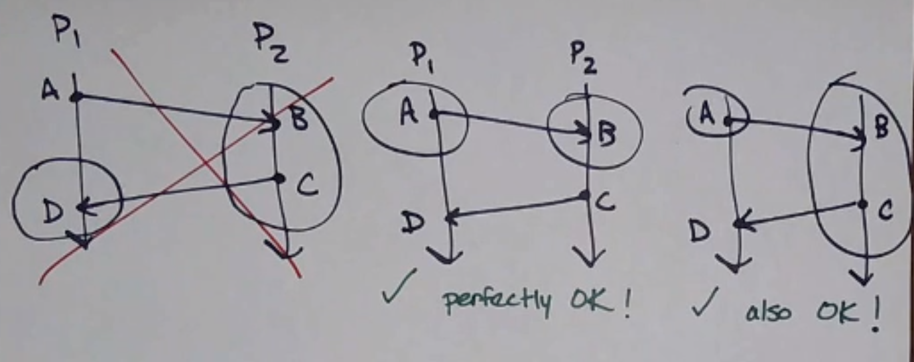
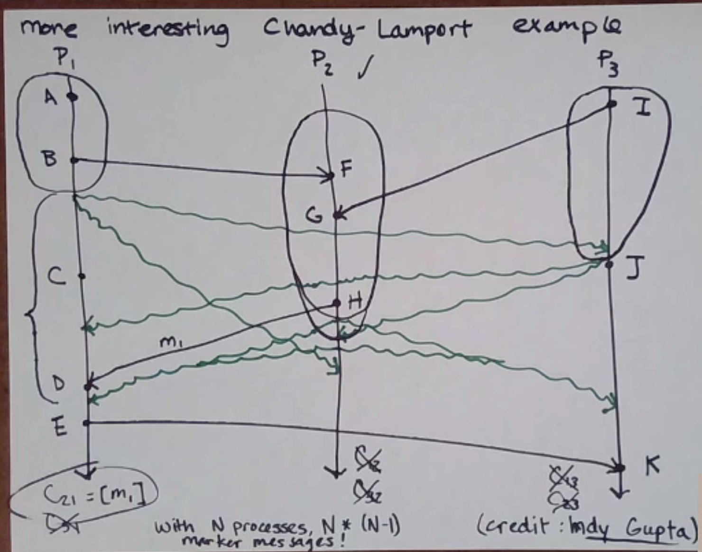

# Snapshots of Distributed Systems 分布式系统快照

快照的目的：

1. checkpointing. 保存进程的状态，以便在进程失败时恢复.
2. detection of any stable property. 用于检测任何稳定的特性
3. deadlock detection 死锁检测

Processes have individual state, which is pretty much all the events that have happened up to a given point.
进程具有独立的状态，这几乎是到给定点发生的所有事件。

How do we get the state of an entire distributed system (a “global snapshot”) at a given time?
我们如何获取给定时间整个分布式系统的状态（“全局快照”）？

We can’t use time-of-day clocks, since they aren’t guaranteed to be synchronized across all processes.
我们不能使用time-of-day时钟，因为它们不能保证在所有进程之间同步。

### consistent 一致

Property that we want:
`If we have events A and B where, and B is in the snapshot, then A is also in the snapshot.`
`我们想要的属性：我们有事件A和B ，如果B在快照中，那么A也在快照中。`
一些快照示例：

## Chandy-Lamport Algorithm

Chandy-Lamport Algorithm 是一种用于`在分布式系统中获取一致性快照（Snapshot）的算法`。该算法由 K. Mani Chandy 和 Leslie Lamport 于 1985 年提出，旨在在不停止系统运行的情况下，获取系统的全局状态。

### channel 通道

connection from one process to another, with FIFO ordering
从一个进程到另一个进程的连接，采用 FIFO 排序

### 算法流程

1. 首先，发起者进程(initiator process, 1 or more)：
   - records its own state
     记录自己的状态
   - sends a marker message out on all its outgoing channels
     在其所有传出通道上发送标记消息
   - starts recording the messages it receives on all its incoming channels
     开始记录在所有传入通道上收到的消息
2. then, when process Pi receives a marker message on Cj:
   那么，当进程 Pi 在 Cj 上收到标记消息时：
   - if it is the first marker has seen (sent or received):
     如果它是Pi 看到的第一个marker(无论是发送还是接收)：
     - record its state
       记录自己的状态
     - mark channel Cj empty
       标记通道 Cj 为空
     - sends a marker out on all its outgoing channels
       在其所有传出通道上发送标记消息
     - starts recording on all incoming channels except Cj
       开始记录除 Cj 外的所有传入通道上的消息
   - else:
     否则：
     - it stops recording on channel Cj
       它停止记录通道 Cj 上的消息

由于每个进程都会向每个其他消息发送一个标记消息，因此该算法发送 `n*(n-1)` 的消息总数。

### 论文记录

The state-detection algorithm plays the role of a group of photographers observing a panoramic, dynamic scene, such as a sky filled with migrating birds -- a scene so vast that it cannot be captured in a single photograph. The photographers must take several snapshots and piece the snapshots together to form a picture of the overall scene. The snapshots cannot all be taken at precisely the same instant because synchronizing problems.
Furthermore, the photographers should not disturb the process that is being photographed. for instance, they cannnot get all the birds in the heavens to remain motionless while the photographs are taken. Yet, the composite picture should be meadingful. The problem before us is to define “meaningful” and then to determine how the photographers should be taken.

状态检测算法的作用类似于一组摄影师观察一个全景的、动态的场景，例如天空中迁徙的鸟群——这个场景如此广阔，以至于无法用一张照片捕捉到。摄影师必须拍摄几张快照，并将这些快照拼接在一起，形成整体场景的图片。由于同步问题，这些快照不可能在完全相同的瞬间拍摄。此外，摄影师不应打扰正在被拍摄的过程。例如，他们不能让天空中的所有鸟在拍照时保持静止。然而，合成的图片应该是有意义的。我们面临的问题是定义“有意义”，然后确定应该如何拍摄这些照片。

### The Big Picture

1. 缺点(使用限制)

   - 通道(channels)必须是 FIFO
     其他的一些不需要 FIFO 通道的算法，要求有时必须暂停应用程序消息（Application Messages）。
     `而 Chandy-Lamport 算法不需要暂停应用程序消息，但是要求通道是 FIFO 的。`
   - 要求消息不会丢失、损坏或重复
   - 要求进程不会崩溃

2. 优点
   - 无论发送标记消息需要多长时间，它所拍摄的快照都是`一致的`
   - `可以多个initiator一起工作(去中心化, decentralized)`
   - 保证算法可以终止

---

- 中心化(centralized)算法：只能有一个initiator
  `must be initiated by exactly one process`
- 去中心化(decentralized)算法：可以有多个initiator
  `can have multiple initiators`
  - Chandy-Lamport
  - Paxos
