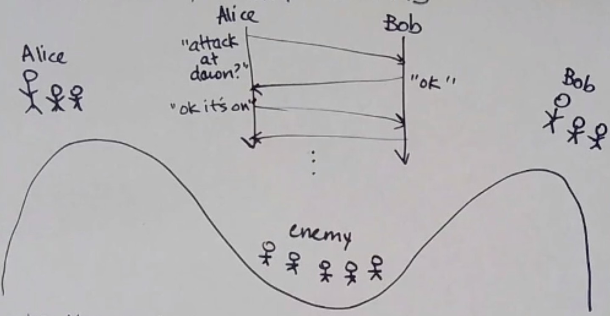

# Safety and Liveness 安全性与活性

- Safety properties:

  - properties that say `a “bad” thing won’t happen`
    坏事不会发生的属性
  - can be violated in a finite execution (can point to where it went wrong)
    可以在有限执行中违反（可以指出出错的地方）

  eg:
  FIFO delivery 先进先出交付
  Causal delivery 因果交付
  Totally ordered delivery 完全订购交付

- Liveness properties

  - says that `a “good” thing will happen`  
    好事会发生的属性
  - cannot be violated in a finite execution (may take infinite time to satisfy)
    不能在有限执行中违反（可能需要无限时间来满足）

  eg:
  `eventually` delivery 最终交付

  > The word `eventually` is often an indicator of a liveness property.

It’s the combination of safety and liveness that makes systems useful - for example, otherwise, you could just drop every message to satisfy FIFO.
安全性和活跃性的结合使系统变得有用——例如，否则，您可以丢弃每条消息来满足 FIFO。

## Reliable delivery, Take 1 可靠交付1

Let P1 be a process that sends a message to process P2. If neither P1 nor P2 crashes (and not all messages are lost), then P2 eventually delivers m.
P1 向进程 P2 发送消息。
`如果 P1 和 P2 都没有崩溃、并且没有丢失所有消息，那么 P2 最终会传递 m。`

Well, it’s a start, but the whole “not crashing” thing is weak.
嗯，这是一个开始，但整个“不崩溃”的东西很弱。

## Fault Models 故障模型分类

场景：
进程1向进程2发送查询，可能发生的故障有：

1. message from P1 is lost - omission fault
   来自1的消息丢失-失效故障
2. message from P1 is slow - timing fault
   来自1的消息慢-计时故障
3. P2 is slow - timing fault
   P2速度慢 - 计时故障
4. message from P2 is slow - timing fault
   来自2的消息慢-计时故障
5. P2 crashed - crash fault
   P2崩溃 - 崩溃故障
6. message from P2 is lost - omission fault
   来自2的消息丢失-失效故障
7. P2 lies - byzantine fault
   P2说谎-拜占庭故障

总结为五类故障：

0. fail-stop fault 失效停止故障
   a process fails by halting (stops sending/receiving messages) andeveryone knows
   进程因停止而失败（停止发送/接收消息），并且`每个人都知道`
1. crash fault 崩溃故障
   a process fails by halting (stops sending/receiving messages) and not everyone necessarily knows about it
   进程因停止而失败（停止发送/接收消息），并且`并非每个人都一定知道它`
2. omission fault 失效故障
   a message is lost (a process fails to send/receive a single message)
   消息丢失（进程无法发送/接收单个消息）
3. timing fault 计时故障
   a process responds too late (or too early)
   进程响应太晚（或太早）

   有时候我们不关注这类故障，因为：
   `In an asynchronous world, there are no timing faults!`

4. byzantine fault 拜占庭故障
   a process behaves in an arbitrary or malicious way
   进程以任意或恶意的方式运行

   有一种特殊类型的拜占庭故障，称为`“身份验证可检测的拜占庭故障”(“authentication-detectable Byzantine faults”)`。这种故障类型介于失效故障和拜占庭故障之间。`系统可以将一些复杂的拜占庭故障“降级”为相对简单的失效故障`，从而简化故障处理过程，提高系统的可靠性和安全性。

If protocol X tolerates crash faults and protocol Y tolerates omission faults, does Y also tolerate crash faults?
如果协议 X 容忍崩溃故障，协议 Y 容忍失效故障，那么 Y 是否也容忍崩溃故障？

Yes! Crash faults are just a special case of omission faults where all messages to/from a process are lost.
是的！`崩溃故障只是失效故障的一种特殊情况，其中发往/来自进程的所有消息都会丢失。`

### 故障模型 Fault Models

A fault model is a specification that says what kinds of faults a system can exhibit, and this tells you what kinds of faults need to be tolerated.
故障模型是一种规范，它说明系统可以表现出哪种故障，并告诉您需要容忍哪种故障。
`In this class, we focus on the omission model (which includes the crash model).`
在本课程中，我们重点关注遗漏模型（包括崩溃模型）。

## Two Generals Problem 两将军问题

在不可靠的通信信道上，无法通过有限次的消息传递来确保双方达成一致。这意味着在分布式系统中，`如果通信信道不可靠，就无法保证一致性。`

In the omission model, it is impossible for Alice and Bob to attack and know for sure that the other will attack.
在 omission model 中，Alice 和 Bob 无法得知对方是否会攻击。
How do we mitigate? 我们如何破局?

- Probabilistic Certainty 概率确定性
  One option is to have Alice constantly send until she receives an ACK
  一种选择是让 Alice 不断发送，直到收到ACK

  then the longer Bob goes without receiving a message, the more sure he is that she has received the ACK
  那么 `Bob 越长时间没有收到来自 Alice 的消息，他就越确定 Alice 已经收到了 ACK`

  Note that it’s not 100% guaranteed, but it works.
  注意，这并不能 100% 保证，但这种方法在实际中是有效的。

- Common Knowledge 预先建立常识
  There is common knowledge of p when everyone knows p, everyone knows that everyone knows p, everyone knows that everyone knows that everyone knows p…
  当每个人都知道p 、每个人都知道每个人都知道p 、每个人都知道每个人都知道每个人都知道p时，就存在p的常识……

## Fault Tolerance 容错

What does it mean to tolerate a class of faults? Usually it’s defined by how/how much your program reacts to a fault.
容忍一类故障是什么意思？通常它是由程序对错误的反应方式/程度来定义的。

A correct program satisfies both its safety and liveness properties, but often satisfying both is impossible during a fault.
正确的程序同时满足其安全性和活跃性，但在发生故障时通常不可能同时满足这两个属性。

So really, it’s about `how wrong` it goes in the presence of a fault.
所以实际上，问题在于出现故障时会出现多大的错误。

|                       | Live                 | Not Live             |
| --------------------- | -------------------- | -------------------- |
| **Safe (安全的)**     | Masking (掩蔽)       | Fail-safe (故障安全) |
| **Not Safe (不安全)** | Non-masking (非掩蔽) | :(                   |

## Reliable Delivery, Take 2

之前说到，`如果 P1 和 P2 都没有崩溃、并且不丢失所有消息，那么 P2 最终会传递 m。`
Do we need `not all messages are lost`? Yes, if we’re working under the omission model.
我们需要`不丢失所有消息`吗？是的，如果我们在omission model下工作。

- 如何做到不丢失所有消息？

1.  repeat until ack 重复直到收到确认

    - Alice puts a message in the send buffer
      Alice 将消息放入发送缓冲区

    - on timeout, send what’s in the buffer
      超时时，发送缓冲区中的内容

    - when ack received, delete message from buffer
      收到确认后，从缓冲区中删除消息

    One problem is if `Bob’s ACK gets dropped, and he receives the message twice`. This may or may not be an issue, depending on the message. For example, if the message is something like “increase value by 1”, that’s an issue!
    在这种情况下，您的消息应该是幂等(idempotent)的- 多次发送它们应该具有与发送一次相同的效果。

    

    So reliable delivery is actually `at-least-once delivery`! But is `exactly-once delivery` possible?
    所以这实际上是至少一次交付！但一次性交付可能吗？
    Not really… most systems that `claim` exactly-once delivery in real life are one of the following:
    事实并非如此……大多数在现实生活中声称一次性交付的系统都是以下之一：

    - the messages were idempotent anyway
      消息是幂等的
    - they’re making an effort to deduplicate messages on the receiver
      他们在接收端努力去重消息

## Reliable Broadcast 可靠广播

broadcast: one sender, everyone receives
广播：一个发送者，每个人都接收

> If you have a unicast primitive, you can implement broadcast by sending multiple unicasts in very quick succession.
> 如果您有单播原语，则可以通过快速连续发送多个单播来实现广播。

定义：
`If a correct process delivers message m, then all correct processes deliver m.`
如果一个正确的进程传递消息 m，那么所有正确的进程都传递 m。
`A correct process is a process that is acting correctly in a given fault model (e.g. not crashed in crash model).`
正确的进程是在给定的故障模型中正确运行的进程（例如，在crash model中没有crash的进程）。

- 两个判断的例子:

1. Alice 向Bob和Carol发送unicast，但是Carol在delivery之前崩溃了。这没有违反可靠广播的定义，因为Carol crash了，不是correct process。
2. Alice 向Bob和Carol发送unicast，Alice在Bob delivery之后崩溃了，导致Carol没有收到消息。这违反了可靠广播的定义。
   

### 如果进程可能在广播中间崩溃，我们如何获得可靠的广播？

如果您收到广播消息，请在`发送之前将其转发给其他人`（或者至少除了发送者之外的所有人）
如果没有人崩溃，每个进程都会收到n-1次。

但每个进程都可以跟踪它们已经传递/转发的消息，以免重复执行。

`完全图`

---

Fault tolerance often involves making **copies**!
容错通常涉及复制！

通过copy来减轻故障的影响。
