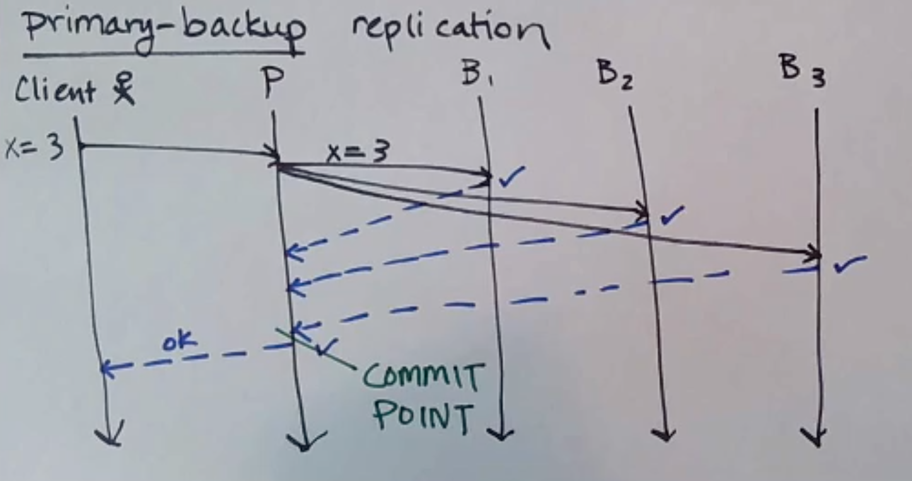
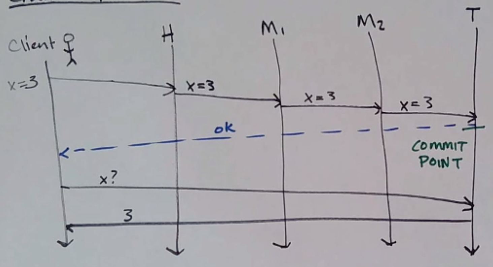
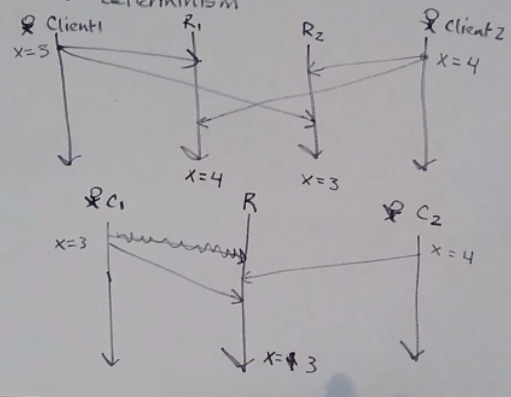
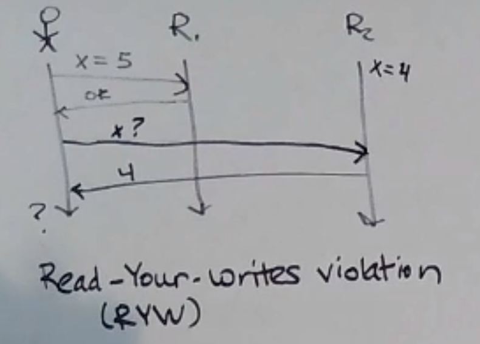
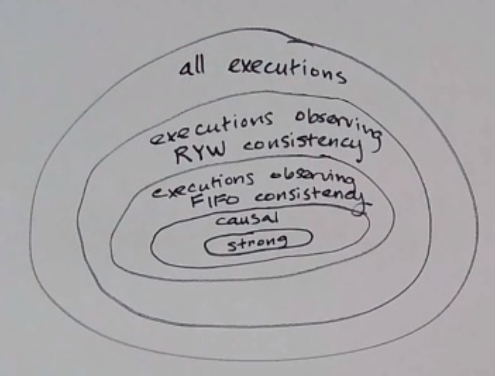
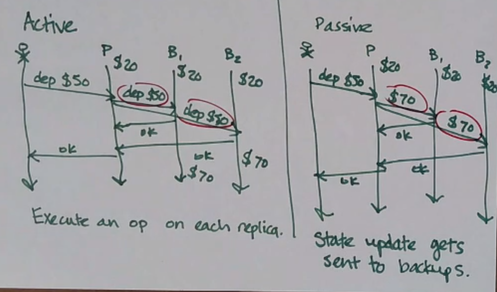

# Replication 复制

## Why do we replicate state/data?

为什么我们要复制状态/数据？

- fault tolerance: prevent data loss
  容错：防止数据丢失
- data locality (keep data close to clients that need it)
  数据局部性（使数据靠近需要它的客户端）
- dividing the work
  分工

But

- higher cost
  成本较高
- hard to keep state consistent (often)
  很难保持状态一致

Informally, a replicated storage system is `strongly consistent` when you cannot tell that the data is replicated.
通俗地说，当client无法判断数据是否已复制时，复制的存储系统是`强一致`的。

两种强一致性的复制协议：主备复制(primary-backup replication) 和 链式复制(chain replication)

### Primary-Backup Replication 主备复制

1. 首先，选择一个进程作为主进程，其他所有进程都是备份，在这种情况下，客户端只能连接到主服务器。
2. 当客户端对主数据库进行写入时，主数据库会将该写入`发送到所有备份` - 当它收到来自所有备份的 ACK 时，即为提交点，并向客户端返回 OK。
3. 读取时，主服务器仅将值返回给客户端，而不咨询任何备份。

   为什么？
   The client must ask the primary instead of a backup because there might be an `uncommitted` write in flight - a backup might know it, but the primary might not have committed it yet.
   客户端必须询问主服务器而不是备份服务器，因为可能存在未提交的动态写入 - 备份服务器可能知道这一点，但主服务器可能尚未提交它。

   How well does it match our replication criteria?
   它与我们的复制标准的匹配程度如何？

   - [x] fault tolerance [x] ok
   - [ ] data locality [ ] bad
   - [ ] dividing work [ ] bad

### Chain Replication 链式复制

Writes go to the head, which forwards to the next one in the chain, and so on to the tail. The tail ACKs the write.
写入到头部，然后转发到链中的下一个，依此类推到尾部。`尾部确认写入。`

Reads go to the tail.
`读取时读取尾部。`
嗯，效果如何？

- [x] fault tolerance [x] ok
- [~] data locality [~] bad
- [x] dividing work [x] not bad
      slightly better - reads and writes go to different processes
      `稍微好一些 - 读取和写入进入不同的进程`

一个评价指标是throughput (吞吐量):
number of actions per unit of time
每单位时间的动作数量

Depending on the workload, CR could give you better throughput than PB.
根据工作负载，CR 可以为您提供比 PB 更好的吞吐量。
For CR, the optimal workload ratio is about 15% writes to 85% reads.
对于 CR，最佳工作负载比率约为 15% 写入与 85% 读取。

链式复制的缺点：
CR has a higher `write latency` (depending on # of nodes in chain). (the two have about the same read latency)
具有较高的`写入延迟`（取决于链中的节点数量）。 （两者的读取延迟大致相同）
因为PB 可以并行处理备份，而CR 必须按顺序串行处理。

> latency (延迟时间)
> time between start and end of one action (一个动作开始和结束之间的时间)

注意：
Regardless of which replication scheme you choose, the client and replicas have to agree on who’s the primary/ head/tail/etc, or else you lose the guarantees of replication!
无论您选择哪种复制方案，`客户端和副本都必须就谁是主/头/尾/等达成一致`，否则您将失去复制的保证！

## Total Order v. Deterministic 全序与确定性

不同客户端同时发送的消息可能会在不同时间到达：

在第二个示例中，没有违反 TO 传递，但结果并不相同(不具有`确定性`) ——— 具体`取决于哪个客户端的消息首先接收！`

`determinism (确定性)`
On every run, the same outcome is achieved.
每次运行都会获得相同的结果。

## Bad Things

What happens if `a client can tell that data is replicated` (i.e. the replication is not strongly consistent)?
如果客户端`可以得知数据已被复制（即复制不是强一致的），会发生什么情况？`

> 强一致性：Client cannot tell that data is replicated(客户端无法得知数据被复制)

1. `Read-Your-Writes` Violation: A client’s written is not immediately returned on a subsequent read.
   违反`读写一致性(Read-Your-Writes)`：客户端的写入不会立即在后续读取中返回。

   问题：我存的五块钱，为什么显示只充值成功了两块？

2. `FIFO Consistency` Violation
   违反 FIFO 一致性
   

   fifo consistency
   先进先出一致性(顺序一致性，Sequential Consistency)
   Writes done by a single process are seen by all processes in the order they were issued
   `某个进程完成的写操作按照执行的顺序`被所有进程看到

   问题：我的账户余额怎么是负数？

3. `Causal Consistency` Violation
   违反因果一致性
   

   causal consistency
   因果一致性
   Writes that are `related by happens-before` (i.e. potentially causally related) must be seen in the same causal order by all processes
   `存在因果关系的操作按因果顺序被所有进程看到`，而不要求所有无关操作之间也有全局顺序。

   问题：我刚刚转账，为什么显示我提取存款显示存款金额为0？

## Consistency Models 一致性模型

Actually, we can define different `consistency models:`
实际上，我们可以定义不同的一致性模型：

> (aside: a model is the set of assumptions you keep in mind when building a system)
> （旁白：模型是构建系统时牢记的一组假设）

But maintaining stronger consistency requires more work, `which means more latency and just being harder`! Remember, replication/consistency usually involves duplicating messages too, so more bandwidth too
但保持更强的一致性需要更多的工作，这意味着更多的延迟，而且更加困难！请记住，复制/一致性通常也涉及复制消息，因此也需要更多带宽

> 想一想CAP定理

一般来说，Casual Consistency 是一个很好的trade-off，因为它可以保证一些一致性，但不需要太多的工作。

## Coordination 协调

Going back to our `strongly consistent replication protocols (PB/CR)` - both of these need some kind of `coordinator process to know which process is the primary/head/tail/etc.`
回到我们的强一致性复制协议（PB/CR）——这两个协议都需要某种**协调器进程来知道哪个进程是主进程/头进程/尾进程等。**

### 链式复制中的协调

CR uses the `fail-stop fault model` (i.e. crashes can occur and be detected by the environment), and requires that `not all processes crash`. There are some ways to implement this (like heartbeating), but sometimes you’ll have a false positive.
CR使用fail-stop故障模型（即崩溃可能发生并被环境检测到），并且要求不是所有进程都崩溃。有一些方法可以实现这一点（例如心跳），但有时您会出现误报。

- head/tail 进程崩溃，怎么办？
  coordinator makes the next/prev process in line the new head/tail
  coordinator 使链中的下一个/上一个进程成为新的头/尾
- middle 进程崩溃，怎么办？
  just gets skipped over (although the clients do not have to be notified)
  如果中间进程崩溃，它就会被跳过（尽管不必通知客户端）
- coordinator 进程崩溃，怎么办？
  (Next: Consensus) （下一篇：共识）

## Active v. Passive Replication 主动与被动复制

- Active replication:
  `execute an operate` on each replica (aka state machine replication)
  主动复制：对每个副本`执行操作`（也称为状态机复制）
- Passive replication:
  `state` gets sent to backups
  被动复制：`状态`发送到备份

选择场合：

- the updated state might be large (use active)
  更新的状态可能很大（使用主动）
- an operation might be expensive to do on each replica (use passive)
  对每个副本执行操作可能很昂贵（使用被动）
- the operation might depend on local process state (use passive)
  `该操作可能取决于本地进程状态（使用被动）`
