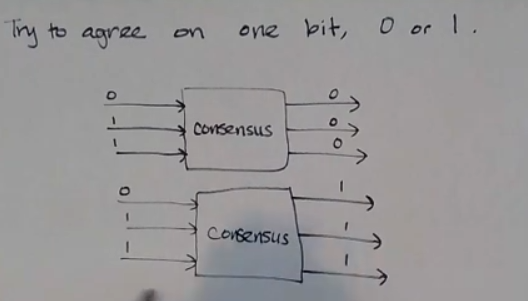
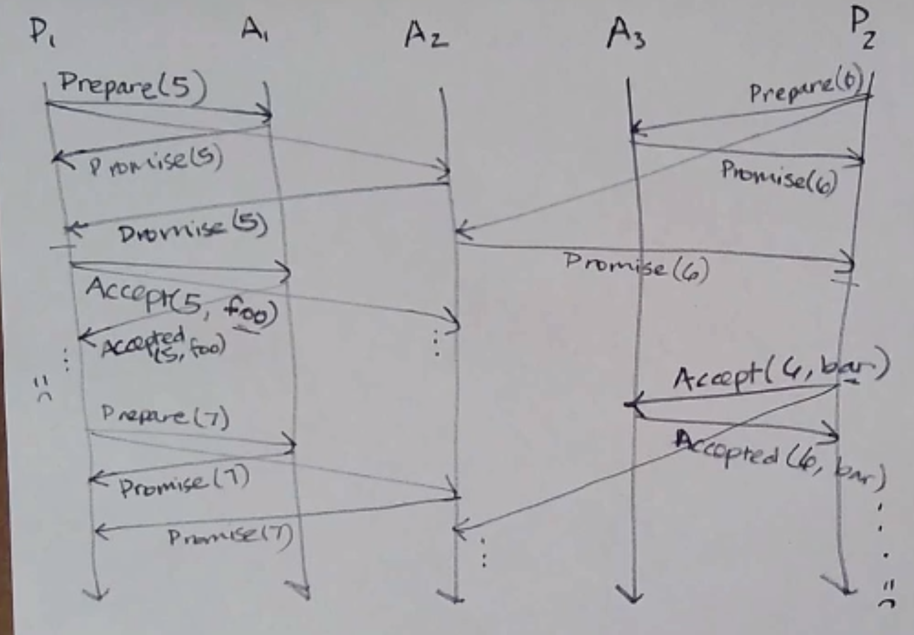
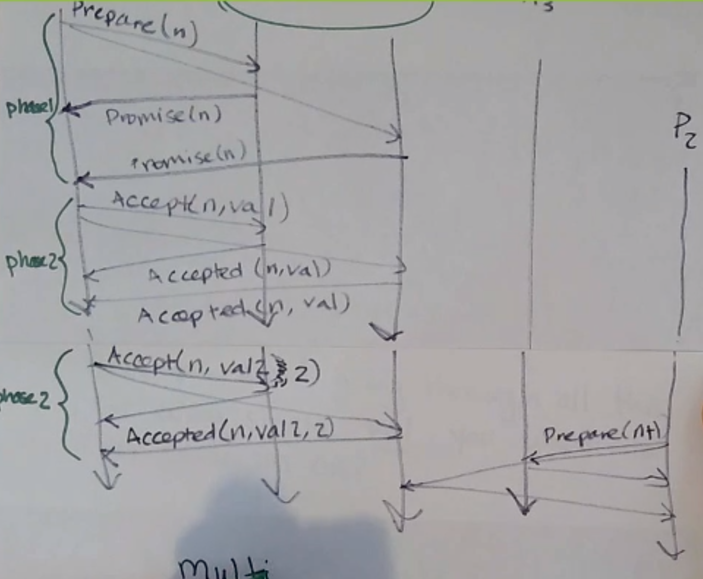
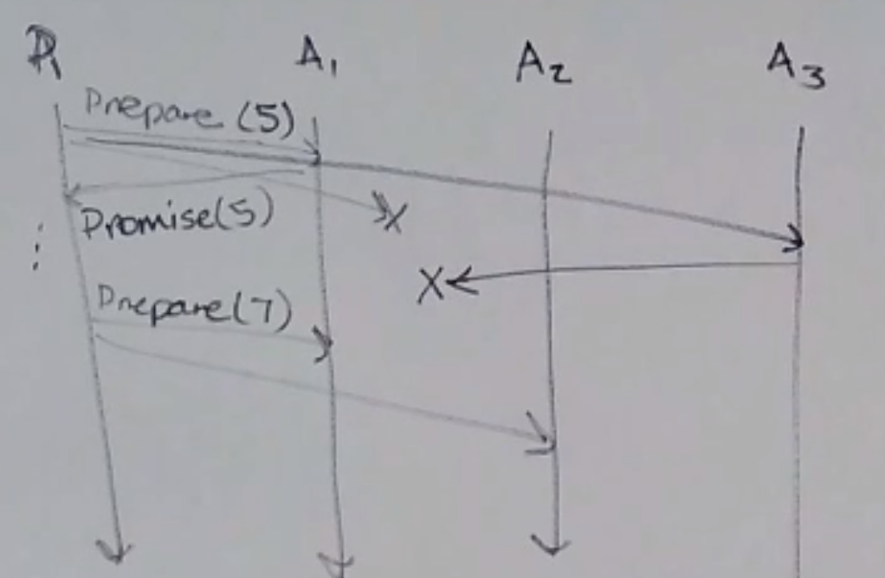

# Consensus 共识

Consensus is hard.


## When do you need consensus? 何时需要共识？

When you have a bunch of processes, and…

1. totally-ordered/atomic broadcast (全序广播/原子广播)
   他们需要以相同的顺序传递相同的消息
2. group membership problem, failure detection (组成员问题，故障检测)
   他们每个人都需要知道存在哪些其他进程，并保持这些列表是最新的
3. leader elections (领导者选举)
   其中一个需要扮演特定的角色，其他人需要就这个角色达成一致
4. distributed mutual exclusion problem (分布式互斥问题)
   他们需要能够轮流访问一次只有一个人可以访问的资源
5. distributed transaction commit (分布式事务提交)
   他们正在参与事务并且需要就提交/中止决策达成一致

We can view consensus as a kind of box, with multiple inputs going in and coming out; the inputs might differ, but in a correct system, they agree coming out.
我们可以将共识视为一种盒子，有多种输入进出；输入可能有所不同，但在正确的系统中，它们会一致输出。

## Properties of consensus 共识的属性

Try but fail to satisfy all 3 of these:

1. Termination
   each correct process eventually decides on a value (whatever it is)
   **终止性：每个正确的过程最终决定一个值（无论它是什么）**
   
2. Agreement
   all correct processes decide on the same value
   协议性：所有正确的过程都决定相同的值
   
3. Validity (aka integrity, nontriviality)
   the agreed-upon value must be one of the proposed values
   有效性（又名完整性、非平凡性）：商定的值必须是建议的值之一
   

`FLP 不可能原理：`
In the `asynchronous network + crash fault model`, no algorithm actually satisfies all 3 of these (Fischer, Lynch, Paterson, 1983)! In this model, we have to compromise, and usually it’s termination that we compromise on.
在异步网络+崩溃故障模型中，没有算法实际上满足所有这三个（Fischer，Lynch，Paterson，1983）！`在这个模型中，我们必须牺牲一个，而且通常我们牺牲的是终止。`

`Paxos 算法牺牲了终止性，保证了协议性和有效性。`

## Paxos 算法

Leslie Lamport (1998)
莱斯利·兰波特(1998)
"Paxos made simple" (2001)

### Roles

Each process takes on some of 3 roles:
每个进程承担 3 个角色中的`一些`：

- proposer - proposes values
  提议者- 提议值
- acceptor - contribute to choosing from among the proposed values
  接受者- 建议选择哪一个提议的值
- learner - learns the agreed-upon value
  学习者- 学习商定的值

### Paxos node

A process could take on multiple roles, but we usually examine the case where each process only takes on one. Each process that plays any role is called a Paxos node.
一个进程可以扮演多个角色，但我们通常会检查每个进程只扮演一个角色的情况。每个扮演任何角色的进程称为一个Paxos节点。

Paxos 节点必须：

- persist data
  持久化数据
- know how many nodes is `a majority of acceptors`
  知道有多少个节点是多数接受者(>=半数)

### How it works

**思路：我给你n块钱，你当我的小弟**

```ts
type Message<T> =
  // phase 1
  | PrepareMessage
  | PromiseMessage<T>
  // phase 2
  | AcceptRequestMessage<T>
  | AcceptMessage<T>
  | LearnMessage<T>
```

1. Phase 1 - Prepare and Promise
   - proposer 向大多数 acceptors 发送 prepare(n) 请求，包含一个提议编号 n。这个编号的是自增的。
   - acceptor 收到 prepare(n) 请求后：
     如果 n > 上次`承诺`的编号，则回复 promise(n, n', v')，其中 n' 是 acceptor 上次`接受`的编号，v' 是对应的值；否则忽略
2. Phase 2 - AcceptRequest and Accept
   - proposer 收到大多数 acceptors 的 promise(n, n', v') 后，选择一个值 v：
     如果存在已接受的提议，则选择编号最大n'对应的值 v'
     否则，选择自己的值
     proposer 向大多数 acceptors 发送 acceptRequest(n, v) 请求
   - acceptor 收到 acceptRequest(n, v) 请求后：
     如果 n >= 上次`承诺`的编号，则接受提议，回复 accepted(n, v)，并发送给所有 learner

### Non-Ternimal 非终止

**Paxos选择了Agreement和Validity，牺牲了Termination。这意味着在某些情况下，Paxos可能永远不会终止。**

`Dueling Proposers` 问题


`Paxos can fail to terminate if you have duelling proposers:`
如果您有决斗的提议者， Paxos 可能无法终止：
In the above execution, a proposer never receives a majority Accepted because the other proposer butts in.
在上面的执行中，一个提议者永远不会收到多数Accept：因为另一个提议者介入。

- 思路
  那么...为什么不只有一个提议者呢？
  因为`选择领导者本身就需要达成共识！`

  We could, however, choose a different leader election protocol to choose the proposer for a paxos run; and that leader election protocol could have different guarantees (`e.g. termination and validity, instead of agreement/validity`)
  然而，我们可以用另外一种leader election协议来选择paxos的提议者；
  `这个leader election协议保证了termination和validity/agreement，牺牲了agreement/validity。`

## Multi-Paxos

Paxos 适合在`单个值(a single value)`上达成共识。
如果您想决定`一系列值(a sequence of values)`怎么办？

1. 方法1：
   `多次运行 Paxos 的 phase 2，直到你的消息开始被忽略(即收到更高的Prepare)`
   
   如果有第二个进程介入，Multi-Paxos 几乎就会变成普通的 Paxos。
2. 方法2：
   `Batching`
   queuing up multiple values and using normal Paxos to get consensus on a batch at a time.
   批处理- 将多个值排队并使用普通 Paxos 一次就​​一批达成共识。

## Paxos: Fault Tolerance

We can’t have just one acceptor, since it can crash.
我们不能只有一个acceptor，因为它可能会崩溃。

### Acceptors

If f is the number of acceptor crashes you want to tolerate, you need **2f+1** acceptors.
如果f是您想要容忍的acceptor崩溃的数量，您需要 **2f+1** 个acceptor。
`因为 f+1>f。`

### Proposers

If f is the number of proposer crashes you want to tolerate, you need **f+1** proposers.
如果f是你想要容忍的提议者崩溃的数量，你需要 **f+1** 个提议者。

### Omission Faults



Paxos is tolerant to omission faults (given timeouts) - it might not terminate, but that’s already not a guarantee, so eh.
`In this scenario, it’s safe but not live - fail-safe.`
Paxos 能够容忍 omission faults 。
它可能不会终止。所以在这种情况下，它是 fail-safe 的。

## Other Consensus Protocols 其他共识协议

- Raft
  2014
  比paxos更容易理解
- Zab (zookeeper atomic broadcast)
  2000
- Viewstamped Replication
  1988

All of these are for `a sequence of values`, like Multi-Paxos.
