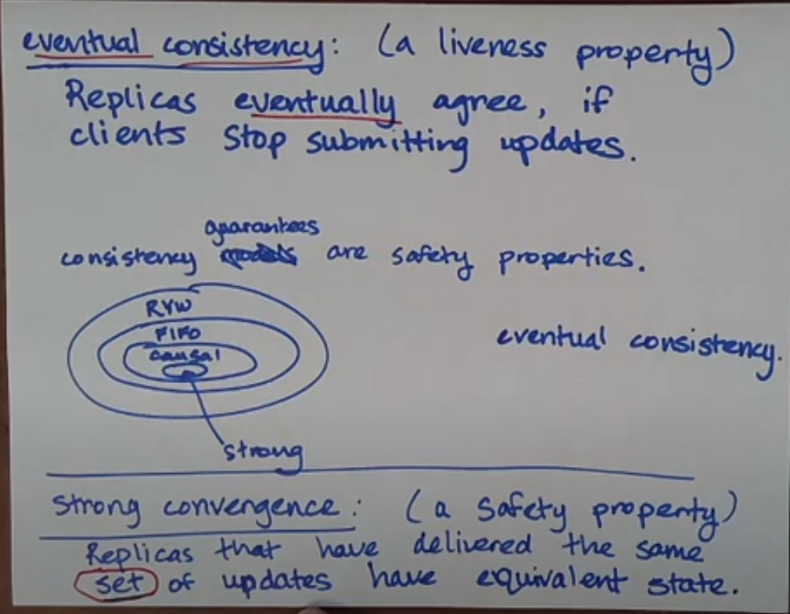

# Consistency 一致性

1. 一致性模型
   

   - RYW > FIFO > Causal > Strong
   - `是 safety properties`
   - 强一致性依赖于共识

2. 最终一致性

   - 最终一致性 (Eventual Consistency)
     **Replicas eventually agree**, if clients stop submitting updates.
     如果客户端停止提交更新，**副本最终会达成一致。**

     - 最终一致性等于没有一致性，不能划分在 `Consistency Models` 中。
     - Consistency Models 是 safety 属性，而最终一致性是 liveness 属性

   - 强收敛性 (Strong Convergence)
     Replicas that have delivered the same set of updates have equivalent state.
     如果副本上应用的更新相同，则副本的状态相同。

     - 强收敛性是safety属性
     - 违反强收敛性的例子：
       
     - 满足强收敛性的例子：
       

     强最终一致性(strong eventual consistency) = 最终一致性(eventual consistency) + 强收敛性(strong convergence)，兼有safe和liveness属性

## Concurrency 并发性

Strong convergence is easy if `different clients write to different keys`… what if we wanted `different clients write to the same key`?
如果不同的客户端写入相同的键呢？Strong convergence 如何保证？

app-specific conflict resolution 应用程序特定的冲突解决

以购物车系统为例，我们可以用合并集合的方法解决冲突：
**set union**

## Dynamo 论文中使用的术语

> Dynamo是一个分布式键值存储数据库。

- network partitions 网络分区
  网络分区是一种故障状态，其中网络的某些部分无法与网络的另一部分通信
  
- availability 可用性
  perfect availability: “**every request receives a response**” - a liveness property
  完美的可用性：“**每个请求都会收到响应**”——活跃属性

考虑以下问题：如果您的网络分区阻止主服务器与备份服务器通信，该怎么办 - 主服务器何时应向客户端发送 ACK

- 保全一致性：在 ACK 之前等待分区修复，但客户端可能会等待很长时间
- 保全可用性：当分区最终修复时，我们可以立即确认并进行复制，但随后系统会在一段时间内不一致

`Primary-Backup/CR prioritizes consistency over availability`; Dynamo et al. choose availability.
Primary-Backup/CR 优先考虑一致性而非可用性；而 Dynamo 选择了可用性。

This tradeoff is called CAP:
这种权衡称为CAP ：

- Consistency 一致性
- Availability 可用性
- Partition Tolerance 分区容错性

It’s impossible to have perfect consistency and availability, because of network partitions.
**由于网络分区，不可能拥有完美的一致性和可用性。**

## testing distributed systems 测试分布式系统

netfilix：chaos engineering 混沌工程
在生产环境中引入故障，以测试系统的鲁棒性

## Quorum Consistency 法定人数一致性

How many replicas should a client talk to? Quorum systems let you configure this.
**客户端应该与多少个副本通信**？Quorum systems 允许您对此进行配置。

- N：副本数, number of replicas
- W："write quorum" 写法定人数，必须有多少个副本确认，写入操作才算成功
- R："read quorum" 读法定人数，必须有多少个副本确认，读取操作才算成功

配置1：N=3, W=3, R=1 (X)
`Read-One-Write-All ROWA`
这并不一定能为您提供强一致性，因为副本可能会以不同的顺序传递来自不同客户端的写入(replicas might deliver writes from different clients in different orders)。

配置2：N=3, W=2, R=2 (O)
Dynamo 论文建议。
This is so read and write quorums overlap。

一般来说，如果 R + W > N，读取仲裁将与写入仲裁相交。

某些数据库系统（例如 Cassandra）允许您配置这些常量。例如，如果您想要超快速写入，但对一致性的保证较少，则可以设置 W = 1。
