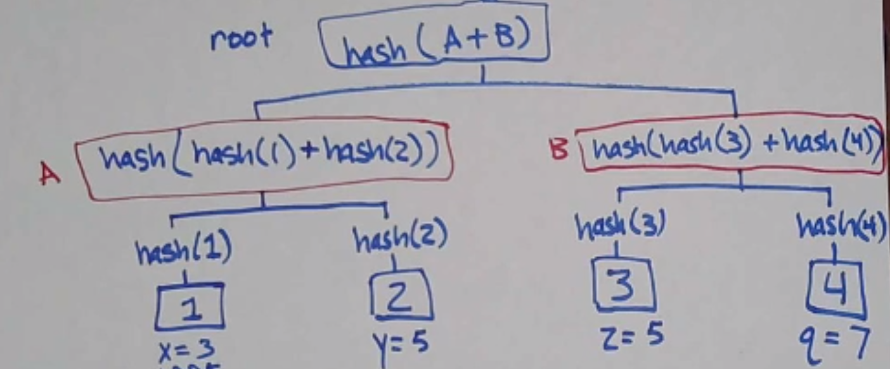
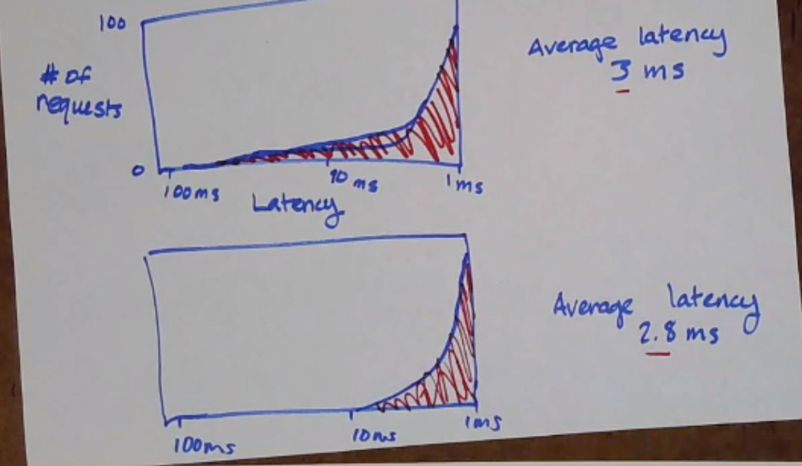
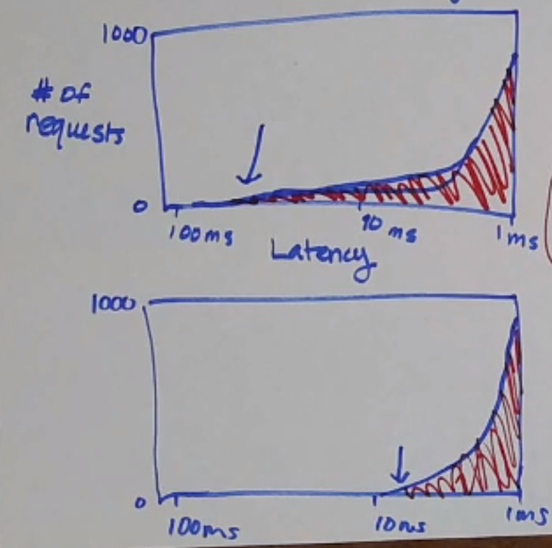
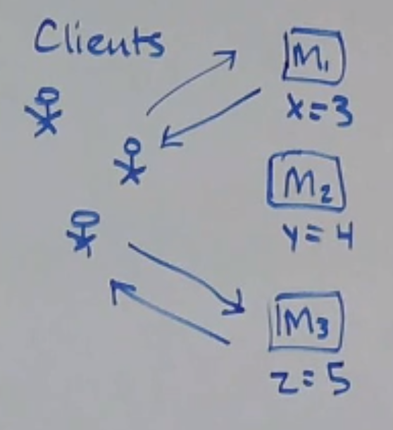
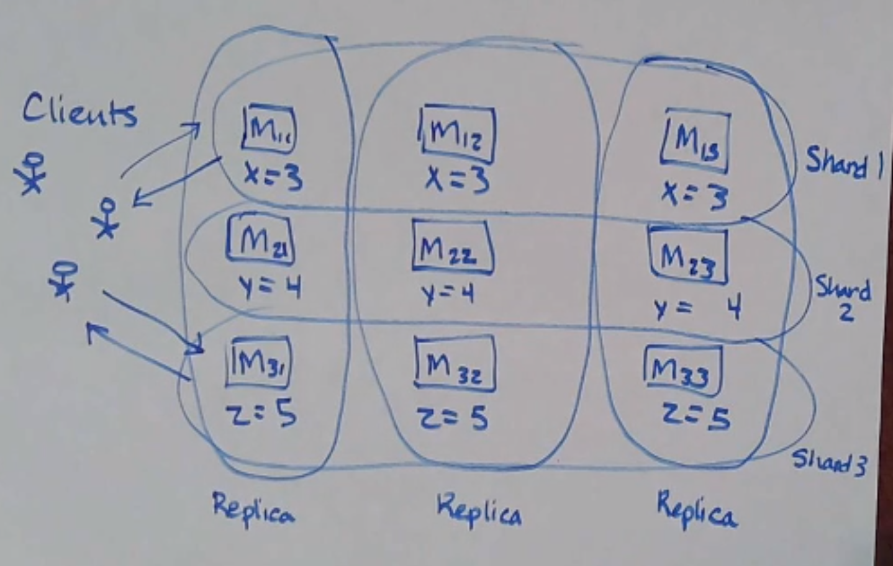
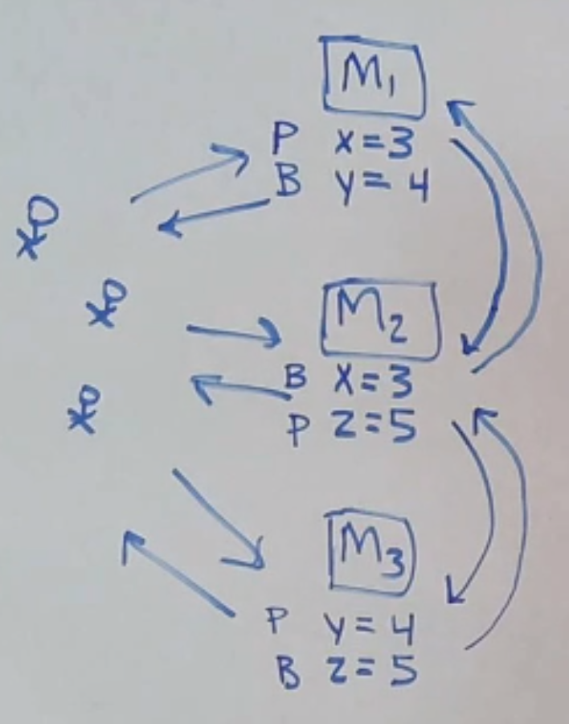

# Dynamo

## Concepts 概念

- availability 可用性
  every request will receive a response (quickly? 99.9% of requests?)
- network partitions 网络分区
  - some machine(s) can’t talk to other(s)
    某些机器无法与其他机器对话
  - temporary and unintentional
    暂时的和无意的
- eventual consistency 最终一致性
  - a liveness property 活性属性
  - replicas eventually agree if updates stop arriving
    “如果更新停止到达，副本最终会同意”
- application-specific conflict resolution 应用程序特定的冲突解决
  - the client can resolve conflicting states (e.g. merging shopping carts)
    客户端可以解决冲突的状态（例如合并购物车）
  - dynamo: deleted items can reappear in a cart (bug)
    dynamo：删除的商品可以重新出现在购物车中（错误）
  - dynamo: if client has no specific conflict resolution, `last write wins (LWW)`
    dynamo：如果客户端没有特定的冲突解决方案，则`最后写入获胜（LWW）`

Consider the problem of adding items to a shopping cart: `writes commute`, which implies strong convergence (replicas that deliver the same set of requests have the same state).
考虑将商品添加到购物车的问题：`写入操作是可交换的(a+b=b+a)`，这意味着强收敛。

## Disagreements 分歧

- anti-entropy
  用于解决 `application(KVS)` state 中的冲突
  - states are big
- gossip
  用于解决 `view` state / group membership (what nodes are alive?) 中的冲突
  - states are small

## Merkle Trees 默克尔树

本质是线段树维护哈希值
checksum

在 Dynamo 中，KVS 状态很大，但视图状态一般都很小。为了在不发送整个状态的情况下比较 KVS 状态，Dynamo 使用Merkle 树（哈希树）
每个叶子都是 KVS 对的哈希，每个父级都是其子级的哈希。然后，两个副本可以比较它们的根节点 - 如果相等，则所有叶子节点也必须相等；否则，比较直接子代等等。

## Tail Latency 尾延迟

Latency 定义：time between the start and end of a single action (单个操作开始和结束之间的时间)

average latency 不能有效地描述延迟
尾部延迟检查最差请求的延迟（`例如第 99.9 个百分位`）。

Dynamo 具有非常好的尾部延迟。

## Sharding 分片

每个人都存储所有数据的方法有什么问题？

- what if you have more data than fits on one machine?
  如果您的数据多于一台机器所能`容纳`的数据怎么办？

- if everyone stores all the data, consistency is more expensive to maintain
  如果每个人都存储所有数据，那么`维护一致性的成本`会更高

Let’s store different partitions of data on different machines instead!
**让我们将不同分区的数据存储在不同的机器上！**

But now you lose fault tolerance… so let’s replicate it some!
但现在你失去了容错能力……所以让我们复制一些吧！

This is called data `partitioning or sharding`. Sharding gives you:
这称为数据分区或分片。分片为您提供：

- increased capacity 增加容量
- increased throughput 增加吞吐量

Let’s consider a different sharding setup: where each machine acts as a primary for some part of the data, and the backup for some other set of data!
让我们考虑一种不同的分片设置：其中每台机器充当部分数据的主要部分，以及其他一些数据集的备份！`通俗地说，每个人的分工为主R和Support两种`。

### 如何分片

1. 将数据随机分配给节点
   good: 均匀分布
   bad: 很难找到特定数据的位置
2. 将所有数据分配给一个节点
   good: 易于查找
   bad: 数据不均匀
3. 按键范围分区(key range partitioning)
   改进：一致性哈希

## Consistent Hashing 一致性哈希

针对有状态的服务。
我们使用一种称为一致性哈希的机制来获得最小的移动。

思路：
将哈希空间视为一个环，每个节点在环上都有一个位置

问题：

1. 级联崩溃：机器没有能力弥补另一次崩溃造成的损失，并且也会崩溃
2. 节点实际上并不是均匀分布的
   解决方案：
   - 虚拟节点(散列到环上的多个位置)
   - 加权
