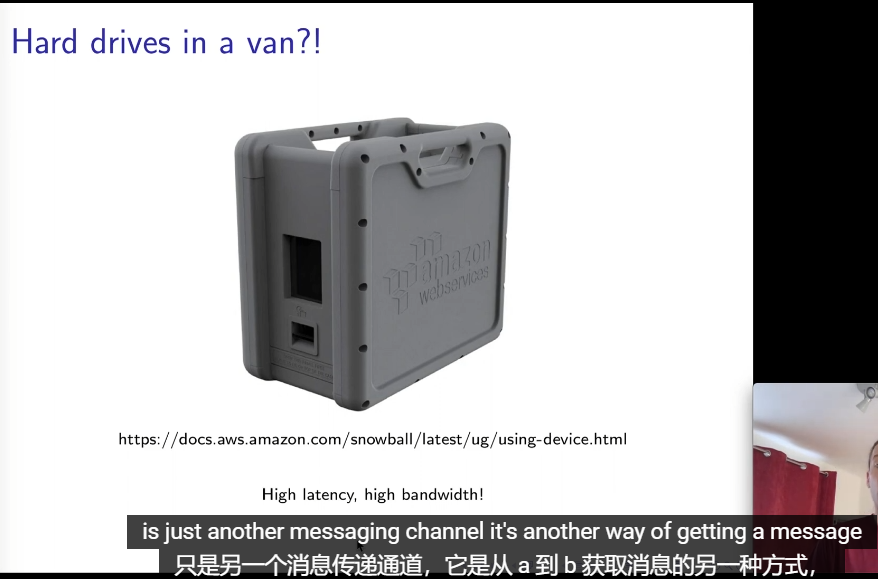
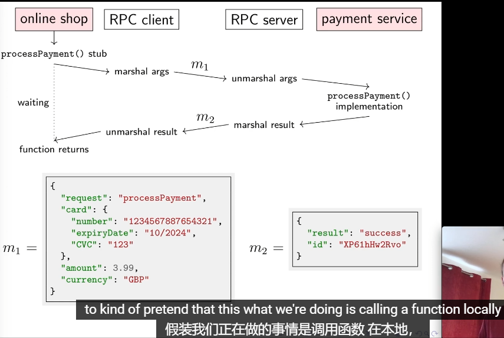

# Distributed Systems

https://www.youtube.com/watch?v=UEAMfLPZZhE&list=PLeKd45zvjcDFUEv_ohr_HdUFe97RItdiB

相同的部分参考 cse138 笔记

## 1.1: Introduction

- 课程是 https://www.cl.cam.ac.uk/teaching/2021/ConcDisSys/materials.html 的第二部分，第一部分 Concurrent Systems 的延续

## 1.2: Computer networking

### 传输方式

1. 通过network传输
   wifi, satellite, etc
2. 通过物理传输
   hard drives in a van
   传输巨量数据
   

### 指标

- latency (延迟)
  - same building < 1ms
  - another continent < 100ms
  - hard drive < 1day
- bandwidth (带宽)
  - home broadband 10-100Mbps
  - hard drive : 50TB/box => 1Gbps

## 1.3: RPC (Remote Procedure Call)

RPC（远程过程调用）简介


### 什么是 RPC？

**RPC（Remote Procedure Call，远程过程调用）** 是一种通信协议，允许程序在不同的计算机或进程之间像调用本地函数一样调用远程服务。通过 RPC，开发者可以简化分布式系统中的通信，使得分布式应用的开发更加直观和高效。

### RPC 的基本概念

1. **客户端（Client）**：

   - 发起远程调用请求的实体。
   - 调用远程过程时，客户端会等待过程执行完成并返回结果。

2. **服务器（Server）**：

   - 提供远程过程的执行环境。
   - 接收客户端的请求，执行相应的过程，并将结果返回给客户端。

3. **过程（Procedure）**：
   - 定义在服务器上的功能，可以被客户端远程调用。
   - 过程的参数和返回值需通过序列化和反序列化进行传输。

### RPC 的工作原理

1. **客户端调用**：

   - 客户端调用本地的 RPC 函数代理（stub）。
   - 代理将函数调用参数序列化（编码）并发送到服务器。

2. **服务器处理**：

   - 服务器接收并反序列化（解码）请求。
   - 执行对应的远程过程。
   - 将执行结果序列化后返回给客户端。

3. **客户端接收**：
   - 客户端接收并反序列化服务器返回的结果。
   - 将结果返回给调用者，完成远程调用过程。

### RPC 的优势

- **抽象化通信细节**：开发者无需关心底层的网络通信细节，可以像调用本地函数一样使用远程服务。
- **简化分布式编程**：提供一致的接口，使得分布式系统的开发更加简洁和模块化。
- **提高代码复用**：允许不同系统或服务之间共享功能，实现代码的复用。

### RPC 的挑战

- **网络延迟**：远程调用涉及网络传输，相比本地调用具有更高的延迟。
- **错误处理**：网络故障、服务器错误等需要健壮的错误处理机制。
- **序列化与反序列化**：数据在传输过程中需要序列化，可能引入性能开销和兼容性问题。
- **安全性**：远程调用涉及跨网络通信，需要确保数据传输的安全性和完整性。

### 常见的 RPC 框架

- **gRPC**：由 Google 开发，基于 HTTP/2 协议，支持多种编程语言，具有高性能和强类型接口定义。
- **Apache Thrift**：由 Facebook 开发，支持多语言，提供灵活的接口定义和高效的序列化机制。
- **JSON-RPC**：基于 JSON 格式的轻量级 RPC 协议，易于实现和使用。
- **XML-RPC**：基于 XML 格式的 RPC 协议，适用于需要与基于 XML 的系统集成的场景。

### 示例

以下是使用 **gRPC** 实现简单 RPC 调用的示例：

#### 1. 定义服务（.proto 文件）

```proto
syntax = "proto3";

package example;

// 定义一个简单的 Greeter 服务
service Greeter {
  // 定义一个 SayHello 方法
  rpc SayHello (HelloRequest) returns (HelloReply);
}

// 定义请求消息
message HelloRequest {
  string name = 1;
}

// 定义响应消息
message HelloReply {
  string message = 1;
}
```

## 4.1: Logical time

## 4.2: Broadcast ordering

## 4.3: Broadcast algorithms

## 5.1: Replication

## 5.2: Quorums

## 5.3: State machine replication

## 6.1: Consensus

## 6.2: Raft

## 7.1: Two-phase commit

## 7.2: Linearizability

## 7.3: Eventual consistency

## 8.1: Collaboration software

## 8.2: Google's Spanner
