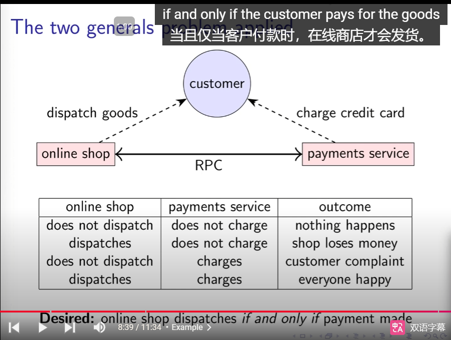
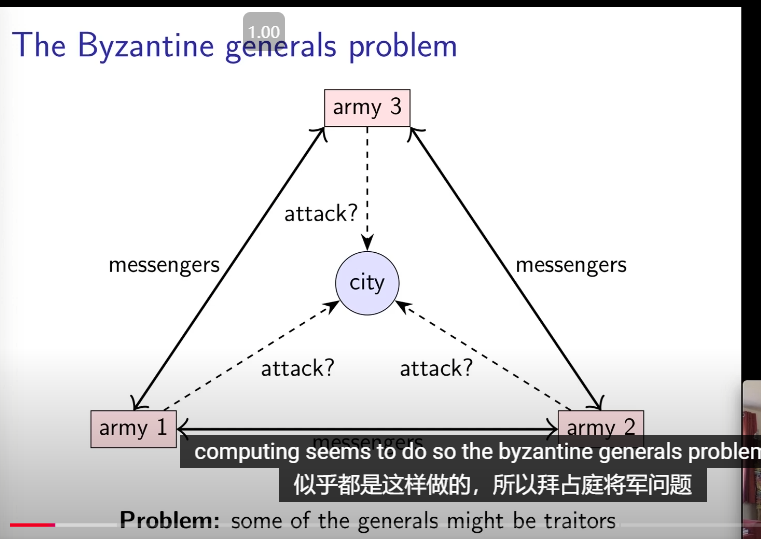
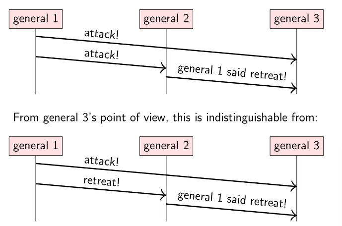
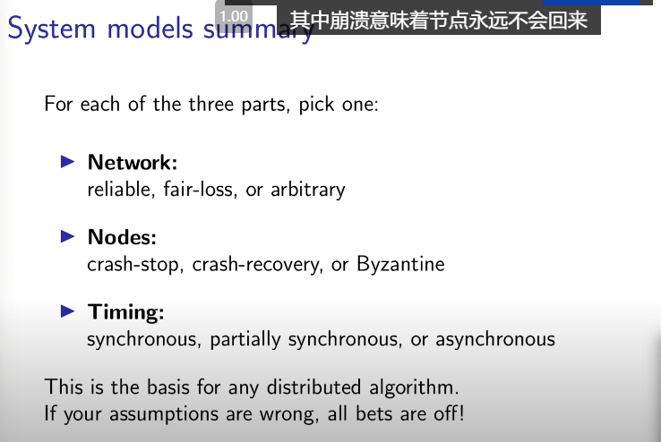
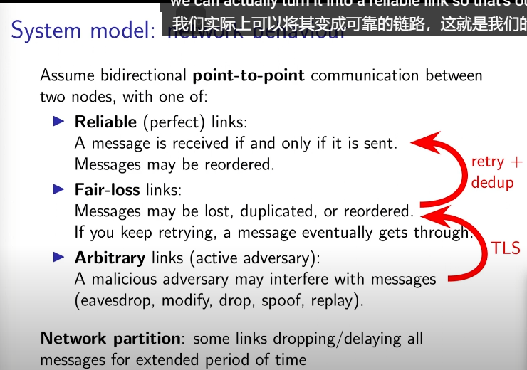
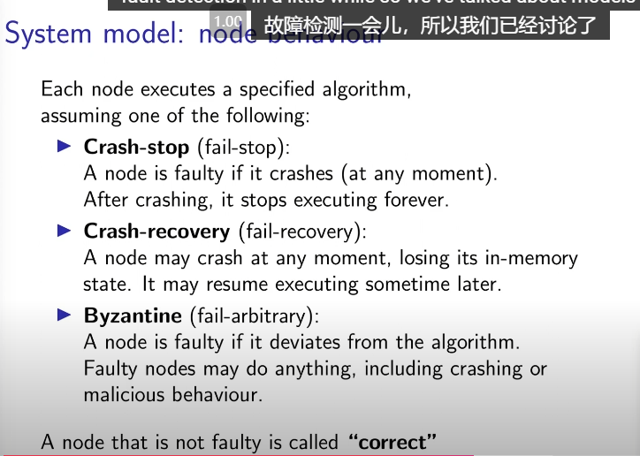
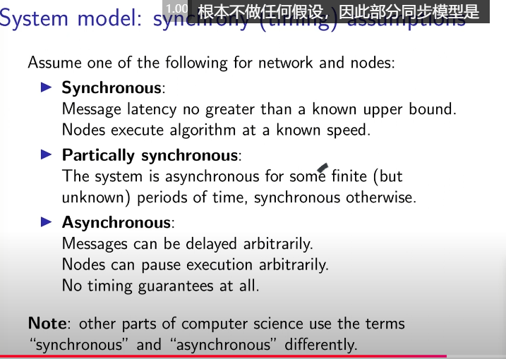
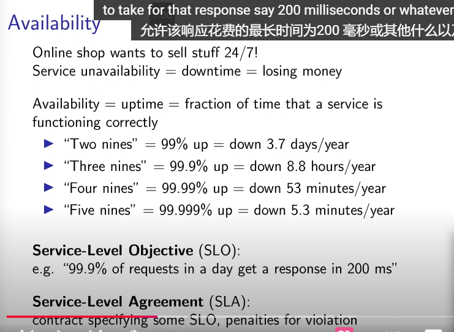

## 2.1: The two generals problem

[text](<../CSE138/4_Safety & Liveness.md>)

两将军问题应用：网购，双方达成共识。

## 2.2: The Byzantine generals problem

拜占庭将军问题

理论：如果存在f个恶意的将军，那么需要3f+1个将军才能保证系统的正确性。

应用：顾客、商家、支付平台三方达成共识。

byzantine <=> malicious

## 2.3: System models

模型是一些假设(assumptions)的集合。是ds的标准。

三个组成：

1. Network Behavior
   

   - reliable
   - fair-loss
     eg: 丢包、乱序、重复
   - arbitrary
     eg: 篡改

   arbitrary -> (TLS) -> fair-loss -> (retry+dedup) -> reliable

2. Node Behavior
   

   - crash-stop(fail-stop)
     eg: 崩溃停止
   - crash-revovery(fail-recovery)
     eg: 崩溃恢复，丢失状态
   - Byzantine(fail-arbitrary)
     任意行为

   A node that is not faulty is called **correct**.

3. Timing Behavior
   

   - synchronous
     网络延迟是有界的
   - partially synchronous
     在某些时间段内是同步的，某些时间段内是异步的
   - asynchronous
     网络延迟是无界的

网络延迟(latency)导致的问题：

- Message loss requiring retry.
- Congestion/contention causing queueing.
- Network/route reconfiguration.

消息重试、消息积压、网络/路由重配置。

## 2.4: Fault tolerance

- Availability
  

  1. SLO(Service Level Objective)
     服务级别目标，例如
     - 可用性：99.9%的可用性，意味着每个月最多允许43.2分钟的停机时间。
     - 响应时间：95%的请求响应时间在200毫秒以内。
     - 错误率：每百万次请求中，错误率不超过1次。
  2. SLA(Service Level Agreement)
     服务级别协议，承诺达到某个SLO。

- Achieving high availability: fault tolerance
  1. Failure: 整个系统不工作了。挂了。
  2. Fault: 系统的某部分不工作了。出现故障。
     node/network fault
  3. Single point of failure(SPOF): 单点故障
     node/network link whose fault leads to failure
     如果一个节点挂了，整个系统就挂了。
