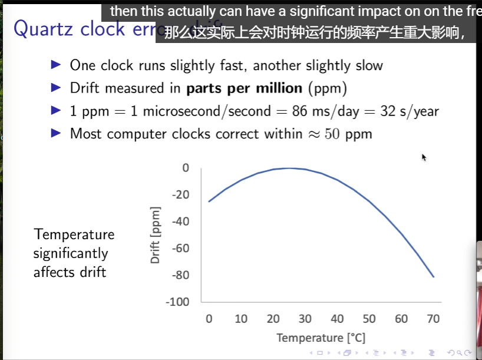
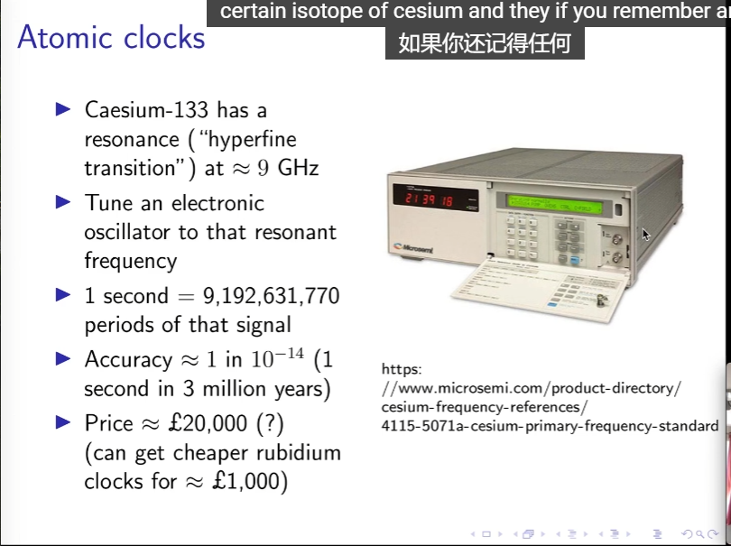
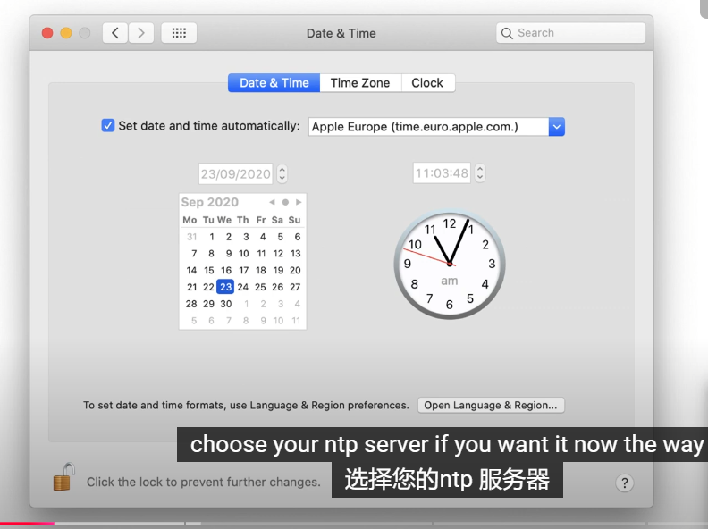
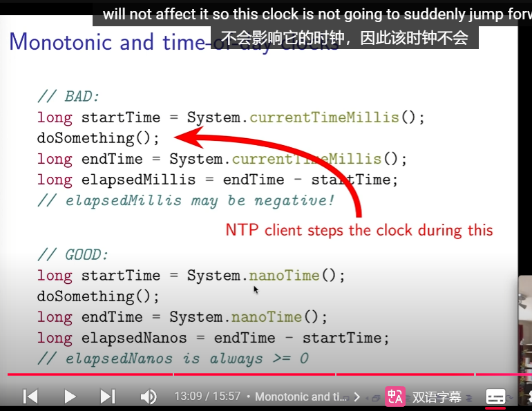
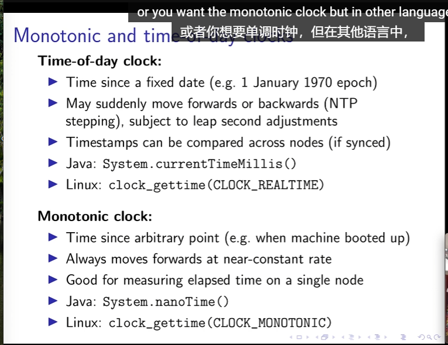

## 3.1: Physical time 物理时钟

注意：
在数字信号中的时钟(oscillator) 不等于分布式系统中的时钟(source of timestamps).

- Quartz clock error: drift
  石英钟误差：漂移
  
  clock skew: 时钟偏差，两个时钟在同一时刻的时间差。
- Atomic clock : 太贵、太大
  

## 什么是 Coordinated Universal Time（UTC，协调世界时）？

**协调世界时（UTC，Coordinated Universal Time）** 是全球时间标准，用于协调世界各地的时钟和时间测量。`UTC 基于原子时（TAI，国际原子时）并结合地球自转的实际速度，通过闰秒的添加或减少来保持与地球自转时间（UT1）的同步。`

## UTC 的组成

1. **原子时（TAI）**：

   - 基于铯-133原子的振荡频率，提供了稳定且精确的时间基准。

2. **地球自转时间（UT1）**：

   - 根据地球自转实际速度测量的时间，与太阳时间紧密相关。

3. **闰秒（Leap Seconds）**：
   - 为了弥补地球自转速度的不规律性，UTC 会在合适的时候添加或减少一秒，使其与 UT1 保持同步。

## UTC 与其他时间标准的关系

- **国际原子时（TAI）**：
  - TAI 是 UTC 的基础，UTC 通过调整闰秒保持与 TAI 和 UT1 的平衡。
- **格林尼治标准时间（GMT）**：

  - GMT 是历史上的时间标准，现在大多情况下 GMT 与 UTC 同步，但 GMT 更侧重于地理位置。

- **本地时间**：
  - 各地的本地时间通常基于 UTC 加上相应的时区偏移量（如 UTC+8 表示北京时间）。

## 示例

### 获取当前 UTC 时间（JavaScript）

```javascript
const currentUTC = new Date().toISOString()
console.log(`当前 UTC 时间：${currentUTC}`)
```

### 计算机如何表示时间戳

1. Unix time
   Unix 时间戳是从 1970 年 1 月 1 日 00:00:00 UTC (epoch)开始的秒数。
   不计算闰秒(软件不处理，直接忽略)。
   闰秒导致的bug:
   2012年6月30日23:59:60，有些系统无法处理这个时间戳，导致系统崩溃。
2. ISO 8601
   ISO 8601 是一种时间和日期的标准格式，例如 `2021-09-01T12:00:00Z`。
   包含 年月日时分秒 以及 时区信息。

## 3.2: Clock synchronisation

- NTP(Network Time Protocol)
  
  NTP 是一种用于同步计算机系统时钟的协议，通过网络传输时间信息，使得计算机的时钟与 UTC 时间保持同步。

  校准过程：

  1. Client 发送请求到 Server，包含本地时间戳 T1。
  2. Server 收到请求后，记录收到时间戳 T2 和回复时间戳 T3。
  3. Client 收到回复后，记录收到时间戳 T4。
  4. 计算公式：
     Round-trip delay: (T4 - T1) - (T3 - T2)
     Estimated server time: T3 + delay / 2
     Clock Skew: (T2 - T1 + T3 - T4) / 2
  5. 校准本地时钟。
     - 如果clock skew <125ms，`slew` the clock
     - 125ms < clock skew < 1000s，`step` the clock
     - clock skew > 1000s，`panic` and nothing

### monotonic clock vs. time-of-day clock




区别：
java中，`System.currentTimeMillis()` 返回的是 time-of-day clock，`System.nanoTime()` 返回的是 monotonic clock，不受系统时间调整的影响。

- time-of-day clock: 从 epoch 开始的时间.可能突然变化(由于闰秒的存在，导致NTP校准时钟)。
- monotonic clock: 从某个时间点开始的时间，保证单调。

## 3.3: Causality and happens-before
