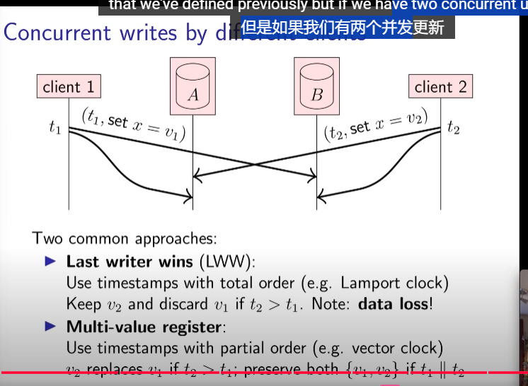

## Replication

A node that has a copy of the data is called a `replica`.

- Idempotence
  

  - 性质：idempotent requests `can be retried without deduplication`
  - 三种retry语义(semantics)：

    - at-most-once
      send request, `dont retry`, update may not happen
    - at-least-once
      `retry request until ack`, may repeat update
    - exactly-once
      `retry + idempotence` or `retry + dedup`

  - Adding and then removing again problem
    
    因为：`虽然 f(f(x)) = f(x)，但是 f(g(f(x)))!=g(f(x))`
  - Another problem with adding and removing
    
    最终状态相同，但是用户意图不同

    解决方案：
    **timestamps + tombstones**
    

    `每次操作加上版本(eg:时间戳)，删除使用标记删除(tombstones)`

- Reconciling replicas (协调副本)
  
  根据版本更新副本值

- Concurrent writes by different clients
  
  两种解决方式：

  1. Last write wins (LWW)
     如果使用全序时钟，可以保留最后一个。
     但问题是：data loss。
  2. Multi-value register
     如果使用偏序时钟，根据并发关系/偏序关系决定保留后一个还是两个都保留。

## Quorums

## State Machine Replication

- 串行事务
- 区块链、智能合约
