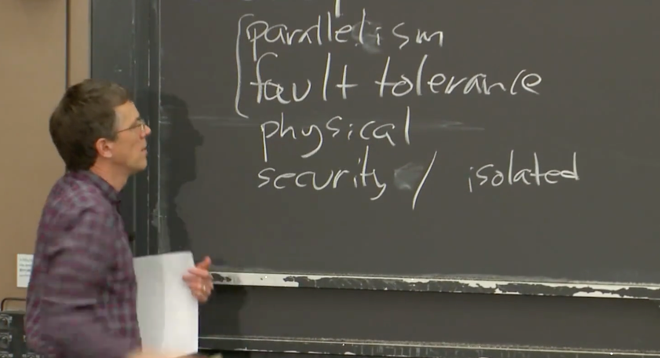
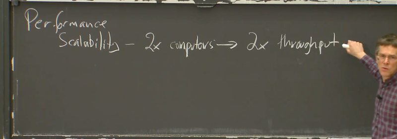
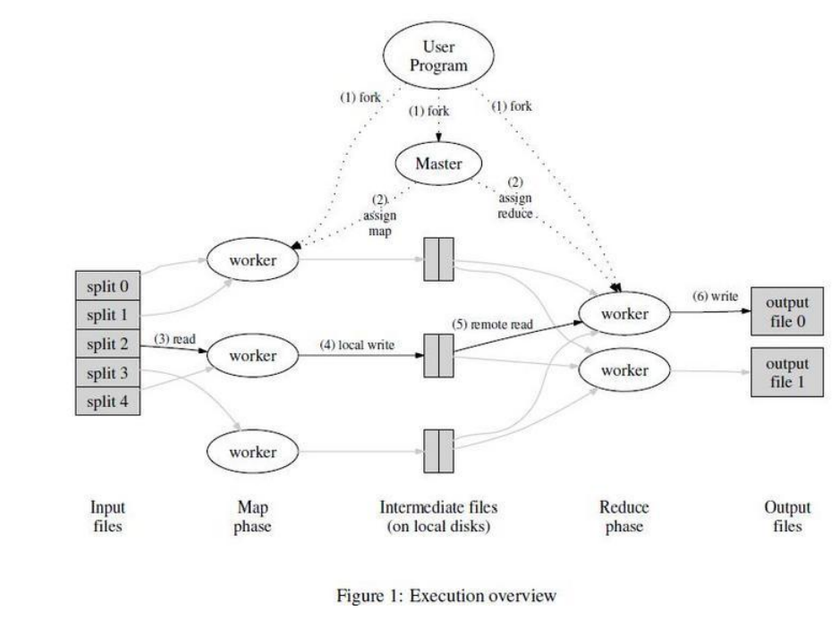

4个lab

- MapReduce
  论文：
  https://orange1438.github.io/pdf/Google-MapReduce.pdf
  https://pdos.csail.mit.edu/6.824/papers/mapreduce.pdf
- Raft for fault-tolerance
- K/V server
- Sharded K/V server

1. 分布式系统的驱动力
   
   - `性能`
   - `容错`
   - 物理分布
     银行转账
   - 安全
     不可信对端（区块链）
2. 分布式系统的挑战

   - concurrency
   - partial failure
   - performance

   在选择使用分布式系统解决问题前，你应该要充分尝试别的思路，因为分布式系统会让问题解决变得复杂。

3. 分布式系统的抽象和实现工具（Abstraction and Implementation）
   基础架构的三个类型主要是`存储，计算和通信（网络）`

   - 对于存储和计算，我们的目标是为了能够设计一些简单接口，让第三方应用能够使用这些分布式的存储和计算，将分布式特性隐藏在整个系统内。
   - 实现：RPC、Threads、Concurrency

4. 可扩展性（Scalability）
   两台计算机构成的系统如果有两倍性能或者吞吐，就是可扩展性。
   

   但是这种可扩展性并不是无限的。很可能在某个时间点你有了10台，20台，甚至100台web服务器，它们都在和同一个数据库通信。现在，`数据库突然成为了瓶颈`，并且增加更多的web服务器都无济于事了。

   所以，有关扩展性是这样：我们希望可以通过增加机器的方式来实现扩展，但是现实中这很难实现，`需要一些架构设计来将这个可扩展性无限推进下去。`

5. 可用性（Availability）
   在特定的故障范围内，系统仍然能够提供服务，系统仍然是可用的。容错。

   - 对于一个具备可用性的系统，为了让系统在实际中具备应用意义，也需要具备可恢复性(Recoverability)。修复之后，系统又可以完全正确的重新运行。
     > 回血
   - 为了实现这些特性，有很多工具。其中最重要的有两个：
     1. 非易失存储（non-volatile storage，类似于硬盘）
        我们可以存放一些checkpoint或者系统状态的log在这些存储中，这样当备用电源恢复或者某人修好了电力供给，我们还是可以从硬盘中读出系统最新的状态，并从那个状态继续运行。
     2. 复制（Replication）
        涉及同步问题。

6. 一致性（Consistency）
   当我需要对一个分布式系统举例时，我总是会想到KV服务，因为它们也很基础，可以算是某种基础简单版本的存储系统。

   - 强一致性 vs. 弱一致性
     [text](<强一致性 vs. 弱一致性.md>)

7. MapReduce基本工作方式
   MapReduce是由Google设计，开发和使用的一个系统，相关的论文在2004年发表。
   Google当时面临的问题是，他们需要在TB级别的数据上进行大量的计算。
   比如说，为所有的网页创建索引，分析整个互联网的链接路径并得出最重要或者最权威的网页。
   在当时，整个互联网的数据也有数十TB。构建索引基本上等同于对整个数据做排序，而排序比较费时。
   所以，当时`Google需要一种框架，使得普通工程师也可以很容易的完成并运行大规模的分布式运算`。这就是MapReduce出现的背景。

   MapReduce的思想是，应用程序设计人员和分布式运算的使用者，只需要写简单的Map函数和Reduce函数，而不需要知道任何有关分布式的事情，MapReduce框架会处理剩下的事情。

   Job。整个MapReduce计算称为Job。
   Task。每一次MapReduce调用称为Task。
   所以，对于一个完整的MapReduce Job，它由一些Map Task和一些Reduce Task组成。

   - 可以将Reduce函数的输出再传递给Map函数
   - 工作流程：
     

     1. MapReduce运行在大量的服务器之上，我们称之为worker服务器或者worker。同时，也会有一个Master节点来组织整个计算过程。Master服务器知道有多少输入文件，例如5000个输入文件。
     2. Master将Map函数`分发`到不同的worker。将Reduce函数`分发`到不同的worker。
     3. Map worker进程会读取输入文件的内容，`调用Map函数`并将文件名和文件内容作为参数传给Map函数。
     4. Map函数调用`emit`，worker进程将数据写入到本地磁盘的文件中。包含了key和value对。
     5. Reduce worker 从每一个Map worker的输出文件中读取数据，将相同key的value进行收集(fish out)，然后调用Reduce函数。
     6. Reduce函数调用`emit`，将输出写入到一个Google使用的共享文件服务中(GFS)。

     > GFS会自动将这个大文件拆分成64MB的块，并将这些块平均的分布在所有的GFS服务器之上
