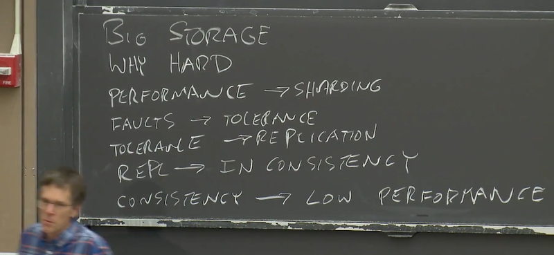
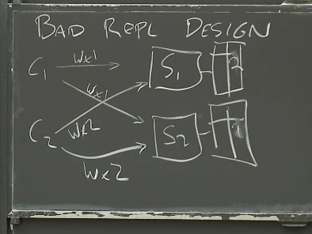
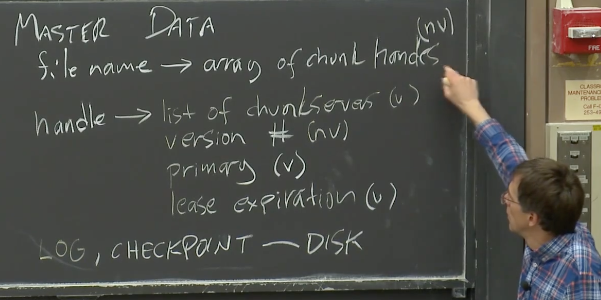

# Lecture 03 - GFS

Big Storage
之所以要说存储，原因是，存储是一种关键的抽象。
可能有各种各样重要的抽象可以应用在分布式系统中，但是实际上，简单的存储接口往往非常有用且极其通用。
构建分布式系统大多都是关于如何设计存储系统，或是设计其它基于大型分布式存储的系统。

## 3.1 分布式存储系统的难点（Why Hard）

- 鱼越大，鱼越小：
  
  性能问题 -> 分片（Sharding）-> 故障问题 -> 容错（Fault Tolerance）-> 副本（Replication）-> 一致性问题（Consistency）-> 降低性能

  现实中，如果你想要好的一致性，你就要付出相应的代价。
  如果你不想付出代价，那就要忍受一些不确定的行为。
  我们之后会在很多系统中看到这里介绍的循环。
  通常，人们很少会乐意为好的一致性付出相应的性能代价。

## 3.2 错误的设计（Bad Design）

- 对于具备强一致或者好的一致性的系统，从应用程序或者客户端看起来就像是和一台服务器在通信。

- 最糟糕的多副本设计
  
  没有做任何事情来保障两台服务器以相同的顺序处理这2个请求

## 3.3 GFS的设计目标 - Big、Fast、Global、Sharding、Automatic Recovery

Google有大量的数据，需要大量的磁盘来存储这些数据，并且需要能借助MapReduce这样的工具来快速处理这些数据。所以，Google需要能够快速的并行访问这些海量数据。

- 只在一个数据中心运行(Single Data Center)
- 内部使用的系统(Internal Use)
- 为TB级别的文件而生，只会顺序处理，不支持随机访问(Big Sequential Access)

论文也提出了一个当时非常异类的观点：`存储系统具有弱一致性也是可以`的。
GFS并不保证返回正确的数据，借助于这一点，GFS的目标是提供更好的性能。
这篇论文还有一个有意思的事情。在一些学术论文中，你或许可以看到一些容错的，多副本，自动修复的多个Master节点共同分担工作，`但是GFS却宣称使用单个Master节点并能够很好的工作。`

> 如果GFS返回错误的数据，会不会影响应用程序？
> 讽刺的是。`有谁关心网上的投票数量是否正确呢`，如果你通过搜索引擎做搜索，20000个搜索结果中丢失了一条或者搜索结果排序是错误的，没有人会注意到这些。这类系统对于错误的接受能力好过类似于银行这样的系统。
> 另外，尽管GFS可能会返回错误的数据，但是可以在应用程序中做一些补偿。例如论文中提到，`应用程序应当对数据做校验，并明确标记数据的边界，这样应用程序在GFS返回不正确数据时可以恢复。`

## 3.4 GFS Master 节点

- 架构:
  上百个客户端、chunkServer和一个Master节点

  Master节点用来管理文件和Chunk的信息，而Chunk服务器用来存储实际的数据。这是GFS设计中比较好的一面，它将这两类数据的管理问题几乎完全隔离开了。`(控制流和数据流分离)`

  Master节点知道每一个文件对应的所有的Chunk的ID，这些Chunk每个是64MB大小，它们共同构成了一个文件。

  每个Chunk默认会有三个副本，所以，通常来说是一个Primary和两个Secondary。

- Master 节点`内存`中的数据结构
  两个table：文件名到ChunkId数组的映射、ChunkId到ChunkInfo的映射

  ```ts
  type FileName = string
  type ChunkId = number
  type ChunkServer = string
  type ChunkInfo = {
    // Chunk服务器的列表
    chunkServers: ChunkServer[]
    // Chunk当前的版本号
    version: number
    // 所有对于Chunk的写操作都必须在主Chunk（Primary Chunk）上顺序处理，主Chunk是Chunk的多个副本之一。所以，Master节点必须记住哪个Chunk服务器持有主Chunk
    primary: ChunkServer
    // 主Chunk只能在特定的租约时间内担任主Chunk，所以，Master节点要记住主Chunk的租约过期时间。
    leaseExpiration: number
  }

  declare const table1: Map<FileName, ChunkId[]>
  declare const table2: Map<ChunkId, ChunkInfo>
  ```

  Master会在磁盘上存储log，`每次有数据变更时，Master会在磁盘的log中追加一条记录`，并生成CheckPoint（类似于备份点）。
  那么哪些数据需要存储在磁盘上?
  (NV: non-volatile, 非易失，这个标记表示对应的数据会写入到磁盘上)
  

  - NV：chunkId(chunkHandle)数组、版本号
  - V:
    - Chunk服务器列表(Master节点重启之后可以与所有的Chunk服务器通信，并查询)
    - 主Chunk的ID(Master节点重启之后会忘记谁是主Chunk，它只需要`等待60秒租约到期`，那么它知道对于这个Chunk来说没有主Chunk，这个时候，Master节点可以安全指定一个新的主Chunk)
    - 租约过期时间也不用写入磁盘

  所以，什么时候需要向磁盘中的Log追加一条记录？

  - 文件扩展到达了一个新的64MB，需要新增一个Chunk
  - 指定了新的主Chunk而导致版本号更新了

  为什么在磁盘中维护log而不是数据库？
  数据库本质上来说是某种B树（b-tree）或者hash table，相比之下，追加log会非常的高效，`因为你可以将最近的多个log记录一次性的写入磁盘`。这些数据都是向同一个地址追加，这样只需要等待磁盘的磁碟旋转一次。而对于B树来说，每一份数据都需要在磁盘中随机找个位置写入。所以`使用Log可以使得磁盘写入更快一些。`

  从log恢复数据：
  当Master节点故障重启，并重建它的状态，你不会想要从log的最开始重建状态，因为log的最开始可能是几年之前，`所以Master节点会在磁盘中创建一些checkpoint点，这可能要花费几秒甚至一分钟。这样Master节点重启时，会从log中的最近一个checkpoint开始恢复，再逐条执行从Checkpoint开始的log`，最后恢复自己的状态。

## 3.5 GFS读文件（Read File）

1. 客户端（或者应用程序）将文件名和偏移量发送给Master
2. Master节点将Chunk Handle（也就是ID，记为H）和服务器列表发送给客户端。
3. 客户端会与选出的Chunk服务器通信，将Chunk Handle和偏移量发送给那个Chunk服务器。

## 3.6 GFS写文件（Write File）（1）

`对于读文件来说，可以从任何最新的Chunk副本读取数据，但是对于写文件来说，必须要通过Chunk的主副本（Primary Chunk）来写入。`

> rust的借用规则，在同一作用域下，只能存在一个可变引用或多个不可变引用

```ts
interface IQueryPrimary {
  (chunkId: ChunkId): ChunkServer | undefined
}
```

最新的副本是指，副本中保存的版本号与Master中记录的Chunk的版本号一致。这就是为什么Chunk的版本号在Master节点上需要保存在磁盘这种非易失的存储中的原因。因为如果版本号在故障重启中丢失，且部分Chunk服务器持有旧的Chunk副本，这时，Master是没有办法区分哪个Chunk服务器的数据是旧的，哪个Chunk服务器的数据是最新的。

> 为什么不将所有Chunk服务器上保存的最大版本号作为Chunk的最新版本号
> 当Master节点重启时，可能部分Chunk服务器离线或者失联或者自己也在重启，从而不能响应Master节点的请求

> 当Master找不到持有最新Chunk的服务器时该怎么办？
> 我们需要等待，甚至可能是永远等待，因为你不会想使用Chunk的旧数据

> 如果Chunk服务器上报的版本号高于Master存储的版本号会怎么样
> Master会认为它在分配新的Primary服务器时出现了错误，并且会使用这个更高的版本号来作为Chunk的最新版本号(当Master向Primary和Secondary发送完消息之后就崩溃了)。

Primary 和 Secondary 们是主从关系。

## 3.7 GFS写文件（Write File）（2）

这一部分主要是对写文件操作的问答。

- 版本号只在Master节点认为Chunk没有Primary时才会增加

- 如果Master节点发现Primary挂了会怎么办
  脑裂（split-brain），网络分区问题
  => 避免错误的为同一个Chunk指定两个Primary的可能性
  => Primary只在租约内有效。Master和Primary都会知道并记住租约有多长`(共识)`

## 3.8 GFS的一致性

重复我们刚刚（3.7的问答中）讨论过的内容。

在GFS的这种工作方式下，如果Primary返回写入成功，那么一切都还好，如果Primary返回写入失败，就不是那么好了。Primary返回写入失败会导致不同的副本有完全不同的数据。应用程序需要容忍读取数据的乱序。
如果应用程序不能容忍乱序，应用程序要么可以通过在文件中写入序列号，这样读取的时候能自己识别顺序，要么如果应用程序对顺序真的非常敏感那么对于特定的文件不要并发写入。

- 将GFS改造成强一致性系统的思路
  1. Two-phase commit
