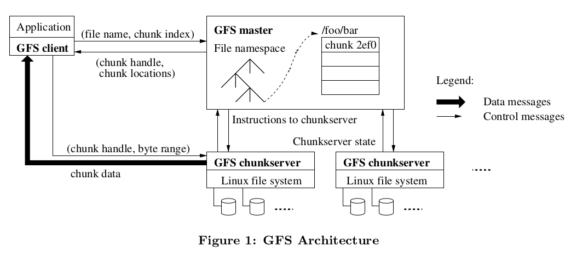

https://blog.mrcroxx.com/posts/paper-reading/gfs-sosp2003/
https://chengzhaoxi.xyz/download/pdf/paper/big-data/Google-File-System%E4%B8%AD%E6%96%87%E7%89%88_1.0.pdf
https://www.cnblogs.com/zzk0/p/13504571.html

1. 现状
   GFS（Google File System）是由我们设计并实现的、为`大规模分布式数据密集型应用程序`设计的可伸缩（scalable）的分布式文件系统。
   GFS很好地满足了我们的存储需求。GFS在Google被广泛地作为存储平台部署，用于生成、处理我们服务所使用的数据或用于需要大规模数据集的研发工作。到目前为止，`最大的GFS集群有上千台机器、上千块磁盘，并提供了上百TB的存储能力。`

2. 需求

   - 设备故障经常发生。采用相对便宜的服务器硬件。
   - 文件比传统标准更大。存储在GFS上的文件的不少都在几个GB这样的级别。
   - 大部分文件会以“追加”（append）的方式变更（mutate），而非“覆写”（overwrite）。这种对大文件的访问模式，追加成了为了性能优化和原子性保证的重点关注目标，而客户端中对chunk数据的缓存则不再重要。`不允许任意更改已有文件 (No Random Write)。`
   - 设计应用程序和文件系统API，要求上层系统(如MR)做一定的适配。
   - 高吞吐量比低延迟重要。

3. 结构
   
   
   **思想：控制流、数据流分离**

   主从模式

   - 单一的master
     负责管理好所有的元信息；接受客户端读取请求
     master 在整个读写过程中并`不承担文件传输的责任`，而是只编制索引和实施检索，这样很大程度上避免了 master 成为 single point of failure。
   - 多 chunkServer
     64MB的chunk；直接将文件回传给用户
   - 多 client

4. master 操作

   - 命名空间管理
   - chunk管理
   - 垃圾回收
   - 旧副本检测

5. client 操作

   - open
   - close
   - create
   - delete
   - read
   - write
   - append
   - snapshot

6. 讨论

7. 实现细节

8. 优化手段
   确保了单一master可承载的规模满足当时google的应用场景需求

   - 空间回收 - 删除的文件留出的空位可以再次使用
   - 读写优化 - 分散文件及备份到多台机器来加速读写

---

## 控制流、数据流分离
