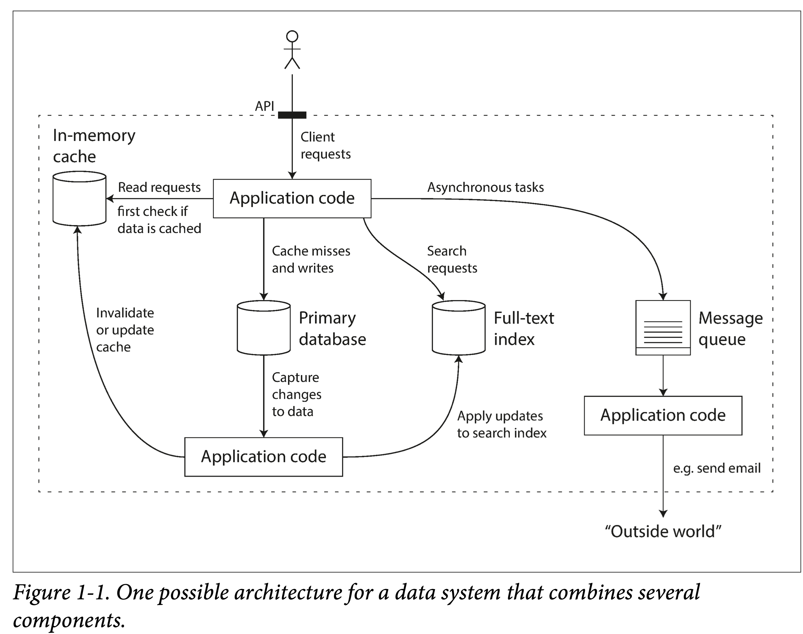

# 第一章：可靠性，可伸缩性，可维护性

## 本书为什么以`数据系统`为主题

数据的**采集**、**存储**和**使用**，是构成信息社会的基础。

### 常见的数据系统

- 存储数据，以便之后再次使用——`数据库`
- 记住一些非常“重”的操作结果，方便之后加快读取速度——`缓存`
- 允许用户以各种关键字搜索、以各种条件过滤数据——`搜索引擎`
- 源源不断的产生数据、并发送给其他进程进行处理——`流式处理`
  spark
- 定期处理累积的大量数据——`批处理`
- 进行消息的传送与分发——`消息队列`
  kafka

我们面临一个新的场景，以某种组合使用这些组件时，在某种程度上，便是创立了一个新的数据系统。

但就这么一个小系统，在设计时，就可以有很多取舍：

使用何种缓存策略？是旁路还是写穿透？
部分组件机器出现问题时，是保证可用性还是保证一致性？
当机器一时难以恢复，如何保证数据的正确性和完整性？
当负载增加时，是增加机器还是提升单机性能？
设计对外的 API 时，是力求简洁还是追求强大？

因此，有必要从根本上思考下`如何评价一个好数据系统`，如何构建一个好的数据系统，有哪些可以遵循的设计模式？有哪些通常需要考虑的方面？
**书中用了三个词来回答：可靠性（Reliability）、可扩展性（Scalability）、可维护性（Maintainability）**

### 可靠性

1. 功能上
   主流程、异常流程 都能正常工作
2. 性能上
3. 安全上

云服务一般会提供 SLA 服务等级协议，如 99.9% 的可用性，即一年中不超过 8.76 小时的时间不可用。

#### 故障

> 两个易混淆的概念：Fault（系统出现问题） 和 Failure（系统不能提供服务）
> 不能进行 Fault-tolerance 的系统，积累的 fault 多了，就很容易 failure。
> 如何预防？混沌测试：如 Netflix 的 chaosmonkey。

- 硬件故障
  对于数据：
  单机：可以做 RAID 冗余。如：EC 编码。
  多机：多副本 或 EC 编码。
- 软件故障
- 人为错误
  尽可能消除所有不必要的假设，提供合理的抽象，仔细设计 API
  进程间进行隔离，对尤其容易出错的模块使用`沙箱机制`
  对服务依赖进行熔断设计

### 可扩展性(Scalability)

`系统应对负载增长的能力。`
但在实践中又很难做好，因为存在一个基本矛盾：只有能存活下来的产品才有资格谈扩展，而过早为扩展设计往往活不下去。

- 衡量负载(load)
  应用日活月活
  每秒向 Web 服务器发出的请求(qps)
  数据库中的读写比率
  聊天室中同时活跃的用户数量

  eg: 推特的feed流：根据用户关注数决定推拉模式。

- 描述性能
- 应对负载

### 可维护性

- 可维护性(Operationability)

- 简洁性(Simplicity)

- 可演化性
