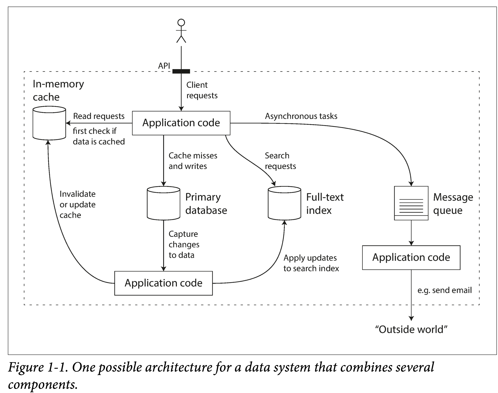

# 第一章：可靠性、可伸缩性和可维护性

https://ddia.qtmuniao.com/#/ch01

## 本书为什么以数据系统（data system）为主题

我们常见的绝大部分应用背后都有一套数据系统支撑

- 常见的`数据系统`有哪些
  存储数据，以便之后再次使用——`数据库`
  记住一些非常“重”的操作结果，方便之后加快读取速度——`缓存`
  允许用户以各种关键字搜索、以各种条件过滤数据——`搜索引擎`
  源源不断的产生数据、并发送给其他进程进行处理——`流式处理`
  定期处理累积的大量数据——`批处理`
  进行消息的传送与分发——`消息队列`
- 数据系统的日益复杂化
  新型的数据采集、存储和处理系统

  Kafka：可以作为存储持久化一段时间日志数据、可以作为消息队列对数据进行分发、可以作为流式处理组件对数据反复蒸馏等等。
  Spark：可以对数据进行批处理、也可以化小批为流，对数据进行流式处理。
  Redis：可以作为缓存加速对数据库的访问、也可以作为事件中心对消息的发布订阅。

  

  但就这么一个小系统，在设计时，就可以有很多取舍：

  使用何种缓存策略？是旁路还是写穿透？
  部分组件机器出现问题时，是保证可用性还是保证一致性？
  当机器一时难以恢复，如何保证数据的正确性和完整性？
  当负载增加时，是增加机器还是提升单机性能？
  设计对外的 API 时，是力求简洁还是追求强大？

  因此，有必要从根本上思考下如何评价一个好数据系统，如何构建一个好的数据系统，有哪些可以遵循的设计模式？有哪些通常需要考虑的方面？

  `书中用了三个词来回答：可靠性（Reliability）、可扩展性（Scalability）、可维护性（Maintainability）`

## 可靠性（Reliability）

- 衡量：功能(符合预期、健壮)、性能、安全
  Fault（系统出现问题） 和 Failure（系统不能提供服务）
  不能进行 Fault-tolerance 的系统，积累的 fault 多了，就很容易 failure。
  如何预防？混沌测试：如 Netflix 的 chaosmonkey。

  - 硬件故障

    - 需要考虑的硬件指标：MTTF（平均故障间隔时间, mean time to failure）
      单块盘 平均故障时间 5 ~10 年，如果你有 1w+ 硬盘，则均匀期望下，每天都有坏盘出现。当然事实是硬盘会一波一波坏。

      对于数据：
      单机：可以做 RAID 冗余。如：EC 编码。
      多机：多副本 或 EC 编码。

  - 软件错误
    在设计软件时，我们通常有一些`环境假设`，和一些`隐性约束`。
    随着时间的推移、系统的持续运行，如果这些假设不能够继续被满足；如果这些约束被后面维护者增加功能时所破坏；都有可能让一开始正常运行的系统，突然崩溃。

  - 人为问题
    - 编码
      尽可能消除所有不必要的假设，提供合理的抽象，仔细设计 API
      进程间进行隔离，对尤其容易出错的模块使用沙箱机制
      对服务依赖进行熔断设计
    - 测试
      - 尽可能引入第三方成员(未参与过，无上下文)测试，尽量将测试平台自动化
      - 单元测试、集成测试、e2e 测试、混沌测试
    - 运行
      - 详细的仪表盘
      - 持续自检
      - 报警、预案
  - 可靠性有多重要？
    事关用户数据安全，事关企业声誉，企业存活和做大的基石。

## 可扩展性（Scalability）

即系统`应对负载增长的能力`。它很重要，但在实践中又很难做好，因为存在一个基本矛盾：`只有能存活下来的产品才有资格谈扩展，而过早为扩展设计往往活不下去。`

- 衡量负载
  负载参数（load parameters）：日活月活、qps、读写比例、聊天室中同时活跃的用户数量

  > 推特的 Feed 流的推拉

- 描述性能
  系统负载是从用户视角来审视系统，是一种`客观指标`。而系统性能则是描述的系统的一种`实际能力`。

  - 吞吐量（throughput）：每秒可以处理的单位数据量，通常记为 QPS。
  - 响应时间（response time）：从用户侧观察到的发出请求到收到回复的时间。
  - 延迟（latency）：日常中，延迟经常和响应时间混用指代响应时间；但严格来说，延迟只是指请求过程中排队等休眠时间，虽然其在响应时间中一般占大头；但只有我们把请求真正处理耗时认为是瞬时，延迟才能等同于响应时间。

  响应时间通常以`百分位点`来衡量，比如 p95，p99 和 p999，它们意味着 95％，99％或 99.9％ 的请求都能在该阈值内完成。
  在实际中，通常使用滑动窗口滚动计算最近一段时间的响应时间分布，并通常以折线图或者柱状图进行呈现。

- 应对负载

  1. 纵向扩展（scaling up）或 垂直扩展（vertical scaling）：换具有更强大性能的机器。e.g. 大型机机器学习训练。
  2. 横向扩展（scaling out）或 水平扩展（horizontal scaling）：“并联”很多廉价机，分摊负载。e.g. 马斯克造火箭。

  - 扩展方式：自动/手动，最好是半自动的。
  - 针对不同场景：换好的机器 -> 上云 -> 自行设计可扩展的分布式架构
  - 两种服务类型：
    无状态服务 比较简单，多台机器，外层罩一个 gateway 就行。
    有状态服务 根据需求场景，如读写负载、存储量级、数据复杂度、响应时间、访问模式，来进行取舍，设计合乎需求的架构。

  **不可能啥都要，没有万金油架构！但同时：万变不离其宗，组成不同架构的原子设计模式是有限的**

## 可维护性（Maintainability）

- 可维护性（Operability）：人生苦短，关爱运维
  系统具有良好的可维护性，意味着**将可定义的维护过程编写文档和工具以自动化，从而解放出人力关注更高价值事情**
- 简洁性（Simplicity）：复杂度管理

  > A Philosophy of Software Design

  复杂度表现：

  状态空间的膨胀。
  组件间的强耦合。
  不一致的术语和命名。
  为了提升性能的 hack。
  随处可见的补丁（workaround）。

  需求很简单，但不妨碍你实现的很复杂 😉：过多的引入了额外复杂度（accidental complexity ）——非问题本身决定的，而由实现所引入的复杂度。
  **通常是问题理解的不够本质，写出了“流水账”（没有任何抽象，abstraction）式的代码。**

  **如果你为一个问题找到了合适的抽象，那么问题就解决了一半，如：**

  高级语言隐藏了机器码、CPU 和系统调用细节。
  SQL 隐藏了存储体系、索引结构、查询优化实现细节。

  如何找到合适的抽象？
  `从计算机领域常见的抽象中找。`
  `从日常生活中常接触的概念找。`(鹰眼->数据监控、鹰爪->数据采集)

  总之，一个合适的抽象，要么是`符合直觉`的；要么是和你的读者`共享上下文`的。

- 可演化性：降低改变门槛
  系统需求没有变化，说明这个行业死了。

  应对之道：

  - 项目管理上 敏捷开发
  - 系统设计上 依赖前两点。`合理抽象，合理封装，对修改关闭，对扩展开放`。

---

# 三种核心测试类型详解

在软件质量保障体系中，单元测试、集成测试和端到端测试构成了测试金字塔的三个层次。每种测试方法都有其独特的目的和价值。

## 单元测试 (Unit Testing)

**定义**：验证代码中最小可测试单元（通常是单个函数、方法或类）的正确性。

**特点**：

- **粒度最小**：测试单一函数或方法的行为
- **执行速度快**：通常毫秒级完成
- **数量最多**：占总测试用例的 60-70%
- **独立性高**：通过模拟(Mock)外部依赖实现隔离
- **由开发者编写**：与开发过程紧密结合

**示例**：

```javascript
// 单元测试示例 (使用Jest)
function sum(a, b) {
  return a + b
}

test('sum函数应正确计算两个数字', () => {
  expect(sum(1, 2)).toBe(3)
  expect(sum(-1, 1)).toBe(0)
})
```

## 集成测试 (Integration Testing)

**定义**：验证多个单元/组件组合在一起时是否正确交互。

**特点**：

- **测试多组件交互**：验证模块间接口和数据流
- **部分使用真实依赖**：如实际数据库或 API
- **执行速度中等**：秒级至分钟级
- **复杂度中等**：测试范围介于单元和 E2E 之间
- **数量适中**：占总测试的 20-30%

**示例**：

```javascript
// 集成测试示例 (测试数据库交互)
describe('用户存储服务', () => {
  beforeAll(() => setupTestDatabase())

  test('应能正确存储和读取用户信息', async () => {
    const user = { name: 'Alice', email: 'alice@example.com' }
    await userService.create(user)
    const savedUser = await userService.findByEmail('alice@example.com')
    expect(savedUser.name).toBe('Alice')
  })
})
```

## 端到端测试 (E2E Testing)

**定义**：模拟实际用户使用场景，验证整个系统从前端到后端的工作流程。

**特点**：

- **覆盖完整用户流程**：如注册、登录、购买等
- **使用真实环境**：完整的前端 UI、后端 API、数据库等
- **执行最慢**：分钟甚至小时级
- **最接近用户体验**：直接测试用户看到的内容
- **数量最少**：占总测试的 10-20%
- **维护成本高**：对 UI 变更敏感

**示例**：

```javascript
// E2E测试示例 (使用Cypress)
describe('用户登录流程', () => {
  it('应允许用户登录并访问仪表盘', () => {
    cy.visit('/login')
    cy.get('input[name=username]').type('testuser')
    cy.get('input[name=password]').type('password123')
    cy.get('button[type=submit]').click()
    cy.url().should('include', '/dashboard')
    cy.get('h1').should('contain', '欢迎，testuser')
  })
})
```

## 测试策略与最佳实践

**测试金字塔原则**：

- 底层大量单元测试（快速、稳定）
- 中层适量集成测试（验证交互）
- 顶层少量 E2E 测试（关键流程）

**关键考量**：

1. **执行速度**：单元测试 > 集成测试 > E2E 测试
2. **维护成本**：单元测试 < 集成测试 < E2E 测试
3. **测试可靠性**：单元测试 > 集成测试 > E2E 测试
4. **问题检测能力**：E2E 测试 > 集成测试 > 单元测试

通过合理组合这三种测试类型，可以构建既高效又可靠的测试策略，大幅提升系统可靠性，同时控制测试成本和维护负担。
