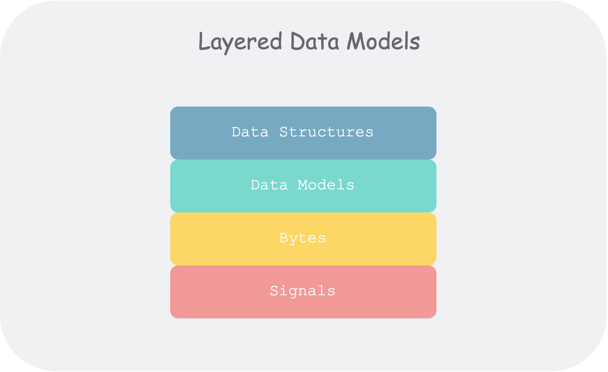
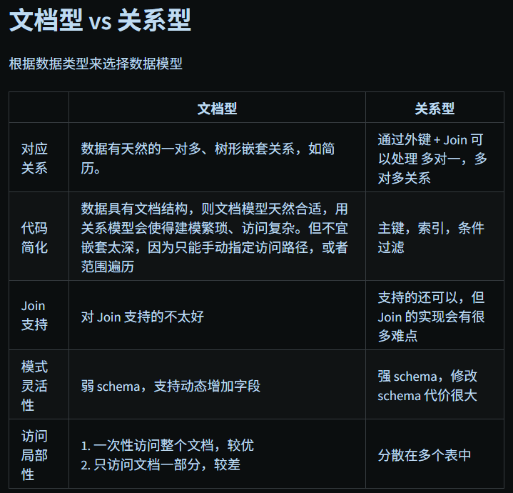
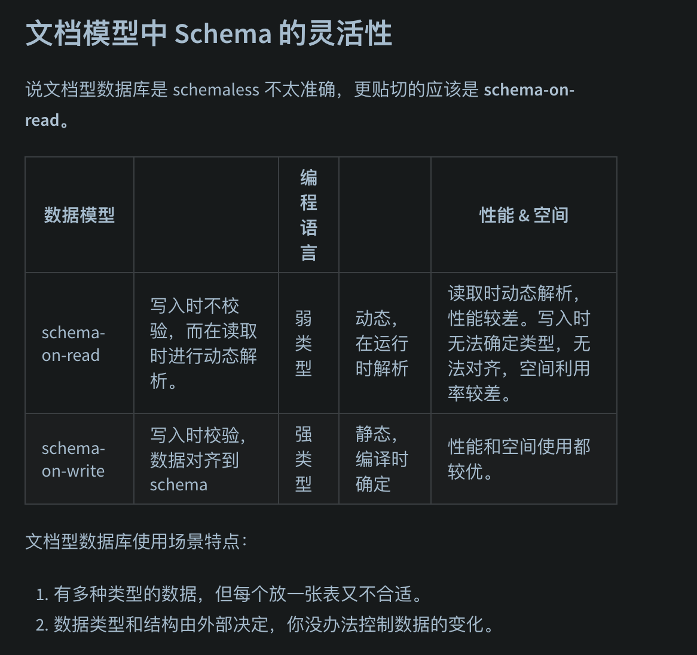
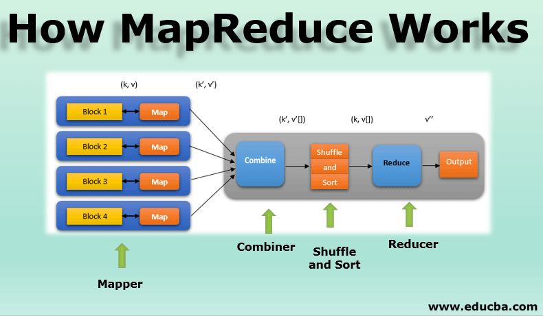

# 第二章：数据模型与查询语言

## 概要

如何分析一个数据模型：
数据基本元素，和元素之间的`对应关系`（一对多，多对多）
（最为流行的）关系模型，（树状的）文档模型，（极大自由度的）图模型。
强 Schema（写时约束）；弱 Schema（读时解析）

如何考量查询语言：
如何与数据模型关联、匹配
声明式（declarative）和命令式（imperative）

- 数据模型
  数据模型：如何组织数据，如何标准化关系，如何关联现实。
  
  每层模型核心问题：**如何用下一层的接口来对本层进行建模？**

  1. 作为应用开发者， 你将现实中的具体问题抽象为一组对象、数据结构（data structure） 以及作用于其上的 API。
  2. 作为数据库管理员（DBA），为了持久化上述数据结构，你需要将他们表达为通用的数据模型（data model），如文档数据库中的 XML/JSON、关系数据库中的表、图数据库中的图。
  3. 作为数据库系统开发者，你需要将上述数据模型组织为内存中、硬盘中或者网络中的字节（Bytes） 流，并提供多种操作数据集合的方法。
  4. 作为硬件工程师，你需要将字节流表示为二极管的电位（内存）、磁场中的磁极（磁盘）、光纤中的光信号（网络）。

  `在每一层，通过对外暴露简洁的数据模型，我们隔离和分解了现实世界的复杂度。`

  好的数据模型需有两个特点：简洁直观；具有组合性

## 关系模型与文档模型

- 关系模型
  当今最流行的数据库模型
  将数据以关系呈现给用户（比如：一组包含行列的二维表），提供操作数据集合的`关系算子`
- NoSQL 的诞生
  不同于传统的关系数据库的数据库管理系统的统称
  MongoDB，Redis，ElasticSearch，Cassandra
- 面向对象和关系模型的不匹配
  关系模型很难直观的表示`一对多`的关系
  文档模型使用 Json 和 XML 的天然嵌套，关系模型使用 SQL 模型，将职位、教育单拎一张表，然后在用户表中使用外键关联。
- 多对一和多对多
  region 在存储时，为什么不直接存储纯字符串：“Greater Seattle Area”，而是先存为 region_id → region name，其他地方都**引用 region_id？**

  易于修改、查询、本地化支持；类似的概念还有：面向抽象编程，而非面向细节。
  **ID 对人类是无意义的，无意义的意味着不会随着现实世界的将来的改变而改动。**

  这在关系数据库表设计时需要考虑，即如何控制冗余（duplication）。会有几种范式（normalization） 来消除冗余。

  `文档型数据库很擅长处理一对多的树形关系，却不擅长处理多对多的图形关系`。如果其不支持 Join，则处理多对多关系的复杂度就从数据库侧移动到了应用侧。

- 文档模型是否在重复历史？
  在关系模型中，数据被组织成元组（tuples），进而集合成关系（relations）；在 SQL 中分别对应行（rows）和表（tables）。
  提供了一种`声明式`的描述数据和构建查询的方法，将逻辑和实现解耦。
- 文档型 vs 关系型
  
  对于高度关联的数据集，使用文档型表达比较奇怪，使用关系型可以接受，使用图模型最自然。
  文档型数据库是 schemaless 不太准确，更贴切的应该是 schema-on-read。
  

## 数据查询语言

- 数据库以外：Web 中的声明式
  css vs js
- MapReduce 查询
  

  - 借鉴自函数式编程。
  - 一种相当简单的编程模型，或者说原子的抽象，现在不太够用。
  - 但在大数据处理工具匮乏的蛮荒时代（03 年以前），谷歌提出的这套框架相当有开创性。

  MongoDB 的 mapreduce
  筛选（filter） → 遍历并执行 map → 对输出按 key 聚集（shuffle）→ 对聚集的数据逐一 reduce → 输出结果集

  ```js
  db.observations.mapReduce(
    function map() {
      // 2. 对所有符合条件 doc 执行 map
      var year = this.observationTimestamp.getFullYear()
      var month = this.observationTimestamp.getMonth() + 1
      emit(year + '-' + month, this.numAnimals) // 3. 输出一个 kv pair
    },
    function reduce(key, values) {
      // 4. 按 key 聚集
      return Array.sum(values) // 5. 相同 key 加和
    },
    {
      query: { family: 'Sharks' }, // 1. 筛选
      out: 'monthlySharkReport' // 6. reduce 结果集
    }
  )
  ```

  `要求 Map 和 Reduce 是纯函数`。即无任何副作用，在任意地点、以任意次序执行任何多次，对相同的输入都能得到相同的输出。因此容易并发调度。
  非常底层、但表达力强大的编程模型。可基于其实现 SQL 等高级查询语言，如 Hive。

## 图模型

文档模型的适用场景？ 你的建模场景中存在着大量一对多（one-to-many）的关系。
图模型的适用场景？ 你的建模场景中存在大量的多对多（many-to-many）的关系。

- 基本概念
  图数据模型（属性图）的基本概念一般有三个：点，边和附着于两者之上的属性。
  一张图中的点和变也可以具有不同类型，能够容纳`异构`数据是图模型善于处理多对多关系的一大原因
  **将异构的数据容纳在一张图中，可以通过图遍历，轻松完成关系型数据库中需要多次 Join 的操作**
- 属性图（PG，Property Graphs）
  有多种对图的建模方式：
  **属性图**（property graph）：比较主流，如 Neo4j、Titan、InfiniteGraph
  **三元组**（triple-store）：如 Datomic、AllegroGraph

- Cypher 查询语言
  无论是 BFS、DFS 还是剪枝等实现细节，一般来说（但是不同厂商通常都会有不同的最佳实践），用户都不需要关心。
- 使用 SQL 进行图查询

- Triple-Stores and SPARQL

- 查询语言前驱：Datalog

---

**属性图（property graph）** 和 **三元组（triple-store）** 都是图数据库的两种主流数据模型。

---

### 属性图（property graph）

- **核心概念**：点（节点）、边（关系）、属性（键值对）。
- **每个点和边都可以有自己的属性**，比如：
  - 点：用户 A，属性有名字、年龄、邮箱等
  - 边：A 关注 B，属性有关注时间、关系类型等
- **适用场景**：社交网络、推荐系统、权限管理等需要表达丰富关系和对象属性的场景。
- **代表产品**：Neo4j、Titan、InfiniteGraph

**举例**：  
A（name=张三） --[关系=朋友, since=2020]--> B（name=李四）

---

### 三元组（triple-store）

- **核心概念**：所有数据都用三元组（subject, predicate, object）来表达。
  - subject（主语）：实体
  - predicate（谓词）：关系/属性
  - object（宾语）：目标实体或属性值
- **适用场景**：知识图谱、语义网、RDF 数据等需要表达复杂语义关系的场景。
- **代表产品**：Datomic、AllegroGraph

**举例**：  
("张三", "朋友", "李四")  
("张三", "年龄", "18")

---

**总结**：

- 属性图更像“有属性的点和边的网络”，适合直观建模和查询。
- 三元组模型更抽象，适合表达语义和知识，便于做推理和语义查询。
