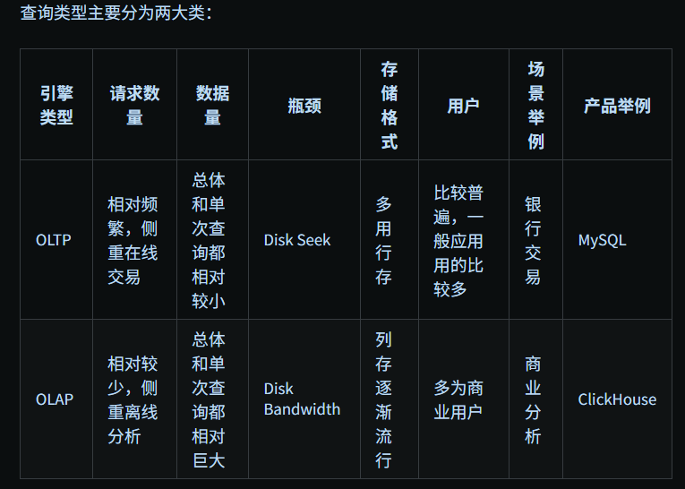
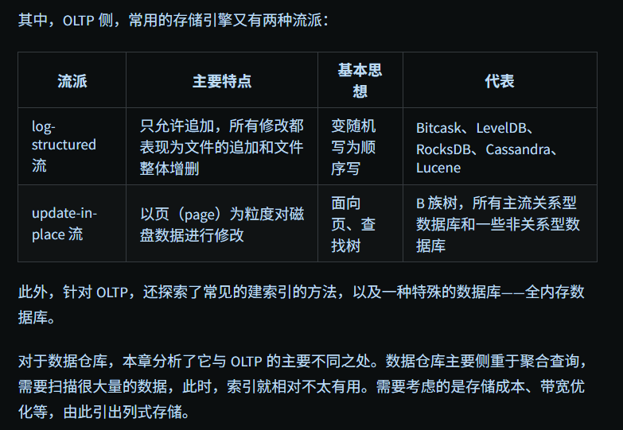
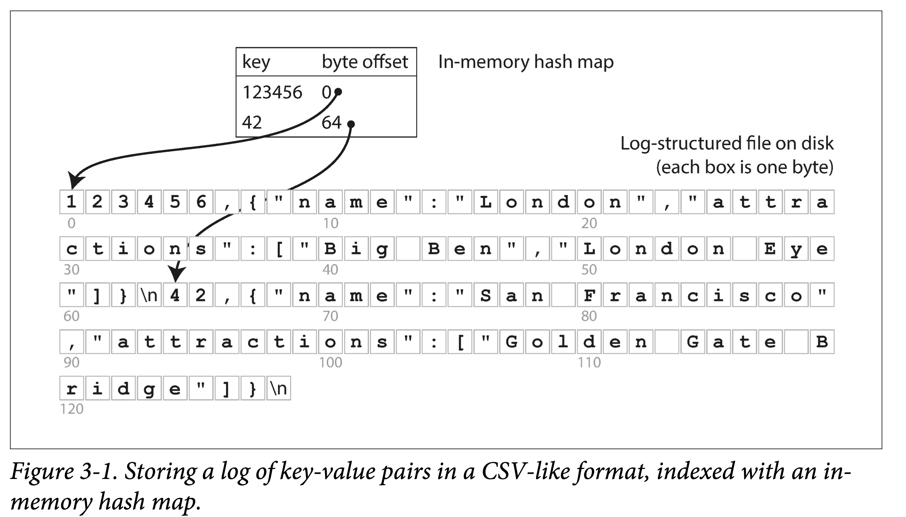
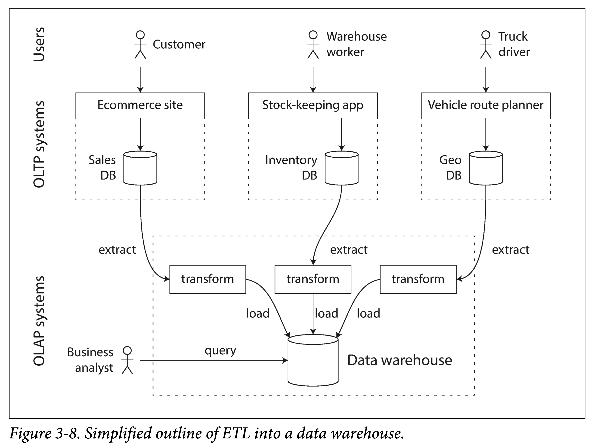
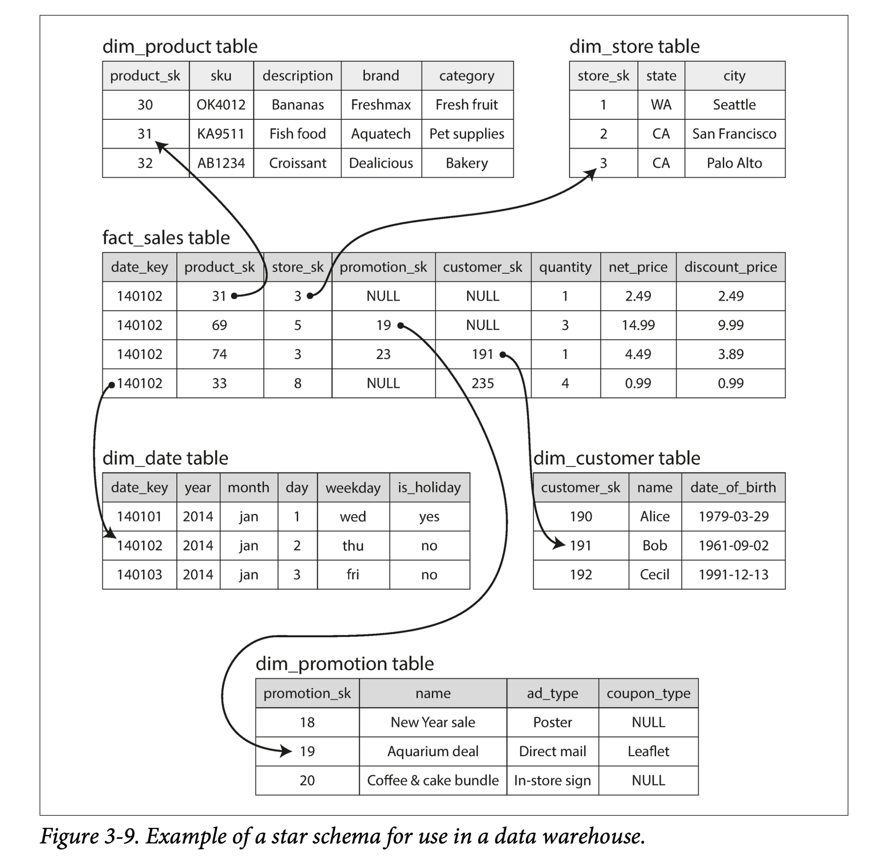
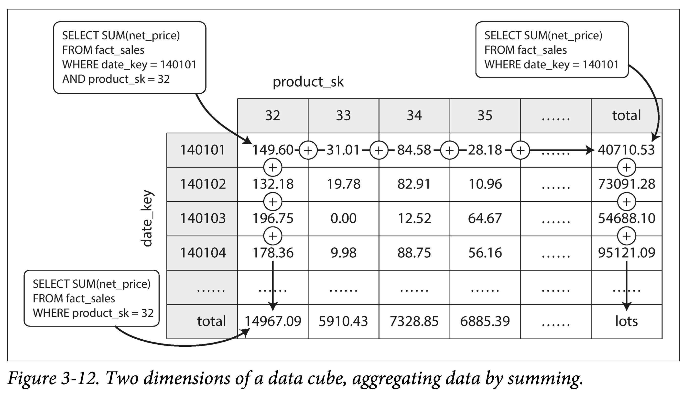

# 第三章：存储与检索

使用场景 → 查询类型 → 存储格式



## 驱动数据库的底层数据结构

数据库存储引擎设计和选择时最常见的权衡（trade off）：

- 恰当的`存储格式`能加快写（日志结构），但是会让读取很慢；也可以加快读（查找树、B 族树），但会让写入较慢。
- 为了弥补读性能，可以构建索引。但是会牺牲写入性能和耗费额外空间。

存储格式一般不好动，但是索引构建与否，一般交予用户选择。

### 哈希索引



### SSTables 和 LSM-Trees

- SSTable（Sorted String Table）

  - 高效的数据文件合并；
  - 不需要在内存中保存所有数据的索引；仅需要记录下每个文件界限（以区间表示：[startKey, endKey]，当然实际会记录的更细）即可；
  - 分块压缩，节省空间，减少 IO。

- 构建和维护 SSTables

Elasticsearch 和 Solr 的索引引擎 Lucene，也使用类似 LSM-Tree 存储结构。但其数据模型不是 KV，但类似：word → document list。

LSM-Tree 的核心思想——保存一组合理组织、后台合并的 SSTables

### B 族树

1. 以页（在磁盘上叫 page，在内存中叫 block，通常为 4k）为单位进行组织。
2. 页之间以页 ID 来进行逻辑引用，从而组织成一颗磁盘上的树。

### B-Trees 和 LSM-Trees 对比

### 其他索引结构

次级索引（secondary indexes）。即，非主键的其他属性到该元素（SQL 中的行，MongoDB 中的文档和图数据库中的点和边）的映射。

- 聚集索引和非聚集索引（cluster indexes and non-cluster indexes）
- 多列索引（Multi-column indexes）
- 全文索引和模糊索引（Full-text search and fuzzy indexes）
- 全内存数据结构
  内存数据库存在优势的原因不仅在于不需要读取磁盘，而在更于**不需要对数据结构进行序列化、编码后以适应磁盘所带来的额外开销**。

## 事务型还是分析型

术语 OL（Online）主要是指`交互式的查询`。
术语事务（transaction）由来有一些历史原因。早期的数据库使用方多为`商业交易（commercial）`，比如买卖、发工资等等。但是随着数据库应用不断扩大，交易\事务作为名词保留了下来。
**事务不一定具有 ACID 特性，事务型处理多是随机的以较低的延迟进行读写，与之相反，分析型处理多为定期的批处理，延迟较高。**

传统数据库在 AP 负载中的表现（大数据量吞吐较低）不尽如人意，**因此大家开始转向在专门设计的数据库中进行 AP 查询，我们称之为数据仓库（Data Warehouse）。**

### 数据仓库


对于一个企业来说，一般都会有很多偏交易型的系统，如用户网站、收银系统、仓库管理、供应链管理、员工管理等等。通常要求`高可用与低延迟`，因此直接在原库进行业务分析，会极大影响正常负载。因此需要一种手段将数据从原库导入到专门的数仓。
`我们称之为 ETL：extract-transform-load。`

数据仓库主要`侧重于聚合查询`，需要扫描很大量的数据，此时，索引就相对不太有用。
需要考虑的是存储成本、带宽优化等，由此引出列式存储。

### AP 建模：星状型和雪花型

星状模型通常包含一张事件表（_fact table_） 和多张维度表（_dimension tables_）。事件表以事件流的方式将数据组织起来，然后通过外键指向不同的维度。


星状模型的一个变种是雪花模型，可以类比雪花（❄️）图案，其特点是`在维度表中会进一步进行二次细分，讲一个维度分解为几个子维度`。比如品牌和产品类别可能有单独的表格。星状模型更简单，雪花模型更精细，具体应用中会做不同取舍。

## 列存

前一小节提到的分维度表和事实表，对于后者来说，有可能达到数十亿行和数 PB 大。虽然事实表可能通常有几十上百列，但是单次查询通常只关注其中几个维度（列）。

### 列压缩

将所有数据分列存储在一块，带来了一个意外的好处，由于同一属性的数据相似度高，`因此更易压缩。`

### 列式存储的排序

- 对所有行**按某一列进行排序后存储**。
  排序后的那一列，压缩效果会更好。

- 不同副本，不同排序
  针对不同的查询需求，便可以路由到不同的副本上做处理。当然，这样也最多只能建立副本数（通常是 3 个左右）列索引。

### 列式存储的写入

上述针对数仓的优化（列式存储、数据压缩和按列排序）都是为了解决数仓中常见的读写负载，读多写少，且读取都是超大规模的数据。

我们针对读做了优化，就让写入变得相对困难。
比如 B 树的原地更新流是不太行的。举个例子，要在中间某行插入一个数据，`纵向来说，会影响所有的列文件（如果不做 segment 的话）`；为了保证多列间按下标对应，横向来说，又得更新该行不同列的所有列文件。

所幸我们有 **LSM-Tree 的追加流**。

将新写入的数据在内存中 Batch 好，按行按列，选什么数据结构可以看需求。
然后达到一定阈值后，批量刷到外存，并与老数据合并。
数仓 Vertica 就是这么做的。

### 聚合：数据立方和物化视图

不一定所有的数仓都是列式存储，但列式存储的种种好处让其变得流行了起来。
其中一个值得一提的是`物化聚合`（materialized aggregates，或者物化汇总）。
**物化，可以简单理解为持久化。本质上是一种空间换时间的 tradeoff。**
与关系数据库中的视图（View）区别在于，**视图是虚拟的、逻辑存在的，只是对用户提供的一种抽象**，是一个查询的中间结果，并没有进行持久化（有没有缓存就不知道了）。
**物化视图本质上是对数据的一个摘要存储**，如果原数据发生了变动，该视图要被重新生成。因此，如果写多读少，则维持物化视图的代价很大。但在数仓中往往反过来，因此物化视图才能较好的起作用。

**物化视图一个特化的例子，是数据立方（data cube，或者 OLAP cube）：按不同维度对量化数据进行聚合。**

但这种构建出来的视图只能针对固定的查询进行优化，如果有的查询不在此列，则这些优化就不再起作用。

在实际中，需要针对性的识别（或者预估）每个场景查询分布，针对性的构建物化视图。

---

对于存储数据和组织索引，我们可以有多种选择：

1. 数据本身无序的存在文件中，称为 堆文件（heap file），索引的值指向对应数据在 heap file 中的位置。这样可以避免多个索引时的数据拷贝。

2. 数据本身按某个字段有序存储，该字段通常是主键。则称基于此字段的索引为聚集索引（clustered index），从另外一个角度理解，即将索引和数据存在一块。则基于其他字段的索引为非聚集索引，在索引中仅存数据的引用。

3. 一部分列内嵌到索引中存储，一部分列数据额外存储。称为覆盖索引（covering index） 或 包含列的索引（index with included columns）。

   覆盖索引的本质是**在普通非聚集索引基础上额外存储了部分列数据**，以减少特定查询模式下的回表操作，从而提高查询性能。

- 聚集索引：
  索引结构（B-Tree）
  ↓
  叶子节点 = 实际数据行

- 非聚集索引：
  索引结构（B-Tree）
  ↓
  叶子节点 = 指向数据行的指针
  ↓
  数据行（需要额外查询）

---

聚集索引 vs 覆盖索引

- 聚集索引

  ```
  根节点
   ↓
  中间节点
   ↓
  叶子节点 = [完整数据行A, 完整数据行B, 完整数据行C, ...]
  ```

- 覆盖索引

  ```
    根节点
     ↓
    中间节点
     ↓
    叶子节点 = [
      {索引键1, 包含列值A, 包含列值B, 指针→完整行},
      {索引键2, 包含列值C, 包含列值D, 指针→完整行},
      ...
    ]
  ```

---

# 内存处理带宽解析

内存处理带宽（Memory Processing Bandwidth）是指计算系统在单位时间内能够处理的内存数据量，通常以GB/s（千兆字节/秒）或MB/s（兆字节/秒）为单位。这个概念在数据库系统设计，特别是列式存储和分析型处理中非常重要。

## 内存处理带宽的核心要素

### 1. 定义与度量

- **定义**：系统从内存读取并处理数据的最大速率
- **计算**：处理器核心数 × 内存通道数 × 每通道带宽
- **典型值**：现代服务器可达50-200GB/s的理论内存带宽

### 2. 在数据管理中的重要性

内存处理带宽对数据系统性能的影响体现在：

- **查询执行速度**：决定了数据扫描的速度上限
- **并行处理能力**：高带宽支持更多并发分析操作
- **列式存储优势**：列存储可以更充分利用内存带宽

## 内存带宽与数据库架构

### 列式存储的带宽优势

列式存储在大数据分析中特别受益于内存处理带宽优化：

1. **选择性读取**：只读取查询所需的列，减少不必要的数据传输

   ```
   // 行式存储查询：SELECT salary FROM employees WHERE dept_id = 5
   // 需读取整行数据，消耗更多带宽

   // 列式存储查询：
   // 只需读取dept_id和salary两列，带宽利用率高
   ```

2. **数据密度**：同类型数据连续存储提高缓存命中率

   ```
   // 行存储中的salary字段
   [员工1数据...., salary1, ....][员工2数据...., salary2, ....]

   // 列存储中的salary字段
   [salary1, salary2, salary3, salary4, ...]
   ```

3. **压缩效率**：相似数据存储在一起，压缩比更高，进一步提高带宽利用率

### 内存带宽瓶颈

在许多现代数据处理应用中，内存带宽已经成为主要的性能瓶颈：

1. **CPU速度 vs 内存带宽**：处理器计算速度增长远快于内存带宽增长
2. **数据密集型应用**：大规模数据分析更容易受带宽限制
3. **多核竞争**：多核架构下多线程共享内存带宽资源

## 优化数据系统的内存带宽利用

### 实用策略

1. **向量化处理**：批量处理数据减少指令开销

   ```
   // 传统循环处理
   for(i = 0; i < 1000000; i++) { result[i] = data[i] * 2; }

   // 向量化处理
   SIMD_multiply(data, 2, result, 1000000);
   ```

2. **数据压缩**：减少需要通过内存传输的数据量
3. **列式布局**：仅读取必要的属性列
4. **内存预取**：提前请求数据到缓存
5. **局部性优化**：重组计算以最大化缓存使用

## 实际应用示例

**示例：数据分析查询优化**

查询：计算各部门平均薪资

```sql
SELECT dept_id, AVG(salary) FROM employees GROUP BY dept_id;
```

- **行存储实现**：需读取整行，带宽使用效率低
- **列存储实现**：仅读取dept_id和salary两列，减少75-90%的数据传输
- **压缩列存储**：如果salary列使用差分编码压缩，可能再减少60-80%的数据量
- **结果**：整体可能提升5-20倍的查询性能，主要受益于更高效的内存带宽使用

在数据仓库和大规模分析系统设计中，对内存处理带宽的优化是一个关键考虑因素，尤其是当处理规模达到TB级别的数据集时。
