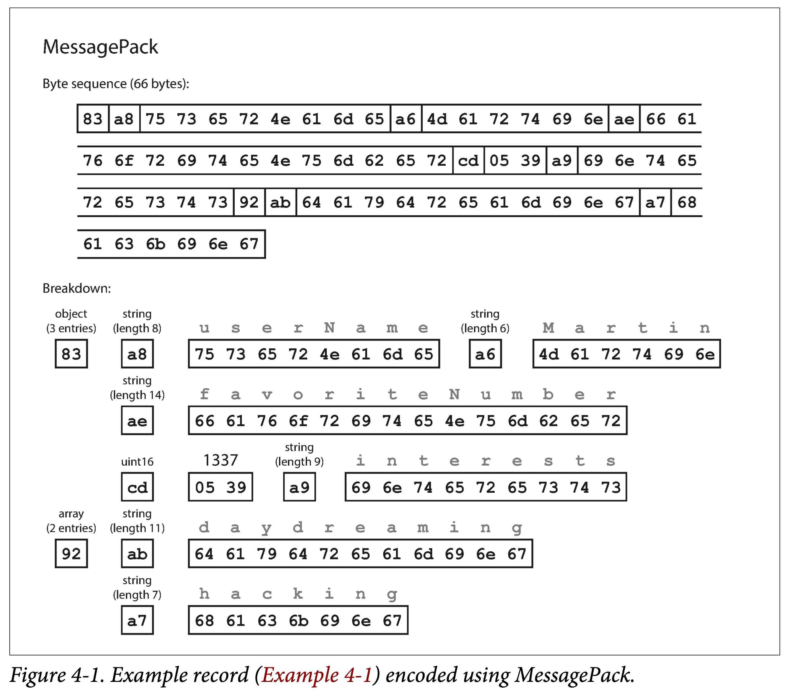
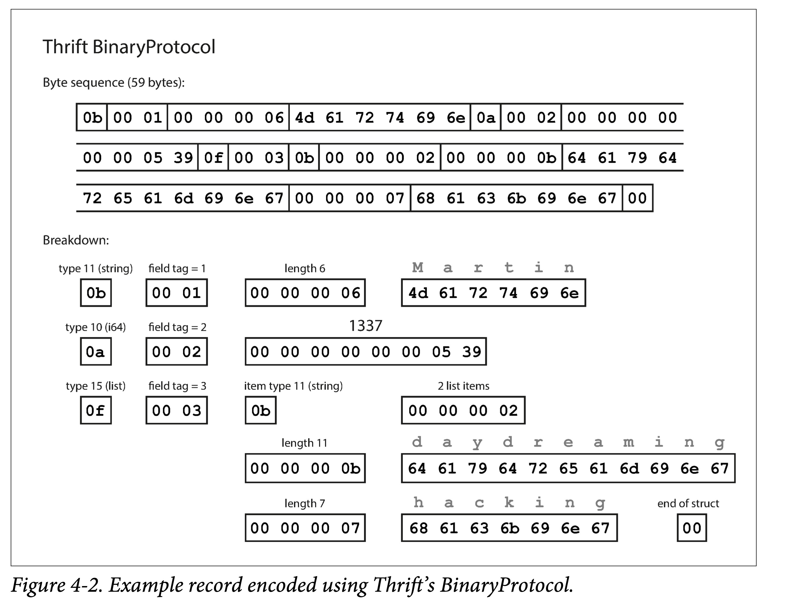
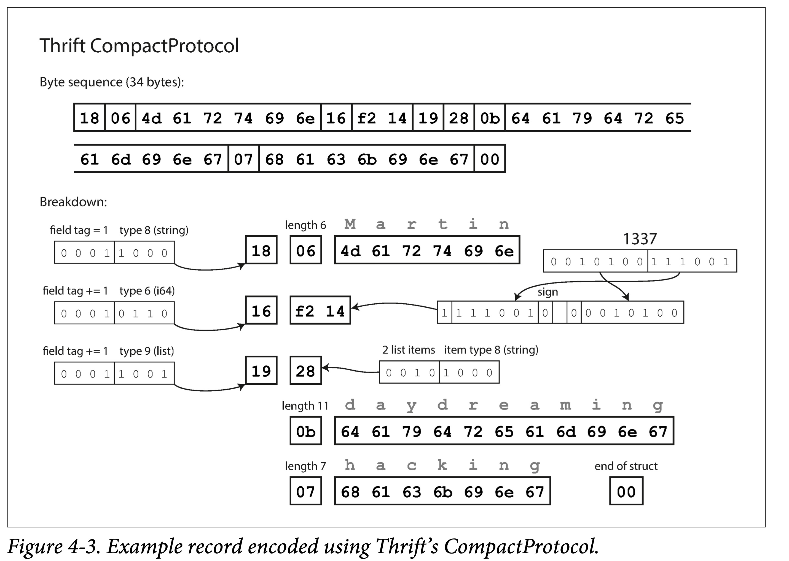
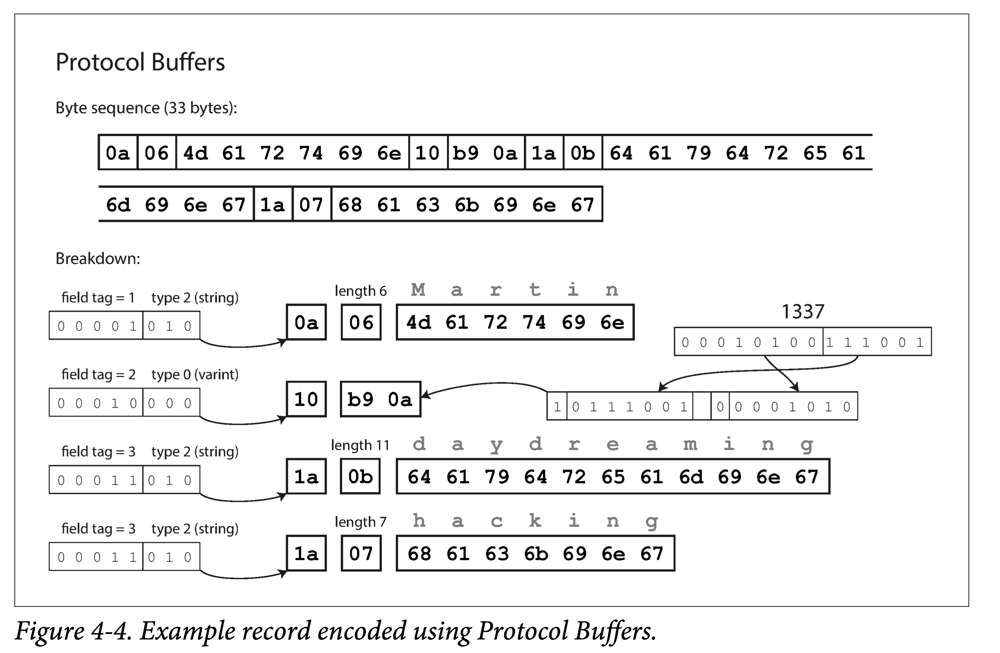

# 第四章：编码与演化

`所有涉及跨进程通信的地方，都需要对数据进行编码（Encoding）`，或者说序列化（Serialization）。因为持久化存储和网络传输都是面向字节流的。
`序列化本质上是一种“降维”操作`，将内存中高维的数据结构降维成单维的字节流，于是**底层硬件和相关协议，只需要处理一维信息即可。**

编码主要涉及两方面问题：

- 如何编码能够节省空间、提高`性能`。
- 如何编码以适应数据的演化和`兼容`。

向后兼容 (`backward` compatibility)：当前代码可以读取旧版本代码写入的数据。
向前兼容 (`forward` compatibility)：当前代码可以读取新版本代码写入的数据。
翻译成中文后，很容易混淆，主要原因在于“后”的歧义性，到底指身后（过去），还是指之后（将来），私以为还不如翻译为，**兼容过去和兼容将来。但为了习惯，后面行文仍然用向后/前兼容。**

<- backward forward ->

## 数据编码的格式

### 编程语言内置

很多编程语言内置了一些缺省的编码方法：

Java 有 java.io.Serializable
Ruby 有 Marshal
Python 有 pickle

但这些编程语言内置的编码格式有以下缺点：

- 和特定语言绑定
- 安全问题
- 兼容性支持不够
- 效率不高

### JSON、XML 及其二进制变体

JSON，XML 和 CSV 属于常用的文本编码格式，其好处在于肉眼可读，坏处在于不够紧凑，占空间较多。
如果数据只被单一程序读取，不需要进行交换，不需要考虑易读性等问题。则可以用二进制编码，在数据量到达一定程度后，二进制编码所带来的空间节省、速度提高都很可观。
因此，JSON 有很多二进制变种：MessagePack、BSON、BJSON、UBJSON、BISON 和 Smile 等。


### Thrift 和 Protocol Buffers

Thrift 最初由 Facebook，ProtoBuf 由 Google 在 07~08 年左右开源。他们都有对应的 RPC 框架和编解码工具。表达能力类似，语法也类似，在编码前都需要由`接口定义语言（IDL）`来描述模式

```protobuf
message Person {
    required string user_name       = 1;
    optional int64  favorite_number = 2;
    repeated string interests       = 3;
}
```

`IDL 是编程语言无关的，可以利用相关代码生成工具，可以将上述 IDL 翻译为指定语言的代码。即，集成这些生成的代码，无论什么样的语言，都可以使用同样的格式编解码。`



- 使用 field tag 编码。field tag 其实蕴含了字段类型和名字。
- 使用类型、tag、长度、bit 数组的顺序编码。




- 字段标号和模式演变
  `模式，即有哪些字段，字段分别为什么类型。`
  随着时间的推移，业务总会发生变化，我们也不可避免的增删字段，`修改字段类型，即模式演变。`

  在模式发生改变后，需要：
  向后兼容：新的代码，在处理新的增量数据格式的同时，也得`处理旧的存量数据。`
  向前兼容：旧的代码，如果遇到新的数据格式，`不能 crash`。

  ProtoBuf 和 Thrift 是怎么解决这两个问题的呢？
  **字段标号 + 限定符（optional、required）** 向后兼容：`新加的字段需为 optional`。这样在解析旧数据时，才不会出现字段缺失的情况。
  向前兼容：**字段标号不能修改，只能追加**。这样旧代码在看到不认识的标号时，省略即可。

- 数据类型和模式演变
  ProtoBuf 没有列表类型，而有一个 repeated 类型。其好处在于兼容数组类型的同时，`支持将可选（optional）单值字段，修改为多值字段`。修改后，旧代码在看到新的多值字段时，只会使用最后一个元素。

### Avro

Apache Avro 是 Apache Hadoop 的一个子项目，专门为数据密集型场景设计，对模式演变支持的很好。支持 Avro IDL 和 JSON 两种模式语言，前者适合人工编辑，后者适合机器读取。

- 写入模式和读取模式
  没有字段标号，Avro 如何支持模式演进呢？ 答案是`显式的使用两种模式。`
  即，在对数据进行编码（写入文件或者进行传输）时，使用模式 A，称为写入模式（writer schema）；在对数据进行解码（从文件或者网络读取）时，使用模式 B，称为读取模式（reader schema），而两者不必相同，只需兼容。

### 模式的优点

模式的本质是显式类型约束，即，先有模式，才能有数据。
相比于没有任何类型约束的文本编码 JSON，XML 和 CSV，Protocol Buffers，Thrift 和 Avro 这些基于显式定义二进制编码优点有：

- `省去字段名`，从而更加紧凑。
- 模式是数据的注释或者文档，并且总是最新的。
- 数据模式允许不读取数据，仅比对模式来做低成本的兼容性检查。
- 对于静态类型来说，可以利用代码生成做编译时的类型检查。

## 几种数据流模型

数据可以以很多种形式从一个系统流向另一个系统，但不变的是，流动时都需要编码与解码。
在数据流动时，会涉及编解码双方模式匹配问题，上一小节已经讨论，本小节主要探讨几种进程间典型的数据流方式：

- 通过**数据库**
- 通过**服务调用**
- 通过**异步消息传递**

### 经由数据库的数据流

- 只由同一个进程访问。则数据库可以理解为该进程向将来发送数据的中介。
- 由多个进程访问。则多个进程可能有的是旧版本，有的是新版本，此时数据库需要考虑向前和向后兼容的问题。
  一种比较棘手的情况：在某个时刻，你给一个表增加了一个字段，较新的代码写入带有该字段的行，之后又`被较旧的代码覆盖成缺少该字段的行`。这时候就会出现一个问题：我们更新了一个字段 A，更新完后，却发现字段 B 没了。

---

- 不同时间写入的数据
  数据的生命周期超过了其对应代码的生命周期
  一般来说，在更改模式时（比如 alter table），数据库不允许增加既没有默认值、也不允许为空的列。
  在读取时，数据库一般会对缺少对应列的旧数据：填充新版本字段的默认值（default value）；如果没有默认值则填充空值（nullable）

- 存储归档
  有时候需要对数据库做备份到外存。在做备份（或者说快照）时，虽然会有不同时间点生成的数据，但通常会将各种版本数据转化、`对齐到最新版本`。毕竟，总是要全盘拷贝数据，那就顺便做下转换好了。

### 经由服务的数据流：REST 和 RPC

通过网络通信时，通常涉及两种角色：服务器（server）和客户端（client）。
**通常来说，暴露于公网的多为 HTTP 服务，而 RPC 服务常在内部使用。**

服务器也可以同时是客户端：

- 作为客户端访问数据库。
- 作为客户端访问其他服务。

对于后者，是因为我们常把一个大的服务拆成一组功能独立、相对解耦的服务，这就是 面向服务的架构（service-oriented architecture，SOA），或者最近比较火的微服务架构（micro-services architecture）。

服务在某种程度上和数据库类似：允许客户端以某种方式存储和查询数据。但不同的是，`数据库通常提供某种灵活的查询语言，而服务只能提供相对死板的 API。`

---

- web 服务
  当服务使用 HTTP 作为通信协议时，我们通常将其称为 web 服务
  但其并不局限于 web，还包括：

  - 用户终端（如移动终端）通过 HTTP 向服务器请求。
  - 同组织内的一个服务向另一个服务发送 HTTP 请求（微服务架构，其中的一些组件有时被称为中间件）。
  - 不同组织的服务进行数据交换。一般要通过某种手段进行验证，比如 OAuth。

- RPC 面临的问题

  - 本地函数调用要么成功、要么不成功。但是 RPC 由于经过网络，可能会有各种复杂情况，比如请求丢失、响应丢失、hang 住以至于超时等等。因此，可能需要重试。
  - 如果重试，需要考虑`幂等性`问题
  - 客户端与服务端使用的编程语言可能不同，但如果有些类型不是两种语言都有，就会出一些问题。

  REST 相比 RPC 的好处在于，它不试图隐去网络，更为显式，让使用者不易忽视网络的影响。

- RPC 当前方向
  比如局域网的网络通常比较快速、可控。
  多次调用，使用幂等性来解决。
  跨语言，可以使用 RPC 框架的 IDL 来解决。
- 数据编码和 RPC 的演化
  - Thrift、gRPC（Protobuf）和 Avro RPC 可以根据编码格式的兼容性规则进行演变。
  - RESTful API 通常使用 JSON 作为请求响应的格式，JSON 比较容易添加新的字段来进行演进和兼容。
  - 对于 RPC，服务的兼容性比较困难，因为一旦 RPC 服务的 `SDK 提供出去之后，你就无法对其生命周期进行控制：总有用户因为各种原因，不会进行主动升级`。因此可能需要长期保持兼容性，或者提前通知和不断预告，或者维护多个版本 SDK 并逐渐对早期版本进行淘汰。
  - **对于 RESTful API，常用的兼容方法是，将版本号做到 URL 或者 HTTP 请求头中。**

### 经由消息传递的数据流

前面研究了编码解码的不同方式：

1. 数据库：一个进程写入（编码），将来一个进程读取（解码）
2. RPC 和 REST：一个进程通过网络（发送前会编码）向另一个进程发送请求（收到后会解码）并同步等待响应。

本节研究介于数据库和 RPC 间的异步消息系统：一个存储（消息 broker、消息队列来临时存储消息）+ 两次 RPC（生产者一次，消费者一次）。

与 RPC 相比，使用消息队列的优点：

- 如果消费者暂时不可用，可以充当暂存系统。
- 当消费者宕机重启后，自动地重新发送消息。
- 生产者不必知道消费者 IP 和端口。
- 能将一条消息发送给多个消费者。
- 将生产者和消费者解耦。

---

- 消息队列
  过去，消息队列为大厂所垄断。但近年来，开源的消息队列越来越多，可以适应不同场景，如 RabbitMQ、ActiveMQ、HornetQ、NATS 和 Apache Kafka 等等。

  - 消息队列的送达保证因实现和配置而异，包括：
    最少一次（at-least-once）：同一条数据可能会送达多次给消费者。
    最多一次（at-most-once）：同一条数据最多会送达一次给消费者，有可能丢失。
    严格一次（exactly-once）：同一条数据保证会送达一次，且最多一次给消费者。

  - 消息队列的逻辑抽象叫做 Queue 或者 Topic，常用的消费方式两种：
    多个消费者互斥消费一个 Topic
    每个消费者独占一个 Topic

- 分布式的 Actor 框架
  Actor 模型是一种基于消息传递的并发编程模型。Actor 通常是由状态（State）、行为（Behavior）和信箱（MailBox，可以认为是一个消息队列）三部分组成：

  状态：Actor 中包含的状态信息。
  行为：Actor 中对状态的计算逻辑。
  信箱：Actor 接受到的消息缓存地。

  **由于 Actor 和外界交互都是通过消息，因此本身可以并行的，且不需要加锁。**
  分布式的 Actor 框架，本质上是将消息队列和 actor 编程模型集成到一块。自然，在 Actor 滚动升级是，也需要考虑前后向兼容问题。

---

```json
{
  "userName": "Martin",
  "favoriteNumber": 1337,
  "interests": ["daydreaming", "hacking"]
}
```
