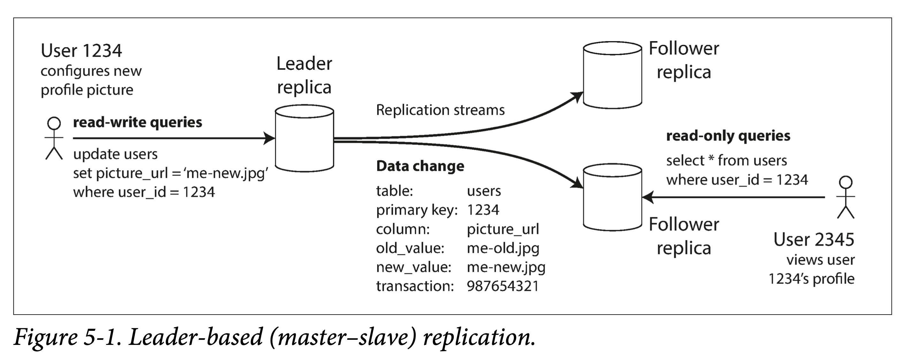

# 第五章：冗余(Replication)

冗余（Replication） 是指将同一份数据复制多份，放到通过网络互联的多个机器上去。

- 提高可用性：当系统部分故障时仍然能够正常提供服务。
- 降低延迟：可以在地理上同时接近不同地区的用户。
- 提高读吞吐：平滑扩展可用于查询的机器。

如果数据是`只读`的，则冗余很好做，直接复制到多机即可。我们有时可以利用这个特性，使用分治策略，将数据分为只读部分和读写部分，则只读部分的冗余就会容易处理的多，甚至可以用 EC(纠错码，error correction/correcting code) 方式做冗余，减小存储放大的同时，还提高了可用性。
想想 EC 牺牲了什么？ **以计算换存储。**

但难点就在于，数据允许数据变更时，如何维护多机冗余且一致。常用的冗余控制算法有：

- 单领导者（single leader）
- 多领导者（multi-leader）
- 无领导者（leaderless）

这需要在多方面做取舍：

- 使用同步复制还是异步复制
- 如何处理失败的副本

## 领导者与跟随者

冗余存储的每份数据称为副本（replica）。
多副本所带来的最主要的一个问题是：`如何保证所有数据被同步到了所有副本上？`
基于`领导者（leader-based） 的同步算法`，是最常用解决办法。

### 同步复制和异步复制

同步（synchronously）复制和异步（asynchronously）复制和关键区别在于：`请求何时返回给客户端。`
如果等待某副本写完成后，则该副本为同步复制。
如果不等待某副本写完成，则该副本为异步复制。

两者的对比如下：

- 同步复制牺牲了`响应延迟和部分可用性`（在某些副本有问题时不能完成写入操作），换取了所有副本的一致性（但并不能严格保证）。
- 异步复制放松了`一致性`，而换来了较低的写入延迟和较高的可用性。

### 新增副本

如果原副本是只读（read-only）的，只需要简单拷贝即可。但是如果是可写副本，则问题要复杂很多。因此，比较简单的一种解决方法是：`禁止写入，然后拷贝`。这在某些情况下很有用，比如夜间没有写入流量，同时一晚上肯定能复制完。

### 宕机处理

- 从副本宕机：追赶恢复。
  类似于新增从副本。如果落后的多，可以直接向主副本拉取快照 + 日志；如果落后的少，可以仅拉取缺失日志。
- 主副本宕机：故障转移。
  首先要选出新的主副本，然后要通知所有客户端主副本变更。
  - 确认主副本故障
  - 选择新的主副本
  - 让系统感知新主副本

### 日志复制

在数据库中，基于领导者的多副本是如何实现的？在不同层次有多种方法，包括：

- 语句层面的复制。
- 预写日志的复制。
- 逻辑日志的复制（基于行）。
- 触发器的复制。

对于一个系统来说，多副本同步的是什么？`增量修改`。
具体到一个由数据库构成的数据系统，通常由数据库外部的`应用层`、数据库内部`查询层`和`存储层`组成。

- 修改在查询层表现为：语句；
- 在存储层表现为：存储引擎相关的预写日志、存储引擎无关的逻辑日志；
- 修改完成后，在应用层表现为：触发器逻辑。

## 复制滞后问题

replication lag

### 读你所写

在一个异步复制的分布式数据库里，同一个客户端，写入主副本后返回；稍后再去读一个落后的从副本，就会发现：读不到自己刚写的内容！
几种方案：

- 按内容分类
  对于客户端`可能修改的内容集，只从主副本读取`。
  如社交网络上的个人资料，读自己的资料时，从主副本读取；但读其他人资料时，可以向从副本读。
- 按时间分类
  近期内有过改动的数据，从主副本读，其他的，向从副本读。
- 利用时间戳
  `客户端记下本客户端上次改动时的时间戳`，在读从副本时，利用此时间戳来看某个从副本是否已经同步了改时间戳之前内容。

### 单调读

读写一致性和单调读有什么区别？ 写后读保证的是写后读顺序，单调读保证的是多次读之间的顺序。

如何实现单调读？

- 只从一个副本读数据。
- 前面提到的时间戳机制。

### 一致前缀读

保证因果一致性。

实现这种一致性保证的方法：

- 不分区。
- 让所有有因果关系的事件路由到一个分区。

### 副本滞后的终极解决方案

**多副本异步复制所带来的一致性问题，都可以通过事务（transaction） 来解决。**
越来越多的分布式数据库开始支持事务，是为分布式事务。

## 多主模型

单主模型一个最大问题：所有写入都要经过它，如果由于任何原因，客户端无法连接到主副本，就无法向数据库写入。
于是自然产生一种想法：多主行不行？
多主复制（multi-leader replication）：有多个可以接受写入的主副本，每个主副本在接收到写入之后，都要转给所有其他副本。`即一个系统，有多个写入点。`

### 多主模型应用场景

单个数据中心，多主模型意义不大：复杂度超过了收益。
总体而言，由于一致性等问题，多主模型应用场景较少，但有一些场景，很适合多主：

- 数据库横跨多个数据中心
- 需要**离线工作的客户端**

  离线后还继续工作的多个副本，本质上就是一个多主模型：每个主都可以独立的写入数据，然后在网络连通后解决冲突。
  Apache CouchDB 的一个特点便是支持多主模型。

- **协同编辑**
  Google Docs 等类似 SaaS 模式的在线协同应用越来越流行。
  这种应用允许多人在线同时编辑文档或者电子表格，其背后的原理，与上一节离线工作的客户端很像。

  为了实现协同，并解决冲突，可以：

  - 悲观方式。加锁以避免冲突，`但粒度需要尽可能小`，否则无法允许多人同时编辑一个文档。
  - 乐观方式。允许每个用户无脑写入，然后如果有冲突，交由用户解决。

  git 也是一个类似的协议。

### 处理写入冲突

- 冲突检测
  多主模型最大的问题是：如何解决冲突。
  有`同步或者异步`的方式进行冲突检测。

  对于单主模型，当检测到冲突时，由于只有一个主副本，可以同步的检测冲突，从而解决冲突：
  让第二个写入`阻塞`，直到第一个写完成。
  让第二个写入`失败`，进行重试。

  但对于多主模型，两个写入可能会在不同主副本立即成功。然后异步同步时，发现冲突，但为时已晚（没有办法简单决定如何解决冲突）。
  虽然，可以在多主间使用同步方式写入所有副本后，再返回请求给客户端。但这会失掉多主模型的主要优点：`允许多个主副本独立接受写入`。此时，蜕化成单主模型。

- 冲突避免
  `解决冲突最好的方式是在设计上避免冲突。`
  由于多主模型在冲突发生后再去解决会有很大的复杂度，因此常使用冲突避免的设计。
- 冲突收敛
  在单主模型中，所有事件比较容易进行定序，因此我们总可以用后一个写入覆盖前一个写入。
  但在多主模型中，很多冲突无法定序：从每个主副本来看，事件顺序是不一致的，并且没有哪个更权威一些，那么就无法让所有副本最终收敛（convergent）。

  此时，我们就需要一些规则，来让其收敛：

  - 给每个写入一个序号，并且后者胜
  - 给每个副本一个序号，序号更高的副本有更高的优先级
  - 提供一种自动的合并冲突的方式
  - 使用程序定制一种保留所有冲突值信息的冲突解决策略
    由于只有用户知道数据本身的信息，因此较好的方式是，将如何解决冲突交给用户。
    - 写时执行：在写入时发现冲突，调用回调代码，解决冲突后写入。这些代码通常在后台执行，并且不能阻塞，因此不能在调用时同步的通知用户。
    - 读时执行：在写入冲突时，所有冲突都会被保留（如使用多版本）。下次读取时，系统会将所有数据本版本返回给用户，进行`交互式的或者自动的解决冲突`，并将结果写回系统。

### 多主复制拓扑

复制拓扑（replication topology）描述了数据写入从一个节点到另一个节点的`传播路径`。

## 无主模型

无主模型，允许任何副本接受写入。
在关系数据库时代，无主模型已经快被忘却。从 Amazon 的 Dynamo 论文开始，无主模型又重新大放异彩，Riak，Cassandra 和 Voldemort 都受其启发，可以统称为 Dynamo 流（Dynamo-style）。

在无主模型中，写入时可以：

- 由客户端直接写入副本。
- 由协调者（coordinator） 接收写入，转发给多副本。但与主副本不同，协调者并不负责定序。

### 有节点故障时的写入

基于主副本（leader-based）的模型，在有副本故障时，需要进行故障切换，但在无主模型中，简单忽略它就行。
`多数派写入，多数派读取，以及读时修复。`
由于写入时，简单的忽略了宕机副本；在读取时，就要多做些事情了：`同时读取多个副本，选取最新版本的值。`

- 读时修复和反熵
  无主模型也需要维持多个副本数据的一致性。在某些节点宕机重启后，如何让其弥补错过的数据？
  - 读时修复（read repair），本质上是一种捎带修复，在`读取时发现旧的就顺手修了。`
  - 反熵过程（Anti-entropy process），本质上是一种兜底修复，读时修复不可能覆盖所有过期数据，因此需要一些`后台进程，持续进行扫描，寻找陈旧数据，然后更新。`
- Quorum 读写
  如果副本总数为 n，写入 w 个副本才认定写入成功，并且在查询时最少需要读取 r 个节点。`只要满足 w + r > n，我们就能读到最新的数据（鸽巢原理）`。此时 r 和 w 的值称为 quorum 读写。
  我们会将读或者写并行的发到全部 n 个副本，但是只要等到法定个副本的结果，就可以返回。

### quorum 一致性的局限

当 w + r ≤ n 时，很可能会读到过期的数据。
但在 w + r > n 时，有一些边角情况（corner case），也会导致客户端读不到最新数据。

- 一致性监控
  基于领导者的多副本模型，由于每个副本复制顺序一致，则可以方便的给出每个副本的落后（lag）进度。
  但对于无主模型，由于没有固定写入顺序，副本的落后进度变得难以界定。如果系统只使用读时修复策略，则对于一个副本的落后程度是没有限制的。读取频率很低数据可能版本很老。
  最终一致性是一种很模糊的保证，但通过监控能够量化“最终”（比如到一个阈值），也是很棒的。

### 放松(Sloppy)的 Quorum 和提示转交

正常的 Quorum 能够容忍一些副本节点的宕机。但在大型集群（总节点数目 > n）中，可能最初选中的 n 台机器，由于种种原因（宕机、网络问题），导致无法达到法定读写数目，则此时有两种选择：

- 对于所有无法达到 r 或 w 个法定数目的读写，`直接报错。`
- 仍然接受写入，并且`将新的写入暂时交给一些正常节点。`

后者被认为是一种宽松的法定数目 （sloppy quorum）：写和读仍然需要 w 和 r 个成功返回，但是其所在节点集合可以发生变化。
一旦问题得到解决，数据将会根据线索移回其应该在的节点（D—> B），我们称之为`提示移交（hinted handoff）。这个移交过程是由反熵 anti-entropy 后台进程完成的。`

- 多数据中心

### 并发写入检测

由于 Dynamo 允许多个客户端并发写入相同 Key，则即使使用严格的 Quorum 读写，也会产生冲突：**对于时间间隔很短（并发）的相同 key 两个写入，不同副本上收到的顺序可能不一致。**
为了使所有副本最终一致，需要有一种手段来解决并发冲突。

- 后者胜（Last-Write-Win）
  后者胜（LWW，last write wins）的策略是，通过某种手段确定一种全局唯一的顺序，然后让后面的修改覆盖之前的修改。
  LWW 有一个问题，就是多个并发写入的客户端，可能都认为自己成功了，但是最终只有一个值被保留了，其他都在后台被丢弃了。即，其迅速再读，会发现不是自己写入的数据。
  使用 LWW 唯一安全的方法是：**key 是一次可写，后变为只读。如 Cassandra 建议使用一个 UUID 作为主键，则每个写操作都只会有一个唯一的键。**
- 发生于之前（Happens-before）和并发关系

  系统中任意的两个写入 A 和 B，只可能存在三种关系：

  A happens before B
  B happens before A
  A B 并发

  **如果两个操作可以定序，则 last write win；如果两个操作并发，则需要进行冲突解决。**

- 确定 Happens-Before 关系

- 合并并发值
  对于上述购物车中只增加物品的例子，可以使用`“并集”`来合并冲突数据。
  如果购物车汇总还有删除操作，就不能简单并了，但是可以将删除变为增加（`写一个 tombstone 标记`）。
- 版本向量
  扩展到无主`多副本`模型时，只使用一个版本值显然不够，这时需要给每个副本的键都引入版本号，对于同一个键来说，`不同副本的版本会构成版本向量（version vector）。`
  每个副本在遇到写入时，会增加对应键的版本号，同时跟踪从其他副本中看到的版本号，通过比较版本号大小，来决定哪些值要覆盖哪些值要保留。
