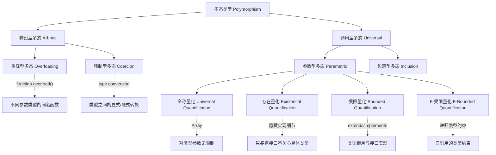

https://github.com/981377660LMT/ts/issues/807

```mermaid
graph TD
    A[多态类型 Polymorphism] --> B[特设型多态 Ad-hoc]
    A --> C[通用型多态 Universal]

    B --> D[重载型多态 Overloading]
    B --> E[强制型多态 Coercion]

    C --> F[参数型多态 Parametric]
    C --> G[包涵型多态 Inclusion]

    F --> H[全称量化 Universal Quantification]
    F --> I[存在量化 Existential Quantification]
    F --> J[受限量化 Bounded Quantification]
    F --> K[F-受限量化 F-Bounded Quantification]

    %% 添加说明
    D -.->|"function overload()"| D1[不同参数类型的同名函数]
    E -.->|"type conversion"| E1[类型之间的显式/隐式转换]
    H -.->|"Array<T>"| H1[对类型参数无限制]
    I -.->|"隐藏实现细节"| I1[只暴露接口不关心具体类型]
    J -.->|"extends/implements"| J1[类型继承与接口实现]
    K -.->|"递归类型约束"| K1[自引用的类型约束]
```
