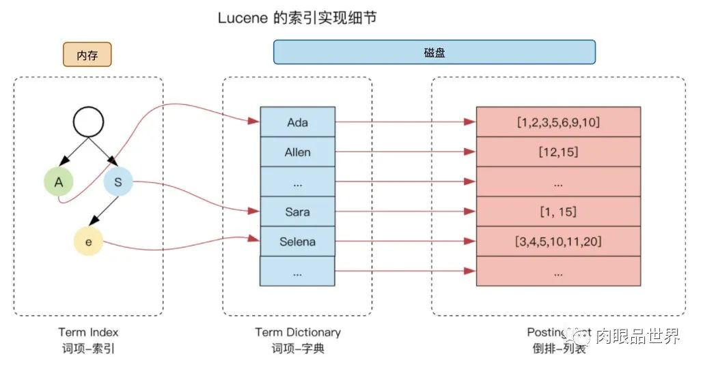
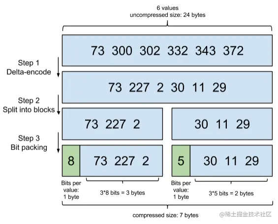
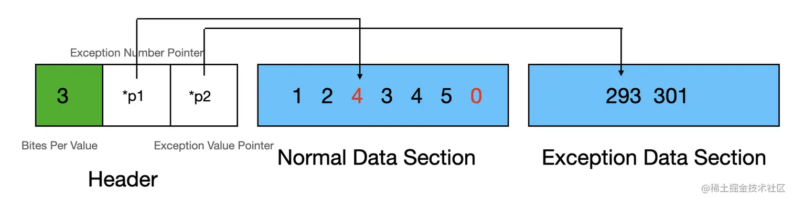

## 哈希

- 余数桶
  `hash[data]=data mod n`
- 基数桶
  基数桶除了像余数桶一样实现了映射的功能，它还能保留了数字原来的大小关系。所以它不仅可以做精确查找，还可以做范围查找
  `hash[data]=data/n`
  我们也可以用基数桶来做数据的预处理(解决浮点数问题，用基数桶转换到一个整数范围就可以)
- (多维)余数桶
  多维哈希
- **(多维)基数桶**
  将数据每一维进行哈希，只是使用的是基数哈希，这样保持了原来数据的大小关系
  多维基数桶的除了可以做精确查找，范围查找外，还可以做`欧几里得距离查找`(atcoder 某次的 ex)
  快速计算`最近欧几里德距离`有什么用？基于 geohash 的附近点查找，基于 hash 的最近邻特征向量查找都是来源于这个算法

## 正排与倒排索引

倒排索引也是索引的一种。索引，本质上就是为了快速检索我们存储的数据。
每种数据库都有自己要解决的问题（或者说擅长的领域），对应的就有自己的数据结构，而不同的使用场景和数据结构，需要用不同的索引，才能起到最大化加快查询的目的。
Elasticsearch 是通过 Lucene 的倒排索引技术实现比关系型数据库更快的过滤。特别是它对多条件的过滤支持非常好

通过文章，获取里面的单词，这种就是所谓的”正向索引”（forward index).(起始就是暴力查找)
后来，我们希望能够输入一个单词，找到含有这个单词，或者和这个单词有关系的文章,就把这种索引，称为 inverted index，直译过来，应该叫”反向索引”，国内翻译成”倒排索引”.(需要预处理)

全文搜索场景.
如果需要涉及多个字段的交集和并集的操作，我们还需要在这之上加入正排和倒排索引.
查询时，先进行分词变成多个 term，然后再对这些 term 求交集(有时根据业务还需要求答案的并集).

1. 倒排索引就是`trie+Map+有序数组`
   这里的 trie 叫`Term Index`，一般是压缩 trie.
   这里的 Map 叫 `Term Dictionary`
   这里的 有序数组 `Posting List`，存储 docId(也有 id，id 是搜索引擎控制的，全局递增)

   https://cloud.tencent.com/developer/article/1883131
   https://xiaoming.net.cn/2020/11/25/Elasticsearch%20%E5%80%92%E6%8E%92%E7%B4%A2%E5%BC%95/
   https://www.coolcode.fun/archives/es-zhong-de-dao-pai-suo-yin-ji-zhi
   

   `Posting List`优化目标：**压缩以节省磁盘空间、快速求并交集**

   - Frame Of Reference（FOR）增量编码技术
     

     > 在 Lucene 里，数据是按照 Segment 存储的，每个 Segment 最多存 65536 个文档 ID

     倒排链先进行增量编码(差分)然后分块，每块最多包含 256 个文档，保证每个元素都不会超过 256 (uint8)；
     最后位打包压缩每个块：Lucene 计算在块中存储增量的`最大位数`，将此信息添加到块头，使用此位数对块的所有增量进行编码

     
     Patched Frame Of Reference (PFOR)：是为了解决`较大异常值`而使得 b 过大提出来的一种改进算法，，b 是指存储最大值所需要的位数。 PFOR 为大多数正常值(90%)选择固定位数 b 来存储（值小于 2^b），不能用 b 位表示的值称为异常值会被存储到另外的异常数组

   - 标记删除：将数据划分为存量数据和增量数据两部分。然后删除数据时就在 bitmap 上标记一下，搜索时检查一下 bitmap 的数据就可以了
   - 定期合并：插入数据也是一样，直接插在倒排链时，速度也很慢，更好的办法就是在内存建立一份增量数据，`当达到一定程度后，就将这份增量数据保存到磁盘中就可以了`。磁盘中的多份增量数据达到一定程度后又合并起来就可以了
   - 优化的 动态 BitSet(元素个数较少(8 倍)，使用数组，否则使用 动态 Bitset) -> 参考 [ABC350G] Mediator
   - bitset 求交集、有序数组求交集都很快
     **如中某个数组长度很小：因为交集不是所有元素都需要的，我们可以根据有序的关系作一个优化**
     即：取所有集合中数量最小的那个集合，然后从标称数组中依次取出每个元素，查看元素是不是在其他的每一个倒排链中

2. 正排索引
   就是记录每个文档中有哪些 term
   文本为 key，以分词的列表为 value
3. 搜索引擎综合

   - 顺序优化
     由于倒排链比较大，磁盘中的 Term Dictionary 的节点是不会直接存放倒排链的，每个节点只会`放倒排链的 offset 和 count 的信息，然后所有的倒排链都直接放到一个文件中去`
     这样做的话，Term Dictionary 就能占用很小的空间，`磁盘的邻近 io 操作都是接近顺序读取`，而不是随机读取的
   - 结构优化
     - 每个记录都有一个 id，全局递增
     - roaring bitmaps
   - 内存与磁盘的处理

     如何将内存作为磁盘的缓存，实现更快的速度：

     - Term Dictionary 实在太大，无法整个保存到内存中。所以，我们采用 Term Index 的方法，将 Term Dictionary 中的单词以前缀划分为多个类别，然后根据这些类别在`内存中建立 Tire 树就可以了`
     - Mmap，读取倒排链和正排索引时，我们可以用 mmap 的方法读取这个大文件，然后由系统来控制换页，`频繁读取的页就一直放在内存中`，不频繁的页会自动替换到磁盘中去

   - 增量与全量的处理
     - 索引与查询分离：让一些机器只做全量数据查询，另外一些机器只做增量数据存储与索引生成，也就是索引与查询分离
     - 用`静态结构来存储存量数据`，然后使用内存加定时持久化来构造`增量数据`。
       查询的时候同时将`存量数据和增量数据的结果合并`起来就可以了。这样就能实现查询时效率足够高，而且修改操作时时间复杂度也不会太高

4. 为什么 Elasticsearch/Lucene 检索可以比 mysql 快
   Mysql 只有 term dictionary 这一层，是以 b-tree 排序的方式存储在磁盘上的。
   检索一个 term 需要若干次随机 IO 的磁盘操作。
   而 Lucene 在 term dictionary 的基础上`添加了 term index 来加速检索`，term index 以树的形式缓存在内存中。从 term index 查到对应的 term dictionary 的 block 位置之后，再去磁盘上找 term，大大减少了磁盘的 random access （随机 IO）次数

## radix tree

既然我们可以用 Trie 树对字符串进行索引，为什么不能`将数字看成字符串`，然后用类似 Trie 树的方式来索引呢，这就是基数树的想法。
数字怎么转换成字符串，方法就是它的二进制串，我们可以将划分每一层的串时，我们可以用一个二进制划分一个字符，也可以用两个二进制划分为一个字符
linux 内核的内存管理，身份鉴别使用的都是基数树实现

## 双数组 trie

https://zhuanlan.zhihu.com/p/35193582
https://blog.csdn.net/heiyeshuwu/article/details/42526461
双数组 Trie 树启发式地利用了复用同一个数组，并加入偏移量来解决冲突的问题。这是一个很好的思路，也是解决稀疏矩阵的存储的问题。最后，这个方法不仅时间复杂度上达到最优，而且空间复杂度也不高，序列化速度也很快，`是 Trie 树的最优的实现方法`；
Trie 树还有前缀和后缀压缩的优化算法，对于长字符串的场景来说，非常有必要。但是对于单词查找这种短字符串的场景来说，就没有什么意义。
