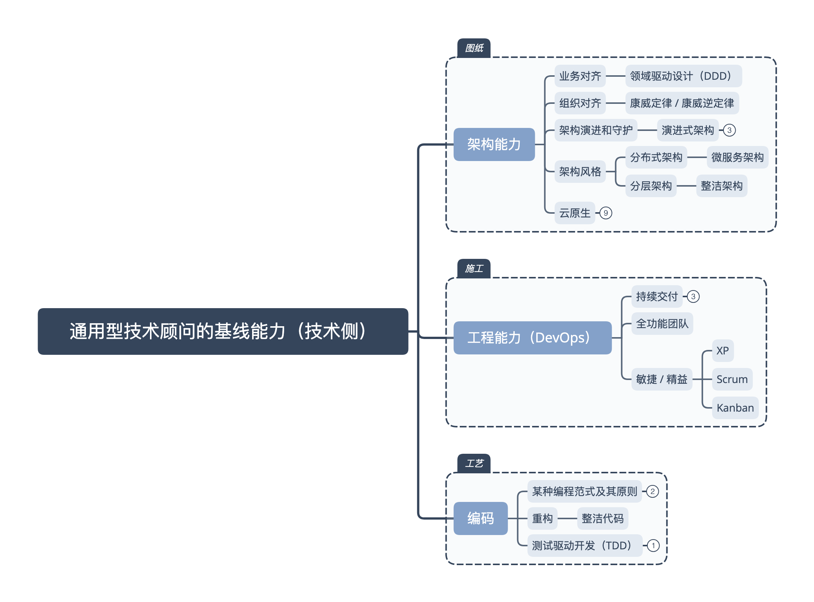

1. express 用中间件实现了非常灵活的扩展性，但是也放弃了性能，也放弃了对代码规范性的约束。
   而在设计上，没有考虑二阶中间件和 js 的异步特性，是其最大的缺陷

   > redux 的中间件是二阶的，就比它灵活多了，能修改下一个中间件的输入和输出参数
   > 大规模的路由匹配时，这是个很大的性能瓶颈
   > 无法优雅地写一个中间件，统计每个请求所使用的时间。这正是下一代 nodejs 上的后端框架——koa 要解决的问题

2. 软件技术顾问的培养（一）：新技术顾问必读的十本书以及背后的思考
   https://huhao.dev/posts/56bcf73b/
   对于通用型软件技术顾问来说，软件工程的端到端实践知识是其非常重要的能力基础

   - 现代软件工程

   - 端到端实践经验
     其实就是一个技术顾问，是否在过去的工作中，从事过并熟悉软件开发从需求分析、设计、实现、测试、上线及运维的全过程
   - 端到端知识体系
     干过很重要，但是干过却不能系统化的说出来为什么这么干，那就是纯粹的片面`经验主义，是缺乏体系支撑和说服力的`
     但凡是善于总结抽象，并且通过长期的实践、思考和总结，很多优秀的软件架构师或工程师都能够`形成一套自己的体系化思想和方法`

     对于一个通用型的软件技术顾问来说，其应该具备的知识体系，就好比应该了解如何能够建一座大楼：
     

     1. 知道如何画`图纸`：知晓现代的系统架构能力 -> 架构能力
        应当能够在**云原生**的背景下，通过**领域驱动设计**的方式，基于业务边界进行架构，选用以**微服务架构**和**分层架构**为代表的，不同层面的恰当架构风格承载架构设计，结合**康威定律或逆康威定律**实现组织与架构相匹配，最后利用**演进式架构**的思想，对架构进行度量、守护和演进。
     2. 知道`施工`的流程：知晓现代的工程实践能力 -> devops
        在帮助客户落地架构设计的过程中，需要构建**全功能团队**，落实 XP（极限编程）、Scrum、Kanban（看板方法）等以价值交付为核心的软件工程实践，通过**持续交付**的方式交付可工作的软件，最终匹配 **DevOps** 所倡导的研发运营一体化价值观
     3. 知道施工的`工艺`：掌握现代的编码基本手艺 -> 编码
        最后，“Talk is cheap, show me the code.”——在代码级别应用适合的编程范式及其原则，帮助客户应用**测试驱动开发**实现增量式设计减少冗余，并将**重构**植入开发团队的 DNA 变成编程的基本功，最终达成**整洁代码**的要求。

3. 通用型软件技术顾问必读的书
   https://www.douban.com/doulist/119965864/

   ## 编码能力

   - 《重构 2：改善既有代码的设计》

   ## 工程能力

   - 《持续交付：发布可靠软件的系统方法》
   - 《DevOps 实践指南》

   ## 架构能力

   - 《领域驱动设计模式、原理与实践》
   - 《架构整洁之道》
   - 《微服务架构设计模式》
   - 《数据密集型应用系统设计》
   - 《企业 IT 架构转型之道：阿里巴巴中台战略思想与架构实战》
