https://zhenghe.gitbook.io/open-courses/cmu-15-445-645-database-systems/relational-data-model
https://www.jianshu.com/nb/36265841

RDBMS 有3个硬骨头，分别是SQL优化，并发控制，失败恢复

## Relational Data Model

理解：从数据完整性、实现、持久化方面分析，需要升级 CSV 数据库，于是就有了专业的`数据库管理系统`（DBMS）。

- 分离逻辑层和物理层
  在早期，各个项目各自造轮子，因为每个轮子都是为应用量身打造，这些系统的逻辑层（logical）和物理层（physical）普遍耦合度很高。

  Ted Codd 发现这个问题后，提出 DBMS 的抽象（Abstraction）：

  - 用简单的、统一的数据结构存储数据
  - 通过高级语言操作数据
  - 逻辑层和物理层分离，系统开发者只关心逻辑层，而 DBMS 开发者才关心物理层。

- 数据模型
  在逻辑层中，我们通常需要对所需存储的数据进行建模。

  Relational => 大部分 DBMS 属于关系型，也是本课讨论的重点

  Key/Value
  Graph
  Document
  Column-family

  Array/Matrix

- Relational Model
  **每个 Relation 都是一个无序集合（unordered set），集合中的元素称为 tuple**，每个 tuple 由一组属性构成，这些属性在逻辑上通常有内在联系。
  primary key 在一个 Relation 中唯一确定一个 tuple。
  foreign key 唯一确定另一个 relation 中的一个 tuple。

## Advanced SQL

在 Relational Model 下构建查询语句的方式分为两种：Procedural 和 Non-Procedural。第一节课中已经介绍了 Relational Algebra，它属于 Procedural 类型，而本节将介绍的 SQL 属于 Non-Procedural 类型。使用 SQL 构建查询时，用户只需要指定它们想要的数据，而不需要关心数据获取的方式，DBMS 负责理解用户的查询语义，选择最优的方式构建查询计划。

## Database Storage

“面向磁盘”的DBMS体系结构
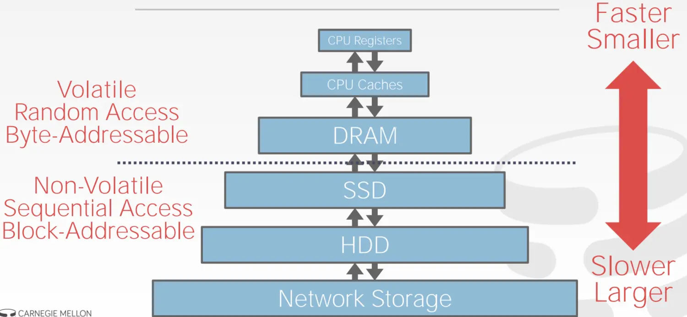

传统的 DBMS 架构都属于 disk-oriented architecture，即假设数据主要存储在非易失的磁盘（non-volatile disk）上。于是 DBMS 中一般都有磁盘管理模块（disk manager），它主要负责数据在非易失与易失（volatile）的存储器之间的移动。
`磁盘管理模块的存在就是为了同时获得易失性存储器的性能和非易失性存储器的容量，让 DBMS 的数据看起来像在内存中一样。`

DBMS 比 OS 拥有更多、更充分的知识来决定数据移动的时机和数量，具体包括：

- 将 dirty pages 按正确地顺序写到磁盘
- 根据具体情况预获取数据
- 定制化缓存置换（buffer replacement）策略

因此不使用 OS 自带的磁盘管理模块

---

DBMS 的磁盘管理模块主要解决两个问题：

1. （本节）如何使用`磁盘文件来表示数据库的数据`（元数据、索引、数据表等）
2. 如何管理数据在内存与磁盘之间的移动

---

数据库按页面组织。
跟踪页面有不同方式。
存储页面有不同方式。
存储元组有不同方法。

- File Storage
  虽然 DBMS 自己造了磁盘管理模块，但 DBMS 一般不会自己造文件系统.
  DIY 文件系统将使得 DBMS 的可移植性大大下降，获得的性能提升在 10% - 15% 之间，不划算。
  DBMS 通常将自己的所有数据作为一个或多个文件存储在磁盘中，而 OS 只当它们是普通文件，并不知道如何解读这些文件。

  - Database Pages

- Page Layout
  每个 page 被分为两个部分：header 和 `data`
- Data Layout

  - Tuple-oriented：记录数据本身
    slotted pages：header 中的 slot array 记录每个 slot 的信息，如大小、位移等
  - Log-structured：记录数据的操作日志

- Tuple Layout
  tuple-oriented 的 layout 中，DMBS 如何存储 tuple 本身呢
  `header+data`

- Tuple Storage
- Data Storage Models
  Relational Data Model 将数据的 attributes 组合成 tuple，将结构相似的 tuple 组合成 relation，但它并没有指定这些 relation 中的 tuple，以及 tuple 的 attributes 的存储方式。一个 tuple 的所有 attributes 并不需要都存储在同一个 page 中，它们的实际存储方式可以根据数据库应用场景优化，如 OLTP 和 OLAP。

## Buffer Pools

如何管理数据在内存与磁盘之间的移动
空间控制（Spatial Control）和时间控制（Temporal Control）

- page table VS page directory
  page directory页面目录是从数据库文件中的页面ID到页面位置的映射。
  →必须将所有更改记录在磁盘上以允许DBMS在重新启动时查找。

  page table页表是从页面ID到缓冲池帧中页面副本的映射。
  →这是内存中的数据结构，不需要存储在磁盘上。

- Buffer Pool Manager
  DBMS 启动时会从 OS 申请一片内存区域，即 Buffer Pool，并将这块区域划分成大小相同的 pages，为了与 disk pages 区别，通常称为 frames，当 DBMS 请求一个 disk page 时，它首先需要被复制到 Buffer Pool 的一个 frame 中

  为了减少并发控制的开销以及利用数据的 locality，DBMS 可能在不同维度上维护多个 Buffer Pools。

- Buffer Replacement Policies
  LRU-K：考虑最后K个参考的历史

## Hash Tables

为了支持 DBMS 更高效地从 pages 中读取数据，DBMS 的设计者需要灵活运用一些数据结构及算法，其中对于 DBMS 最重要的两个是：

Hash Tables
Trees

在做相关的设计决定时，通常需要考虑两个因素：

Data Organization：如何将这些数据结构合理地放入 memory/pages 中，以及为了支持更高效的访问，应当存储哪些信息
Concurrency：如何支持数据的并发访问

## Tree Indexes

节点大小、合并的阈值、变长的KEY
前缀压缩，后缀截断，批量插入，指针滑动

## Index Concurrency Control

通常我们会从两个层面上来理解并发控制的正确性：

Logical Correctness：（17 节）我是否能看到我应该要看到的数据？
Physical Correctness：（本节）数据的内部表示是否安好？

- Latch Crabbing/Coupling
- Better Latching Algorithm
  可以采用类似乐观锁的思想，假设 leaf node 是安全（更新操作仅会引起 leaf node 的变化）的，在查询路径上一路获取、释放 read latch，到达 leaf node 时，若操作不会引起 split/merge 发生，则只需要在 leaf node 上获取 write latch 然后更新数据，释放 write latch 即可；若操作会引起 split/merge 发生，则重新执行一遍，此时在查询路径上一路获取、释放 write latch，即 Latch Crabbing 原始方案。

  - Search：与 Latch Crabbing 相同

  - Insert/Delete:

    使用与 Search 相同的方式在查询路径上获取、释放 latch，在 leaf node 上获取 write latch

    如果 leaf node 不安全，可能会引起其它节点的变动，则使用 Latch Crabbing 的策略再执行一遍

- Horizontal Scan
  当遇到横向扫描无法获取下一个节点的 latch 时，`该线程将释放 latch 后自杀`。这种策略逻辑简单，尽管有理论上的优化空间，但在实践中是常见的避免死锁的方式。
- Delayed Parent Updates
  每当 leaf node 溢出时，我们都需要更新至少 3 个节点：

  即将被拆分的 leaf node
  新的 leaf node
  parent node

  修改的成本较高，因此 B-link Tree 提出了一种优化策略：每当 leaf node 溢出时，只是标记一下而暂时不更新 parent node，等下一次有别的线程获取 parnet node 的 write latch 时，一并修改

## Query Processing

- Processing Model
  processing model 定义了系统如何执行一个 query plan，目前主要有三种模型

  迭代模型，主要是自顶向下的。物化模型，是自底向上的。矢量模型，像迭代模型一样通过next来交互，但是是批量发送数据，也是自顶向下的。
  在大多数dbms的系统都支持迭代模型，物化模型更加适合oltp而非olap。而矢量模型是olap的理想选择。

- Access Methods
  指的是 DBMS 从数据表中获取数据的方式

  顺序扫描，索引扫描，和多索引扫描

- Expression Evaluation

## Sorting&Aggregations

- General External Merge Sort

## Join Algorithms

为什么我们需要连接？
在关系型数据库中，我们常常通过规范化 (Normalization) 设计避免信息冗余；因此查询时，就需要通过 Join 将不同 table 中的数据合并来重建数据。

以课程伊始时的 table 为例，通过将 Artist 与 Album 之间的多对多关系拆成 Artist, ArtistAlbum 以及 Album 三个 tables 来规范化数据，使得数据存储的冗余减少：

查询时我们就需要通过 Join 来重建 Artist 与 Album 的完整关系数据。

- Join Operator Output
  逻辑上 Join 的操作的结果是：
  对任意一个 tuple r∈R 和任意一个在 Join Attributes 上对应的 tuple s∈S ，将 r 和 s 串联成一个新的 tuple.

  Join 操作的结果 tuple 中除了 Join Attributes 之外的信息与多个因素相关

  我们可以在 Join 的时候将所有非 Join Attributes 都放入新的 tuple 中，这样 Join 之后的操作都不需要从 tables 中重新获取数据
  
  也可以在 Join 的时候`只复制 Join Attributes 以及 record id`，后续操作自行根据 record id 去 tables 中获取相关数据。对于列存储数据库，这是比较理想的处理方式，被称为 `Late Materialization。`

- I/O Cost Analysis
  **衡量 Join Algorithm 好坏的标准，就是 I/O 的数量**

  - Nested Loop Join
    Simple
    Block
    Index

  总是选择小表作为 Outer Table
  尽量多地将 Outer Table 缓存在内存中
  扫描 Inner Table 时，尽量使用索引

  - Sort-Merge Join
  - Hash Join
    Hash Join 在绝大多数场景下是最优选择，但当查询包含 ORDER BY 或者数据极其不均匀的情况下，Sort-Merge Join 会是更好的选择，DBMSs 在执行查询时，可能使用其中的一种到两种方法

## Query Optimization

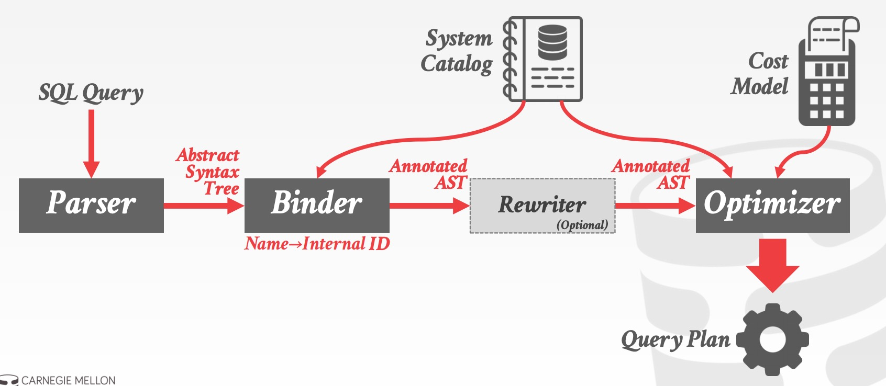

- Heuristics/Rules(基于规则的)
  通过重写QUERY来消除不高效，不需要一个成本模型
  Rewriter 负责 Heuristics/Rules

  - Query Rewriting
    如果两个关系代数表达式 (Relational Algebra Expressions) 如果能产生相同的 tuple 集合，我们就称二者等价

  - Predicate Pushdown

    - 越早过滤越多数据越好
    - `重排 predicates，使得选择性大的排前面`
    - `将复杂的 predicate 拆分，然后往下压`，如 X=Y AND Y=3 可以修改成 X=3 AND Y=3

  - Projections Pushdown
    本方案对列存储数据库不适用。在行存储数据库中，`越早过滤掉不用的字段越好`，因此将 Projections 操作往查询计划底部推也能够缩小中间结果占用的空间大小。
    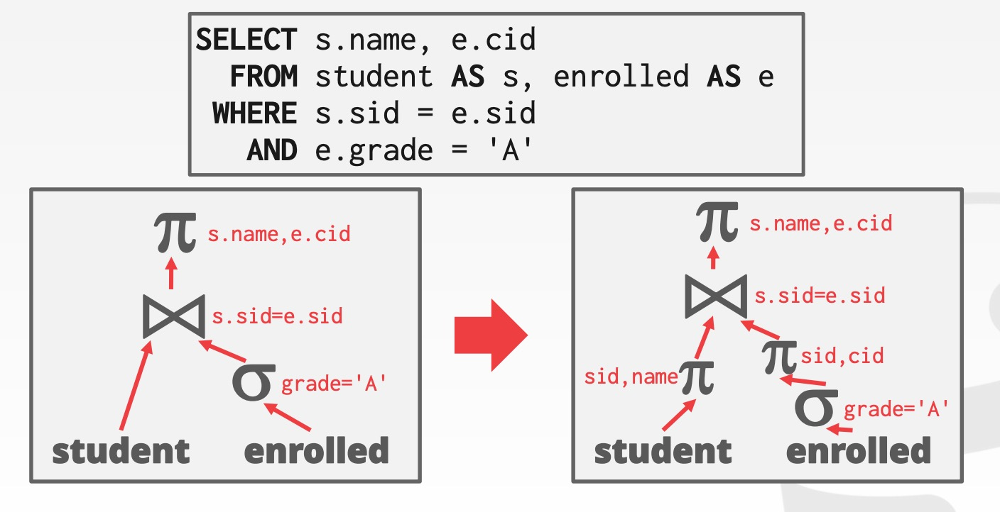

- Cost-based Search(基于成本的)
  使用成本模型来评估多种等价计划然后选择成本最小的
  Optimizer 则负责 Cost-based Search

  除了 Predicates 和 Projections 以外，许多操作没有通用的规则，如 Join
  这时候就需要一些成本估算技术，将过滤性大的表作为 Outer Table，小的作为 Inner Table，从而达到查询优化的目的

  - Cost Estimation
    整个查询过程需要读入和写出多少 tuples
  - Statistics

## Parallel Execution

随着摩尔定律逐渐失效，处理器走向多核，系统可以通过并行执行增加吞吐量，减少延迟，使得系统响应更快。

- Process Models
  多用户数据库系统处理并发请求的架构

  Thread per DBMS Worker

- Execution Parallelism

  - Intra-operator Parallelism (Horizontal)

    将 data 拆解成多个子集，然后对这些子集并行地执行相应的 operator，DBMS 通过将 exchange operator 引入查询计划，来合并子集处理的结果，过程类似 MapReduce

  - Inter-operator Parallelism (Vertical)
    将 operators 串成 pipeline，数据从上游流向下游，一般无需等待前一步操作执行完毕，也称为 pipelined parallelism

- I/O Parallelism

## Concurrency Control Theory

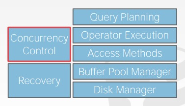
在前面的课程中介绍了 DBMS 的主要模块及架构，自底向上依次是 Disk Manager、Buffer Pool Manager、Access Methods、Operator Execution 及 Query Planning。但数据库要解决的问题并不仅仅停留在功能的实现上，它还需要具备：

- 满足多个用户同时读写数据，即 Concurrency Control，如：
  两个用户同时写入同一条记录
- 面对故障，如宕机，能恢复到之前的状态，即 Recovery，如：
  你在银行系统转账时，转到一半忽然停电

Concurrency Control 与 Recovery 都是 DBMSs 的重要特性，它们渗透在 DBMS 的每个主要模块中。而二者的基础都是具备 ACID 特性的 Transactions，因此本节的讨论从 Transactions 开始。

- Transactions
  transaction 是 DBMS **状态变化的基本单位**

  - Atomicity
    **logging**/shadow paging
  - Consistency
  - Isolation
    Pessimistic：不让问题出现，将问题扼杀在摇篮之中
    Optimistic：假设问题很罕见，一旦问题出现了再行处理

    当dbms交替的执行操作，就会出现一些问题。有如下三类。

    读 - 写冲突（“不可重复读取”）：事务处理时多次读取同一个对象，无法获得相同的值。
    写 - 读冲突（“脏读”）：事务看到另一个事务的写入的值在那个事务提交前。
    写 - 写冲突（“丢失的更新”）：一个事务覆盖另一个并发事务的未提交数据。

## Two Phase Locking (2PL)

上节课介绍了通过 WW、WR、RW conflicts 来判断一个 schedule 是否是 serializable 的方法，但使用该方法的前提是预先知道所有事务的执行流程，这与真实的数据库使用场景并不符合，主要原因在于：

- 请求连续不断。时时刻刻都有事务在开启、中止和提交
- 显式事务中，客户端不会一次性告诉数据库所有执行流程

因此我们需要一种方式来保证数据库最终使用的 schedule 是正确的 (serializable)。不难想到，保证 schedule 正确性的方法就是合理的加锁 (locks) 策略，2PL 就是其中之一。

- lock manager
  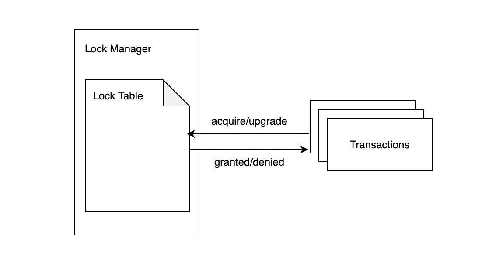

- 2PL
  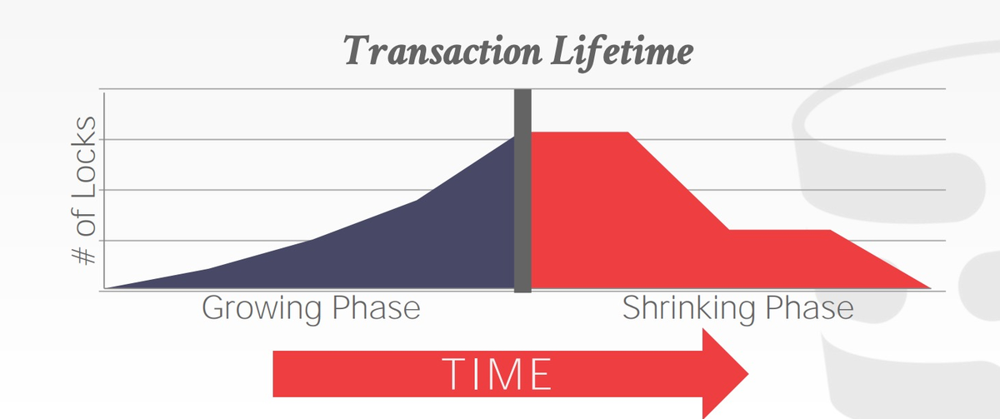
  2PL 本身已经足够保证 schedule 是 serializable，通过 2PL 产生的 schedule 中，各个 txn 之间的依赖关系能构成有向无环图。但 2PL 可能导致`级联中止 (cascading aborts)`
  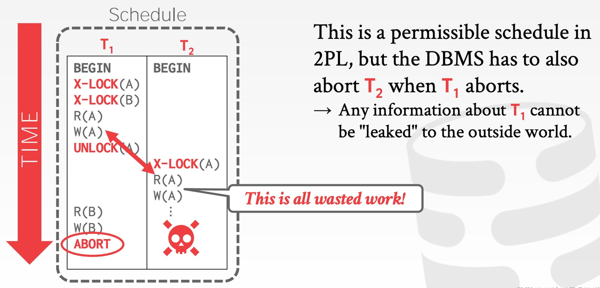
  由于 T1 中止了，T2 在之前读到 T1 写入的数据，就是所谓的 "脏读"。为了保证整个 schedule 是 serializable，DBMS 需要在 T1 中止后将曾经读取过 T1 写入数据的其它事务中止，而这些中止可能进而使得其它正在进行的事务级联地中止，这个过程就是所谓的级联中止。

- Rigorous 2PL
  事实上 2PL 还有一个增强版变种，Rigorous 2PL，后者**每个事务在结束之前，其写过的数据不能被其它事务读取或者重写**
  这种方法的优点是DBMS不会导致级联中止。
  同时只要把原来的值赋值回去就可以实现abort了。
- universe of schedules
  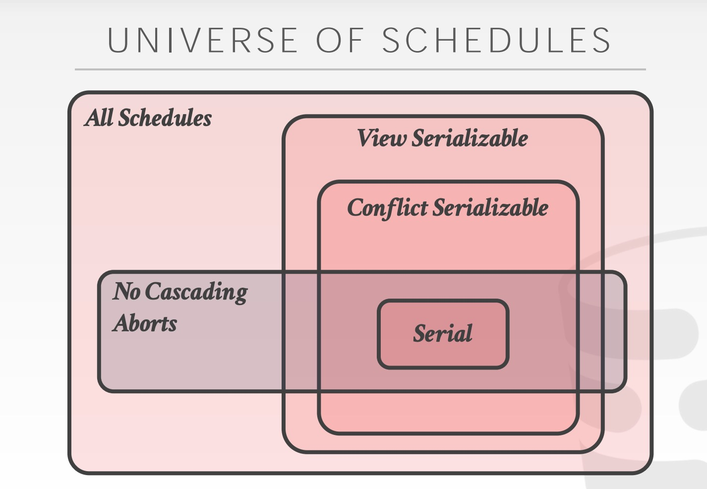
  cascading aborts 也是 schedule 的一个特性，它与 serializable 并无直接关系
- Deadlock Detection & Prevention
  `2PL 无法避免的一个问题就是死锁`
  死锁其实就是事务之间互相等待对方释放自己想要的锁。解决死锁的办法也很常规：
  - Detection：事后检测
    当 DBMS `检测到`死锁时，它会选择一个 "`受害者`" (事务)，将该事务回滚，打破环形依赖，而这个 "受害者" 将依靠配置或者应用层逻辑重试或中止。在选择完 "受害者" 后，DBMS 还有一个设计决定需要做：`完全回滚还是回滚到足够消除环形依赖即可。`
  - Prevention：事前阻止
    只要保证 prevention 的方向是一致的，就能阻止死锁发生，其原理类似哲学家就餐设定顺序的解决方案：先给哲学家排个序，遇到获取刀叉冲突时，顺序高的优先。

## Timestamp Ordering Concurrency Control(T/O)

上节课介绍的 2PL 是悲观的并发控制策略，本节课介绍的 Timestamp Ordering (T/O) 则是一个乐观的策略，其乐观表现在`事务访问数据时无需显式加锁`。
T/O 的核心思想就是利用时间戳来决定事务之间的等价执行顺序：
**如果 TS(Ti) < TS(Tj)，那么数据库必须保证实际的schedule与先执行Ti，后执行Tj的结果等价。**
要实现 T/O，就需要一个单调递增的时钟，来决定任意事务Ti发生的时间。
满足条件的时钟方案有很多，如：

- 系统单调时钟 (System Clock)
- 逻辑计数器 (Logical Counter)
- 混合方案 (Hybrid)

---

- Basic T/O
  Basic T/O 是 T/O 方案的一种具体实现。在 Basic T/O 中，事务读写数据不需要加锁，每条数据 X 都会携带两个标记：

  W-TS(X)：最后一次写 X 发生的时间戳
  R-TS(X)：最后一次读 X 发生的时间戳

  在每个事务结束时，Basic T/O 需要检查该事务中的每个操作，`是否读取或写入了未来的数据`，一旦发现则中止、重启事务。

  ```go
  func read(X) val {
      if TS(T_i) < W_TS(X) {
          abort_and_restart(T_i)
      } else {
          val := read_data(X)
          R_TS(X) = max(R_TS(X), TS(T_i))
          // make a local copy of X to ensure repeatable reads for T_i
          return val
      }
  }

  func write(X, val) {
    if TS(T_i) < R_TS(X) || TS(T_i) < W_TS(X) {
        abort_and_restart(T_i)
    } else {
        X = val
        W_TS(X) = max(W_TS(X), TS(T_i))
        // make a local copy of X to ensure repeatable reads for T_i
    }
  }

  // Thomas Write Rule (TWR)
  func write(X, val) {
      if TS(T_i) < R_TS(X) {
          abort_and_restart(T_i)
          return
      }

      // TWR
      if TS(T_i) < W_TS(X) {
          // ignore write
          return
      }

      X = val
      W_TS(X) = TS(T_i)
      // ...
  }
  ```

  如果不使用 TWR 优化，Basic T/O 能够生成 conflict serializable 的 schedule，`如果使用了 TWR，则 Basic T/O 生成的 schedule 虽然与顺序执行的效果相同，但不满足 conflict serializable。`

  优点：无死锁，无等待；
  缺点：长事务容易因为与短事务冲突而饿死；长事务容易因为与短事务冲突而饿死。

- Recoverable Schedules
  Recoverable Schedules（可恢复调度） 是指一种事务调度方式，保证只有**当一个事务依赖的另一个事务已经提交后，自己才能提交。**
  `如果事务T2读取了事务T1写的数据，T2必须等T1提交后才能提交。`
  这样即使T1回滚，T2也不会已经提交，`避免了“脏读已提交”`导致的不一致。

  Basic T/O 可能产生不可恢复的 schedules。

- Optimistic Concurrency Control (OCC)
  OCC 是 H.T. KUNG 在 CMU 任教时提出的并发控制算法。在 OCC 中，数据库为每个事务都创建一个私有空间：

  所有被读取的数据都复制到私有空间中
  所有修改都在私有空间中执行

  OCC 分为 3 个阶段：

  1. Read Phase：追踪、记录每个事务的读、写集合，并存储到私有空间中
  2. Validation Phase：当事务提交时，检查冲突
  3. Write Phase：如果校验成功，则合并数据；否则中止并重启事务

  DBMS 需要维持所有活跃事务的全局视角，并将 Validation Phase 和 Write Phase 的逻辑放入一个 critical section 中。

- Partition-Based T/O
  类似全局锁到分段锁的优化，我们也可以将数据库切分成不相交 (disjoint) 的子集，即 horizontal partitions 或 shards，然后在 partition 内部使用单调递增的时间戳确定各个事务的顺序，不同 partition 上的事务之间无需检测冲突。

## Multi-Version Concurrency Control

简而言之，实现 MVCC 的 DBMS 在内部维持着单个逻辑数据的多个物理版本，当事务修改某数据时，DBMS 将为其创建一个新的版本；当事务读取某数据时，它将读到该数据在事务开始时刻之前的最新版本。

MVCC 的核心优势可以总结为以下两句话：

`Writers don't block readers.Readers don't block writers.`
写不阻塞读，读不阻塞写

只读事务可以在不获取锁的情况下读取一致的快照。 时间戳用于确定可见性。

---

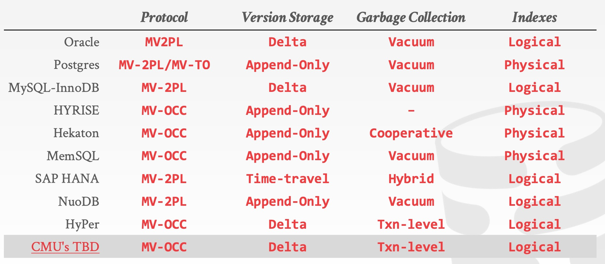

**MVCC 不止是一个并发控制协议，它由四个部分组成，这些部分包括**：

- Concurrency Control Protocol(并发控制协议)

  - Approach #1：Timestamp Ordering (T/O)：为每个事务赋予时间戳，并用以决定执行顺序
  - Approach #2：Optimistic Concurrency Control (OCC)：为每个事务创建 private workspace，并将事务分为 read, write 和 validate 3 个阶段处理
  - Approach #3：Two-Phase Locking (2PL)：按照 2PL 的约定获取和释放锁

- Version Storage(版本存储)
  关于DBMS如何存储逻辑对象的不同物理版本。
  DBMS使用元组的指针字段为每个逻辑元组创建一个`版本链`。 这允许DBMS在运行时查找特定事务可见的版本。 索引总是指向链的头部。 线程遍历链，直到找到可见的版本。
  不同的存储方案确定每个版本的存储位置/内容。

  - Approach #1：Append-Only Storage：新版本通过追加的方式存储在同一张表中
  - Approach #2：Time-Travel Storage：老版本被复制到单独的一张表中
  - Approach #3：Delta Storage：老版本数据的被修改的字段值被复制到一张单独的增量表 (delta record space) 中

- Garbage Collection(垃圾回收)
  DBMS需要随着时间的推移从数据库中删除可回收的物理版本。
  →DBMS中没有活动的txn可以“看到”该版本（`SI`）。
  →版本是由中止的txn创建的。

  - Approach #1：Tuple-level：直接检查每条数据的旧版本数据

    - Background Vacuuming 单独的线程定期扫描表并查找可回收的版本.
    - Cooperative Vacuuming 工作线程在遍历版本链时识别可回收的版本。 仅适用于OLD2NEW

  - Approach #2：Transaction-level：每个事务负责跟踪数据的旧版本，DBMS 不需要亲自检查单条数据

- Index Management(索引管理)
  我们有时会是根据索引去查数据，那么索引也必须链接到多版本数据的指针头

  - Primary Key Index
    - 主键索引直接`指向 version chain 的头部`
  - Secondary Indexes
    二级索引有两种方式指向数据本身：
    - Approach #1：逻辑指针，即`存储主键值或 Tuple Id`，如果版本发生变化，只需要改这个MAP里的映射关系一处；
    - Approach #2：物理指针，即`存储指向 version chain 头部的指针`，一变，所有索引都要跟着变。

每一部分都可以选择不同的方案，可以根据具体场景作出最优的设计选择。

## Logging Schemes

https://zhenghe.gitbook.io/open-courses/cmu-15-445-645-database-systems/logging-schemes

故障恢复机制包含两部分：

在事务执行过程中采取的行动来确保在出现故障时能够恢复 (本节课)
在故障发生后的恢复机制，确保原子性、一致性和持久性 (下节课)

- Failure Classification
  事务故障 (Transaction Failures)
  系统故障 (System Failures)
  存储介质故障 (Storage Media Failures)

- Buffer Pool Policies
  DBMS 如何支持 undo/redo 取决于它如何管理 buffer pool。我们可以从两个角度来分析 buffer pool 的管理策略：Steal Policy 和 Force Policy。

  Steal Policy：DBMS 是否允许一个未提交事务修改持久化存储中的数据？
  Force Policy：DBMS 是否强制要求一个提交完毕事务的所有数据改动都反映在持久化存储中？

- Shadow Paging
  `Shadow Paging: No-Steal + Force`
  凡是你要修改的页，都会有2个实例，一个是MASTER（数据库用的页），一个是你的复制出来的用来临时修改的（SHADOW）
  当前事务的修改只会发生在SHADOW页上。当一个事务提交，把SHADOW页通过一个原子性的切换指针的操作，把MASTER指向的页换到SHADOW页 来保证原子性。

  一个事务可能会涉及到改动多个页，你单个指针可以原子性的转换。那么有多个页该如何保证原子性呢？
  **双缓冲树**
  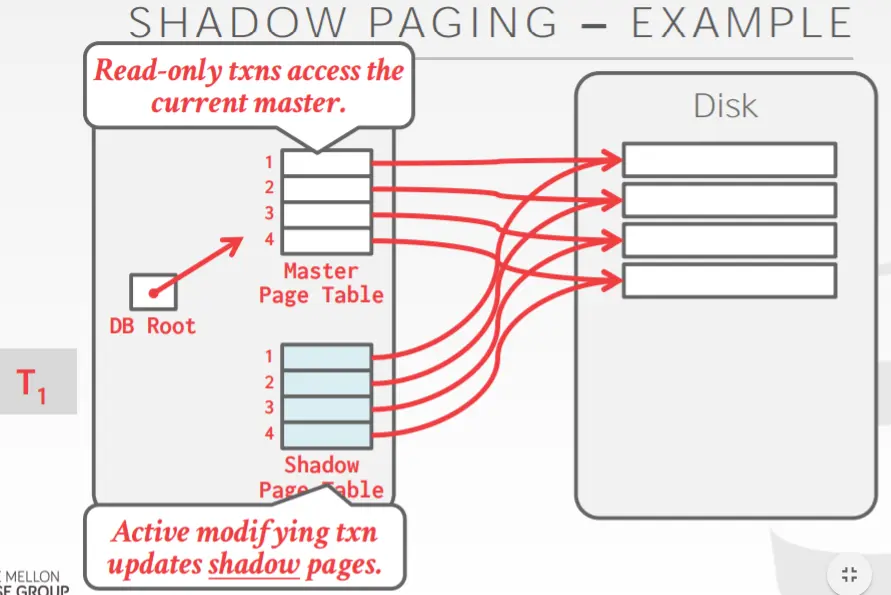
  凡是修改的页指针先会在SHADOW PAGE的树里修改，然后如果事务提交。我们只要转移DB ROOT的指针就好

  缺点：提交时要做的事很多，如要FLUSH所有更新的页。 **FLUSH 非连续的页去磁盘上是很慢的**。数据会碎片化，还需要GC来回收不用的页。

- Write-Ahead Log
  `Write-Ahead Log (WAL): Steal + No-Force`
  几乎永远是最佳选择。
  随机读，随机写变为了顺序读，顺序写。

  DBMS将所有txn的日志记录分阶段存储在内存中（通常由缓冲池支持）。
  确保在页面本身被重写到磁盘之前，所有与更新页面有关的日志记录都被写入到磁盘。
  在将所有相关日志记录写入稳定存储之前，不会将txn视为已提交。
  每一条LOG记录都会包含TRANSACTION ID， Object ID, BEFORE VALUE(undo), AFTER VALUE(redo)

- Logging Schemes
  physical logging 和 logical logging。
  前者指的是记录物理数据的变化，类似 git diff 做的事情；
  后者指的是记录逻辑操作内容，如 UPDATE、DELETE 和 INSERT 语句等等。

  还有一种混合策略，称为 physiological logging
  这种方案不会像 physical logging 一样记录 xx page xx 偏移量上的数据发生 xx 改动，而是记录 xx page 上的 id 为 xx 的数据发生 xx 改动，`前者需要关心 data page 在磁盘上的布局，后者则无需关心`

- Checkpoints
  DBMS 需要周期性地记录 checkpoint，即将所有日志记录和数据页都持久化到存储设备中，然后在日志中写入一条 <CHECKPOINT> 记录

## Database Recovery

https://www.jianshu.com/p/ea61881309df
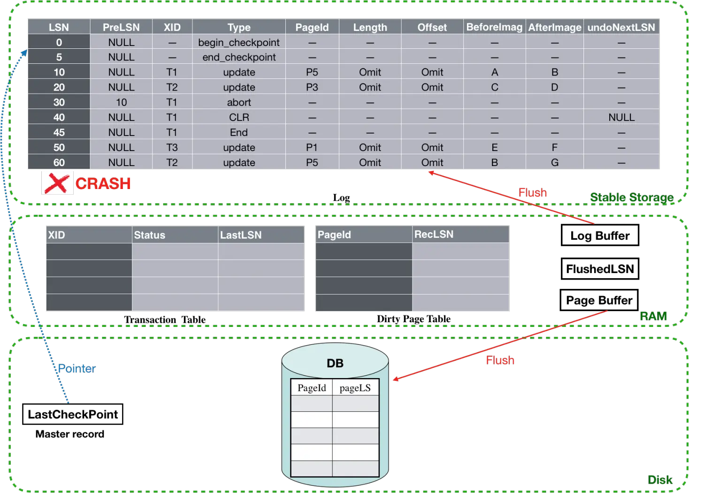

本节课介绍的是 Algorithms for Recovery and Isolation Exploiting Semantics (ARIES)，由 IBM Research 在 90 年代初为 DB2 DBMS 研发的基于 WAL 的故障恢复机制，尽管并非所有 DBMS 都严格按照 ARIES paper 实现故障恢复机制，但它们的思路基本一致。

ARIES 的核心思想可以总结为 3 点：

- Write-Ahead Logging (WAL)
  在数据落盘之前，所有写操作都必须记录在日志中并落盘
  必须使用 Steal + No-Force 缓存管理策略 (buffer pool policies)

- Repeating History During Redo
  当 DBMS 重启时，按照日志记录的内容重做数据，恢复到故障发生前的状态

- Logging Changes During Undo
  在 undo 过程中记录 undo 操作到日志中，确保在恢复期间再次出现故障时不会执行多次相同的 undo 操作

## Introduction to Distributed Databases

当我们在谈论分布式数据库时，首先要明确什么是分布式系统：**如果通信成本和通信的可靠性问题不可忽略，就是分布式系统**。这也是区分 Parallel DBMS 和 Distributed DBMS 的依据所在

- System Architecture
  Shared Memory、Shared Disk 和 Shared Nothing
- Database Partitioning
- Transaction Coordination

## Distributed OLTP Databases

Atomic Commit Protocols

Replication

Consistency Issues (CAP)

Federated Databases

## Distributed OLAP Databases

众所周知，数据库有两种典型使用场景，OLTP 和 OLAP。线上服务与 OLTP 数据库交互，OLTP 数据库再被异步地导出到 OLAP 数据库中作离线分析。
OLTP 数据库就是 OLAP 数据库的前端，通过 ETL 的过程，OLTP 数据库中的数据将被清理、重新整理到 OLAP 数据库上。OLAP 数据库为用户提供复杂的数据查询、分析能力，帮助公司：分析过去和预测未来。

Execution Models

Query Planning

Distributed Join Algorithms

Cloud Systems

## 温故而知新-CMU15445知识点复习+设计配套项目(总结的非常好!)

https://www.jianshu.com/p/aaf708b422ea

### 为什么需要数据库系统？

因为读写磁盘是昂贵的，数据库系统可以管理超过内存大小的数据，并且有效的避免很长的停顿和性能的退化。

### 数据库底层是如何存储的？

首选数据库会有一个模块叫storage manager他的职责就是负责读写磁盘上对应数据的PAGE，同时保持较好的空间和时间的局部性。数据文件在底层会有不同的组织形式，比较常见的是无序的HEAP FILE， 或者是有序的聚集索引（B树），还有一种是HASH FILE。

...

### Hash表主要关注什么？

Hash 函数的选择，就是在`性能和冲突率`之间的TRADE OFF。
另外就是冲突之后的策略选择，其实是在`开一个更大的表和找到其他地方去插KEY`的TRADE OFF。

### 聚集索引和非聚集索引在叶子节点的区别？

聚集索引KEY对应的是TUPLE， 而非聚集索引KEY对应的是RECORD_ID(PRIMARY KEY)

### 节点的SIZE如何选择？

其实就是LEAF SCAN的代价 和 ROOT-TO -LEAF的代价的权衡。一般存储设备越慢，节点就需要越大。

### 你可以分别讲下wait-die 和 wound-wait 这2种策略的区别吗？

| 策略       | 老事务遇新事务 | 新事务遇老事务 |
| ---------- | -------------- | -------------- |
| Wait-Die   | 等待           | 回滚           |
| Wound-Wait | 抢锁让新回滚   | 等待           |

- **Wait-Die**：老等新死
- **Wound-Wait**：老抢新等

### QUERY 是怎么从用户输入 到最后变成可执行的计划的？

首先SQL QUERY会经过 重写器，这里会根据一些固定的模式对QUERY做改写，随后会经过PARSER生成一颗语法树，语法树的节点去查system catalog会把一些人可以读懂的关键词 转换为系统内部的INTERNAL ID。 然后交给tree rewriter看下这颗树可不可以优化。到这里产生出了逻辑计划。逻辑计划结合一些基于统计样本的COST MODEL 再做一层优化生成出物理执行计划。

### 逻辑计划和物理计划的区别是？

`逻辑计划就是一些代数算子生成的一颗语法树`。表示这个SQL ，通过这些代数组合是等价的性质，可以去做优化，这里的优化通过一些静态规则和启发函数，可以再不用对DB的内容知道的情况下做出。
而物理计划就是具体调用底层存储引擎的哪些API去`实际取数据`。这里需要知道DB的数据分布，根据抽样统计得到的信息估算出更好的获取数据的方案。

### WAL 怎么回收？

DBMS会周期性的打CHECKPOINT， 凡是打了CHECKPOINT的位置在这之前已经COMMIT的TX一定是已经落盘了。所以关于这些的WAL就可以回收掉的。
