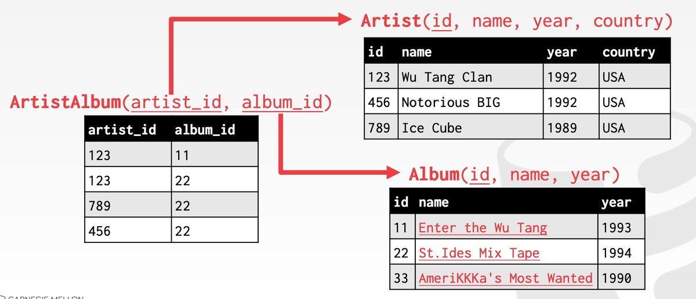
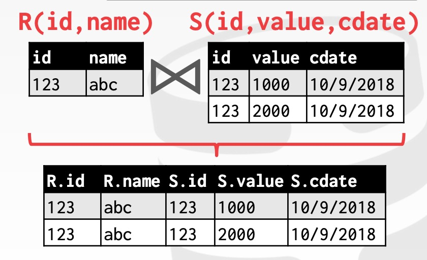

https://zhenghe.gitbook.io/open-courses/cmu-15-445-645-database-systems/relational-data-model
https://www.jianshu.com/nb/36265841

## Relational Data Model

需要升级 CSV 数据库，于是就有了专业的数据库系统（DBMS）。

- 分离逻辑层和物理层
  在早期，各个项目各自造轮子，因为每个轮子都是为应用量身打造，这些系统的逻辑层（logical）和物理层（physical）普遍耦合度很高。

  Ted Codd 发现这个问题后，提出 DBMS 的抽象（Abstraction）：

  - 用简单的、统一的数据结构存储数据
  - 通过高级语言操作数据
  - 逻辑层和物理层分离，系统开发者只关心逻辑层，而 DBMS 开发者才关心物理层。

- 数据模型
  在逻辑层中，我们通常需要对所需存储的数据进行建模。

  Relational => 大部分 DBMS 属于关系型，也是本课讨论的重点
  Key/Value
  Graph
  Document
  Column-family
  Array/Matrix

- Relational Model
  **每个 Relation 都是一个无序集合（unordered set），集合中的元素称为 tuple**，每个 tuple 由一组属性构成，这些属性在逻辑上通常有内在联系。
  primary key 在一个 Relation 中唯一确定一个 tuple。
  foreign key 唯一确定另一个 relation 中的一个 tuple。

## Advanced SQL

在 Relational Model 下构建查询语句的方式分为两种：Procedural 和 Non-Procedural。第一节课中已经介绍了 Relational Algebra，它属于 Procedural 类型，而本节将介绍的 SQL 属于 Non-Procedural 类型。使用 SQL 构建查询时，用户只需要指定它们想要的数据，而不需要关心数据获取的方式，DBMS 负责理解用户的查询语义，选择最优的方式构建查询计划。

## Database Storage

传统的 DBMS 架构都属于 disk-oriented architecture，即假设数据主要存储在非易失的磁盘（non-volatile disk）上。于是 DBMS 中一般都有磁盘管理模块（disk manager），它主要负责数据在非易失与易失（volatile）的存储器之间的移动。
`磁盘管理模块的存在就是为了同时获得易失性存储器的性能和非易失性存储器的容量，让 DBMS 的数据看起来像在内存中一样。`

DBMS 比 OS 拥有更多、更充分的知识来决定数据移动的时机和数量，具体包括：

- 将 dirty pages 按正确地顺序写到磁盘
- 根据具体情况预获取数据
- 定制化缓存置换（buffer replacement）策略

因此不使用 OS 自带的磁盘管理模块

---

DBMS 的磁盘管理模块主要解决两个问题：

1. （本节）如何使用`磁盘文件来表示数据库的数据`（元数据、索引、数据表等）
2. 如何管理数据在内存与磁盘之间的移动

---

- File Storage
  虽然 DBMS 自己造了磁盘管理模块，但 DBMS 一般不会自己造文件系统.
  DIY 文件系统将使得 DBMS 的可移植性大大下降，获得的性能提升在 10% - 15% 之间，不划算。
  DBMS 通常将自己的所有数据作为一个或多个文件存储在磁盘中，而 OS 只当它们是普通文件，并不知道如何解读这些文件。

  - Database Pages

- Page Layout
  每个 page 被分为两个部分：header 和 `data`
- Data Layout

  - Tuple-oriented：记录数据本身
    slotted pages：header 中的 slot array 记录每个 slot 的信息，如大小、位移等
  - Log-structured：记录数据的操作日志

- Tuple Layout
  tuple-oriented 的 layout 中，DMBS 如何存储 tuple 本身呢
  `header+data`

- Tuple Storage
- Data Storage Models
  Relational Data Model 将数据的 attributes 组合成 tuple，将结构相似的 tuple 组合成 relation，但它并没有指定这些 relation 中的 tuple，以及 tuple 的 attributes 的存储方式。一个 tuple 的所有 attributes 并不需要都存储在同一个 page 中，它们的实际存储方式可以根据数据库应用场景优化，如 OLTP 和 OLAP。

## Buffer Pools

如何管理数据在内存与磁盘之间的移动
空间控制（Spatial Control）和时间控制（Temporal Control）

- Buffer Pool Manager
  DBMS 启动时会从 OS 申请一片内存区域，即 Buffer Pool，并将这块区域划分成大小相同的 pages，为了与 disk pages 区别，通常称为 frames，当 DBMS 请求一个 disk page 时，它首先需要被复制到 Buffer Pool 的一个 frame 中

  为了减少并发控制的开销以及利用数据的 locality，DBMS 可能在不同维度上维护多个 Buffer Pools。

- Buffer Replacement Policies

## Hash Tables

为了支持 DBMS 更高效地从 pages 中读取数据，DBMS 的设计者需要灵活运用一些数据结构及算法，其中对于 DBMS 最重要的两个是：

Hash Tables
Trees

在做相关的设计决定时，通常需要考虑两个因素：

Data Organization：如何将这些数据结构合理地放入 memory/pages 中，以及为了支持更高效的访问，应当存储哪些信息
Concurrency：如何支持数据的并发访问

## Tree Indexes

## Index Concurrency Control

通常我们会从两个层面上来理解并发控制的正确性：

Logical Correctness：（17 节）我是否能看到我应该要看到的数据？
Physical Correctness：（本节）数据的内部表示是否安好？

- Latch Crabbing/Coupling
- Better Latching Algorithm
  可以采用类似乐观锁的思想，假设 leaf node 是安全（更新操作仅会引起 leaf node 的变化）的，在查询路径上一路获取、释放 read latch，到达 leaf node 时，若操作不会引起 split/merge 发生，则只需要在 leaf node 上获取 write latch 然后更新数据，释放 write latch 即可；若操作会引起 split/merge 发生，则重新执行一遍，此时在查询路径上一路获取、释放 write latch，即 Latch Crabbing 原始方案。

  - Search：与 Latch Crabbing 相同

  - Insert/Delete:

    使用与 Search 相同的方式在查询路径上获取、释放 latch，在 leaf node 上获取 write latch

    如果 leaf node 不安全，可能会引起其它节点的变动，则使用 Latch Crabbing 的策略再执行一遍

- Horizontal Scan
  当遇到横向扫描无法获取下一个节点的 latch 时，`该线程将释放 latch 后自杀`。这种策略逻辑简单，尽管有理论上的优化空间，但在实践中是常见的避免死锁的方式。
- Delayed Parent Updates
  每当 leaf node 溢出时，我们都需要更新至少 3 个节点：

  即将被拆分的 leaf node
  新的 leaf node
  parent node

  修改的成本较高，因此 B-link Tree 提出了一种优化策略：每当 leaf node 溢出时，只是标记一下而暂时不更新 parent node，等下一次有别的线程获取 parnet node 的 write latch 时，一并修改

## Query Processing

- Processing Model
  processing model 定义了系统如何执行一个 query plan，目前主要有三种模型
- Access Methods
  指的是 DBMS 从数据表中获取数据的方式
- Expression Evaluation

## Sorting&Aggregations

- General External Merge Sort

## Join Algorithms

在关系型数据库中，我们常常通过规范化 (Normalization) 设计避免信息冗余；因此查询时，就需要通过 Join 将不同 table 中的数据合并来重建数据。
以课程伊始时的 table 为例，通过将 Artist 与 Album 之间的多对多关系拆成 Artist, ArtistAlbum 以及 Album 三个 tables 来规范化数据，使得数据存储的冗余减少：

查询时我们就需要通过 Join 来重建 Artist 与 Album 的完整关系数据。

- Join Operator Output
  逻辑上 Join 的操作的结果是：
  对任意一个 tuple r∈R 和任意一个在 Join Attributes 上对应的 tuple s∈S ，将 r 和 s 串联成一个新的 tuple.

  Join 操作的结果 tuple 中除了 Join Attributes 之外的信息与多个因素相关

  我们可以在 Join 的时候将所有非 Join Attributes 都放入新的 tuple 中，这样 Join 之后的操作都不需要从 tables 中重新获取数据
  
  也可以在 Join 的时候`只复制 Join Attributes 以及 record id`，后续操作自行根据 record id 去 tables 中获取相关数据。对于列存储数据库，这是比较理想的处理方式，被称为 `Late Materialization。`

- I/O Cost Analysis
  **衡量 Join Algorithm 好坏的标准，就是 I/O 的数量**

  - Nested Loop Join
    Simple
    Block
    Index

  总是选择小表作为 Outer Table
  尽量多地将 Outer Table 缓存在内存中
  扫描 Inner Table 时，尽量使用索引

  - Sort-Merge Join
  - Hash Join
    Hash Join 在绝大多数场景下是最优选择，但当查询包含 ORDER BY 或者数据极其不均匀的情况下，Sort-Merge Join 会是更好的选择，DBMSs 在执行查询时，可能使用其中的一种到两种方法

## Query Optimization
