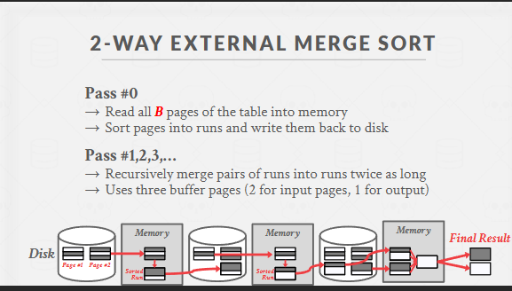
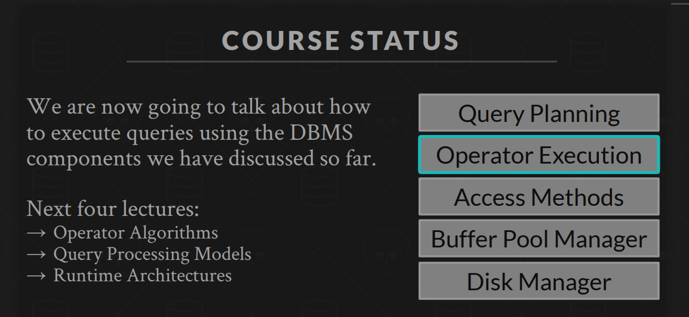
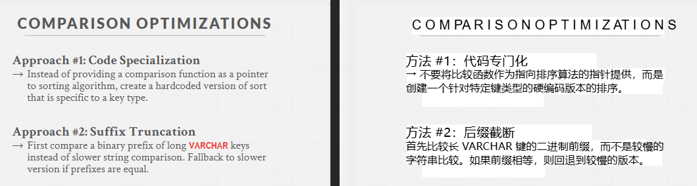

## 1. 为什么要专门讲“排序”和“聚合”？

- **排序 (ORDER BY)** 常出现在 SQL 查询中，尤其在 OLAP（分析型）场景，需要对海量数据进行排序，传统的内存排序 (QuickSort) 无法直接处理超大数据集——因为“装不下内存”。数据库往往需要“外部排序”算法（external sort）来分块读写、分阶段归并。
- **聚合 (AGGREGATION)** 指我们常见的 `GROUP BY`、`COUNT(*)`、`SUM(...)`、`AVG(...)`、`MIN / MAX(...)` 等操作；有些场景也会用 `DISTINCT` 去重。这些操作在分析型查询和统计报表中非常常见。数据库必须提供高效的聚合算法来应对大数据。

简单理解：

> **没学“外部排序”，无法处理超出内存的大规模ORDER BY；  
> 没学聚合算法，就不知道数据库怎么做GROUP BY 才又快又省资源。**

---

## 2. 排序算法：外部归并排序 (External Merge Sort)

### 2.1 核心思想

当数据量大到无法一次性放进内存时，就需要“分段分块”进行**外部排序**。最常见方法就是**外部归并排序**（External Merge Sort）。它通常分两大阶段：

1. **生成初始有序runs (Run Generation)**
   - 将数据分成若干可装进内存的块（Run），在内存里用正常的内部排序（如快速排序）排好后写到临时文件，形成多个“小有序块”。
2. **多路归并 (Multi-way Merge)**
   

   - 将若干个“小有序块”同时读到内存，像归并排序的最后阶段那样，把最小值依次输出到新的文件。这样就得到一个更大的有序块。
   - 重复此过程，直到所有初始 runs 归并成一个大有序结果文件。

   当我们要对最终结果做 **ORDER BY** 时，数据库就会调用这个外部归并排序。如果磁盘上的数据量非常大，就会进行**多轮**归并。

### 2.2 记忆要点

- **分块 → 内存排序 → 写回磁盘 → 归并**
- 如果一次归并把所有块都“多路归并”完成，就只需要**一轮**；否则就多次归并，每次产生更少、但更大的有序块。
- **时间复杂度**大致是 \( O(N \log N) \)，但此处 “\(\log N\)” 是指分块和多轮归并时的多路数计算；I/O角度也要考虑对每条数据的读写次数。

### 2.3 拓展：优化技巧

- **Replacement Selection**：可以“动态”地从一个内存堆产生比较长的 runs，减少 run 的个数。
- **多路归并**：如果内存够，可以一次性并行归并更多块（k 路归并），减少归并轮数。

---

## 3. 聚合算法

在关系型数据库中，**聚合**指把按某些字段分好组，然后做 `COUNT / SUM / MAX / MIN / AVG`等操作，并且可能有 `DISTINCT`、`HAVING` 等修饰。  
最常见的实现方式有两种：

1. **排序聚合**（Sort-based Aggregation）
2. **哈希聚合**（Hash-based Aggregation）

---

### 3.1 排序聚合（Sort-based Aggregation）

**思路**：先对所有输入数据按“分组键”进行排序，排完后同一组的所有行就连续排列了。然后**一遍线性扫描**就能把相同组的行累加到一起。

举个例子，想 `GROUP BY department_id` 做一个 SUM(salary)：

1. 把所有记录按 department_id 排序；
2. 遍历排序后的结果时，一旦 department_id 改变，就说明上一组结束，下一组开始，所以可以输出上一组聚合结果并清零重新统计。

**优点**：

- 逻辑清晰，且如果**本来就要 ORDER BY** 这列，那么排序阶段“一举两得”。
- 适合**无索引**且数据量不大，或者外部排序也能搞定时比较简单。

**缺点**：

- 需要先排序，如果数据量巨大，就跟外部排序同样的代价。
- 只适合**分组键数量相对少**的情况，如果 group by 的列很多、或者数据分布非常离散，也没有特别的好处。

---

### 3.2 哈希聚合（Hash-based Aggregation）

**思路**：

1. 初始化一个哈希表，key 是分组键，value 是聚合累加器（如计数、求和等）。
2. 逐条读输入：
   - 计算当前行的分组键key 的哈希值；
   - 在哈希表中找对应分组的聚合器，把当前值更新进去（例如 salary 累加）。
3. 最后哈希表里的每个 `key -> 聚合值` 就是一组聚合结果。

**优点**：

- 平均情况下是 **\(O(N)\)** 的线性处理，不需要排序；
- 对大数据做 GROUP BY 速度往往更快。

**缺点**：

- 只能处理**等值分组**（对 “分组键” 做哈希）。
- 需要一定内存来存哈希表。当数据太大时，得做**分区**（类似 hash join 的外部哈希思路）把大数据分拆进多个较小的哈希表。

---

## 4. 哪个更好？排序聚合 vs. 哈希聚合

就像**Sort-Merge Join vs. Hash Join**的逻辑，**哈希聚合**在大多数 `GROUP BY` 场景下通常更快，平均线性；而**排序聚合**需要花精力排序。但如果你**已经需要把数据排序**或者**分组键不是等值**（例如要按区间分组），那就可能用排序方式更合适。

最简单的比较表：

| 算法         | 时间复杂度          | 需要排序？ | 是否能处理等值以外分组？ | 典型场景                             |
| ------------ | ------------------- | ---------- | ------------------------ | ------------------------------------ |
| **排序聚合** | ~ \(O(N \log N)\)   | 是         | 可以做各种排序分组       | 数据量中等，需要结果排序或非等值分组 |
| **哈希聚合** | ~ \(O(N)\) 平均情况 | 否         | 只能等值（哈希key）      | 大规模 GROUP BY，等值分组，内存够    |

---

## 5. 整体回顾：排序与聚合算法

1. **外部归并排序** (External Merge Sort)：

   - 处理海量数据的常用方法；
   - 分块排序 + 多路归并；
   - I/O层面要注重减少磁盘读写次数。

2. **聚合算法**：
   - **排序聚合**：先排序分组，再线性聚合；
   - **哈希聚合**：用哈希表分组，边读边累加，往往性能更高；
   - 对超大数据，要考虑外部哈希聚合（分区）。

### 5.1 在数据库中的使用场景

- 当执行 `ORDER BY col`，如果数据量大，会用外部归并排序；
- 当执行 `GROUP BY key`，通常使用**哈希聚合**实现；若需要结果有序、或聚合列是某种范围分组，也会用**排序聚合**；
- 数据库“执行器”在具体实现时，会按照计划节点(`SortPlanNode`, `AggregationPlanNode`)来调对应的算法做外部排序或哈希聚合。

### 5.2 一句话记忆

> **“外部排序，把大文件分块排再归并；  
> 聚合要快，用哈希表边走边算；  
> 如果还想要有序输出或分组不等值，就用排序聚合。”**

---

## 6. 总结

- **学习外部排序**是为了**处理内存放不下的大数据**做 ORDER BY 或其他需要排序的操作；它的关键是**分块** + **归并**。
- **聚合算法**有**排序聚合**与**哈希聚合**两大类，它们和“排序连接 vs 哈希连接”思路非常相似。**哈希**通常在等值分组或连接中“快而好用”；**排序**就更灵活，兼容范围分组或顺便带有序输出。
- 当数据量极大时，这些算法都要配合**外部方法**（external sort、external hash）来克服内存限制。

> **学会这些，就能理解数据库面对海量数据时是如何优雅地排序以及进行 GROUP BY 聚合了！**

---

- DISK-ORIENTED DBMS
  数据无法全部保存在内存中。
  We will use the `buffer pool` to implement algorithms that need to spill to disk.
  We are also going to prefer algorithms that maximize the amount of `sequential I/O`.

- Double Buffering Optimization（双缓冲优化）
  **Double Buffering Optimization（双缓冲优化）**是一种在数据库或系统执行阶段常用的I/O 优化技术。它的核心思路是：在处理当前数据的同时，**提前在后台预取(prefetch)下一批数据**并存放到另一个缓冲区，从而减少CPU空等磁盘I/O的时间。

  简言之：

  1. **双缓冲**：系统至少准备两个缓冲区（Buffer 1、Buffer 2）。
  2. **并行执行**：当CPU正在对 Buffer 1 中的数据做计算时，磁盘可以同时把下一批数据读进 Buffer 2；下一步处理时就可以直接使用已经读好的数据。
  3. **好处**：CPU 不必频繁停下来等 I/O 完成，能连续“拿到”数据；磁盘读取也能与CPU计算尽量并行进行，**大幅提升吞吐**、减少等待。

  这种方法广泛用于外部排序（如归并排序的多路归并阶段）或其他需要分块处理的大数据操作。当一段数据正在被处理，下一段数据就在后台读入第二个缓冲，这样每轮切换时几乎无需额外等待磁盘I/O，提高整体执行效率。

- 排序优化
  

  - 不用函数，而是硬编码
  - 后缀截断

- 聚集
  - 排序
  - 哈希
