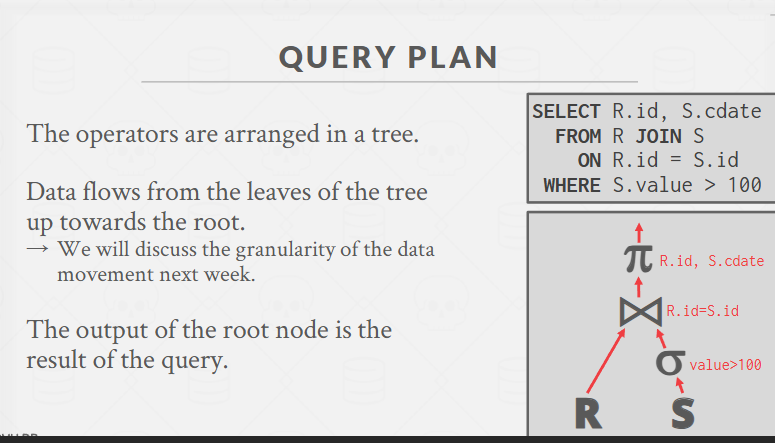
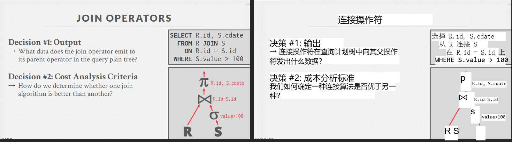
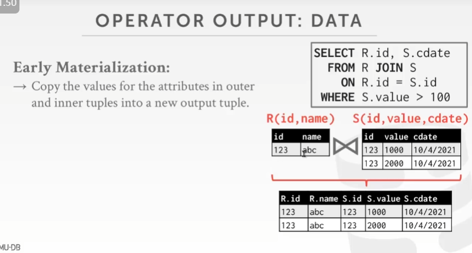
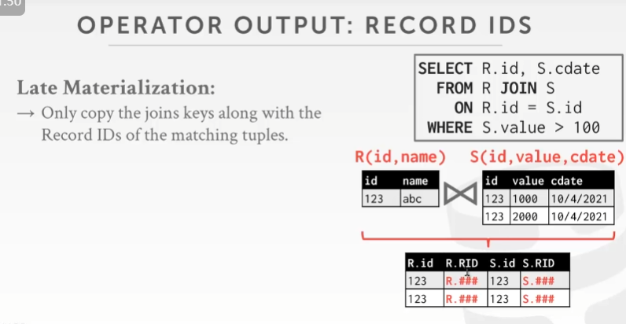
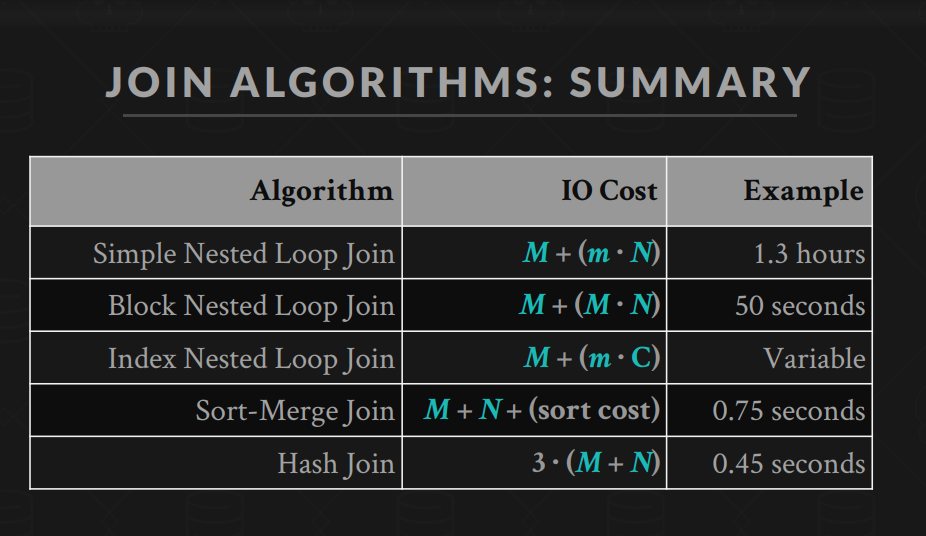

# 三大经典连接算法——嵌套循环、排序-合并和哈希连接

## 1. 为什么要学这些连表算法？

在 SQL 查询中，`JOIN` 操作经常是**最消耗时间**的部分。两个表（可能几十万、上千万行）要“配对”在一起，以满足某个条件，这个过程如果盲目地“每条对比每条”，效率会变得十分低下。为了解决这个问题，数据库系统会实现多种“连表”算法，针对不同情况选择最合适的方法，快速完成 `JOIN`。

简单记口诀：

> **“没有索引先排序，等值连接用哈希，深度优化拿索引。”**

---

## 2. 第一种：嵌套循环连接（Nested Loop Join, NLJ）

**核心思路**：

- 外层表（outer table）逐行“拿过来”一条；
- 内层表（inner table）逐行“对比一遍”；
- 满足条件就输出结果，不满足就跳过。

### 2.1 基本版

就像两重循环，时间复杂度：\( O(M \times N) \)（如果外表 M 条、内表 N 条）。很容易记住：**每个外表行都要和内表所有行“挨个比对”**。

### 2.2 优化版（索引嵌套循环，Index NLJ）

如果**内表有索引**，那不用整表扫描了。拿到外表的一条记录，只需要利用索引在内表里快速定位匹配值（平均 \( O(\log N) \) 或更好）。这样就像**查词典**一样，而不是读完词典整本才能找到答案。

- 当外表行很少，或有较强的过滤（导致外表输出很少元组），Index NLJ 可以非常快。
- 记住：在**有索引**时，Index NLJ 常常是**最优选择**。

---

## 3. 第二种：排序-合并连接（Sort-Merge Join, SMJ）

**核心思路**：

1. 对两个表先按“连接键”进行排序；
2. 然后就像归并排序的最后一步，维护两个指针依次比较大小，相等则输出，不等就移动较小的那一方。

### 3.1 特点

- 要先花力气**排序**（耗时大约 \( O(M \log M + N \log N) \) ）。
- **归并**那一步只需要线性地把俩已排好序的序列“扫一遍”，所以这个部分是 \( O(M + N) \)。
- 如果后续还要对结果进行排序，你已经把数据都排好序了，一举两得。

### 3.2 怎么记？

记它**最重要的优点**：

> “**排序之后合并**，一次搞定连接 + 有序输出”，对等值连接和范围连接都能用。  
> 如果输入太大，没有索引，又要结果排序，SMJ 就是好工具。

---

## 4. 第三种：哈希连接（Hash Join）

**核心思路**：

1. “构建”阶段：先拿一个表（最好是那个“小”表）建哈希表，<键 → 行>；
2. “探测”阶段：再扫另一表，每次用行的连接键来查这个哈希表，找到匹配行就组合输出。
3. 布隆过滤器优化不存在的情况。

### 4.1 平均复杂度

接近 \( O(M + N) \) ——算是最优了。但！注意是“平均”情况，需要**哈希函数好**，避免冲突过多。且“只能等值”，对 `<`, `<=` 这种范围连接用不了。

### 4.2 内存不够？

可以做 “**分区哈希**”（Grace Hash Join），把数据先切成多个小块，每块分别哈希连接。这样就能分多次在有限内存中操作。
**先将两个表按相同哈希函数分割为若干分区，使同一哈希值的行只会存在于对应的那对分区之中，从而在内存里分批完成匹配(Nested Loop Join)。**
Grace：分区+写临时文件+分批哈希；
Hybrid：部分在分区时直接“内存建表”并连接，减少 I/O。

### 4.3 一句记忆

> “等值连接就用哈希，速度快到飞起；但是不能处理非等号，也可能受内存限制。”

---

## 5. 三种算法的对比

一个**表格**帮你理清：

| 算法名称           | 主要优点                      | 主要缺点                         | 最佳应用场景                             |
| ------------------ | ----------------------------- | -------------------------------- | ---------------------------------------- |
| NLJ（含Index NLJ） | 实现简单；有索引时非常高效    | 没索引就变成 \( O(M \times N) \) | 当内表有索引；或表很小；或连接条件很复杂 |
| Sort-Merge Join    | 支持等值 & 范围连接；输出有序 | 排序成本高、退化                 | 没有合适索引、要排序结果、大规模数据     |
| Hash Join          | 等值连接平均线性；通常最快    | 只能等值；内存不足时要分区哈希   | 大型等值连接，不需要顺序输出             |

**快速记忆**：

1. **NLJ** = “暴力遍历” + “如果内表有索引就飞快”。
2. **Sort-Merge** = “排序后像合并排序那样配对” + “顺便有序”。
3. **Hash Join** = “建哈希表 + 查哈希表” + “只能等值，但速度狂飙”。

---

https://15445.courses.cs.cmu.edu/fall2022/slides/11-joins.pdf

- 小表(outer table)放外循环
  In general, we want the smaller table to always be the `left table ("outer table")` in the query plan.

- Query Plan(查询计划)

  

- Join Operator(连接算子)
  
- Materialization(物化)

  物化（Materialization）指的是在查询优化或数据处理过程中，**将计算或查询的中间结果显式地保存下来**，而不是采用完全的“惰性计算”（lazy evaluation）。

  - 这样做的好处是中间结果可以被后续的操作直接重用，避免重复的计算，尤其在处理比较复杂的查询或多次访问相同数据时，可以节省计算资源。
  - 物化的副作用可能增加存储、I/O开销，特别是当中间数据量很大时，需要权衡内存和性能之间的平衡。
  - Early Materialization（提前物化）是在数据处理流程中尽早将某个中间结果计算并存储的策略。后续算子无需回表查询。
    
  - Late Materialization（延迟物化）则是将中间结果的计算推迟到真正需要使用时才进行。
    
    Only copy the joins keys along with the Record IDs of the matching tuples.

- Join Algo
  

  - Stupid Nested Loop Join
    **设一次IO为0.1ms，需要1.3小时**
  - Block Nested Loop Join
  - Index Nested Loop Join

  Key Takeaways
  → Pick the smaller table as the outer table(小表放外循环).
  → Buffer as much of the outer table in memory as possible(尽量把外表放在内存中).
  → Loop over the inner table (or use an index)(循环内表或使用索引).

  - Sort-Merge Join
  - Hash Join
    - Grace Hash Join
    - Hybrid Hash Join
