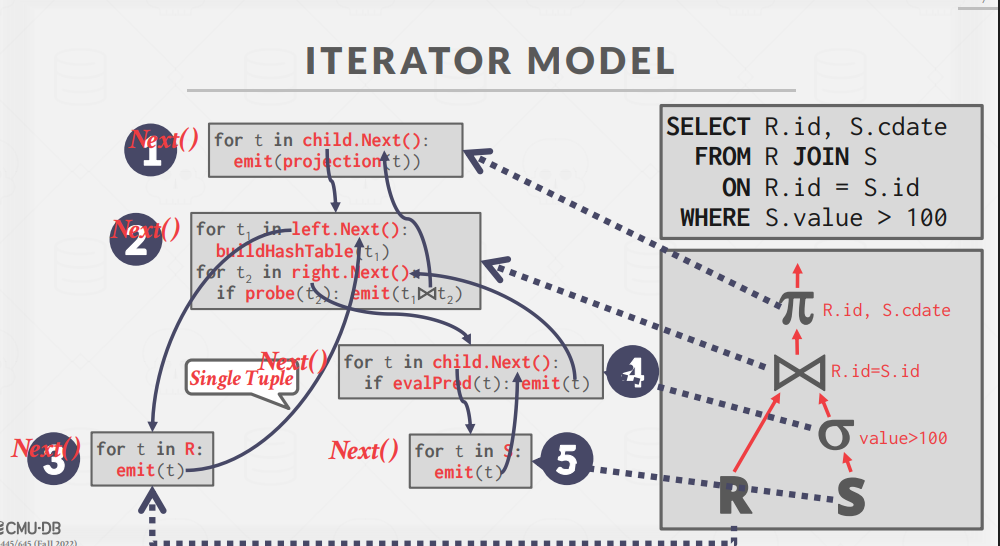
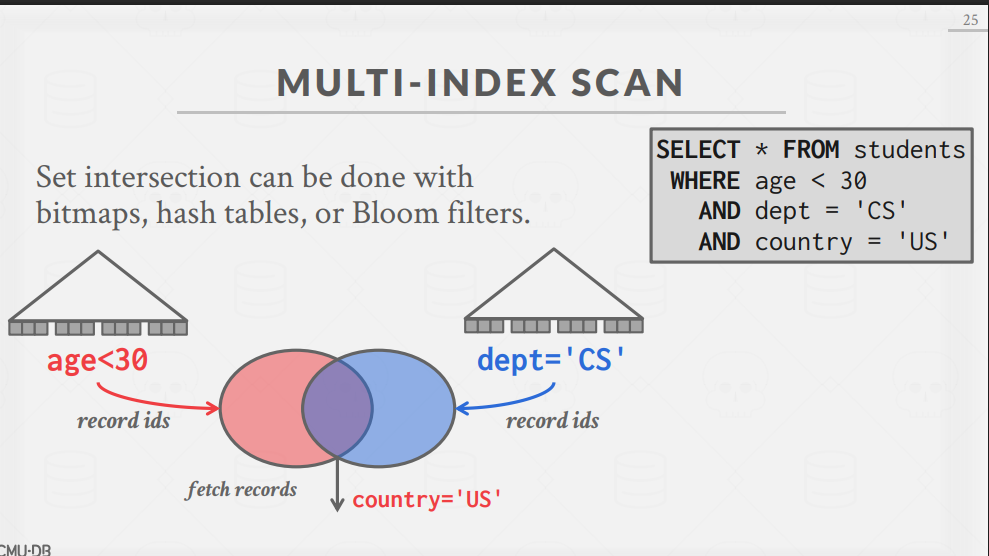
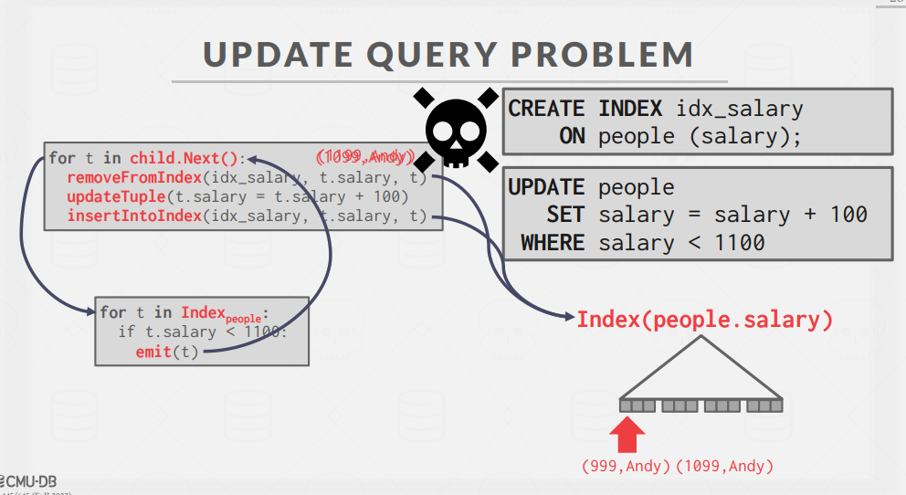
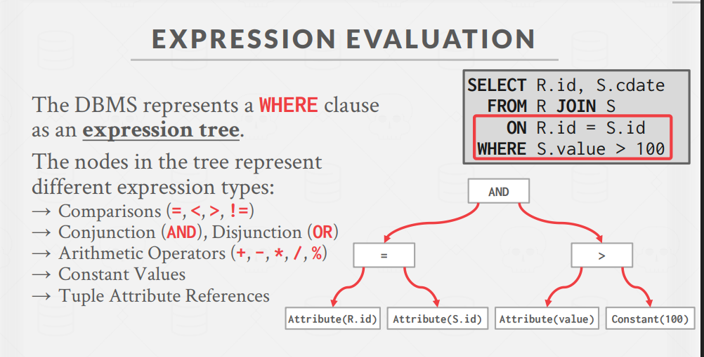

# Query Execution 1(查询执行1)

## 一、查询处理模型

查询处理模型定义了DBMS如何执行查询计划，主要有三种模型：

### 1. 迭代器模型 (Iterator Model)

eg: MySQL、SQLite、MongoDB、PostgreSQL

- 也称为**火山模型**或**管道模型**
- 每个操作符实现`Next()`函数，每次调用返回**单个元组**或结束标记
- 工作原理：
  - 上层操作符调用下层操作符的`Next()`获取数据
  - 操作符在内部循环中处理子操作符的元组
  - 形成自顶向下的调用链
- 优势：
  - 支持元组流水线处理，减少中间结果存储
  - 适用于各种查询类型
  - 几乎所有DBMS的标准实现
- 限制：
  - `部分操作符(如JOIN、ORDER BY)必须阻塞直到子操作符输出所有元组`

### 2. 物化模型 (Materialization Model)

eg: Monet DB

- 每个操作符**一次性**处理所有输入并输出所有结果
- "物化"完整的中间结果集
- 优势：
  - 适合OLTP工作负载（处理少量元组的简单查询）
  - 减少函数调用和协调开销
- 缺点：
  - 不适合有大量中间结果的OLAP查询

### 3. 向量化/批处理模型 (Vectorization Model)

eg: ClickHouse

- 结合迭代器与物化模型的优点
- 操作符一次处理和返回**一批元组**(而非单个)
- 优势：
  - 大幅减少操作符调用次数
  - `便于使用CPU的SIMD指令进行向量化处理`
  - 非常适合OLAP查询

## 二、数据访问方法

数据访问方法决定DBMS如何从表中获取数据：

### 1. 顺序扫描 (Sequential Scan)

- 最基本的访问方法，扫描表中所有页面
- 流程：
  - 从缓冲池检索每个页面
  - 迭代页面中每个元组并应用过滤条件
  - 内部维护游标跟踪上次检查的位置
- 优化技术：
  - 预取：在计划之前，提前将页面加载到缓冲池
  - 缓冲池绕过：避免缓存中间结果
  - 并行化：多线程并行扫描
  - 区域映射(ZoneMap)：预先计算页面级聚合以跳过不必要的页面
  - 延迟物化 ：只上报offset而不是行数据

### 2. 索引扫描 (Index Scan)

- 利用索引快速定位满足条件的元组

- 索引选择依据：**区分度高的优先执行**
  - 索引包含的属性与查询引用的属性匹配程度
  - 属性的值域范围
  - 谓词类型（等值、范围等）
  - 索引是否为唯一索引

### 3. 多索引扫描 (Multi-Index Scan)

- 同时使用多个索引处理复杂查询条件
- 执行流程：
  - 使用每个匹配索引计算符合条件的记录ID集合
  - 基于查询条件组合这些集合(交集或并集)
  - 检索实际记录并应用任何剩余条件
- 实现方式：通过位图、哈希表或布隆过滤器高效执行集合操作

## 三、修改处理

处理修改数据库的DML操作(INSERT、UPDATE、DELETE)：

### 1. 基本流程

- 修改操作负责更新目标表和所有相关索引
- 约束检查可以立即执行或推迟到事务结束
- 输出可以是记录ID或完整元组数据(RETURNING子句)

### 2. 万圣节问题 (Halloween Problem)

- 问题：更新操作改变元组物理位置，导致扫描操作符多次访问同一元组
- 首次发现：1976年万圣节，IBM System R研究人员
- 解决方案：`跟踪每个查询中已修改的记录ID`

## 四、表达式计算

表达式评估是查询执行的核心组件：

### 1. 表达式树

- DBMS`将WHERE子句表示为表达式树`
- 节点类型：比较运算符、逻辑运算符、算术运算符、常量、属性引用

### 2. 评估方法

- 传统方法：递归遍历表达式树并解释每个节点
  - 灵活但性能较低
- 优化方法：直接编译表达式为机器代码(JIT编译)
  - 显著提高性能，但增加复杂性

## 总结

- 不同处理模型适合不同工作负载：
  - OLTP → 物化模型
  - OLAP → 向量化模型
  - 混合 → 迭代器模型
- **索引扫描**通常比顺序扫描更高效
- 表达式编译可显著提升性能
- 处理修改查询需要特别注意数据一致性问题

---

# JIT与AOT编译解释

## JIT (Just-In-Time) 编译

**即时编译**是在程序**运行过程中**将代码编译成机器码的技术。

### 工作原理

- 首先以中间代码形式分发程序
- 在执行时，`将频繁使用的代码片段("热点代码")编译成机器码`
- 可以根据实际运行情况进行优化

### 生活比喻

就像餐厅厨师在收到订单后才开始烹饪，根据客人的具体需求和口味调整菜品。

### 实际例子

1. **Java虚拟机**：先解释执行字节码，频繁执行的方法被JIT编译优化
2. **JavaScript引擎**：V8(Chrome)和SpiderMonkey(Firefox)对热点JS代码进行JIT编译
3. **数据库查询**：PostgreSQL/MySQL可将SQL查询即时编译成机器码
4. **Python的PyPy**：对热点Python代码进行JIT编译加速

## AOT (Ahead-Of-Time) 编译

**预先编译**是在程序**执行之前**就将全部代码编译成机器码的技术。

### 工作原理

- 在开发环境或打包阶段完成所有编译工作
- 生成针对特定平台的优化机器码
- 执行时直接运行编译好的代码，无需额外转换

### 生活比喻

像餐厅提前准备好所有可能需要的食材和半成品，客人点餐后可以快速上菜。

### 实际例子

1. **C/C++程序**：使用GCC/Clang提前编译成可执行文件
2. **Go语言应用**：直接编译成无依赖的二进制文件
3. **Flutter的Release模式**：将Dart代码预编译成原生代码
4. **Rust应用**：编译成高效的机器码，无需运行时

## 对比与选择

| 特性         | JIT编译            | AOT编译        |
| ------------ | ------------------ | -------------- |
| 启动速度     | 较慢(需编译)       | 快速(已编译)   |
| 长期执行效率 | 高(可动态优化)     | 固定(静态优化) |
| 内存占用     | 较高(需编译器)     | 较低           |
| 跨平台能力   | 强(中间代码可移植) | 弱(平台专用)   |
| 部署文件大小 | 小(中间代码)       | 大(机器码)     |

许多现代系统采用混合方式：

- **Android**：结合安装时AOT和运行时JIT优化
- **.NET**：支持JIT模式和AOT发布选项
- **WebAssembly**：浏览器中JIT执行，但支持AOT编译
