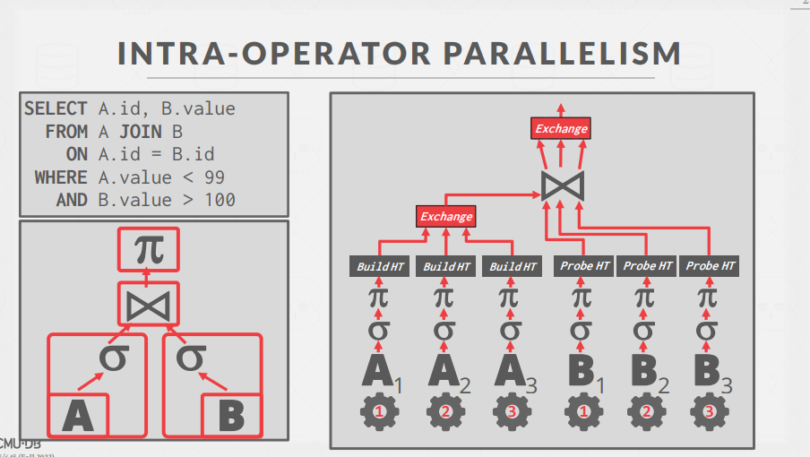
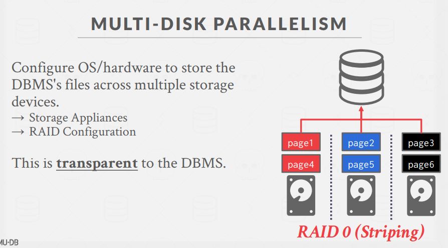
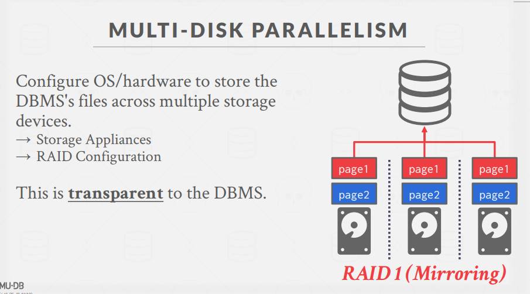

# Query Execution 2(查询执行2)

数据库并行查询执行

## 一、并行执行的基础与动机

### 为什么需要并行执行？

- **提高性能**：利用相同硬件资源获得更好性能
  - 更高的吞吐量（Throughput）
  - 更低的延迟（Latency）
- **提升系统响应性**：多用户环境下更快响应
- **降低总体拥有成本（TCO）**：更少的机器意味着更少的部件、更小的物理占用和更低的能源消耗

### 并行系统 vs. 分布式系统

两者都将数据库分散到多个`资源`上，但在物理组织上有所不同：

**并行DBMS**：

- 资源物理上相互靠近
- 通过高速互连通信
- 通信被假定为廉价且可靠

**分布式DBMS**：

- 资源可能相距较远
- 通过较慢的互连通信
- 通信成本和问题不可忽视

## 二、DBMS进程模型(Process Model)

进程模型定义了`DBMS如何架构以支持多用户应用的并发请求`。

### 1. 每个worker一个进程 (Process per Worker)

- 每个worker是独立的OS进程
- 依赖OS调度器
- 使用共享内存(shared-memory)存储全局数据结构
- 单进程崩溃不会导致整个系统崩溃
- 例如：IBM DB2、**PostgreSQL**、Oracle

### 2. 每个worker一个线程 (Thread per Worker)

- 单一进程包含多个worker线程
- DBMS主要自行管理调度
- 可能使用或不使用调度器线程
- 线程崩溃可能导致整个系统崩溃
- 几乎所有过去20年创建的DBMS都采用此模型
- 例如：Microsoft SQL Server、**MySQL**、Oracle(2014+)

### 3. 嵌入式DBMS (Embedded DBMS)

- DBMS在应用程序相同地址空间内运行
- 应用程序负责线程和调度
- 例如：SQLite、BerkeleyDB、**RocksDB**、**LevelDB**

### 调度策略

- DBMS比OS更了解查询的特性和资源需求
- 为每个查询计划，DBMS决定：
  - 使用多少任务和CPU核心
  - 在哪个CPU核心上执行任务
  - 任务输出存储在哪里

例如，SQL Server的SQLOS是用户级OS层，管理硬件资源，处理非抢占式线程调度。

## 三、查询执行的并行化类型(Execution Parallelism)

### 查询间并行 vs. 查询内并行

- **查询间并行(Inter-Query)**：同时执行多个不同查询

  - 提高系统吞吐量，减少延迟
  - 只读查询几乎不需要显式协调
  - `更新操作需要复杂协调机制(并发控制)`

- **查询内并行(Intra-Query)**：并行执行单个查询内的操作
  - 减少长时间运行查询的延迟（特别是OLAP查询）
  - `所有操作符都有并行版本`

### 查询内并行的三种方式

#### 1. 算子内并行(Intra-Operator/水平并行)

`Map Reduce`

- 将操作符分解为独立片段，在不同数据子集上执行相同功能
- 使用**交换操作符(Exchange Operator)**合并/分割结果
- 交换操作符类型：
  - **收集(Gather)**：将多个worker结果合并为单一输出流
  - **分发(Distribute)**：将单一输入流分割为多个输出流
  - **重分区(Repartition)**：在多个输入流和输出流间重新分配数据

#### 2. 算子间并行(Inter-Operator/垂直并行)

- 不同操作重叠执行，形成流水线，无需物化中间结果
- **worker同时执行查询计划不同段的操作符**
- 也称为流水线并行(Pipeline Parallelism)
- 在流式系统(continuous queries)中更常见

#### 3. 混合并行(Bushy Parallelism)

- 结合算子内和算子间并行
- worker同时执行查询计划不同段的多个操作符
- 需要交换操作符合并中间结果

## 四、I/O并行化(I/O Parallelism)

如果**磁盘始终是主要瓶颈**，仅增加进程/线程可能无法提高性能，甚至可能使性能变差。
因此需要I/O并行化：

### 多磁盘并行(Multi Disk Parallelism)

This is transparent to the DBMS.

- 配置OS/硬件在多个存储设备上存储DBMS文件
- 常见方式：
  RAID：独立磁盘冗余阵列

  - **RAID 0(条带化,striping)**：
    优点：数据分布在多个磁盘上，提高读写性能(**可以并行读写**)
    缺点：一个盘挂就全挂
    
  - **RAID 1(镜像)**：
    优点：数据复制到多个磁盘，提高可靠性
    坏处：空间浪费
    

  - **RAID 5(分布式奇偶校验)**：

    RAID 5 (Redundant Array of Independent Disks Level 5) 是一种兼顾性能与容错性的磁盘阵列技术，通过分布式奇偶校验实现数据冗余。

    - 最少需要**3个**磁盘
    - 利用**分布式奇偶校验**实现数据保护
    - 能够在**任意一个**磁盘故障时保持系统正常运行

    **第一个盘存a，第二个盘存b，第三个盘存a^b.**

### 数据库分区(Database Partitioning)

- 一些DBMS允许指定每个数据库的磁盘位置
- 缓冲池管理器将页映射到磁盘位置
- 如果DBMS将每个数据库存储在单独目录，在文件系统级别实现也很简单

### 表分区(Partitioning)

- 将单个逻辑表拆分为不连续的物理段，分别存储和管理
  `垂直分表：高频、短的数据可以存储在一个表中，低频、长的数据存储在另一个表中。`
  `水平分表：将表按行分割成多个表。`
- 分区对应用应该是透明的
- 分区可基于：
  - 范围(Range)
  - 哈希(Hash)

mycat: 分库分表中间件

## 总结

并行执行对现代DBMS至关重要，几乎所有主流DBMS都支持它。然而，正确实现并行执行面临诸多挑战：

- 协调开销(Coordination Overhead)
- 调度复杂性(Scheduling)
- 并发问题(Concurrency Issues)
- 资源争用(Resource Contention)

选择合适的并行策略需要考虑工作负载特性、硬件配置和系统架构等多种因素。

---

- Inter-Query 与 Intra-Query 并行对比

  ## Inter-Query 并行（查询间并行）

  指**同时执行多个不同查询**的能力。

  ### 特点

  - 多个独立查询同时运行，各自使用自己的执行线程
  - 类似于多人同时使用数据库的场景
  - 提高系统整体吞吐量

  ### 例子

  银行系统同时处理：

  - 用户A查看账户余额
  - 用户B转账
  - 用户C提取现金

  这三个查询同时执行，互不干扰。

  ## Intra-Query 并行（查询内并行）

  指**单个查询的多个部分并行执行**的能力。

  ### 特点

  - 一个复杂查询被拆分成多个部分并行处理
  - 需要将数据分割并在最后合并结果
  - 减少单个复杂查询的响应时间

  ### 例子

  分析查询：`SELECT SUM(sales) FROM transactions WHERE date > '2022-01-01' GROUP BY region`

  - 工作者1：处理北美地区数据
  - 工作者2：处理欧洲地区数据
  - 工作者3：处理亚洲地区数据
  - 最后合并所有地区结果

  ## 关键区别

  | 特性         | Inter-Query           | Intra-Query          |
  | ------------ | --------------------- | -------------------- |
  | 目标         | 提高总体吞吐量        | 减少单个查询延迟     |
  | 适用场景     | OLTP (小型、频繁查询) | OLAP (大型复杂查询)  |
  | 资源分配     | 每个查询分配有限资源  | 单个查询获得大量资源 |
  | 扩展受限因素 | CPU核心数/内存        | 单查询的依赖关系     |
  | 实现复杂度   | 相对简单              | 复杂(需特殊算子)     |

  现代DBMS通常同时支持这两种模式，根据工作负载特性和系统资源动态选择最佳并行策略。
