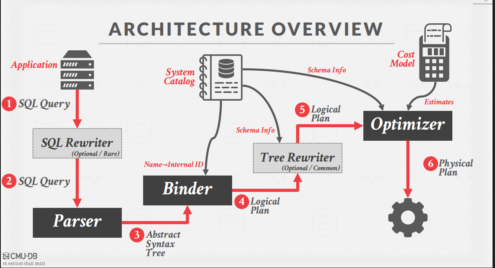

# 查询优化

最难 -> 优化器(Optimizer)
第二难 -> 事务

## 一、查询优化基础

### 查询优化的目标

查询优化是DBMS中最复杂的模块之一，目标是：

- 为给定查询找到**执行代价最低**的正确执行计划
- 已被证明是NP完全问题（计算复杂度非常高）
- 实际实现中没有优化器能够真正找到"最优"计划

  - 使用启发式(heuristics)方法限制搜索空间
  - 使用估计(estimation)技术猜测计划实际代价 (**cost-based**)

  > 还有一个人工智能优化器

### 逻辑计划与物理计划

- **逻辑计划**：表示查询的抽象操作，独立于执行细节(`声明式`)
- **物理计划**：定义具体执行策略，包含访问路径和算法细节(`命令式`)
  - 物理算子依赖于数据的物理格式（排序、压缩等）
  - 逻辑算子到物理算子不一定是1:1映射

### 查询优化架构



1. **解析器**：SQL转换为抽象语法树
2. **绑定器**：名称解析（表名、列名→内部ID）(Resolver)
3. **重写器**：基于规则优化
4. **优化器**：基于代价优化
5. **物理计划生成**：最终确定执行计划

## 二、基于规则/启发式的优化(Heuristics / Rules)

基于规则的优化通过**模式匹配(pattern matching)**将逻辑计划转换为等价的更高效计划，无需检查数据内容：

### 1. 逻辑查询优化技术

- **拆分连接谓词**：将复合谓词分解为最简单形式
  ```sql
  WHERE A.id=B.id AND B.val>10 AND C.name='xyz'
  ```
  拆分为独立谓词，便于优化器移动
- **谓词下推(Predicate Pushdown)**：将过滤条件尽可能推到查询树的底层
  - **越早过滤数据，中间结果越小**
  - 减少后续操作需处理的数据量
- **笛卡尔积变成join**：用内连接替换笛卡尔积
  - 从 `A × B WHERE A.id = B.id`
  - 变为 `A ⋈ B ON A.id = B.id`
- **投影下推**：在管道中断前消除冗余属性
  - 减少物化成本和内存使用

### 2. 嵌套子查询处理

处理嵌套子查询的两种方法：

- **重写方法**：去相关化或扁平化嵌套查询
  ```sql
  -- 从这个:
  SELECT name FROM sailors WHERE EXISTS (
    SELECT * FROM reserves WHERE sailors.sid = reserves.sid
  )
  -- 重写为:
  SELECT name FROM sailors, reserves
  WHERE sailors.sid = reserves.sid
  ```
- **分解方法**：将查询分解为块，专注于一次处理一个块
  - 子查询写入临时表，查询完成后丢弃

### 3. 表达式重写

优化器转换查询表达式，实现方式：

- 基于if/then/else子句
- 基于模式匹配规则引擎

常见重写规则：

- **不可能/不必要谓词**：`WHERE 1=0` → `false`
- **合并谓词**：`val BETWEEN 1 AND 100 OR val BETWEEN 50 AND 150` → `val BETWEEN 1 AND 150`

## 三、基于代价的搜索(Cost-based Search)

DBMS使用代价模型预测给定数据库状态下查询计划的行为：

### 代价模型组成


1. **物理代价**：预测CPU周期、I/O、缓存未命中等
2. **逻辑代价**：估算每个操作符输出大小
3. **算法代价**：操作符算法实现的复杂度

例如，PostgreSQL代价模型使用加权的CPU和I/O代价：

> magic number:你为什么用这个数?不知道,可能是魔法吧。

- **内存中处理元组比从磁盘读取快400倍**
- **顺序I/O比随机I/O快4倍**

### 统计信息与选择率(Statistics and Selection Cardinality)

数据库收集和维护表格、属性和索引的统计信息，用于估计查询代价：

- **选择率**是满足谓词的元组比例：
  - 等值谓词：`selectivity(A=constant) = 出现次数/表大小`
  - 范围谓词：基于分布估计
  - 否定：`1 - 原谓词选择率`
  - 合取(AND)：各谓词选择率相乘（假设独立）
  - 析取(OR)：`P1 + P2 - (P1 * P2)`（假设独立）

### 数据分布统计

为提高选择率估计准确性，DBMS使用：

1. **直方图**：维护列值的分布信息

   - 等宽直方图：每个桶宽度相同
     
   - 等深直方图：每个桶包含大致相同数量的值
     

2. **草图(Sketches)**：概率性数据结构，提供近似统计

   - Count-Min Sketch：近似频率计数
   - HyperLogLog：近似不同元素数量

3. **采样(Sampling)**：维护表格的小子集估计选择率

## 四、基于代价的优化

基于代价的优化枚举查询的多个等价计划，并选择代价最低的：

### 1. 单关系查询规划

- 选择最佳访问方法：
  - 顺序扫描
  - 二分查找（聚集索引）
  - 索引扫描
- 谓词评估顺序优化
  哪个索引区分性好，就用谁
- OLTP查询通常简单，仅需选择最佳索引

### 2. 多关系查询规划

两种主要方法：

#### 自底向上优化 (System R风格)

- 先用静态规则进行初始优化
- 使用动态规划确定最佳连接顺序
- 迭代构建"左深"连接树 (left-deep join)
- 步骤：
  1. 选择每个表的最佳访问路径
  2. 枚举所有可能的连接顺序
  3. 确定代价最低的连接顺序

#### 自顶向下优化 (Cascades框架)

`动态规划`

- 从逻辑计划开始，执行分支限界搜索
- 将逻辑算子转换为物理算子
- 在搜索中跟踪全局最佳计划
- 优势：
  - 将数据的物理属性作为规划中的一等公民
  - 支持更灵活的搜索策略
  - 可以处理复杂的物理属性要求（如排序）

> pg: 表格数少 <12 用dp, >=12 用遗传算法(优胜劣汰+基因突变)
> 

## 总结

查询优化结合两大策略：

1. **基于规则的优化**：无需理解数据库内容就能提高效率
2. **基于代价的优化**：使用统计信息和代价模型选择最高效的执行计划

实际系统中，优化器使用启发式方法和剪枝技术限制搜索空间，在优化质量和优化时间之间取得平衡。由于NP完全的复杂性，查询优化仍是数据库研究的活跃领域。

---

- NP 完全问题

  ## 基本定义

  NP完全问题是计算复杂性理论中一类特殊的问题集合，满足两个条件：

  1. 它属于**NP类**问题（可以在多项式时间内验证解的正确性）
  2. 所有NP类问题都可以通过多项式时间归约(reduction)到该问题

  ## 关键概念解释

  ### P类问题

  - 可以在**多项式时间内解决**的问题
  - 例如：排序、最短路径问题、二分查找

  ### NP类问题

  - 可以在多项式时间内**验证**解的正确性的问题
  - P类是NP类的子集（P ⊆ NP）
  - "P是否等于NP"是计算机科学最著名的未解决问题之一

  ### 归约(Reduction)

  - 将一个问题A转化为另一个问题B的过程
  - 如果A可以归约到B，且B能高效解决，则A也能高效解决

  ## 经典的NP完全问题

  1. **旅行商问题(TSP)**：找到访问所有城市一次并返回起点的最短路径
  2. **子集和问题**：判断一组数中是否存在子集的和等于给定值
  3. **图着色问题**：用最少的颜色为图的顶点着色，使相邻顶点颜色不同
  4. **布尔可满足性问题(SAT)**：给定布尔表达式，判断是否存在使其为真的变量赋值
  5. **团问题(Clique)**：在图中找到特定大小的完全子图
  6. **顶点覆盖问题**：找到最小的顶点集合，使图中每条边至少有一个端点在该集合中

  ## NP完全问题的特点

  - **难解性**：目前没有找到能在多项式时间内解决任何NP完全问题的算法
  - **等价性**：如果能高效解决一个NP完全问题，则可高效解决所有NP完全问题
  - **验证容易**：给定解答，容易验证其正确性
  - **穷举搜索**：目前最佳算法通常是指数级或更高时间复杂度

  ## 实际应对策略

  由于NP完全问题难以找到精确解，实践中常用：

  - **近似算法**：寻找接近最优的解
  - **启发式方法**：基于经验规则快速找到可接受解
  - **参数化算法**：针对特定参数设计算法
  - **特殊情况求解**：某些特殊输入下可能存在高效算法

  ## 在数据库查询优化中的应用

  数据库中的查询优化问题（找到最优的连接顺序）也被证明是NP完全问题，这就是为什么查询优化器使用启发式规则和剪枝策略，而不是穷举所有可能的执行计划。

---

## Count-Min Sketch

**目的**: 估计数据流中元素出现频率

**工作原理**:

- 使用多个哈希函数和一个二维计数矩阵
- 插入元素时，增加每个哈希函数映射位置的计数器
- 查询频率时，返回所有哈希映射位置中的最小值

**特点**:

- 空间效率极高（常数空间）
- 可能高估但永不低估频率
- 适用于大规模流数据分析

## HyperLogLog

**目的**: 高效估计集合中不重复元素数量(基数)

**工作原理**:

- 观察元素哈希值二进制表示中第一个1出现的位置
- 位置越靠后，不同元素越多的概率越高
- 通过多个估计值的调和平均提高准确性

**特点**:

- 内存占用极小（与集合大小无关）
- 标准误差约为1.04/√m (m为寄存器数量)
- 可处理数十亿级别的唯一元素计数
