# CMU15445 并发控制章节详解

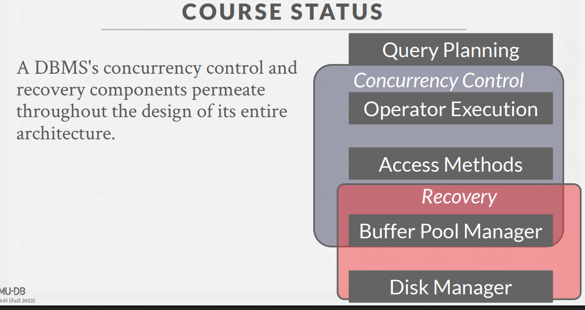

## 1. 并发控制的动机与背景

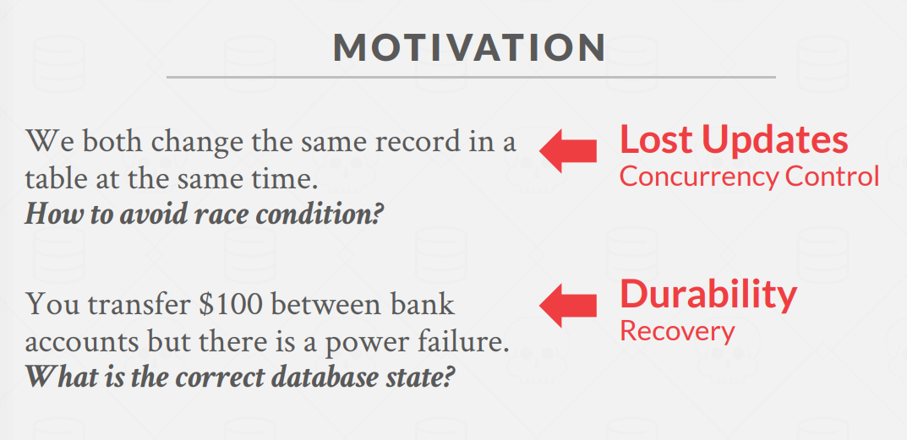
并发控制是数据库系统的核心组件之一，解决了多个事务同时访问数据库时可能出现的问题。在现代数据库系统中，并发控制机制尤为重要，主要解决以下问题：

- **竞态条件**：当多个用户同时修改同一记录时如何避免冲突
- **数据一致性**：例如当进行资金转账时遇到断电，如何确保数据库保持正确状态

## 2. ACID 特性

事务是数据库处理的基本单位，必须具备 ACID 特性：

> 事务是一系列的sql语句

> STRAWMAN SYSTEM (草稿版)：串行+开始前拷贝所有数据
> 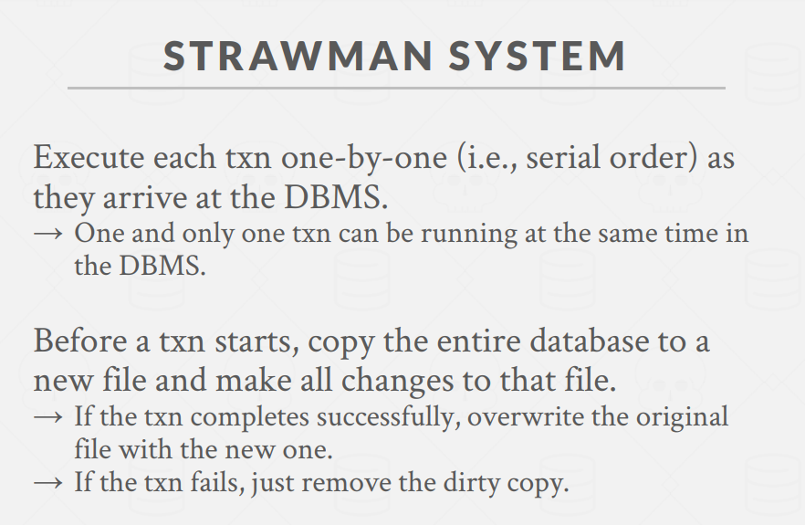
> 优化思路：
> 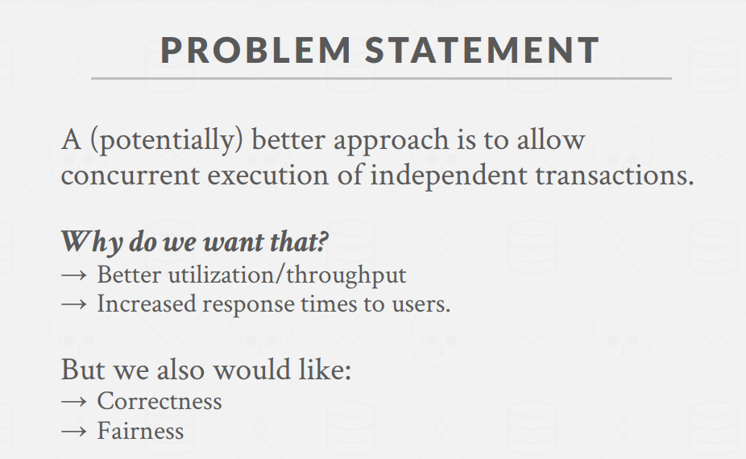

- database 与 transaction ：
  db：A **fixed** set of named data objects
  transaction: A sequence of read and write operations。begin 、commit、abort/rollback.

### Atomicity（原子性）

`all or nothing`

- DBMS 保证事务中的所有操作要么全部执行，要么全部不执行（"全有或全无"）
- 实现机制：

  1. **日志（Logging）**：记录所有操作，以便在需要时撤销操作
     `回滚、监控、性能`

     Logging is used by almost every DBMS.
     → Audit Trail
     → Efficiency Reasons

  2. **影子分页（Shadow Paging）**：不直接修改原始页面，而是创建页面副本并进行修改，事务提交时原子地更新指向新页面的指针，使更改可见

### Consistency（一致性）

`it looks correct to me`

- **数据库一致性**：数据库准确建模现实世界并遵循完整性约束
- **事务一致性**：如果事务执行前数据库是一致的，执行后也必须是一致的
  - `这主要是业务负责，数据库无法控制`(sql语句写得对不对)

### Isolation（隔离性）

`all by myself`

- 事务的执行相互隔离，每个事务执行时就像它独自运行一样
- 数据库通过`并发控制协议`确保正确的操作交叉执行
  - 悲观：Don't let problems arise in the first place.
  - 乐观：Assume conflicts are rare, deal with them after they happen.

---

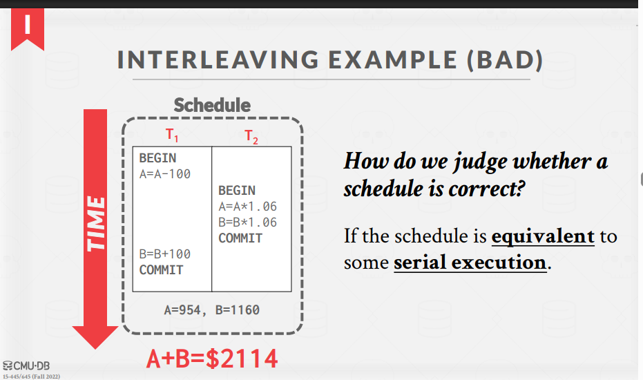

- Serial Schedule
  串行调度：所有事务按顺序执行，没有交叉操作
- Equivalent Schedule
  两个调度如果对任何数据库状态产生相同的最终效果，则它们是等价的
- Serializable Schedule
  可串行化调度：等价于某个串行调度的调度

### Durability（持久性）

`i will survive`
→ No torn updates(部分更新).
→ No changes from failed transactions.

- 已提交事务的更改必须永久保存
- 即使系统崩溃，已提交的更改也不会丢失
- The DBMS can use either **logging or shadowpaging** to ensure that all changes are durable.

有些人认为数据库做并发控制好，有些人认为在业务做并发控制好。
`google spanner 论文：只有在出现性能问题时，才考虑不用数据库事务的解法。`

## 3. 事务隔离与并发控制

### 并发执行的挑战

当多个事务并发执行时，操作的任意交错可能导致：

- **临时不一致**（可接受）
- **永久不一致**（不可接受）

### 串行化理论基础

**冲突操作(conflicting operations)**定义：

- 来自不同事务的操作
- 作用于同一对象，且至少一个是写操作

**冲突类型**：

1. **读-写冲突（R-W）**：导致不可重复读
   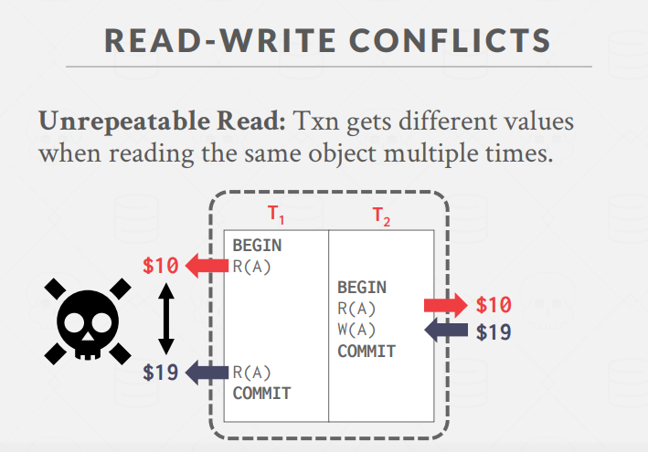
2. **写-读冲突（W-R）**：导致脏读
   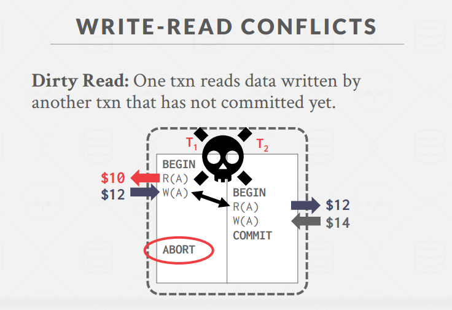
3. **写-写冲突（W-W）**：导致丢失更新
   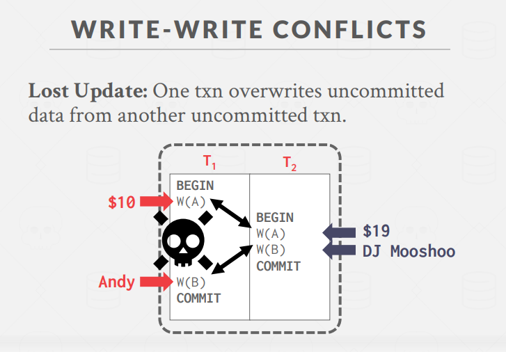

### 串行化类型

1. **冲突可串行化（Conflict Serializability）**

   - 调度可以通过交换非冲突操作转换为串行调度
   - 通过**依赖图/优先图**判断：如果图中无环，则调度是冲突可串行化的
   - 大多数数据库系统实现这种串行化

2. **视图可串行化（View Serializability）**
   它关注的是事务看到的数据的顺序，而不是操作的顺序
   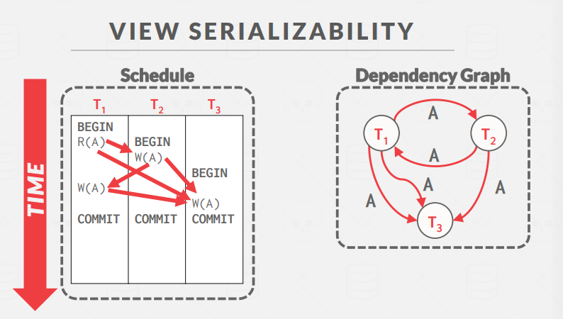
   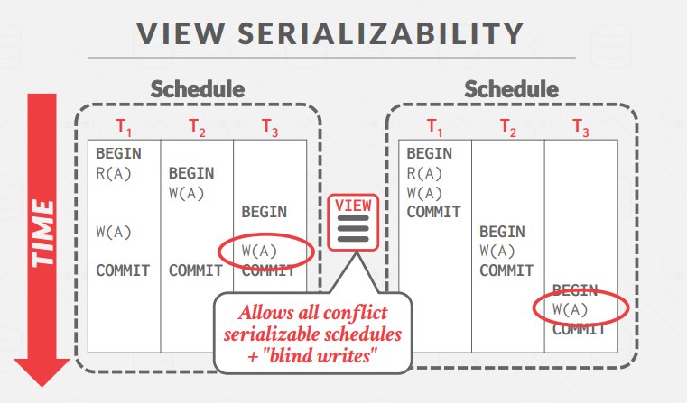

   - 比冲突可串行化允许更多的调度
   - 允许"盲写"（blind writes），即一个事务写入数据但不读取
   - 实现效率较低，`很少有系统支持`

由于数据库算法无法完全理解业务，所有两种方法都有误判率(误判成不可串行化)。

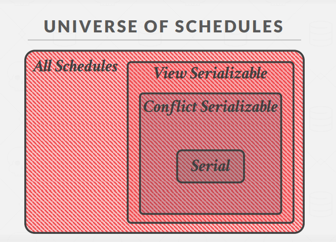

视图可串行性 > 冲突可串行性 > 串行

### 判断可串行化的方法

使用依赖图（也称优先图）：

- 每个事务是一个节点
- 如果事务T1的操作与事务T2的操作冲突，且T1的操作先于T2的操作，则从T1到T2有一条边
- 如果图中有环，则该调度不是冲突可串行化的

## 4. 实际应用

在实践中，数据库系统通常支持冲突可串行化，因为它可以高效执行。并发控制协议主要分为两类：

1. **悲观并发控制**：预先防止问题发生（例如锁定）
2. **乐观并发控制**：假设冲突很少，发生后再处理

## 5. 实际案例分析

课程中给出了多个案例分析如何判断调度的可串行性：

- 两个事务的简单转账操作
- 涉及三个事务的复杂场景
- 不一致分析的问题

通过分析事务之间的依赖关系，可以判断调度是否满足可串行化要求，从而保证数据库的正确性和一致性。

---

- 事务调度的关键概念

## 1. 串行调度 (Serial Schedule)

**定义**：一个不在不同事务间交错执行操作的调度。

**特点**：

- 每个事务从头到尾完整执行，然后才开始执行下一个事务
- 总是保证正确性，但并发度低
- 性能通常不理想，因为资源利用率低

**示例**：

```
T1: R(A), W(A), R(B), W(B)
T2: R(C), W(C), R(D), W(D)
```

串行调度1：T1全部执行完，再执行T2

```
T1: R(A), W(A), R(B), W(B)
T2:                      R(C), W(C), R(D), W(D)
```

串行调度2：T2全部执行完，再执行T1

```
T2: R(C), W(C), R(D), W(D)
T1:                      R(A), W(A), R(B), W(B)
```

## 2. 等价调度 (Equivalent Schedule)

**定义**：两个调度如果对任何数据库状态产生相同的最终效果，则它们是等价的。

**特点**：

- 即使操作顺序不同，最终结果相同
- 等价性与操作的具体内容无关，`只关注读写顺序`
- 为并发执行提供理论基础

**等价的判定**：

- 冲突等价：冲突操作相对顺序相同
- 视图等价：`初始读、写后读、最终写`关系相同

## 3. 可串行化调度 (Serializable Schedule)

**定义**：一个与某种串行执行等价的调度。

**特点**：

- 允许操作交错执行，但最终效果等同于某个串行执行
- 是并发调度正确性的标准
- 如果每个事务都保持一致性，那么可串行化调度也保持一致性

**主要类型**：

1. **冲突可串行化**：可通过交换非冲突操作转换为串行调度

   - 可用依赖图检测：无环图表示可串行化调度
   - `大多数数据库实现这种类型`

2. **视图可串行化**：更宽松的定义，包含更多合法调度
   - 包括所有冲突可串行化调度及部分"盲写"调度
   - 检测复杂度高，实际系统很少实现

**实际应用**：

- 数据库系统通常采用冲突可串行化作为正确性标准
- 通过并发控制协议（如2PL、MVCC）来确保生成可串行化调度
- 有时会放宽要求，使用更低隔离级别来提高性能

**示例**：

```
可串行化调度（等价于先执行T1再执行T2）：
T1: R(A), W(A)
T2:           R(B), W(B)
T1:                     R(B), W(B)
T2:                               R(A), W(A)
```

这三个概念构成了事务并发执行正确性的理论基础。串行调度是最安全但性能最低的执行方式，可串行化调度在保证正确性的同时允许更高的并发度，而等价性概念则为判断调度正确性提供了标准。

- 视图等价中的三个关键概念

视图等价（View Equivalence）是判断两个事务调度是否等价的一种方式，它关注调度中数据项的"读-写"依赖关系。视图等价主要关注三种关键关系：

## 1. 初始读（Initial Read）

**定义**：事务读取数据项的初始值（未被任何事务修改的值）。

**为什么重要**：

- 确保事务在相同的"起点"上开始
- 保证事务读取到数据的原始状态是一致的
- 如果一个事务在某调度中读取了数据项A的初始值，那么在等价调度中也应读取A的初始值

**示例**：

```
假设数据库初始状态：A=10
T1: R(A) [读取初始值A=10]
T2: W(A) [修改A=20]

在任何等价调度中，T1必须读取A的初始值10
```

## 2. 写后读（Read from Relation/Dependency）

**定义**：一个事务读取由另一个事务写入的值。

**为什么重要**：

- 确保事务间的因果关系保持不变
- 维护事务之间的数据依赖性
- 如果T2在某调度中读取了T1写入的值，那么在等价调度中也必须保持这种关系

**示例**：

```
T1: W(A) [写入A=20]
T2: R(A) [读取A=20，即T1写入的值]

在任何等价调度中，T2必须读取T1写入的值
```

## 3. 最终写（Final Write）

**定义**：对数据项的最后一次写操作，决定了数据项的最终状态。

**为什么重要**：

- 确保数据库的最终状态一致
- 保证事务执行结果对外部世界的影响相同
- 如果某个事务对某数据项执行了最后的写操作，那么在等价调度中也应如此

**示例**：

```
T1: W(A) [写入A=20]
T2: W(A) [写入A=30]

T2执行了对A的最终写，在任何等价调度中，T2也必须执行对A的最终写
```

## 视图等价的整体意义

这三种关系共同定义了视图等价，两个调度S1和S2是视图等价的，当且仅当：

1. 对于每个数据项，相同的事务在S1和S2中执行初始读
2. 相同的"写后读"关系在S1和S2中保持不变
3. 对于每个数据项，相同的事务在S1和S2中执行最终写

视图等价比冲突等价更宽松，它能捕获更多"正确"的调度，特别是允许所谓的"盲写"（一个事务写入数据但从不读取）场景，这在冲突等价中无法识别。

**为什么这三个概念很重要**：

- 它们共同确定了事务执行的外部可观察行为
- 它们定义了调度等价性的本质 - 如果两个调度在这三方面相同，那么它们对数据库产生相同的效果
- 它们提供了判断调度是否可串行化的理论基础，而不仅仅依赖于操作的执行顺序

视图等价是理解事务调度正确性的强大工具，尽管在实际系统中，由于其计算复杂性，通常采用更严格但更高效的冲突等价来实现并发控制。
