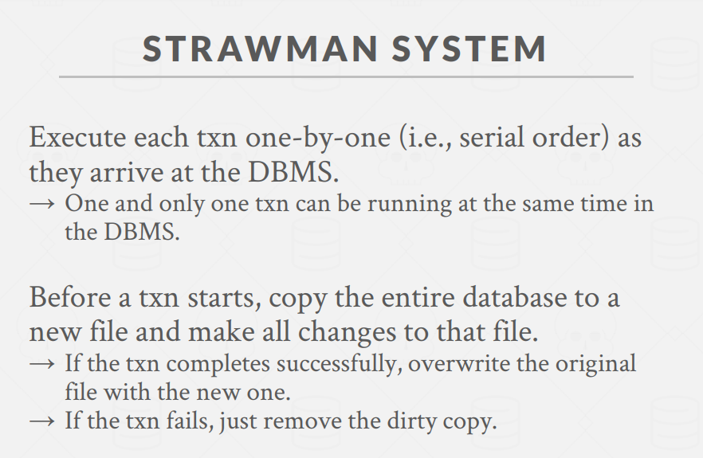
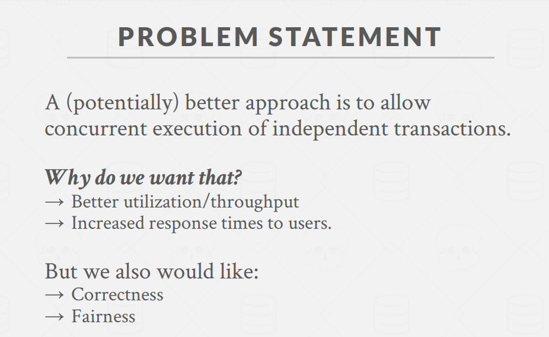

# CMU15445 并发控制章节详解

## 1. 并发控制的动机与背景

并发控制是数据库系统的核心组件之一，解决了多个事务同时访问数据库时可能出现的问题。在现代数据库系统中，并发控制机制尤为重要，主要解决以下问题：

- **竞态条件**：当多个用户同时修改同一记录时如何避免冲突
- **数据一致性**：例如当进行资金转账时遇到断电，如何确保数据库保持正确状态

## 2. ACID 特性

事务是数据库处理的基本单位，必须具备 ACID 特性：

> 事务是一系列的sql语句

> STRAWMAN SYSTEM (草稿版)：串行+开始前拷贝所有数据
> 
> 优化思路：
> 

### Atomicity（原子性）

- 事务中的所有操作要么全部执行，要么全部不执行（"全有或全无"）
- 实现机制：
  1. **日志（Logging）**：记录所有操作，以便在需要时撤销操作
  2. **影子分页（Shadow Paging）**：创建页面副本，只有事务提交时才使更改可见

### Consistency（一致性）

- **数据库一致性**：数据库准确建模现实世界并遵循完整性约束
- **事务一致性**：如果事务执行前数据库是一致的，执行后也必须是一致的
  - 这主要是应用程序的责任，数据库无法控制

### Isolation（隔离性）

- 事务的执行相互隔离，每个事务执行时就像它独自运行一样
- 数据库通过并发控制协议确保正确的操作交叉执行

### Durability（持久性）

- 已提交事务的更改必须永久保存
- 即使系统崩溃，已提交的更改也不会丢失

## 3. 事务隔离与并发控制

### 并发执行的挑战

当多个事务并发执行时，操作的任意交错可能导致：

- **临时不一致**（可接受）
- **永久不一致**（不可接受）

### 串行化理论基础

**冲突操作**定义：

- 来自不同事务的操作
- 作用于同一对象，且至少一个是写操作

**冲突类型**：

1. **读-写冲突（R-W）**：导致不可重复读
2. **写-读冲突（W-R）**：导致脏读
3. **写-写冲突（W-W）**：导致丢失更新

### 串行化类型

1. **冲突可串行化（Conflict Serializability）**

   - 调度可以通过交换非冲突操作转换为串行调度
   - 通过**依赖图/优先图**判断：如果图中无环，则调度是冲突可串行化的
   - 大多数数据库系统实现这种串行化

2. **视图可串行化（View Serializability）**
   - 比冲突可串行化允许更多的调度
   - 允许"盲写"（blind writes）
   - 实现效率较低，很少有系统支持

### 判断可串行化的方法

使用依赖图（也称优先图）：

- 每个事务是一个节点
- 如果事务T1的操作与事务T2的操作冲突，且T1的操作先于T2的操作，则从T1到T2有一条边
- 如果图中有环，则该调度不是冲突可串行化的

## 4. 实际应用

在实践中，数据库系统通常支持冲突可串行化，因为它可以高效执行。并发控制协议主要分为两类：

1. **悲观并发控制**：预先防止问题发生（例如锁定）
2. **乐观并发控制**：假设冲突很少，发生后再处理

## 5. 实际案例分析

课程中给出了多个案例分析如何判断调度的可串行性：

- 两个事务的简单转账操作
- 涉及三个事务的复杂场景
- 不一致分析的问题

通过分析事务之间的依赖关系，可以判断调度是否满足可串行化要求，从而保证数据库的正确性和一致性。

## 总结

并发控制和恢复机制是数据库系统最重要的功能之一。数据库系统自动插入锁定/解锁请求并调度不同事务的操作，确保最终执行效果等同于按某种顺序一个接一个地执行这些事务。这种自动化机制使应用开发者可以专注于业务逻辑而不必担心底层并发问题。

下一步课程将讨论具体的并发控制协议实现和优化方法。
