# CMU15445 并发控制章节：锁机制详解

## 1. 基础概念与背景

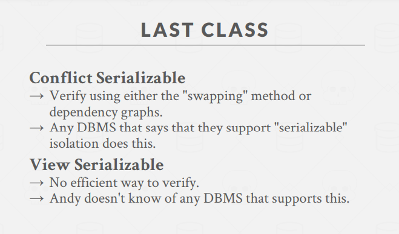
在上一章节，我们学习了冲突可串行化和视图可串行化的概念，以及如何验证调度的正确性。然而，这些方法需要**预先知道**整个调度，在实际系统中不可行。因此，我们需要一种机制来保证**在线调度**的正确性，这就是**锁**机制的作用。
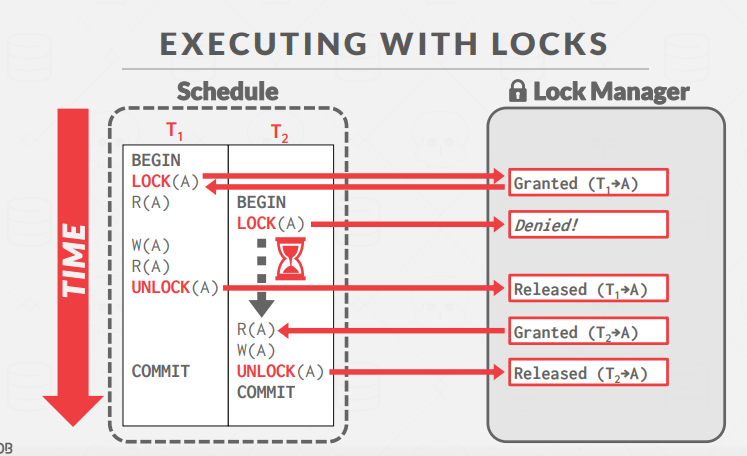
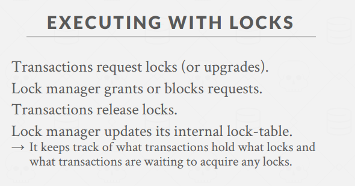

## 2. 锁与闩锁的区别

Lock -> 事务的锁
Latch -> 内存数据结构的锁

| 特性         | 锁 (Locks)                 | 闩锁 (Latches)   |
| ------------ | -------------------------- | ---------------- |
| 保护对象     | 数据库内容                 | 内存数据结构     |
| 存在期间     | 整个事务                   | 关键代码段       |
| 模式         | 共享、排他、更新、意向锁等 | 读、写           |
| 死锁处理     | 检测与恢复                 | 避免             |
| 死锁处理方式 | 等待、超时、取消           | 代码规范         |
| 实现方式     | 锁管理器                   | 受保护的数据结构 |

## 3. 基本锁类型

两种最基本的锁类型：

- **S-LOCK (共享锁)**：用于读操作，多个事务可同时持有
- **X-LOCK (排他锁)**：用于写操作，同一时间只能有一个事务持有

> S: Shared, X: Exclusive

**兼容性矩阵**：

```
         | 共享(S) | 排他(X)
---------|---------|---------
共享(S)  |    ✓    |    ✗
排他(X)  |    ✗    |    ✗
```

## 4. 两阶段锁协议 (2PL)

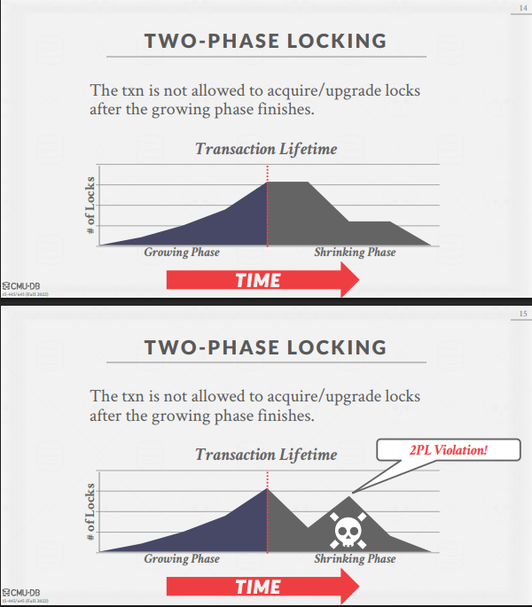

### 基本定义

两阶段锁是一种并发控制协议，在运行时决定事务是否可以访问数据库对象，不需要预先知道事务的所有操作。

### 两个阶段

1. **增长阶段 (Growing Phase)**：

   - 事务只能获取锁，不能释放任何锁

2. **缩减阶段 (Shrinking Phase)**：
   - 事务只能释放先前获取的锁，不能获取新锁

### 2PL的特点

- `保证冲突可串行性`：生成的调度优先图总是无环的
- 无法避免**级联回滚(cascading aborts)**问题
  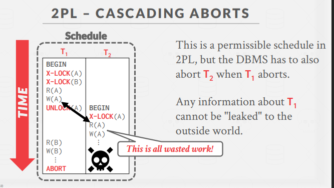
- 限制了一些理论上可串行但不符合2PL的调度

### 级联回滚问题

当一个事务T1回滚时，可能导致已读取T1写入值的其他事务T2也必须回滚，形成连锁反应。

### 强严格两阶段锁 (SS2PL/Rigorous 2PL)

解决了脏读问题(读取未提交的值)、级联回滚问题；但可能引发死锁。

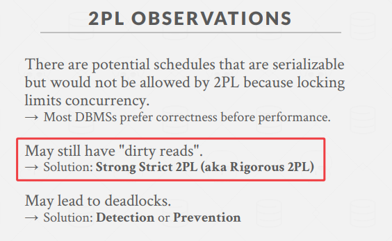
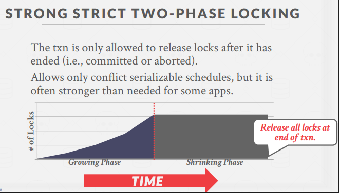
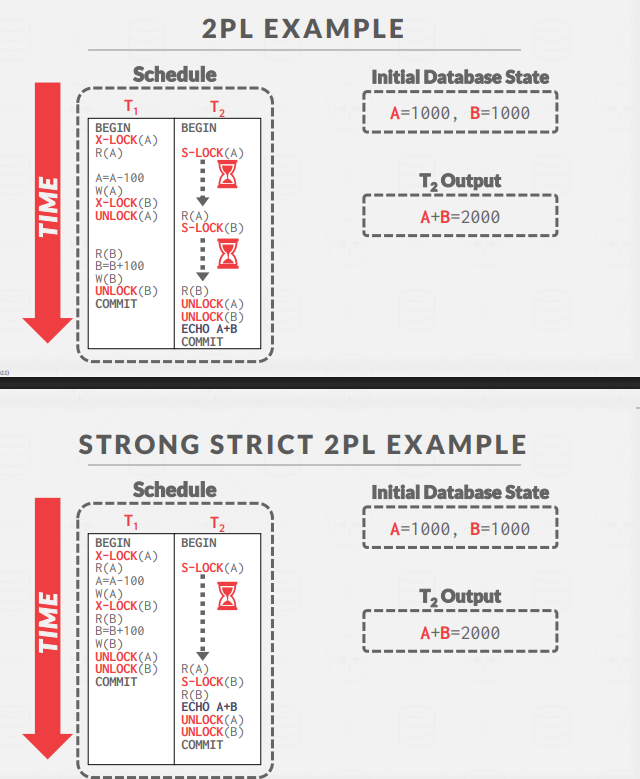

- **事务只能在结束（提交或回滚）后释放锁(解锁和提交同时完成)**
- 优点：
  - 不会发生级联回滚
  - 回滚事务只需恢复原始值即可
  - 确保严格调度

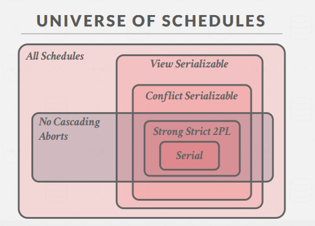

## 5. 死锁问题

### 定义

死锁是指一个事务等待循环，每个事务都在等待另一个事务释放锁。

### 死锁检测(Deadlock Detection)

- 使用**等待图**(waits-for graph)跟踪事务间的锁等待关系
- 节点是事务，Ti到Tj的边表示Ti在等待Tj释放锁
- 定期检查图中是否有环，有环即表示死锁
  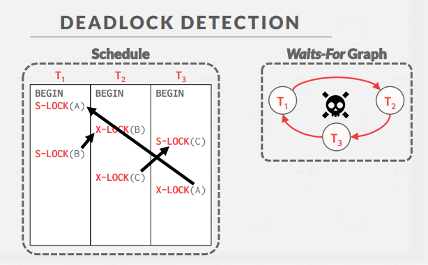

### 死锁处理(Deadlock Handling)

当检测到死锁时，DBMS需要选择一个"牺牲者(victim)"事务回滚以打破循环。

**牺牲者选择策略**：

- 按年龄（最小时间戳）
- 按进度（已执行查询的最少/最多）
- 按已锁定项目数
- 按连带回滚的事务数

**回滚长度**：

- 完全回滚：回滚整个事务
- 部分回滚：使用保存点(Savepoint)，只回滚到足以打破死锁的位置

### 死锁预防(Deadlock Prevention)

基于时间戳的优先级分配（较旧时间戳 = 较高优先级）：
**关键：不要互相等，单向等待，反过来直接干掉**
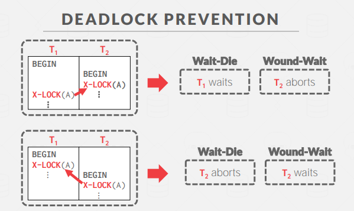

1. **Wait-Die ("老等年轻")**：

   `高的等低的，低的等高的直接重开`

   - 如果请求事务优先级高于持有事务，则请求事务等待
   - 否则请求事务中止（死亡）

2. **Wound-Wait ("年轻等老")**：

   `高的直接干掉低的，低的等高的`

   - 如果请求事务优先级高于持有事务，则持有事务中止（受伤）
   - 否则请求事务等待

这些方案通过只允许单向等待，保证不会形成等待环。
重开时还是使用原来的时间戳，防止饥饿。

## 6. 层次化锁

目的：避免加锁过多的情况，在上层加下层的锁定标记总结

### 锁粒度(Lock Granularity)

DBMS可以在不同粒度级别获取锁：

- 属性（字段）
- **元组（行）**
- 页
- 表
- 整个数据库

**粒度权衡**：

- 较少的锁、较大的粒度：低开销但并行度低
- 较多的锁、较小的粒度：高开销但并行度高

### 数据库锁层次结构

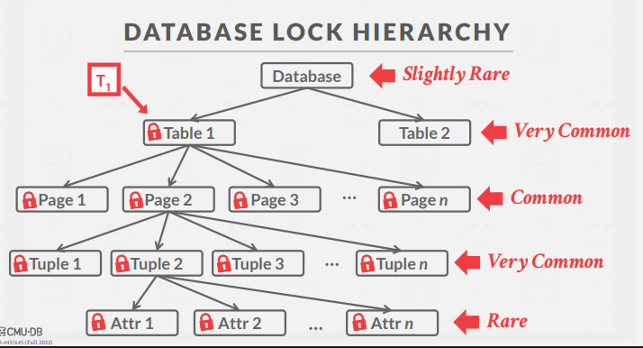

```
数据库
  ├── 表1
  │    ├── 属性1...属性n
  │    └── 页1...页n
  │         └── 元组1...元组n
  └── 表2...表n
```

### 意向锁(Intention Locks)

意向锁允许在不检查所有后代节点的情况下锁定高级节点，表示在较低级别有显式锁定。

**类型**：

- **意向共享锁(IS)**：表示在较低级别有显式共享锁
- **意向排他锁(IX)**：表示在较低级别有显式排他锁
- **共享+意向排他锁(SIX)**：同时具有S和IX的特性

**兼容性矩阵**：

```
    | IS | IX | S  | SIX | X
----|----|----|----|----|----
IS  | ✓  | ✓  | ✓  | ✓  | ✗
IX  | ✓  | ✓  | ✗  | ✗  | ✗
S   | ✓  | ✗  | ✓  | ✗  | ✗
SIX | ✓  | ✗  | ✗  | ✗  | ✗
X   | ✗  | ✗  | ✗  | ✗  | ✗
```

### 锁定协议

- 获取S或IS锁需要在父节点持有至少IS锁
- 获取X、IX或SIX锁需要在父节点持有至少IX锁

### 锁升级(Lock Escalation)

- 当事务获取过多低级锁时，DBMS可自动切换到更粗粒度的锁
- 减少锁管理器需要处理的请求数量，提高性能

## 7. 实践中的锁使用

绝大部分是自动加锁

### SQL中的显式锁

1. **锁定表**：

```sql
LOCK TABLE <table> IN <mode> MODE;
-- 模式：SHARE, EXCLUSIVE (PostgreSQL/DB2/Oracle)
-- 模式：READ, WRITE (MySQL)
```

2. **选择并锁定**：

```sql
SELECT * FROM <table>
WHERE <condition> FOR UPDATE;  -- 排他锁

-- 共享锁版本
-- PostgreSQL: FOR SHARE
-- MySQL: LOCK IN SHARE MODE
```

## 8. 并发控制方案的覆盖关系

所有可能的调度中：

- 视图可串行化包含冲突可串行化
- 冲突可串行化包含无级联中止的调度
- 无级联中止的调度包含强严格2PL
- 所有这些都包含串行调度

## 9. 总结与下一步

2PL是几乎所有DBMS使用的并发控制机制，它能`自动生成正确`的交错执行：

- 通过锁和协议(2PL, SS2PL)确保正确性
- 通过死锁检测与处理机制解决冲突
- 通过死锁预防策略避免死锁

下一节课将讨论基于时间戳的并发控制方法，它是另一种保证事务隔离的重要技术。

## 关于"撕裂更新"(Torn Updates)的补充

**撕裂更新**是指当系统崩溃或断电时，一个事务的更新只部分完成，导致数据页处于不一致状态。

**特点**：

- 数据页包含部分旧值和部分新值
- 通常发生在数据页大于底层存储原子写入单元时
- 违反ACID中的原子性和持久性原则

**防止撕裂更新的机制**：

1. **写前日志(WAL)**：先记录变更，再修改数据页
2. **双写缓冲区**：如MySQL InnoDB使用的技术
3. **页校验和**：检测部分写入的页面
4. **原子页写入**
5. **影子分页**：修改页面副本，提交时原子更新指针

理解并防止撕裂更新是保证数据库持久性的关键要求。
