# 时间戳顺序并发控制（Timestamp Ordering Concurrency Control）详解

## 1. 并发控制方法概述

在数据库系统中，并发控制主要有两种经典方法：

### 两阶段锁协议（Two-Phase Locking, 2PL）

- 在事务执行过程中动态决定冲突操作的可串行化顺序
- 通过获取和释放锁来控制数据访问

锁 -> 影响性能

### 时间戳顺序协议（Timestamp Ordering, T/O）

- 在事务执行前预先确定事务的可串行化顺序
- 使用时间戳来避免冲突，而不是锁定资源

## 2. 时间戳顺序协议基本原理

时间戳顺序协议使用时间戳来决定事务的可串行化顺序。如果事务 Ti 的时间戳小于事务 Tj 的时间戳（TS(Ti) < TS(Tj)），则数据库系统必须确保执行计划等同于 Ti 在 Tj 之前执行的串行计划。

### 时间戳分配方式

每个事务 Ti 被分配一个唯一的递增时间戳：

- **系统时间**：使用系统时钟
- **逻辑计数器**：使用递增的计数器
- **混合方法**：结合以上两种方法

## 3. 基本时间戳顺序协议（Basic T/O）

在基本 T/O 协议中，事务无需获取锁就可以读写对象。系统通过时间戳标记来跟踪对象的访问历史：

- **W-TS(X)**：对象 X 的最近写入时间戳
- **R-TS(X)**：对象 X 的最近读取时间戳

### 读操作规则

当事务 Ti 尝试读取对象 X 时：

- 如果 **TS(Ti) < W-TS(X)**，违反了时间戳顺序（`试图读取"来自未来"的数据`），必须中止 Ti 并使用新时间戳重启
- 否则，允许 Ti 读取 X，并更新 R-TS(X)为 max(R-TS(X), TS(Ti))，同时为 Ti **创建 X 的本地副本**以确保可重复读

### 写操作规则

当事务 Ti 尝试写入对象 X 时：

- 如果 **TS(Ti) < R-TS(X) 或 TS(Ti) < W-TS(X)**，违反了时间戳顺序，中止并重启 Ti
- 否则，允许 Ti 写入 X 并更新 W-TS(X)，同时为保证可重复读也**创建 X 的本地副本**

### 实例分析

以下是一个简单的例子说明基本 T/O 协议的工作原理：

假设有两个事务 T1(TS=1)和 T2(TS=2)，初始数据库中对象 A 和 B 的 R-TS 和 W-TS 都是 0

```
T1                  T2
BEGIN
R(B) → R-TS(B)=1
R(A) → R-TS(A)=1
                   BEGIN
                   R(B) → R-TS(B)=2
                   W(B) → W-TS(B)=2
R(A)
COMMIT             R(A) → R-TS(A)=2
                   W(A) → W-TS(A)=2
                   COMMIT
```

在这个例子中，两个事务都能正常提交，因为没有违反时间戳顺序。

## 4. Thomas 写规则（Thomas Write Rule）

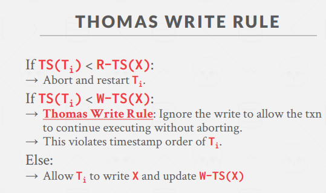

基本 T/O 协议可以通过 Thomas 写规则进行优化，减少不必要的事务中止：

如果 TS(Ti) < W-TS(X)，但 TS(Ti) ≥ R-TS(X)：

- 标准规则：中止并重启 Ti
- Thomas 写规则：**忽略这次写入操作**，允许事务继续执行而不中止

这条规则可以提高并发度，尽管它违反了 Ti 的时间戳顺序，但不会影响正确性。因为较旧的写入实际上会被较新的写入覆盖，所以可以安全地忽略。

Basic T/O 一般不单独使用：

- 如果长事务总是被短事务引发冲突，可能导致starvation（饥饿现象）。
- 拷贝本地副本代价

## 5. 乐观并发控制（Optimistic Concurrency Control, OCC）

乐观并发控制基于这样的假设：**冲突很少发生**，因此无需花费开销获取锁或更新时间戳。它适用于冲突较少的场景。

- `每个事务加了一个私有的workspace`
- Any object read is copied into workspace.
- Modifications are applied to workspace.

### OCC 的三个阶段

1. **读阶段**

   - 跟踪事务的读写集合，将写入存储在私有工作空间中
   - 系统从共享数据库复制每个事务访问的元组到私有工作空间

2. **验证阶段**

   - 当事务提交时，检查它是否与其他事务冲突
   - 验证可以采用后向验证或前向验证

3. **写阶段**
   - 如果验证成功，将私有工作空间的更改应用到数据库(一般会锁表写入)
   - 如果验证失败，中止并重启事务

### 验证方式

#### 后向验证（Backward Validation）

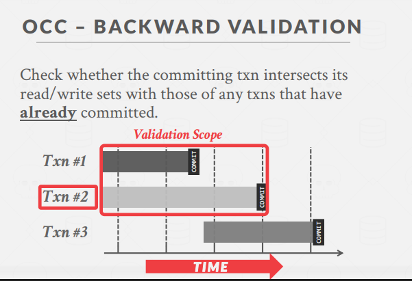
检查提交事务的读/写集合是否与已提交事务的读/写集合相交

#### 前向验证（Forward Validation）

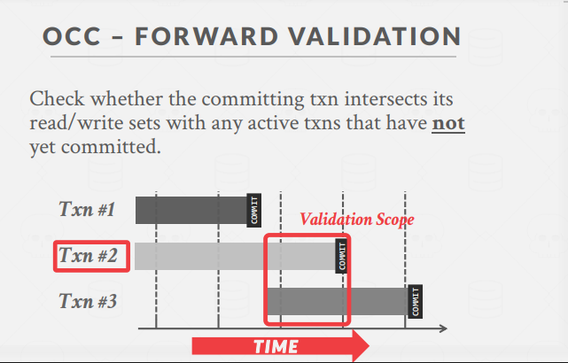
检查提交事务的读/写集合是否与尚未提交的活跃事务的读/写集合相交。如果 TS(Ti) < TS(Tj)，必须满足以下三个条件之一：

1. Ti 在 Tj 开始执行前完成所有三个阶段（串行执行）
   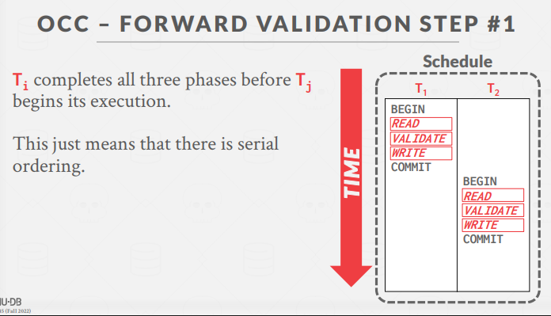
2. Ti 在 Tj 开始写阶段前完成，且 Ti 不写入 Tj 读取的任何对象
   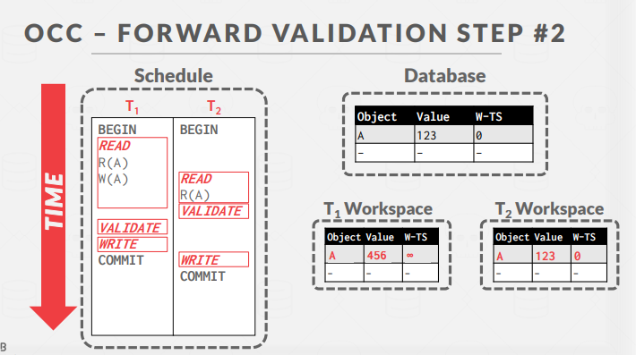
3. Ti 在 Tj 完成读阶段前完成读阶段，且 Ti 不写入 Tj 读取或写入的任何对象
   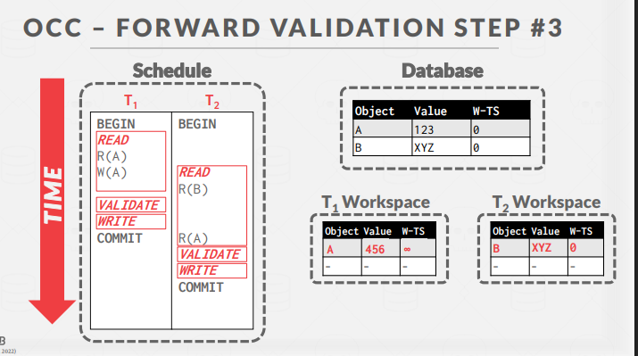

## 6. 动态数据库的幻读问题

传统的并发控制处理已存在对象的读写。但当事务执行`插入、更新和删除操作`时，会出现新的问题，特别是"幻读"问题。

`二阶段锁和OCC都预防不了幻读问题：只能控制已经存在的数据，无法控制新数据!`
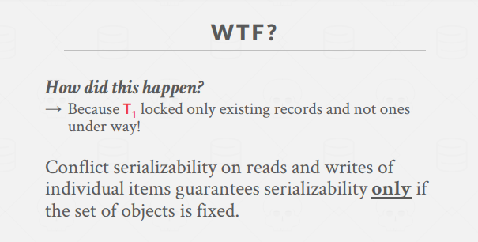

### 幻读问题示例

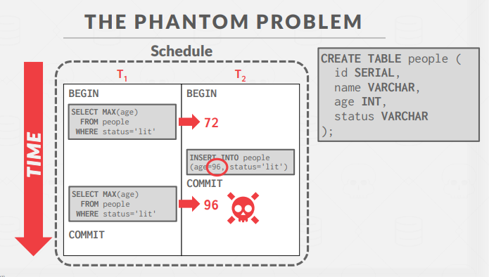
一个事务 T1 执行查询获取最大年龄，另一个事务 T2 插入了一个年龄更大的记录，当 T1 再次执行相同查询时，结果变化了：

```sql
T1: SELECT MAX(age) FROM people WHERE status='lit'; -- 结果：72
T2: INSERT INTO people (age=96, status='lit');
T1: SELECT MAX(age) FROM people WHERE status='lit'; -- 结果：96 (变了!)
```

### 解决幻读问题的方法

1. **重新执行扫描(Re-Execute Scan)**

   - 跟踪事务执行的所有 WHERE 子句
   - 提交时重新执行查询的扫描部分，检查是否产生相同结果

   简单粗暴

2. **谓词锁定（Predicate Locking）**
   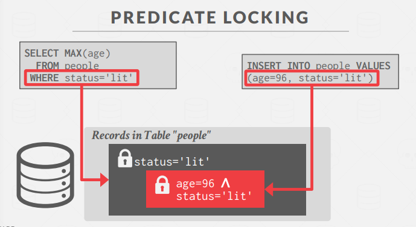

   - 对 SELECT 查询的 WHERE 子句谓词加共享锁
   - 对 UPDATE、INSERT 或 DELETE 查询的 WHERE 子句谓词加排他锁
   - 在实际系统中很少实现（HyPer 系统例外）

3. **索引锁定方案(Index Locking)**

   - **键值锁**：锁定索引中的单个键值
   - **间隙锁**：锁定键之间的间隙
     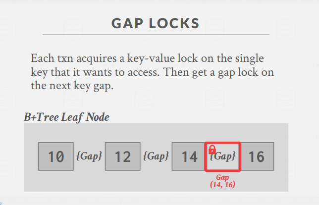
   - **键范围锁**：锁定键值及其到下一个键值的间隙
   - **层次锁定**：允许事务以不同的锁模式持有更广泛的键范围锁

## 7. 隔离级别(Isolation Levels)

完全可串行化可能限制并发性，降低性能。因此，我们可能需要使用较弱的一致性级别来提高可扩展性。

### 隔离级别定义

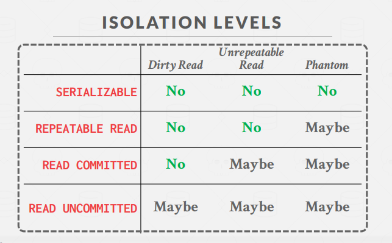
隔离级别控制事务暴露于其他并发事务操作的程度：

- **SERIALIZABLE（可串行化）**：没有幻读，所有读取可重复，没有脏读
- **REPEATABLE READS（可重复读）**：可能发生幻读
- **READ COMMITTED（读已提交）**：可能发生幻读和不可重复读
- **READ UNCOMMITTED（读未提交）**：所有问题都可能发生

### 实现方式

- **SERIALIZABLE**：首先获取所有锁；加上索引锁；使用严格的 2PL
- **REPEATABLE READS**：与上述相同，但没有索引锁
- **READ COMMITTED**：与上述相同，但 S 锁立即释放
- **READ UNCOMMITTED**：与上述相同，但允许脏读（没有 S 锁）

### 数据库系统默认隔离级别

不同数据库系统的默认和最大隔离级别各不相同：

- `PostgreSQL：默认 READ COMMITTED`，最高 SERIALIZABLE
- `MySQL：默认 REPEATABLE READS`，最高 SERIALIZABLE
- Oracle：默认 READ COMMITTED，最高 SNAPSHOT ISOLATION
- SQL Server：默认 READ COMMITTED，最高 SERIALIZABLE

## 8. 总结

时间戳顺序并发控制提供了一种替代锁的方法来管理事务间的冲突。它通过时间戳预先确定事务顺序，避免了死锁问题，但可能导致更多的事务中止。而乐观并发控制则基于冲突较少的假设，在低冲突环境中可能表现更好。

每种并发控制方法都有其优缺点，选择合适的方法和隔离级别取决于应用场景、工作负载特性以及对一致性与性能的权衡考虑。
