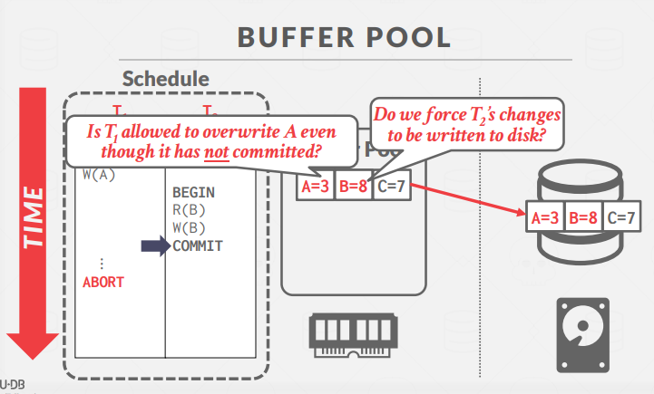
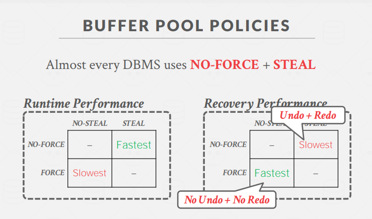
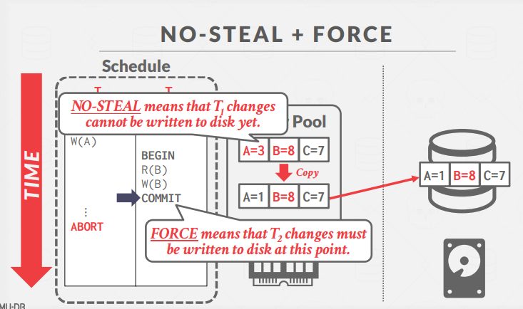
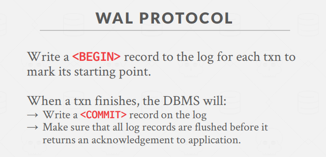
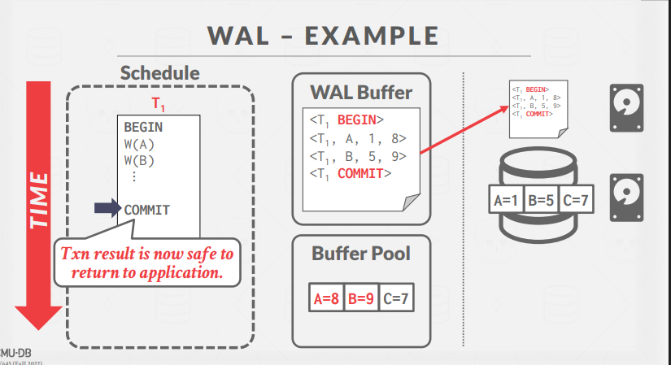
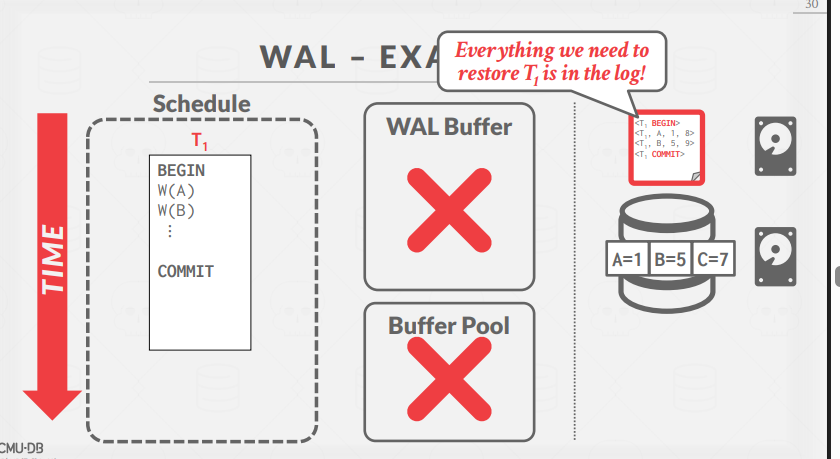
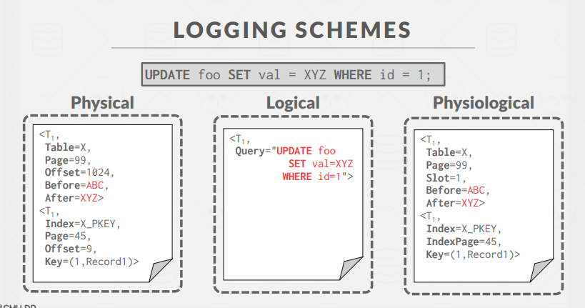
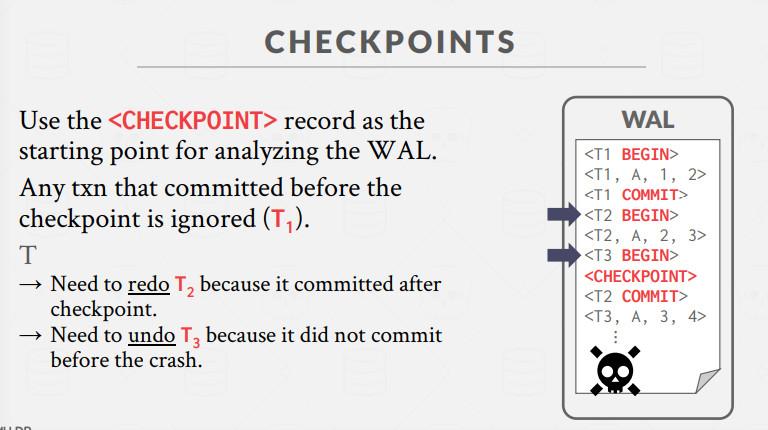

# 数据库日志系统（Database Logging）

事务 -> 并发控制 + `恢复`

## 1. 日志系统概述与动机

数据库系统需要确保事务的 ACID 属性，即使在系统发生崩溃的情况下。当事务修改数据时，这些更改首先在内存（缓冲池）中进行，然后才写入磁盘。`如果在将更改写入磁盘之前系统崩溃，这些更改将会丢失。`

**问题示例**：

- 事务 T1 对数据项 A 进行了更改（从 A=1 改为 A=12）
- 在写回磁盘之前系统崩溃
- 重启后，更改丢失，无法确定事务是否已完成

**恢复算法的目标**：

- 确保数据库一致性
- 保证事务的原子性
- 保证数据的持久性

## 2. 存储类型与故障分类 (Failure Classification)

### 2.1 存储类型

- **易失性存储（Volatile Storage）**：

  - 断电或程序退出后数据不保留
  - 示例：DRAM、SRAM

- **非易失性存储（Non-volatile Storage）**：

  - 断电和程序退出后数据仍然保留
  - 示例：HDD、SSD

- **稳定存储（Stable Storage）**：
  - 理论上的存储类型，能够在所有可能的故障场景下保留数据
  - `实际上不存在，通过冗余和备份机制模拟`

### 2.2 故障分类

一般考虑事务、系统故障

**类型 1：`事务`故障**

- 逻辑错误：事务因内部错误条件无法完成（如完整性约束违反）
- 内部状态错误：DBMS 因错误条件（如死锁）必须终止活动事务

**类型 2：`系统`故障**

- 软件故障：操作系统或 DBMS 实现问题（如未捕获的除零异常）
- 硬件故障：托管 DBMS 的计算机崩溃（如断电）
  - 失败-停止假设：系统崩溃不会破坏非易失性存储的内容

**类型 3：`存储介质`故障**

- 不可修复的硬件故障：磁头崩溃或类似磁盘故障破坏部分非易失性存储
- 此类故障 DBMS 无法恢复，必须从归档版本恢复数据库

## 3. 缓冲池策略（Buffer Pool Policies）

> undo: 保证原子性，redo: 保证持久性

数据库在处理事务时需要决定如何管理缓冲池与磁盘之间的数据交换，这通过两种策略控制：

### 3.1 STEAL 策略

刷脏页时是否允许提交未commit事务的数据.

- **STEAL**：允许未提交事务刷进磁盘（需要 UNDO 机制）
- **NO-STEAL**：不允许未提交事务刷进磁盘

### 3.2 FORCE 策略

commit 时是否立即将脏页刷进磁盘.

- **FORCE**：要求所有更新在提交前写入磁盘（不需要 REDO 机制）
- **NO-FORCE**：不要求在提交前写入磁盘

### 3.3 策略组合性能比较

- **NO-STEAL + FORCE**：
  

  - 运行时性能：最慢
  - 恢复性能：最快
  - 特点：`不需要 UNDO，不需要 REDO`
  - 缺点：无法支持写入集超过可用物理内存的事务(提交前要全部缓存住)

- **STEAL + NO-FORCE**：
  - 运行时性能：最快
  - 恢复性能：最慢
  - 特点：`需要 UNDO 和 REDO`
  - **几乎所有 DBMS 都使用此组合**

## 4. 恢复方法

### 4.1 影子分页（Shadow Paging）

`实际用的比较少`
`Buffer Pool Policy: NO-STEAL + FORCE`

不是复制整个数据库，而是在写入时复制页面，创建两个版本：

- **主版本（Master）**：只包含已提交事务的更改
- **影子版本（Shadow）**：包含未提交事务的临时更改

#### 工作原理：

`双缓冲`

1. 只读事务访问当前主版本
2. 活动修改事务更新影子页面
3. 提交时，通过覆盖根指针使其指向影子版本，从而交换主版本和影子版本

#### 撤销与重做：

- **撤销（Undo）**：移除影子页面，保留主版本和数据库根指针不变
- **重做（Redo）**：完全不需要

#### 缺点：

- 复制整个页面表开销大
- 提交开销高（需要刷新每个更新的页面、页面表和根）
- 数据碎片化（不利于顺序扫描）
- 需要垃圾回收
- 一次只支持一个写事务或批处理事务

#### 实例：SQLite（2010 年前版本）

- 当事务修改页面时，DBMS 在覆盖主版本前将原始页面备份到单独的日志文件
- 称为"回滚模式"（rollback mode）
- 重启后，如果存在日志文件，DBMS 还原它以撤销未提交事务的更改

### 4.2 预写日志（Write-Ahead Log, WAL）

`主流方法`
`随机写变顺序写`
`Buffer Pool Policy: STEAL + NO-FORCE`

**先写日志，再写数据**

维护与数据文件分开的日志文件，记录事务对数据库的更改：

- 假设日志在稳定存储上
- 日志包含足够信息以执行必要的撤销和重做操作

#### WAL 协议：

1. DBMS 在易失性存储中暂存事务的所有日志记录
2. 在页面被覆盖前，与更新页面相关的所有日志记录必须写入非易失性存储
3. 只有当所有日志记录写入稳定存储后，事务才被视为已提交

#### WAL 日志格式：

每个日志条目包含对单个对象更改的信息：

- 事务 ID
- 对象 ID
- 更改前值（用于 UNDO）(Not necessary if using append-only MVCC)
- 更改后值（用于 REDO）

> mysql: undolog、redolog 分开

#### 组提交优化（Group Commit）：

- 问题：每次事务提交都刷新日志缓冲区会成为瓶颈
- 解决方案：批处理多个日志刷新以分摊开销
  - 当缓冲区满时刷新到磁盘
  - 或达到超时时间（如 5 毫秒）

> 磁盘没有好的解决办法，所以大家都在研究内存型数据库 hhh

## 5. 日志格式(Logging Schemes)

### 5.1 物理日志（Physical Logging）

- 记录对特定页面的字节级更改
- 示例：类似 git diff
- 缺点：空间占用大

### 5.2 逻辑日志（Logical Logging）

- 记录事务执行的高级操作(其实就是SQL语句)
- 示例：UPDATE、DELETE 和 INSERT 查询
- 缺点：重放可能比较难，例如备库没有主库的索引，重放出错; 且事务并发顺序影响重放结果；回放时间更长

### 5.3 物理逻辑日志（Physiological Logging）

`mysql 使用`

- 混合方法，记录通过页面 ID + `槽号标识`的单个元组的字节级更改
- 不指定页面组织方式

---

- **物理日志（Physical Logging）**：  
  记录**数据页的全部物理变化**，如“第X页被整体改成了什么内容”。  
  优点：恢复快。  
  缺点：日志量大，不易跨平台。

- **物理逻辑日志（Physiological Logging）**：  
  记录**某个物理位置上的逻辑操作**，如“第X页的第Y条记录被改成了Z”。  
  优点：日志量小于纯物理日志，恢复快，兼顾灵活性。  
  缺点：实现稍复杂。

`物理日志关心“整个页怎么变了”，物理逻辑日志关心“页内哪个位置怎么变了”。`
mysql mixed 日志格式实际是使用在binlog中的，undolog 和 redolog 并不能配置日志格式

### 5.4 物理 vs 逻辑日志

- 逻辑日志每个日志记录写入的数据少于物理日志
- 对于在较低隔离级别运行的并发事务，使用逻辑日志实现恢复很困难
  - 难以确定崩溃前查询可能修改了数据库的哪些部分
  - 恢复时间更长，必须重新执行每个事务

### 5.5 日志结构系统（Log-Structured Systems）

- 日志结构数据库没有脏页概念
  - 从磁盘检索的任何页面都是不可变的
- DBMS 在内存页（MemTable）中缓冲日志记录
  - 如果此缓冲区满，必须刷新到磁盘，但可能包含未提交事务的更改
- 这些 DBMS 仍然维护单独的 WAL 以在崩溃时重建 MemTable

## 6. 检查点（Checkpoints）

随着时间推移，WAL 将无限增长。崩溃后，DBMS 必须重放整个日志，这将花费很长时间。

> 玩游戏必须要存档

### 6.1 检查点目的

DBMS 定期进行检查点，将所有缓冲区刷新到磁盘，提供一个线索，表明崩溃后需要回放 WAL 的起点。

### 6.2 阻塞/一致性检查点协议

1. 暂停所有查询
2. 将内存中的所有 WAL 记录刷新到磁盘
3. 将缓冲池中所有修改的页面刷新到磁盘
4. 向 WAL 写入<CHECKPOINT>条目并刷新到磁盘
5. 恢复查询

### 6.3 检查点分析

- 使用<CHECKPOINT>记录作为分析 WAL 的起点
- 忽略在检查点之前提交的事务
- 需要**重做在检查点之后提交**的事务
- 需要**撤销未提交**的事务

### 6.4 检查点挑战

- 为确保一致性快照，DBMS 必须在执行检查点时`暂停事务`
- `扫描日志`查找未提交事务可能需要很长时间
- 检查点频率取决于多种因素

### 6.5 检查点频率

- 检查点过于频繁会导致运行时性能下降（系统花费太多时间刷新缓冲区）
- 等待太长时间同样不好（检查点会变大且慢，恢复时间更长）
- 可根据应用程序恢复时间要求调整

## 7. 总结

- 预写日志（WAL）几乎总是处理易失性存储丢失的最佳方法
- 使用增量更新（STEAL + NO-FORCE）和检查点
- 恢复时：撤销未提交事务 + 重做已提交事务
