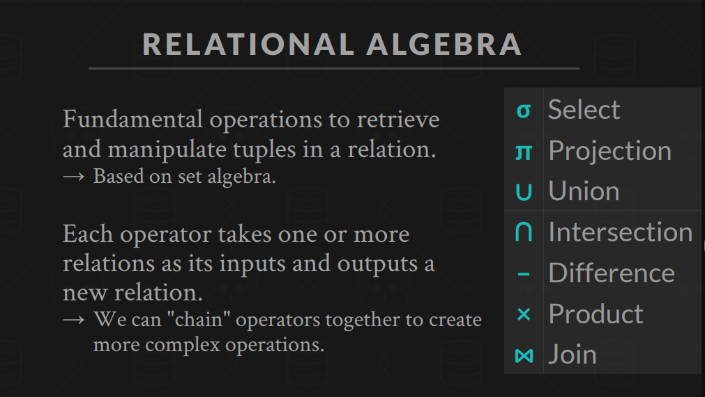

# Relation Model (关系模型)

下面是一份关于 CMU-15445 课程中“1_relation model”部分的易懂讲解笔记，结合了权威数据库教材以及 CMU-15445 课程中所讲的内容整理而成，帮助你理解关系模型的基本概念、理论基础与操作方法。

---

# CMU-15445 1_Relation Model 讲解笔记

## 1. 关系模型的基本思想

**关系模型**由 E.F. Codd 在 1970 年提出，是关系型数据库（RDBMS）的理论基础。其核心思想是将数据组织成一个或多个二维表格，每个表格称为**关系**。这种模型具有以下几个基本元素：

- **关系（Relation）**：相当于一个二维表。每个关系都由行和列组成。
- **元组（Tuple）**：关系中的一行，代表某个实体的一个实例。
- **属性（Attribute）**：关系中的一列，描述了数据的一个特征。
- **域（Domain）**：每个属性允许的取值范围。例如，“性别”属性的域可能为 {“男”, “女”}。

在 CMU-15445 课程中，这部分内容通常作为数据库系统基础理论的开篇介绍，目的是让大家掌握数据如何在逻辑上组织和操作。

---

## 2. 关系模式与约束

- **关系模式（Schema）**：定义关系结构，包括关系的名称、各个属性的名称和数据类型。例如，一个学生表的模式可以写为：
  ```
  Student(学号: int, 姓名: varchar, 性别: char, 年龄: int)
  ```
- **完整性约束**：为了保证数据的一致性与正确性，关系模型引入了一些约束条件，例如主键（Primary Key）、外键（Foreign Key）以及其他域约束。
  - **主键**：标识关系中每个元组的唯一性。
  - **外键**：确保数据间的参照完整性。

CMU-15445 课程中会强调这些约束如何帮助设计出既高效又一致的数据库系统，同时也为后续数据库操作（如查询优化和事务处理）提供理论基础。

---

## 3. 关系代数与操作

关系模型不仅描述数据的结构，还定义了一套数学上严谨的操作——**关系代数**，这正是 SQL 查询语言设计的理论基础。常见的关系代数运算包括：

- **选择（Selection, σ）**：从关系中挑选出满足给定条件的元组。例如：

  ```
  σ(年龄 > 20)(Student)
  ```

  表示从学生表中选出年龄大于20的所有记录。

- **投影（Projection, π）**：提取关系中的部分属性，消除不必要的信息。例如：

  ```
  π(姓名, 性别)(Student)
  ```

  表示只取学生表中的“姓名”和“性别”两列。

- **连接（Join）**：将两个关系按照某种条件合并为一个新的关系。
- **集合运算**：并、交、差等操作用于合并或比较两个关系。

CMU-15445 课程在介绍关系模型时，会结合这些操作说明 SQL 如何将声明式查询转换成一系列数学运算，从而实现数据的抽象查询和高效优化。

---

## 4. 数据独立性与标准化

- **数据独立性**：关系模型实现了逻辑数据与物理存储的分离。应用程序只需要操作逻辑结构（关系、元组、属性），而不必关心底层如何存储。这一点对于数据库的可维护性和扩展性至关重要。

- **规范化（Normalization）**：为了消除数据冗余和更新异常，关系模型引入了规范化理论。通过将数据拆分成多个关系，并通过外键建立联系，可以实现更高的数据一致性。CMU-15445 也会简单介绍常见范式，如第一范式、第二范式、第三范式及BCNF。

---

## 5. 总结

CMU-15445 课程中“1_relation model”部分主要讲解了以下几点：

- **基本概念**：关系、元组、属性和域构成了关系模型的基础。
- **关系模式**：定义了数据的结构及各属性的数据类型，同时通过主键、外键等约束确保数据一致性。
- **关系代数**：提供了一套数学运算（选择、投影、连接等），为查询语言提供理论依据。
- **数据独立性**：逻辑数据与物理存储分离，使得应用程序不受底层实现影响。
- **规范化**：通过数据拆分和约束设计，消除冗余、提高一致性。

这种设计思想使得关系模型成为数据库理论中最为广泛应用和深入研究的模型之一，为 SQL 语言和现代数据库系统的发展奠定了坚实基础。

---

- DBMS(Database Management System) 是一个软件系统，用于创建、管理和操作数据库。
- data model、schema：

  - data model：数据模型是对数据的`抽象`表示，定义了数据的结构、关系和操作。
    - Relation model：关系模型是数据模型的一种，使用表格（关系）来表示数据及其关系。
    - K-V
    - Graph
    - Document
    - Column-family
    - Array/Matrix/Vectors (机器学习)
    - Network
  - schema：模式是数据库中数据的逻辑`结构描述`，包括表的名称、字段及其类型等信息。

  A data model is a collection of concepts for `describing` the data in a database.
  A schema is a `description of a particular collection` of data, using a given data model.

- Column-family（列族）是列式存储数据库（如 HBase、Cassandra 等）中用于组织和存储数据的基本结构单元。相关特点包括：

  - **数据分组：** 同一个列族中的所有列会存储在一起，便于快速读取。
  - **灵活性：** 每一行可以包含不同的列，但属于同一列族的列存储在一起，适合存储同一类数据。
  - **性能优化：** 数据聚集在列族内，可减少磁盘 I/O，提高查询效率，尤其在大量列和稀疏数据场景下。

- Relation Model
  **Structure**: The definition of the database's relations and their contents.
  **Integrity**: Ensure the database's contents satisfy constraints.
  **Manipulation**: Programming interface for accessing and modifying a database's contents.
  表的本质就是关系，n-ary relation = table with n columns

- 主键
  Some DBMSs automatically create `an internal primary key` if a table does not define one.
  AUTO_INCREMENT
- 外键
- DML(Data Manipulation Language) 数据操作语言

  - SELECT
  - INSERT
  - UPDATE
  - DELETE

  命令式(Relational Algebra)
  

  声明式(Relational Calculus)
  high-level，不说明执行顺序，只说明结果，`优化交给引擎`

- 算子

  - SELECT：选择子表
  - PROJECT：产生一个新的关系，包含原关系的某些列，**映射成一张新的表**
  - UNION
  - INTERSECT
  - DIFFERENCE
  - PRODUCT
  - JOIN
    JOIN 就是把两个表中“匹配到一起”的行合并成一行。
    也就是说，`把两个表按照某个或几个共同的字段找到关联的记录，并把它们拼到一起，形成一个新的结果表。`
    Generate a relation that contains all tuples that are a combination of two
    tuples (one from each input relation) with a common value(s) for one or more attributes.

- 模型与查询语言是解耦的
  The relational model is independent of any query language implementation.
  SQL is the de facto standard (many dialects).

  ```py
  for line in file.readlines():
    record = parse(line)
    if record[0] == "GZA":
      print(int(record[1]))
  ```

  ```sql
  SELECT year FROM artists
  WHERE name = 'GZA';
  ```
