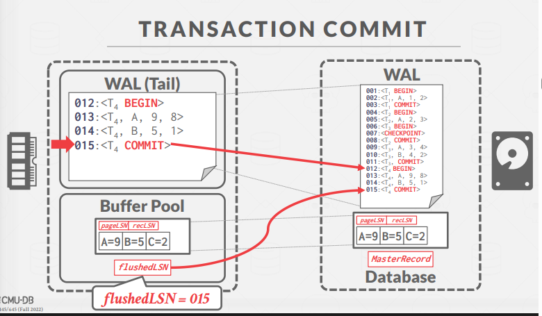
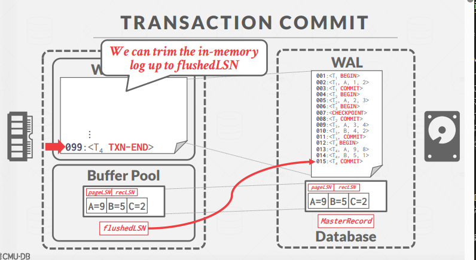
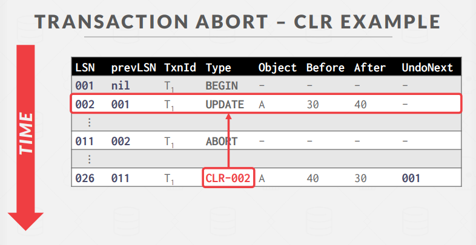
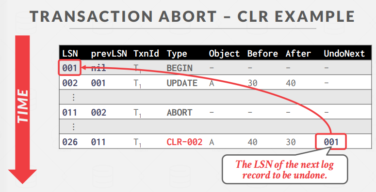
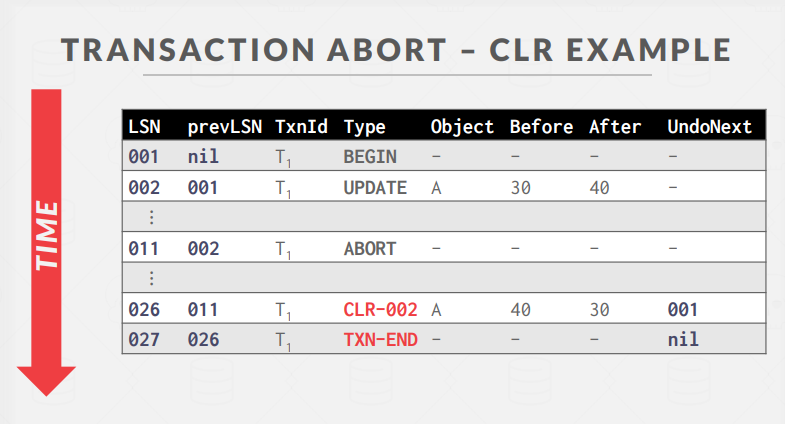
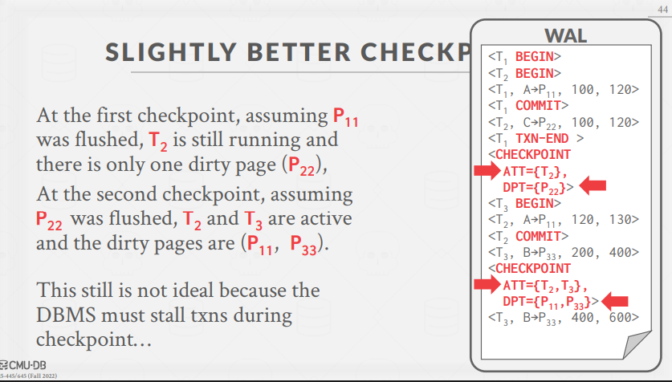
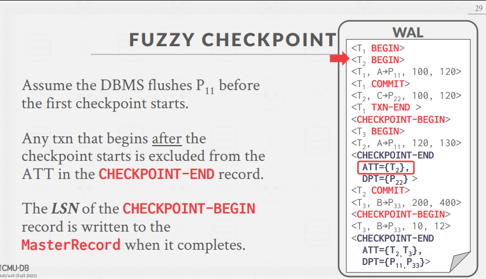
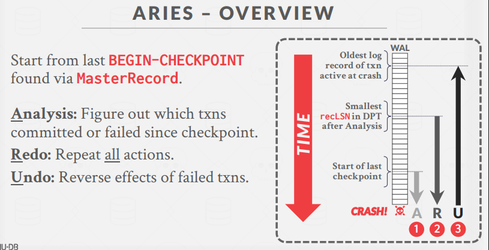
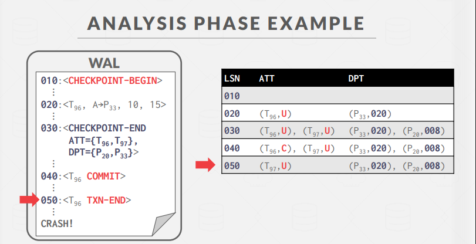

# ARIES 恢复算法详解

这章非常关键

`数据库恢复原型算法`

`Crash Recovery`

ARIES（Algorithms for Recovery and Isolation Exploiting Semantics）是一种数据库恢复算法，最初由IBM研究院在20世纪90年代初期为DB2数据库系统开发。虽然并非所有系统都完全按照论文中定义的方式实现ARIES，但大多数现代数据库系统采用的恢复机制与ARIES非常相似。

## ARIES 的核心思想

ARIES 基于三个主要思想：

1. **预写日志 (Write-Ahead Logging)**：

   - 任何数据库变更在写入磁盘前，必须先将其记录到稳定存储的日志中
   - 使用STEAL（允许未提交事务的脏页刷盘）和NO-FORCE（提交事务时不强制脏页刷盘）的缓冲池策略

2. **在重做阶段重演历史 (Repeating History During Redo)**：

   - 系统重启时，重放操作并将数据库恢复到崩溃前的确切状态

3. **撤销过程中记录日志 (Logging Changes During Undo)**：
   - 在撤销操作时记录日志，确保在多次失败的情况下操作不会重复执行

## 日志序列号 (LSN)

ARIES使用日志序列号(Log Sequence Numbers)来跟踪和管理恢复过程：

| LSN名称      | 位置   | 定义                             |
| ------------ | ------ | -------------------------------- |
| flushedLSN   | 内存   | 已写入磁盘的最后一条日志的LSN    |
| pageLSN      | 页面x  | 页面x的最新更新的LSN             |
| recLSN       | 页面x  | 页面x自上次刷盘以来的最早更新LSN |
| lastLSN      | 事务Ti | 事务Ti创建的最新日志记录         |
| MasterRecord | 磁盘   | 最新检查点的LSN                  |

### 写入日志记录的规则

- 每个数据页包含pageLSN，代表该页最近一次更新的LSN
- 系统跟踪flushedLSN，即目前为止已刷盘的最大LSN
- 在DBMS将页面x写入磁盘前，必须先刷新日志至少到以下点：
  - pageLSNx ≤ flushedLSN

## 正常执行过程

### 事务提交

当事务提交时：

1. DBMS将COMMIT记录写入日志
2. 确保该事务的所有日志记录（直到COMMIT记录）都已刷盘
   - 日志刷盘是顺序的、同步的磁盘写入
   - 每个日志页可以包含多条日志记录
3. 提交成功后，写入特殊的TXN-END记录到日志
   - 表示该事务不会再有新日志记录
   - 这条记录不需要立即刷盘

### 事务回滚

回滚事务是ARIES撤销操作的特例，只应用于单个事务。需要在日志记录中添加额外字段：

- `prevLSN`：事务的前一个LSN，形成每个事务的链表以便遍历

#### 补偿日志记录 (CLR，Compensation Log Record)

CLR描述为撤销先前更新记录而采取的操作：

- 包含更新日志记录的所有字段，外加`undoNext指针`（下一个待撤销的LSN）
- CLR添加到日志中，但DBMS不会等待它们刷盘就通知应用程序事务已回滚

#### 回滚算法

1. 首先为事务写入ABORT记录到日志
2. 按照相反顺序分析事务的更新
3. 对于每条更新记录：
   - 写入CLR条目到日志
   - 恢复旧值
4. 最后，写入TXN-END记录并释放锁

**注意**：CLR不需要被回滚

## 检查点机制

### 非模糊检查点（影响性能）

DBMS在创建检查点时停止所有操作以确保一致的快照：

- 暂停任何新事务的启动
  > STW!
- 等待所有活动事务完成
- 将脏页刷新到磁盘

### 稍好的检查点策略

DBMS在创建检查点时**暂停修改事务**：

- 阻止查询获取表/索引页面的写锁
- 不必等待所有事务完成
- 记录检查点开始时的内部状态：

  - 活动事务表(ATT)
  - 脏页表(DPT)
    ATT 和 DPT 让恢复过程更快、更准，避免全盘扫描和无用操作。

  > 活动事务表和脏页表

  ### 活动事务表 (ATT)

  记录崩溃时哪些事务还“活着”（即未完成）。
  恢复时判断哪些事务需要撤销（Undo），哪些已经提交（Commit）。
  `恢复时只需要撤销ATT中未完成的事务，避免无谓遍历所有日志`。

  每个当前活动的事务一个条目：

  - txnId：唯一事务标识符
  - status：事务的当前"模式"
    - R → 运行中
    - C → 提交中
    - U → 需要撤销的候选
  - lastLSN：事务创建的最新LSN

  当TXN-END记录写入后，从表中移除条目

  ### 脏页表 (DPT)

  跟踪缓冲池中哪些页面包含尚未刷新到磁盘的更改：

  - 缓冲池中每个脏页一个条目
  - recLSN：首次导致页面变脏的日志记录的LSN

  `恢复时只需要重做DPT中涉及的页面，从最早的recLSN开始，减少不必要的磁盘操作。`

### 模糊检查点(Fuzzy Checkpoint)

模糊检查点允许活动事务在系统写入检查点日志记录时`继续运行`：
**时间点变成时间段**

- 不尝试强制将脏页刷新到磁盘
- 新增日志记录类型跟踪检查点边界：
  - CHECKPOINT-BEGIN：表示检查点开始
  - CHECKPOINT-END：包含ATT和DPT信息
- 检查点完成时，CHECKPOINT-BEGIN记录的LSN写入MasterRecord

## ARIES 恢复阶段

ARIES的恢复过程分为三个阶段：

`Start from last BEGIN-CHECKPOINT found via MasterRecord.`

### 1. 分析（Analysis）

**做什么？**
`Figure out which txns committed or failed since checkpoint.`

- 从最近的检查点（Checkpoint）开始，顺着日志往前看，找出：
  - 崩溃时哪些事务还没结束（活着的事务，填ATT）
  - 哪些数据页是脏的（填DPT）

**目的？**

- 确定后面需要重做和撤销的范围。

---

### 2. 重做（Redo）

**做什么？**
`Repeat all actions.`

- 从DPT里最早的recLSN开始，顺着日志把所有相关的操作（包括未提交的事务）都再做一遍，把数据库恢复到崩溃那一刻的状态。

**目的？**

- 保证所有该落盘的数据都落盘，数据库状态和崩溃前一样。

---

### 3. 撤销（Undo）

**做什么？**
`Reverse effects of failed txns.`

- 把分析阶段发现的“活着但没提交”的事务（ATT里状态为U的事务）做过的操作按日志反向撤销，并写CLR日志。

**目的？**

- 保证未提交的事务对数据库的影响都被撤销，数据一致。

### 理解

**分析找活人，重做演历史，撤销清尾巴。**

1. **分析**：谁还活着？哪些页脏了？
2. **重做**：把所有操作再做一遍，恢复到崩溃前。
3. **撤销**：把没提交的操作撤回去。

## 崩溃中的崩溃处理

- 如果在分析阶段恢复期间崩溃：
  - 无需特殊处理，再次运行恢复即可
- 如果在重做阶段恢复期间崩溃：
  - 同样无需特殊处理，再次重做所有操作
- 恢复期间提高重做阶段性能：
  - 假设不会再次崩溃，在后台异步将所有更改刷新到磁盘(`一边重做一边刷盘`)
- 恢复期间提高撤销阶段性能：
  - 在新事务访问页面前，才懒惰地回滚更改
  - 重写应用程序以避免长时间运行的事务

## 总结

ARIES的主要思想：

- 使用STEAL/NO-FORCE策略的预写日志(WAL)
- 模糊检查点（脏页ID的快照）
- 从最早的脏页开始重做所有操作
- 撤销从未提交的事务
- 撤销时写入CLR，以在重启期间的故障中幸存(二次宕机后知道清理到哪了)

日志序列号：

- LSN标识日志记录；通过prevLSN链接成每个事务的`反向链表`
- pageLSN允许比较数据页和日志记录

---

从根本上理解和记忆 ARIES 恢复算法，可以抓住以下几个核心“关键词”和“比喻”：

---

## 1. 日志优先，数据后写（WAL）

**关键词**：日志先于数据  
**比喻**：像写日记，先把要做的事记下来，之后再去做。  
**记忆法**：只要有变更，先写日志，后写数据，出事了就翻日记还原。

---

## 2. 三步恢复流程（分析、重做、撤销）

**关键词**：分析（谁活着/脏了）、重做（重演历史）、撤销（回滚未完成）  
**比喻**：

- 分析：事故现场调查，谁还活着，哪些地方被破坏了。
- 重做：把事故前的所有动作再演一遍，恢复到出事那一刻。
- 撤销：把没做完的动作撤回去，保证没人“假装”做完。

**记忆法**：

- 先查清楚（分析），
- 再全部重做一遍（重做），
- 最后把没做完的撤销（撤销）。

---

## 3. 日志序列号（LSN）和链表

**关键词**：LSN、prevLSN、pageLSN  
**比喻**：每条日志像有编号的快递单，事务的日志用链表串起来，页面记住最新的快递单号。

**记忆法**：

- 日志有编号（LSN），
- 事务日志串成链（prevLSN），
- 页面记最新编号（pageLSN）。

---

## 4. 补偿日志记录（CLR）

**关键词**：撤销时也要记日志  
**比喻**：撤销动作也要写进日记，`防止撤销时又出事故`。

**记忆法**：撤销也要写日志，保证多次崩溃也能恢复。

---

## 5. 模糊检查点（Fuzzy Checkpoint）

**关键词**：快照+继续运行  
**比喻**：拍照时人还在动，但把当时的状态记下来，方便以后恢复。

**记忆法**：检查点不是暂停一切，而是边拍照边干活。

---

## 6. STEAL/NO-FORCE 策略

**关键词**：允许脏页提前写盘，提交时不强制写盘  
**比喻**：可以提前把未完成的作业交给老师，但不要求作业一交就必须存档。

**记忆法**：脏页可以提前写，提交不用强制写。

---

## 总结口诀

**先记日志，后写数据；三步恢复，分析重做撤销；撤销也写日志，检查点边拍边干；编号串链，脏页可提前。**

---

只要记住这些关键词和比喻，遇到ARIES相关问题时，脑中自然浮现出“先写日志、三步恢复、撤销也写日志、模糊检查点”等核心思想，理解和记忆就会变得非常容易。

---

- TXN-END
  **TXN-END** 是 ARIES 恢复算法中的一种特殊日志记录，表示一个事务（Transaction）已经彻底结束，不会再有任何与该事务相关的日志写入。

  ### 作用

  - 明确标记该事务的生命周期已经结束。
  - 便于恢复时判断哪些事务已经完全处理完，可以安全地从活动事务表（ATT）中移除。
  - 对于提交和中止的事务，最终都会写入 TXN-END 日志。

  ### 典型流程

  类似 try-catch-finally

  1. 事务提交时，先写 COMMIT 日志并刷盘。
  2. 事务中止时，先写 ABORT 日志，撤销所有操作并写 CLR 日志。
  3. 最后，写 TXN-END 日志，表示该事务彻底结束。

  TXN-END 日志用于标记事务的最终结束(finally)，帮助恢复算法正确管理和清理事务状态。

---

- 恢复阶段细节
  ARIES 恢复算法的三个阶段（分析、重做、撤销）
  ARIES 恢复就像事故调查——先查清楚现场，再还原经过，最后撤销不合法的动作，保证数据库安全可靠。

  ## 1. 分析阶段（Analysis Phase）

  **目标**：  
   确定崩溃时哪些事务还没结束（需要撤销），哪些页面是脏的（需要重做）。

  **步骤**：

  1. **从 MasterRecord 记录的最后一次 CHECKPOINT-BEGIN 开始，顺序扫描日志。**
  2. **维护两个表：**

     - **ATT（Active Transaction Table）**：记录当前活跃事务的状态（运行/提交/撤销）和最后一条日志的LSN。
     - **DPT（Dirty Page Table）**：记录哪些页是脏的，以及每个脏页第一次变脏时的日志LSN（recLSN）。

  3. **遇到日志记录时的处理：**

     - **TXN-END**：从 ATT 移除该事务。
     - **事务相关记录（如 BEGIN、UPDATE、COMMIT、ABORT）**：
       - 如果事务不在 ATT，加入 ATT，状态为 UNDO。
       - 如果遇到 COMMIT，状态改为 COMMIT。
     - **更新类日志（UPDATE/CLR）**：
       - 如果涉及的页面不在 DPT，加入 DPT，recLSN 设为当前日志LSN。

  4. **分析阶段结束时：**
     - ATT 里剩下的事务就是崩溃时还没结束的事务（需要撤销）。
     - DPT 里记录的就是崩溃时可能没落盘的脏页（需要重做）。

  **例子**（简化版）：
  

  | LSN | 日志内容                                      | ATT          | DPT              |
  | --- | --------------------------------------------- | ------------ | ---------------- |
  | 010 | <CHECKPOINT-BEGIN>                            |              |                  |
  | 020 | <T96, A→P33, 10, 15>                          | T96:U        | P33:020          |
  | 030 | <CHECKPOINT-END ATT={T96,T97}, DPT={P20,P33}> | T96:U, T97:U | P33:020, P20:008 |
  | 040 | <T96 COMMIT>                                  | T96:C, T97:U | P33:020, P20:008 |
  | 050 | <T96 TXN-END>                                 | T97:U        | P33:020, P20:008 |

  ***

  ## 2. 重做阶段（Redo Phase）

  **目标**：  
   把崩溃前所有应该落盘但可能没落盘的操作都再做一遍，恢复到崩溃时的状态。

  **步骤**：

  1. **从 DPT 里 recLSN 最小的那条日志开始，顺序扫描日志。**
  2. **对于每条 UPDATE 或 CLR 日志：**

     - 如果该页不在 DPT，跳过（说明该页已经落盘，不需要重做）。
     - 如果该页在 DPT，但该日志LSN < 页的 recLSN，跳过（说明该操作之前已经落盘）。
     - 其他情况，重做该操作（即把日志里的变更再应用到页面上，并更新 pageLSN）。

  3. **重做阶段结束时：**
     - 对于 ATT 里状态为 COMMIT 的事务，写 TXN-END 日志，并从 ATT 移除。

  **注意**：  
   重做阶段即使是未提交事务的操作也要重做，因为后面撤销阶段会把它们撤销掉。

  ***

  ## 3. 撤销阶段（Undo Phase）

  **目标**：  
   撤销所有崩溃时还没提交的事务的影响，保证原子性。

  **步骤**：

  1. **遍历 ATT 里状态为 UNDO 的事务，按 lastLSN 逆序处理。**
  2. **对于每条需要撤销的 UPDATE 日志：**
     - 撤销该操作（恢复旧值）。
     - 写一条 CLR（补偿日志记录），记录撤销操作。
     - CLR 里有 undoNext 字段，指向下一个需要撤销的 LSN。
  3. **遇到事务的 BEGIN 日志或所有操作都撤销完后，写 TXN-END 日志，并从 ATT 移除。**

  **注意**：  
   CLR 记录本身不会被再次撤销（即 CLR 只做一次）。

  ***

  ## 总结流程图

  1. **分析**：
     - 找出活跃事务（ATT）和脏页（DPT）。
  2. **重做**：
     - 从最早的脏页日志开始，重做所有相关操作。
  3. **撤销**：
     - 把未提交事务的操作按日志逆序撤销，并写CLR。

  ***

  ## 关键点记忆

  - **分析**：谁还活着？哪些页脏了？
  - **重做**：把所有操作再做一遍，恢复到崩溃前。
  - **撤销**：把没提交的操作撤回去，写CLR。
