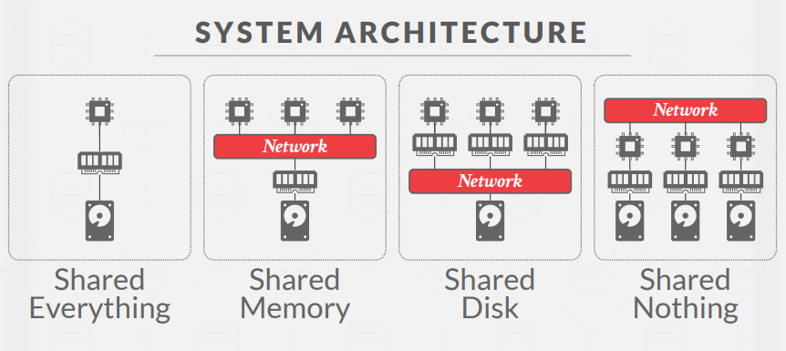
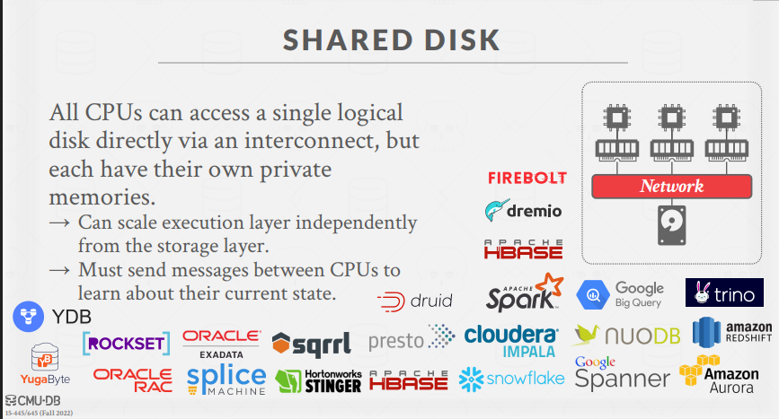
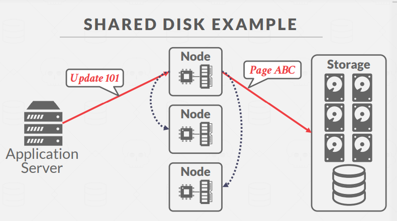
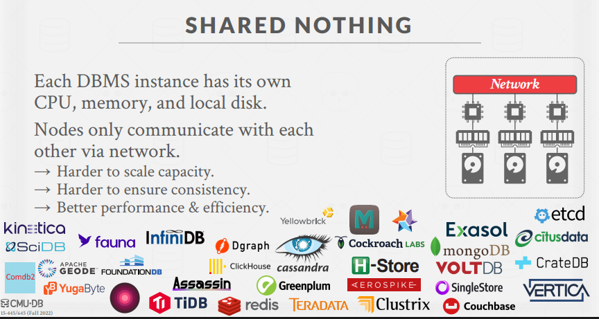
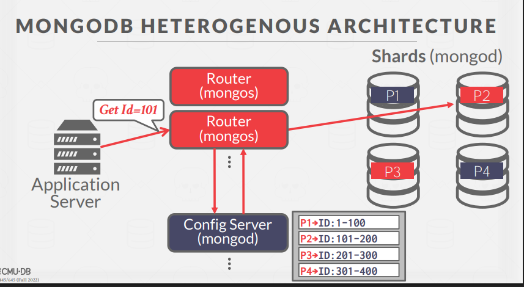
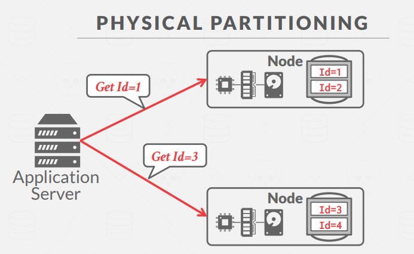
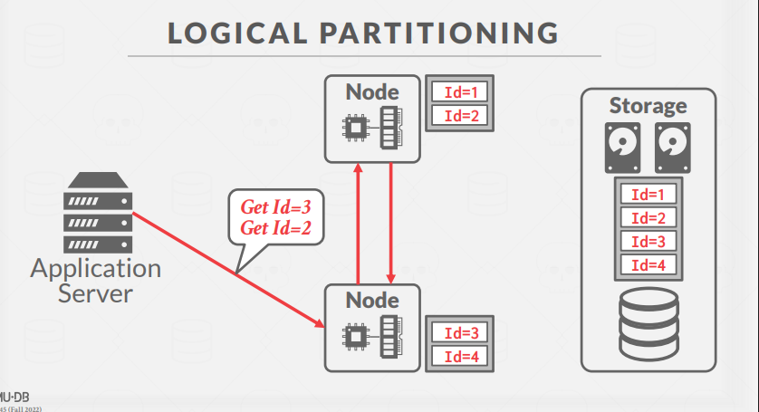
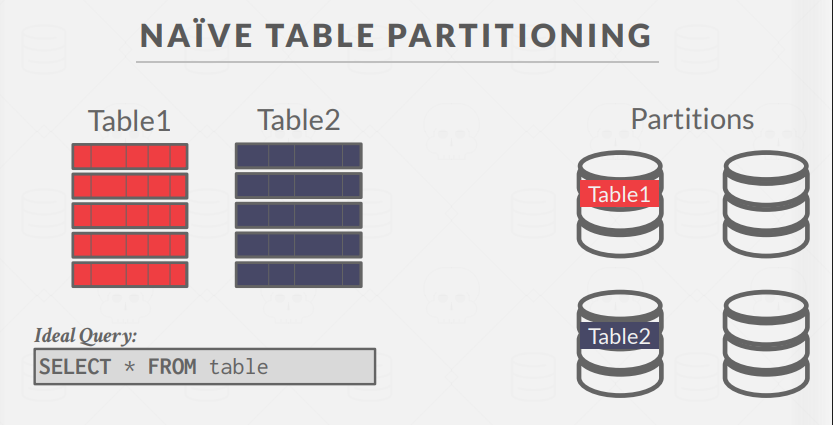
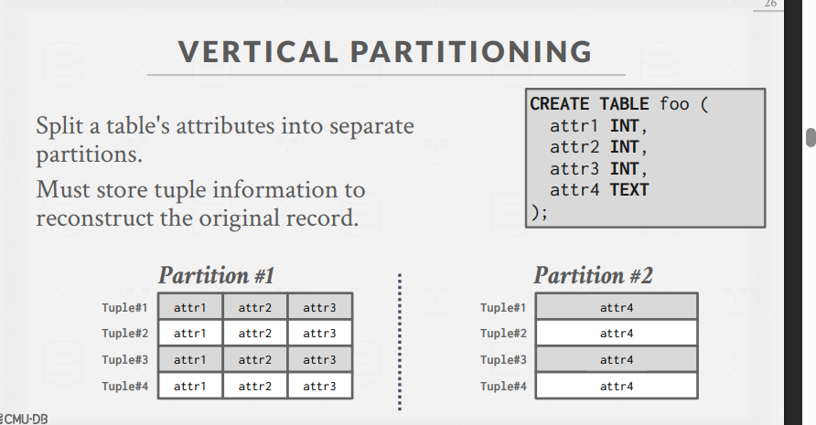
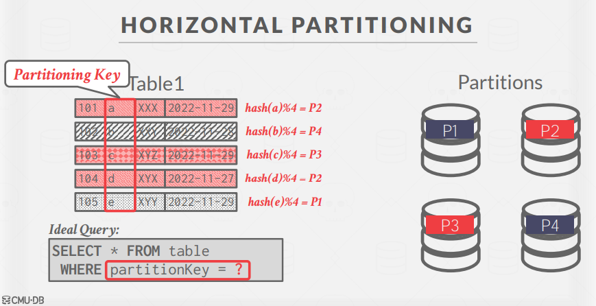

# 分布式数据库系统笔记

## 一、并行系统 vs. 分布式系统

两者的主要区别：

| 并行 DBMS                | 分布式 DBMS             |
| ------------------------ | ----------------------- |
| 节点物理上相互靠近       | 节点可能相距较远        |
| 通过高速局域网通信       | 通过较慢的公共网络通信  |
| 通信成本被假定为低且可靠 | `通信成本/问题不可忽视` |

## 二、系统架构

分布式 DBMS 的系统架构决定了 CPU 之间如何协调以及在哪里检索/存储数据库对象：

### 1. 共享内存 (Shared Memory)

- CPU 通过快速互连访问公共内存地址空间
- 每个处理器对所有内存数据结构有全局视图

分布式用的极少

### 2. 共享磁盘 (Shared Disk)

- 所有 CPU 可通过互连直接访问单个逻辑磁盘，但各自有私有内存
- 存储层和执行层可独立扩展
- 例如：Oracle RAC

云场景用的多；`计算节点和存储节点分离。`
缓存同步问题。

### 3. 无共享 (Shared Nothing)

- 每个 DBMS 实例有自己的 CPU、内存和本地磁盘
- 节点只通过网络通信
- 扩展性较难但性能和效率更好
- 例如：大多数分布式数据库系统

一致性问题。

---

设计需要考虑的问题(design issues)

- 向哪个节点请求
- 如何执行sql语句
  - push -> 汇总各个节点结果
  - pull -> 拉到集中节点处理
- 如何保障一致性
- 如何分区

## 三、数据分区策略

### 1. 表级分区

- 将整个表分配给单个节点
- 假设每个节点有足够存储空间容纳整张表
- 适合不跨表连接查询和访问模式均匀的场景

### 2. 垂直分区

- 按照属性(列)拆分表
- 必须存储元组信息以重建原始记录

### 3. 水平分区 (分片/Sharding)

- 基于某些分区键将表的元组拆分为不相交的子集
- 分区方案包括：
  - **哈希分区**：均匀分布数据，但不适合范围查询
  - **范围分区**：适合范围查询，但可能导致热点
  - **谓词分区**：基于条件表达式

### 4. 一致性哈希 (Consistent Hashing)

- 解决普通哈希在节点增减时大量数据迁移的问题
- 减少在节点变化时需要重新映射的键数量
- 在分布式缓存和 NoSQL 系统中广泛使用

## 四、事务协调

分布式环境中处理事务的两种方法：

### 1. 中心化协调器

- 全局"交通警察"控制事务
- 例如：TP Monitor，X/Open XA 标准

### 2. 去中心化协调器

- 节点自组织协调事务
- 通常一个节点被选为临时领导者

## 五、分布式并发控制

允许多个事务在多个节点上同时执行，面临的挑战：

- 数据复制
- 网络通信开销
- 节点故障
- 时钟偏移

分布式 2PL（两阶段锁定）需要处理跨节点锁请求和死锁检测。

---

下面是对你提供内容的结构化讲解，帮助你理解分布式数据库系统中的同质/异质架构、分区、透明性、协调等核心概念：

---

- 其他概念

  ## 1. 同质节点(HOMOGENOUS) vs. 异质节点(HETEROGENOUS)

  - **同质（Homogenous）**：集群中`每个节点都能做所有类型的任务`（比如都能存储数据、处理请求），这样部署和故障切换更简单。
  - **异质（Heterogenous）**：每个`节点分工不同`，比如有的专门做路由（mongos），有的专门存数据（shard），有的专门做配置（config server）。可以让一台物理机承担多种“虚拟”角色。

  **MongoDB 架构举例**：

  

  - mongos（路由器）、mongod（分片和配置服务器）

  ***

  ## 2. 数据透明性(Data Transparency)

  - 理想：应用不需要知道数据物理存储在哪个节点，`查询结果和单机一样。`
  - 现实：开发者还是要关注跨节点通信的代价，避免产生大量数据移动。

  ***

  ## 3. 数据分区（Data Partitioning）

  - **目的**：把数据库拆分到多个资源（磁盘、节点、CPU）上，提高扩展性。

  - **方式**：
    - 物理分区（shared nothing）：每个节点独立存储一部分数据。
      
    - 逻辑分区（shared disk）：多个节点共享存储。
      

  分区(Partitioning)是“怎么切”，分片(Sharing)是“切完分到不同机器”。
  Sharding = 分布式的水平分区。

  ### 分区类型

  1. **Naive Table Partitioning**：整张表放一个节点，适合表不大且访问均匀。
     
  2. **垂直分区（Vertical Partitioning）**：按列分，把表的不同属性分到不同分区，需要额外信息重组原始记录。
     
  3. **水平分区（Horizontal Partitioning）**：按行分，把表的不同记录分到不同分区，常用哈希、范围、谓词等方式。
     

  ***

  ## 4. 一致性哈希（Consistent Hashing）

  - 解决节点动态增减时数据迁移量大的问题。
  - 把节点和数据都映射到一个环上，数据分配给顺时针遇到的第一个节点。
  - 支持副本（Replication Factor），提高容错。

  ***

  ## 5. 单节点 vs. 分布式事务

  - **单节点事务**：只访问一个分区，协调简单。
  - **分布式事务**：跨多个分区，需要复杂的协调和一致性协议。

  ***

  ## 6. 事务协调方式

  - **集中式（Centralized）**：有一个全局协调者（如TP Monitor），所有锁和提交请求都通过它。
  - **去中心化（Decentralized）**：节点间自组织协调（如Raft、Paxos等）。

  ***

  ## 7. 分布式并发控制

  - 多节点并发执行事务更难，需考虑复制、网络延迟、节点故障、时钟漂移等问题。
  - 可以扩展单机的2PL等协议，但实现更复杂。

  ***

  ## 记忆建议

  - **同质/异质**：全能/分工。
  - **分区**：按表、按列、按行分。
  - **透明性**：理想不关心位置，现实要关注代价。
  - **协调**：中心化像“交通警察”，去中心化像“自治小组”。
  - **一致性哈希**：环形分配，节点变动影响小。
