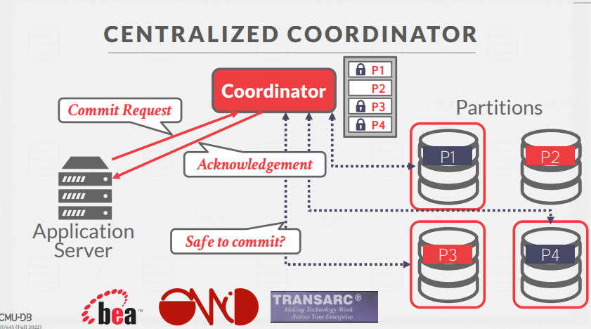
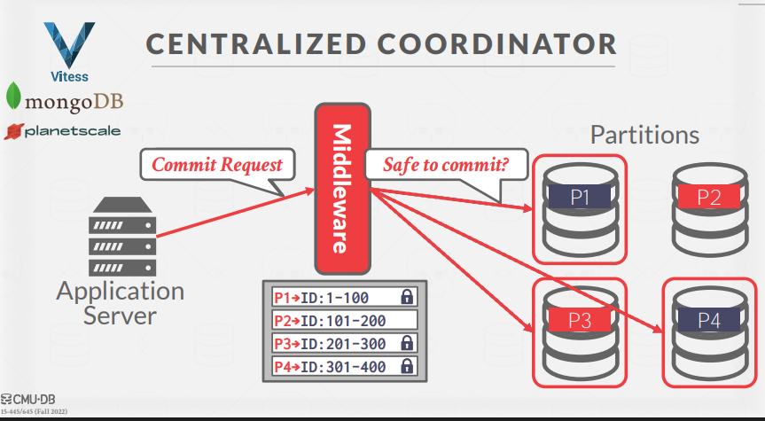
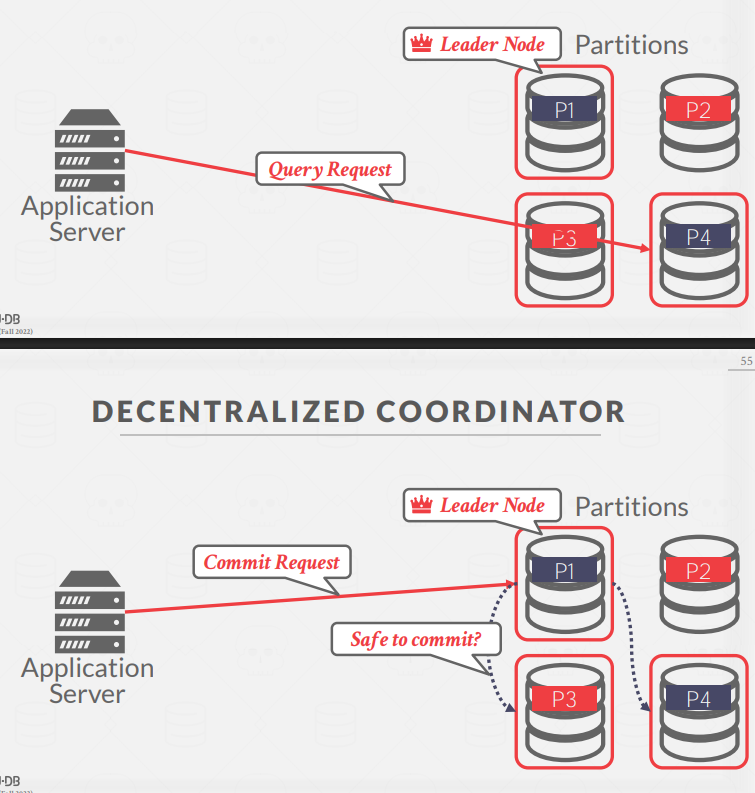

下面详细讲解 TP Monitor、集中式/去中心化协调器，以及分布式并发控制的核心思想和流程。

---

## 1. 集中式协调器（Centralized Coordinator）

用的不太多，单点问题

**工作流程**

1. **应用服务器**发起事务请求。
2. **协调器**统一分发锁请求到各个分区（P1、P2、P3、P4）。
3. 各分区返回锁定结果，协调器收集后通知应用服务器。
4. 提交时，协调器向所有分区发出“可以提交吗？”的请求。
5. 所有分区确认后，协调器通知正式提交。

**优点**

- 事务管理逻辑集中，易于实现一致性和原子性。
- 死锁检测、锁管理等都可以统一处理。

**缺点**

- 协调器单点故障风险。
- 扩展性有限，协调器可能成为瓶颈。

---

TP Monitor（Transaction Processing Monitor）是一种集中式协调器，用于管理分布式数据库系统中的事务。

- 早期用于主机和终端之间的事务（如ATM、航空订票）。
- 典型协议：X/Open XA（90年代标准）。

- 统一管理分布式事务的开始、锁定、提交、回滚等操作。
- 保证分布式环境下的原子性、一致性。

---

## 3. 去中心化协调器（Decentralized Coordinator）

**工作流程**

1. 应用服务器向某个节点（Leader Node）发起事务请求。
2. Leader Node 负责协调本次事务，和涉及的分区直接通信。
3. 查询、锁定、提交等操作由 Leader Node 组织，分布式协作完成。

**优点**

- 没有单点瓶颈，系统更易扩展。
- 容错性更好。

**缺点**

- 协调逻辑复杂，节点间需要更多通信。
- 死锁检测、全局一致性更难实现。

---

## 4. 分布式并发控制（Distributed Concurrency Control）

**目标**

- 允许多个事务在多个节点上同时安全执行，保证一致性。

**难点**

- 节点间网络通信延迟大(Network Communication Overhead).
- 节点可能宕机或网络分区(Node Failures).
- 时钟不同步（Clock Skew）.
- 数据副本同步（Replication）.

**常用协议**

- 分布式两阶段锁（Distributed 2PL）：各节点本地加锁，协调器统一管理锁的分配和释放。
- 分布式死锁检测：如 Waits-For 图，检测跨节点的死锁。

**流程举例**

- T1 在 Node1 上锁 A，T2 在 Node2 上锁 B。
- T1 想锁 B，T2 想锁 A，形成跨节点死锁。
- 需要全局死锁检测机制来打破死锁。

---

## 总结记忆

- **集中式协调器**：所有事务调度都走一个“交通警察”。
- **去中心化协调器**：每次事务选一个“组长”临时协调。
- **分布式并发控制**：多节点并发更难，需考虑网络、故障、时钟等问题。

---

**Distributed 2PL（分布式两阶段锁协议，Distributed Two-Phase Locking）** 是将经典的“两阶段锁协议（2PL）”扩展到分布式数据库系统中的一种并发控制方法。

---

## 2PL（两阶段锁）回顾

- **两阶段**：
  1. **加锁阶段（Growing phase）**：事务可以申请锁，但不能释放锁。
  2. **解锁阶段（Shrinking phase）**：事务只能释放锁，不能再申请新锁。
- **保证**：只要所有事务都遵守2PL，就能避免丢失更新、脏读等并发问题，实现串行化调度。

---

## 分布式 2PL 的含义

- **场景**：一个事务可能跨多个节点/分区访问和修改数据。
- **做法**：每个节点本地实现2PL，节点之间通过协调器（集中式或去中心化）协同加锁和释放锁。
- **全局死锁检测**：因为锁分布在多个节点，可能出现跨节点死锁，需要全局检测和处理。

---

## 工作流程（简化版）

1. 事务在各节点上分别申请锁（如T1在Node1锁A，Node2锁B）。
2. 所有锁都获得后，事务执行操作。
3. 事务准备提交时，统一释放所有锁。
4. 期间如果有锁冲突，事务会等待，可能形成分布式死锁。

---

## 关键点

- **分布式2PL** = 各节点本地2PL + 全局协调/死锁检测
- 保证分布式事务的串行化隔离级别
- 死锁处理比单机复杂

---

**一句话记忆**：  
Distributed 2PL 就是在分布式环境下，所有节点一起遵守“两阶段锁”规则，实现全局一致的并发控制。
