# 分布式 OLAP 数据库系统

## 一、分离式环境与决策支持系统

### 1. 分离式环境 (Bifurcated Environment)

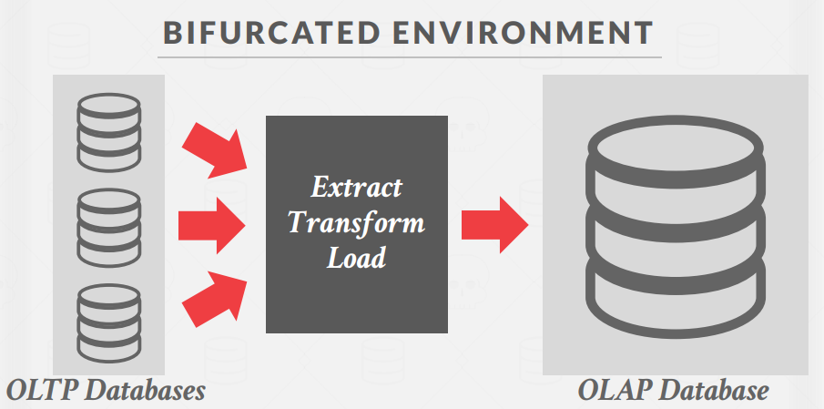
现代数据系统通常将交易处理和分析处理分开：

- OLTP 数据库处理日常事务
- 数据通过 ETL（提取、转换、加载）过程移至 OLAP 系统
- OLAP 数据库专门针对复杂查询和分析进行优化

### 2. 决策支持系统 (Decision Support Systems)

决策支持系统用于帮助组织的管理、运营和规划层面，通过**分析历史数据来辅助决策制定**。主要数据组织模型包括：

- 星型模式 (Star Schema)
  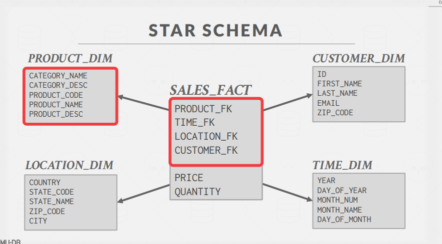

- 雪花模式 (Snowflake Schema)
  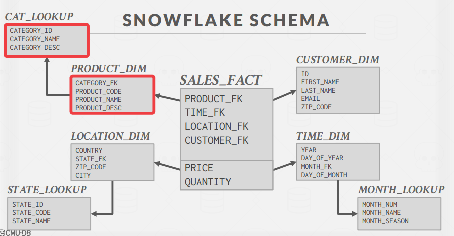

## 二、数据模型

### 1. 星型模式

- 由一个中央事实表和多个维度表组成
- 事实表包含业务过程的度量和指标以及指向维度表的外键
- 维度表包含描述性属性
- 结构简单，查询性能优良

```
事实表(SALES_FACT)──┬──维度表(PRODUCT_DIM)
                   ├──维度表(TIME_DIM)
                   ├──维度表(LOCATION_DIM)
                   └──维度表(CUSTOMER_DIM)
```

### 2. 雪花模式

- 星型模式的规范化形式
- 维度表被进一步分解为多层次的表
- 减少数据冗余，但增加了连接操作

```
事实表(SALES_FACT)──┬──维度表(PRODUCT_DIM)────────类别表(CAT_LOOKUP)
                   ├──维度表(TIME_DIM)──────────月份表(MONTH_LOOKUP)
                   ├──维度表(LOCATION_DIM)─────州表(STATE_LOOKUP)
                   └──维度表(CUSTOMER_DIM)
```

### 3. 星型 vs 雪花模式

| 问题       | 星型模式           | 雪花模式         |
| ---------- | ------------------ | ---------------- |
| 规范化程度 | 低（非规范化）     | 高（规范化）     |
| 存储空间   | 较大               | 较小             |
| 查询复杂性 | 简单（较少连接）   | 复杂（较多连接） |
| 查询性能   | 通常更快           | 通常更慢         |
| 数据完整性 | 可能存在一致性问题 | 更好的数据一致性 |

## 三、执行模型(Execution Model)

分布式 OLAP 系统中查询处理的两种基本方法：

### 1. Push 查询到数据（推模型）

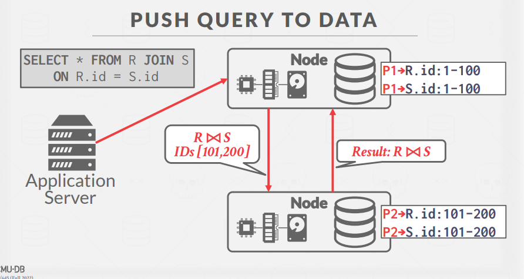

- 将查询（或部分查询）发送到包含数据的节点
- 在数据所在节点执行尽可能多的过滤和处理操作
- 减少网络传输数据量
- 优点：减少网络传输，可处理大量数据
- 缺点：需要在各节点维护完整的查询执行能力

### 2. Pull 数据到查询（拉模型）

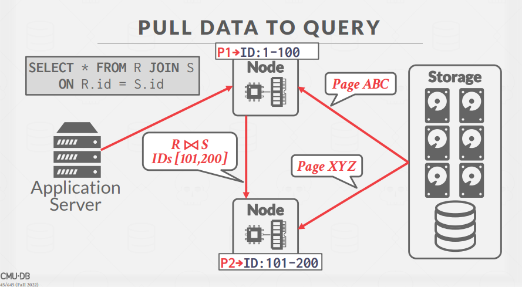

- 将数据从存储节点拉取到执行查询的节点
- 适合当查询处理复杂且数据相对较小的情况
- 优点：查询处理逻辑集中，易于管理
- 缺点：可能导致大量数据传输

### 3. 缓存考虑

- 从远程节点接收的数据缓存在缓冲池中
- 允许中间结果大于可用内存
- 临时页面在重启后不会持久化

## 四、查询规划与容错

### 1. 查询容错(Query Fault Tolerance)

大多数共享无关系分布式 OLAP 数据库假设查询执行期间节点不会失败：

- 如果一个节点在查询执行期间失败，整个查询失败
- `可以通过对查询中间结果创建快照，便于恢复`
- 查询失败恢复通常不是优先考虑的特性

用的不太多

### 2. 查询规划(Query Planning)

分布式环境中的查询优化需要考虑：

- 谓词下推
- 早期投影
- 最优连接排序
- 数据的物理位置
- 网络传输成本

### 3. 查询计划片段

将查询计划分解为特定分区的片段有两种方法：

#### 物理操作符方法

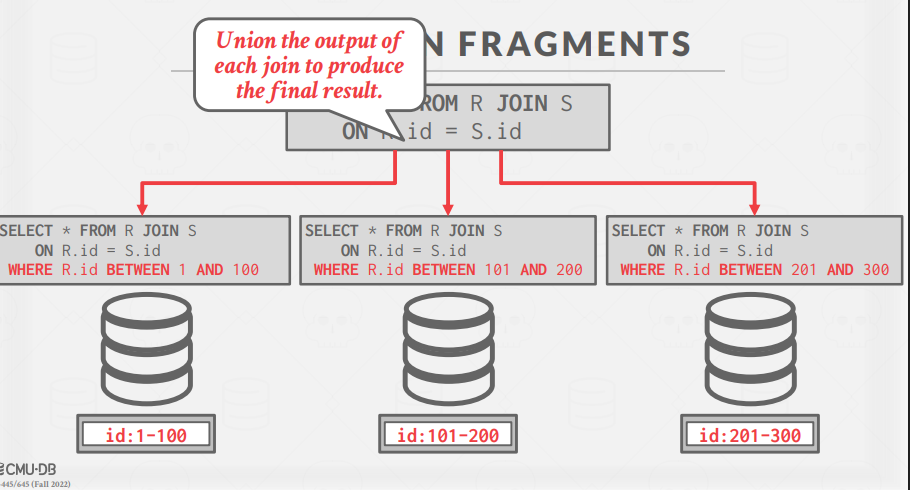

- 生成单一查询计划，然后分解为特定分区的片段
- 大多数系统采用这种方法

#### SQL 重写方法

用的少

- 将原始查询重写为特定分区的查询
- 允许在每个节点进行本地优化
- 仅少数系统（如 SingleStore、Vitess）使用此方法

## 五、分布式连接算法

分布式连接算法的效率取决于目标表的分区方案。针对不同场景有不同的连接策略：

### 1. 情景一：表复制

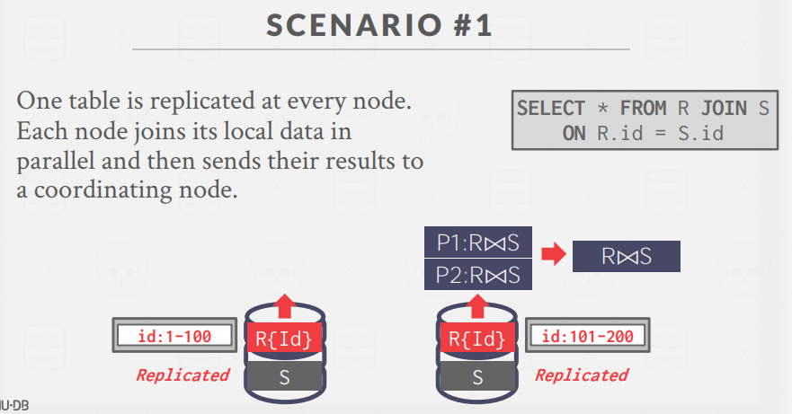

- `一张表在每个节点上都有副本`
- 每个节点并行连接其本地数据
- 然后将结果发送到协调节点

### 2. 情景二：按连接属性分区

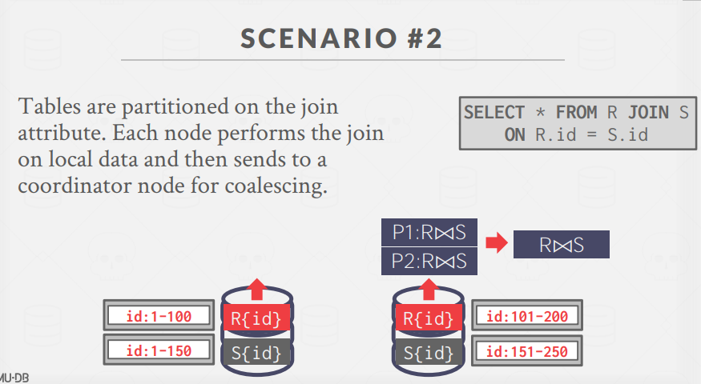

- `表按连接属性分区`
- 每个节点执行本地数据上的连接
- 将结果发送到协调节点进行合并

### 3. 情景三：小表广播

- 两张表按不同键分区
- `如果一张表较小，则将其"广播"到所有节点`
- 在每个节点执行本地连接

### 4. 情景四：数据重新分布

- 两张表不是按连接键分区
- `DBMS 通过"洗牌"将表复制到各节点`
- `实现按连接键的重分区`
- 然后在每个节点执行本地连接

### 5. 半连接优化

- 半连接(Semi-Join)是一种`只包含左表列`的连接类型
- 分布式数据库使用半连接最小化连接时发送的数据量
- 类似于投影下推优化
- 可通过 EXISTS 子句实现：
  ```sql
  SELECT R.id FROM R
  WHERE EXISTS (SELECT 1 FROM S WHERE R.id = S.id)
  ```

## 六、云系统与现代趋势

### 1. 云系统

云供应商提供数据库即服务(DBaaS)，这是托管的 DBMS 环境：

都是虚拟服务器
Newer systems are starting to blur the lines
between shared-nothing and shared-disk.
→ Example: You can do simple filtering on Amazon S3 before copying data to compute nodes.

#### 托管 DBMS(Managed DBMS)

- DBMS 没有明显修改以"知道"它在云环境中运行
- 例子：大多数供应商提供的传统数据库服务

#### 云原生 DBMS(Cloud-Native DBMS)

- 专门设计用于运行在云环境中
- 通常基于共享磁盘架构(shared-disk)
- 例子：Snowflake、Google BigQuery、Amazon Redshift、Microsoft SQL Azure

### 2. 无服务器数据库(Serverless DBMS)

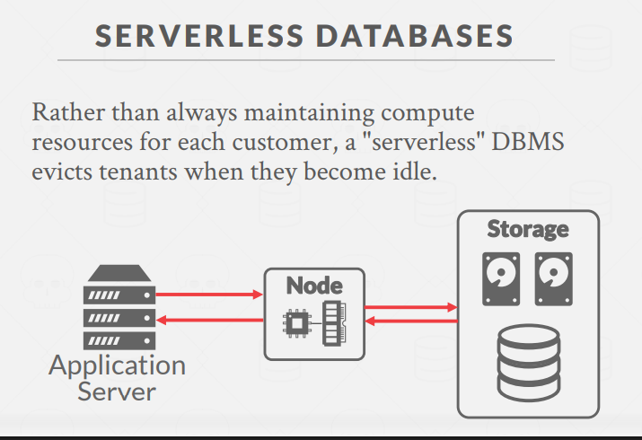
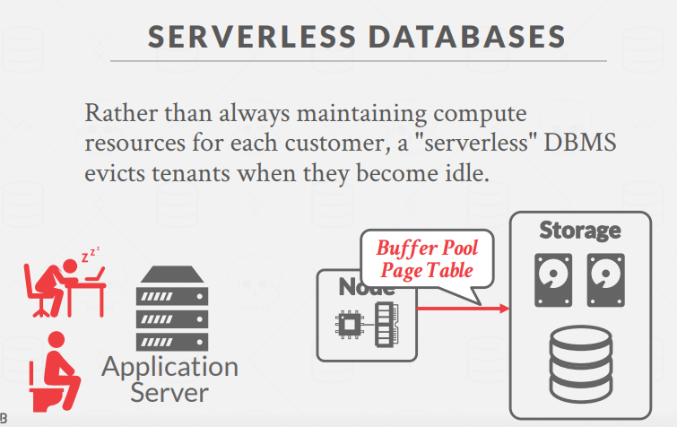
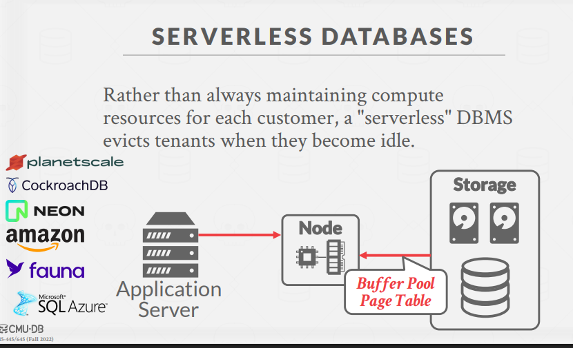

- `计算与存储分离`
- 不为每个客户持续维护计算资源
- 在租户空闲时将其驱逐
- `按需`分配资源并按使用付费
- 减少空闲资源成本

### 3. 数据湖(Data Lakes)

- 用于存储大量结构化、半结构化和非结构化数据的仓库
- 无需预先定义模式或将数据导入专有内部格式
- 支持跨多个系统分析数据
- 例如：S3、HDFS、Azure Data Lake

### 4. 通用数据格式(Universal Formats)

新的开源二进制文件格式使得跨系统访问数据更容易：

- **Apache Parquet**：来自 Cloudera/Twitter 的压缩列式存储
- **Apache ORC**：来自 Apache Hive 的压缩列式存储
- **Apache CarbonData**：来自华为的带索引的压缩列式存储
- **Apache Iceberg**：来自 Netflix 的支持模式演化的灵活数据格式
- **HDF5**：用于科学工作负载的多维数组
- **Apache Arrow**：来自 Pandas/Dremio 的内存压缩列式存储

### 5. 组件分离

现代分布式 OLAP 系统往往采用分离的组件：

- **系统目录**：HCatalog、Google Data Catalog、Amazon Glue Data Catalog
- **节点管理**：Kubernetes、Apache YARN、云供应商工具
- **查询优化器**：Greenplum Orca、Apache Calcite

---

分布式 OLAP 数据库系统针对复杂分析查询进行了优化，随着云计算的普及，这个领域蓬勃发展。理解这些概念对于设计和管理大规模数据分析应用至关重要。

---

### 云原生（Cloud-Native）是什么？

- **云原生** 就像是“为云而生”的软件，天生就适合在云上跑。
- 它会自动适应云的弹性（人多就多开机器，人少就自动缩减），自动修复、自动升级，像乐高一样可以灵活拼装和拆分。
- 常用微服务、容器（如 Docker）、Kubernetes 这些现代技术。

---

### Managed（托管型）和云原生的本质区别

- **Managed（托管型）**：

  - 传统软件搬到云上，由云厂商帮你打理（比如帮你备份、升级、监控），但软件本身还是原来的那一套。
  - 就像把你家电脑搬到别人家，请人帮你维护。

- **云原生**：
  - 软件一开始就是为云环境设计的，充分利用云的弹性、自动化和分布式能力。
  - 就像直接住进智能公寓，所有设施都是自动化、可扩展的。

---

### 总结口诀

**托管是“搬家”，云原生是“为云而造”。**
