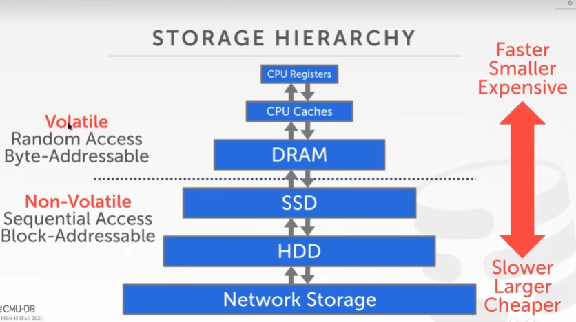
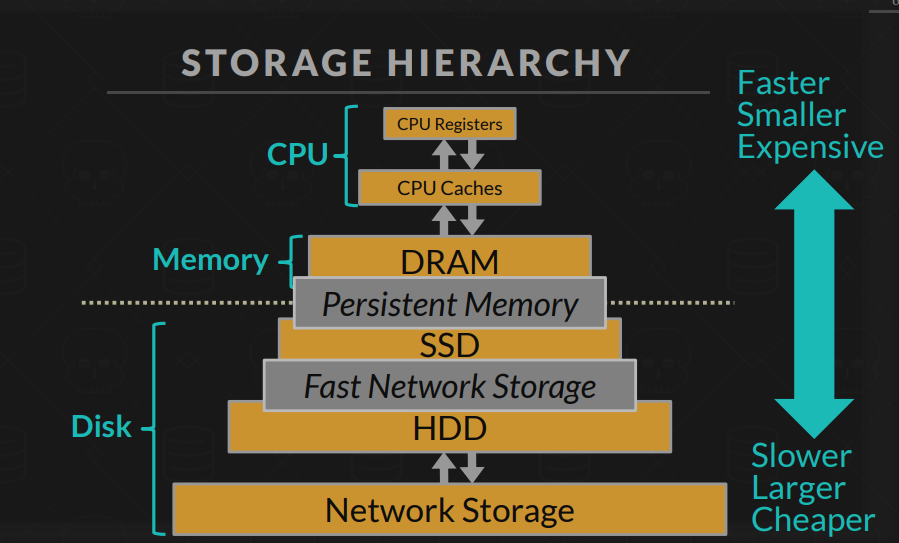
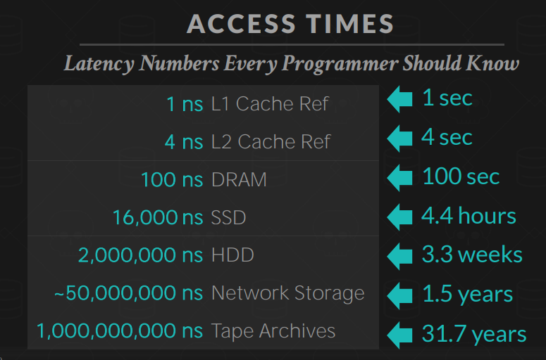
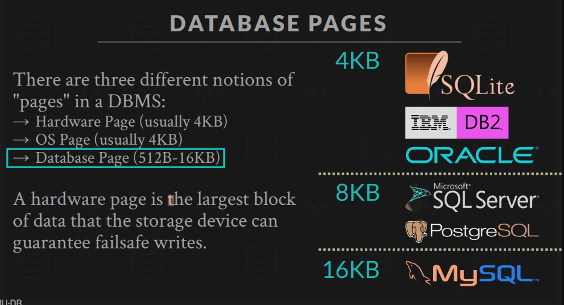
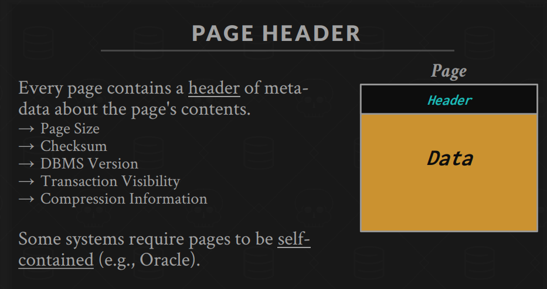
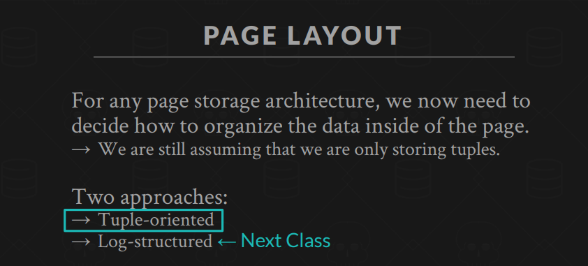
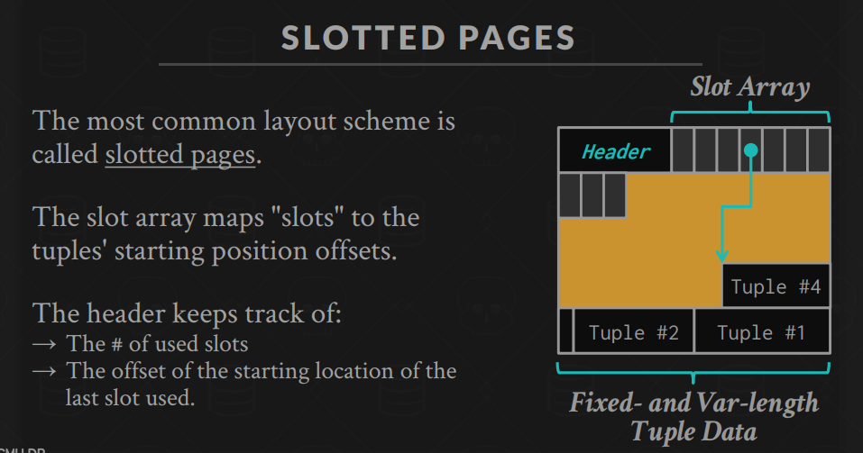
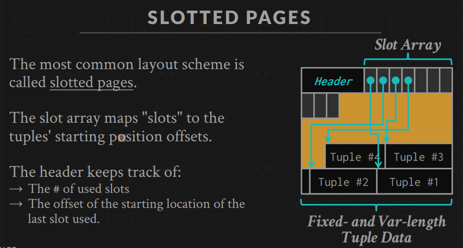
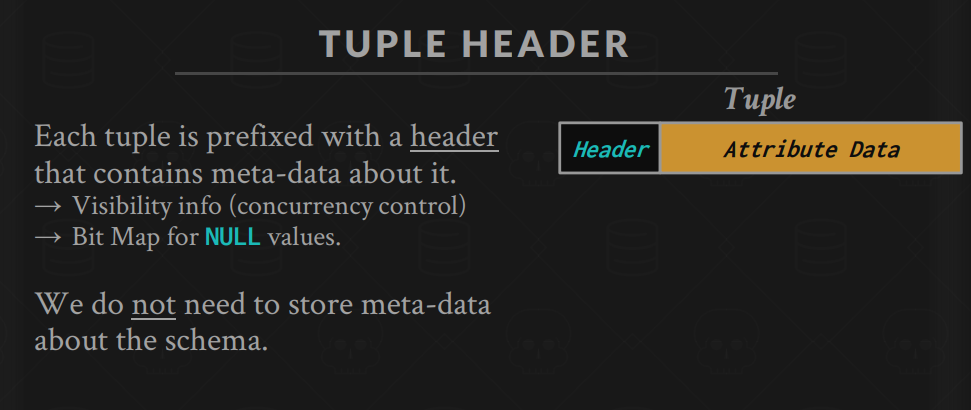
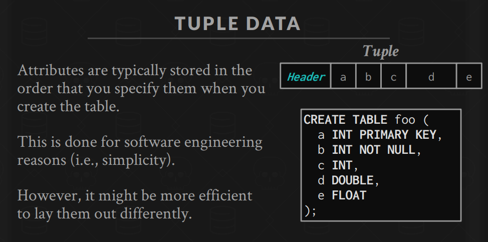

# Lecture 3、4 Database Storage 讲解笔记

现代数据库系统中，存储引擎扮演着至关重要的角色。CMU-15-445 课程中前几讲会详细讨论数据库如何在磁盘和内存之间管理数据。这里主要讲解 Lecture 3（数据库存储 I）与 Lecture 4（数据库存储 II）的核心内容。

---

## Lecture 3: 数据库存储 I – 存储基础与页面组织

### 1. 存储设备与存储层次

- **存储层次**：  
  数据库数据物理上存储在磁盘上，但为了提高访问效率，会利用内存作为缓冲。整个存储层次通常包括：
  - **磁盘**：持久存储，容量大，但访问速度慢（有寻道时间、旋转延迟）。
  - **缓冲池**：内存中预先加载磁盘页，减少频繁磁盘 I/O，提升性能。

### 2. 页面（Page）与页组织

- **页面概念**：  
  数据库把磁盘存储的基本单位定义为**页面**（通常为 4KB 或 8KB）。每个页面存储若干记录及页头元数据。
  > 注意这个页面不是操作系统的页面，而是数据库自定义的存储单位。
- **页结构设计**：  
  常见的设计是**槽页（Slotted Page）**结构：
  - 页头保存页内元数据（如记录数、空闲空间指针等）；
  - 槽目录（slot directory）记录每个记录在页面中的偏移和长度，支持可变长度记录和删除操作时避免大量移动数据。

### 3. 文件组织与数据存储

- **堆文件（Heap File）**：  
  数据库常采用堆文件来存储数据，即将记录以无特定顺序存放在页面中，新记录通常填入已有空闲空间或追加新的页面。
- **页替换策略**：  
  当缓冲池中的页面全部被占用时，数据库系统通过替换算法（如 LRU、CLOCK 等）选择合适的页面写回磁盘以腾出空间。

---

## Lecture 4: 数据库存储 II – 内存管理与存储分配

### 1. 记录的存储格式

- **定长与变长记录**：
  - **定长记录**：每条记录长度固定，存取简单，但浪费空间。
  - **变长记录**：例如含有 VARCHAR 字段的记录，长度不定，常采用槽页结构管理。
- **槽页机制**：  
  在槽页中，记录实际存放在页内的某个位置，而槽目录记录每条记录的具体位置和长度。当记录被删除时，只需要将对应槽标记为空，避免移动整个页面数据。

### 2. 内存分配与对齐

- **内存管理**：  
  数据库在内存中管理数据页时，需要合理规划内存分配，以避免频繁的分配/释放造成碎片。
- **字节对齐**：  
  为提高 CPU 访问效率，通常会对结构体和记录进行字节对齐，确保数据按照适当的边界存放，减少额外 CPU 处理开销。

### 3. 存储分配策略

- **内存再利用**：  
  数据库会采用空闲页列表、空闲空间管理等机制，以便在插入新记录时快速定位有足够空间的页面，减少碎片和频繁的磁盘 I/O。
- **压缩与列式存储预告**：  
  虽然 Lecture 4 主要讨论行存储中的内存管理，但课程也会提及数据压缩技术和列存储的优势，为后续讲解做铺垫。

---

## 总结与记忆要点

- **Lecture 3 重点**：

  - 数据存储层次：磁盘与内存缓冲池。
  - 页面组织：页（page）作为基本存储单位，槽页结构支持可变长度记录。
  - 文件组织：堆文件存储，缓冲池和页替换算法保证高效 I/O。

- **Lecture 4 重点**：
  - 记录存储格式：定长 vs. 变长，槽页机制。
  - 内存管理：内存分配、对齐策略、空闲空间管理。
  - 存储分配策略：如何减少碎片和提升存储利用率，为插入、删除操作做支持。

**一句话记忆**：

> “存储从磁盘到内存，页面做基本单位；槽页管理记录位置，空闲页再利用。”

这两讲帮助我们理解数据库如何在物理层面管理数据，如何将磁盘数据按页面组织到内存中，并且通过各种内存管理与分配策略，实现高效的数据存取和维护。

---

We now understand what a database looks like at a logical level and how to write queries to read/write data (e.g., using SQL).
We will next learn how to build software that manages a database (i.e., a DBMS)

Query Planning
Operator Execution
Access Methods
Buffer Pool Manager
Disk Manager <- We are here

---

- The DBMS assumes that the primary storage location of the database is on `non-volatile` disk.The DBMS's components `manage the movement of data between non-volatile and volatile storage.`

- 存储分层(Storage Hierarchy)
  
  

  - CPU Registers
  - CPU Caches

  - DRAM(Dynamic Random Access Memory，动态随机存取存储器，内存)

  ***

  - SSD(Solid State Drive，固态硬盘)
  - HDD(Hard Disk Drive，机械硬盘)
  - Network Storage

- 访问延迟
  

  L1 Cache: 1ns
  L2 Cache: 4ns
  DRAM: 100ns
  SSD: 1.6e4ns
  HDD: 2e6ns
  Network Storage: 5e7ns

- Sequential vs Random Access

  - Sequential Access: 读取连续存储的多个数据块，速度快。
  - Random Access: 随机读取存储在不同位置的数据块，速度慢。

  - extent 指的是一次性连续分配多个数据页。相比单个页的分配，extent 能减少磁盘寻址和碎片问题，提高磁盘 I/O 效率。

- 数据库管理系统（DBMS）设计的几个关键目标：

  - **支持超出内存容量的数据库**  
    DBMS 需要管理的数据往往比系统内存大，因此必须设计机制在内存与磁盘之间高效地移动数据。
  - **磁盘 I/O 的高成本**  
    因为读写磁盘的操作非常昂贵，所以必须对磁盘访问进行精细管理，防止造成长时间停顿和性能下降。
  - **优化磁盘访问模式**  
    随机读写相比于顺序读写速度慢很多。DBMS 会尽力将数据的读取/写入操作设计成顺序访问，从而提高整体性能。

  mysql: DISK-ORIENTED DBMS
  redis: MEMORY-ORIENTED DBMS

- 为什么不使用操作系统(例如mmap)来管理内存？
  虽然 DBMS 可以利用操作系统的内存映射（mmap）功能，把文件内容映射到程序地址空间，但这并不是最优解，原因包括：

  - DBMS 需要以正确的顺序将`脏页刷新到磁盘`，而操作系统的调度策略往往不够具体。
  - DBMS 需要实现`专门的预取策略`，根据查询模式提前加载数据，优化磁盘访问。
  - DBMS 需要根据应用场景`定制缓冲区替换策略`，降低缓存失效带来的开销。
  - DBMS 需要对`线程/进程调度`做出优化决策，确保数据处理的实时性和稳定性。

  The OS is not your friend.

- **数据库存储两大关键问题**

  1. 静态：`如何在磁盘上的文件中表示数据库` -> **存储引擎** （We are here）

     - DBMS 需要设计一套策略，将数据库中的表、索引、日志等数据以合适的结构（如页面、区间（extent）等）存储在文件中。这关系到磁盘的物理布局、数据格式以及如何高效地查找和更新数据。

  2. 动态：`如何管理内存，并在磁盘和内存之间高效地移动数据` -> **缓冲池**
     - 由于数据量通常远超内存容量，DBMS 需要实现复杂的缓冲管理机制，如缓冲池、缓存替换算法、预取策略和脏页刷写（flush）机制，以保证在需要时数据可以快速地从磁盘加载到内存，以及在修改后及时写回磁盘，平衡 I/O 性能和数据一致性。

## 文件存储 (File Storage)

- **数据库文件**：DBMS 以自己的专有格式将数据库`存储在磁盘文件中`，操作系统并不理解这些文件的内容结构。
- **存储管理器(Storage Manager)**：负责管理数据库文件，执行读写调度以优化空间和时间局部性。It organizes the files as a `collection of pages.`
- **页面概念**：

  - 硬件页面（通常 4KB）：存储设备能保证原子写入的最大数据块
  - 操作系统页面（通常 4KB）
  - 数据库页面（512B-16KB）：DBMS 管理数据的基本单位
    

- **页面存储架构**：

  - **堆文件组织**：无序页面集合，元组随机存储
  - 树文件组织
  - 顺序/排序文件组织
  - 哈希文件组织

- **堆文件管理**：

  - 支持创建/获取/写入/删除页面
  - 使用页面目录追踪页面位置和可用空间

  It is easy to find pages if there is only a single file.
  Need meta-data to keep track of what pages exist in multiple files and which ones have free space.

## 页面布局 (Page Layout)

- **页面头部**：包含元数据（大小、校验和、DBMS版本、事务可见性信息等）
- **槽位页面(SLOTTED PAGES)**设计：
  

  slot 顺序存储，tuple 倒序存储

  - 最常用的页面内部布局
  - 使用`槽位数组映射到元组在页内的具体位置`
  - 便于处理`可变长度数据`
  - 支持高效的增删改操作

- **记录标识符（Record ID）**：
  - 通常由页面ID + 槽位/偏移量组成
  - 用于唯一标识数据库中的每个元组，仅内部使用，外部只能用主键等

## 元组(行记录)布局 (Tuple Layout)

A tuple is essentially a sequence of bytes.
It's the job of the DBMS to interpret those bytes into attribute types and values.

- **元组结构**：`字节序列`，由DBMS解释为属性类型和值
- **元组头部**：包含元数据（`事务可见性`信息、`NULL值位图`等）
- **数据存储**：默认按创建表时的列顺序存储
- **物理反规范化(denormalize)**：
  物理反规范化（Denormalized Tuple Data）是指：
  DBMS将逻辑上`应该分开存储在不同表中的相关数据（如有外键关系的记录），物理上预先连接并存储在同一个页。`
  主要特点：

  - 通过"预连接"（pre-join）减少查询时的I/O操作
  - 读取性能提升，特别是对于经常需要连接的数据
  - 更新操作可能变得更昂贵，因为可能需要修改多处数据
  - 这不是新技术，IBM System R在1970年代就应用了
  - 许多NoSQL数据库也使用类似技术，只是不称之为物理反规范化

  本质上是用空间换时间的存储策略，牺牲部分写入性能和存储空间来提高读取效率。

页上页：**数据库的页，到操作系统可能就是4个页，到磁盘可能就是4个块.**
