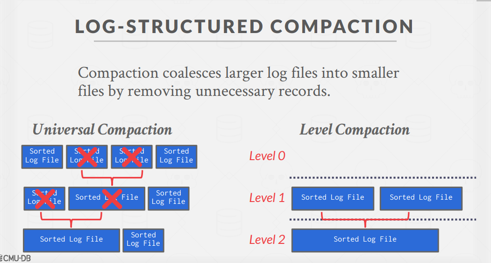
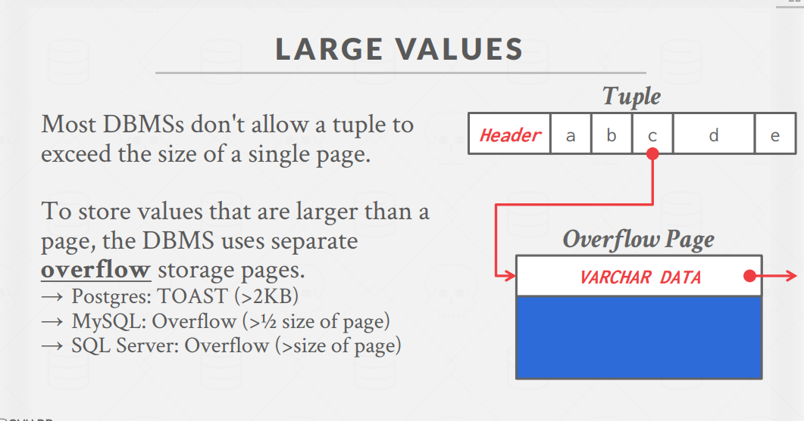
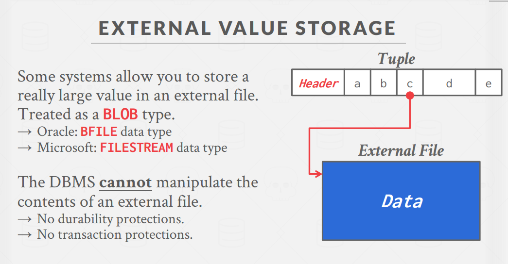
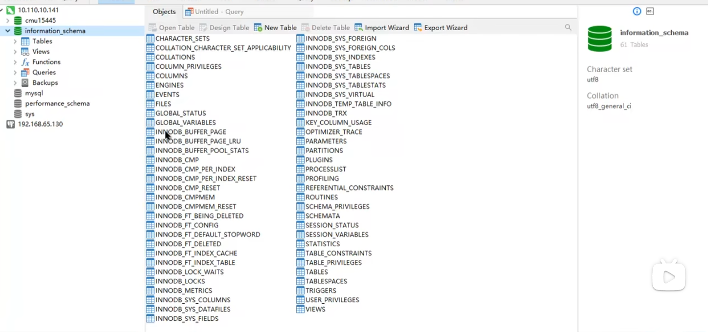
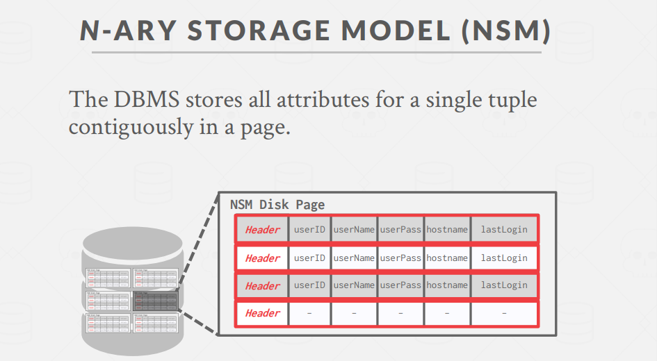
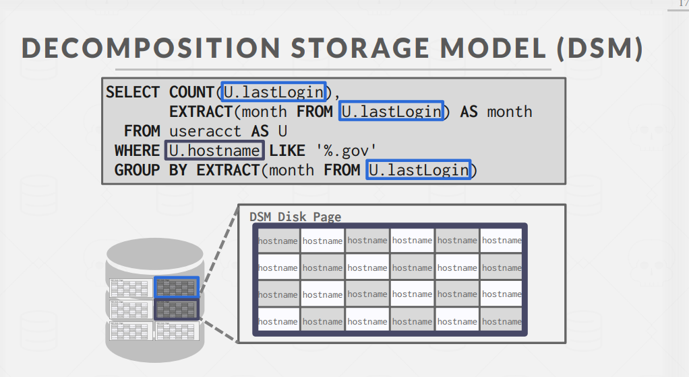

# 数据库存储引擎详解

## 一、磁盘导向与页导向架构

### 磁盘导向架构

- DBMS假设数据库主要存储在非易失性磁盘上
- 各组件负责管理数据在非易失性存储和易失性存储之间的移动

### 页导向架构操作流程

- **插入新元组**：

  1. 查询页目录找到有空闲槽的页
  2. 从磁盘加载页(如果不在内存中)
  3. 利用槽位数组找到页内空闲空间
  4. 写入新元组

- **更新现有元组**：

  1. 通过记录ID定位页
  2. 从磁盘加载页(如果不在内存中)
  3. 通过槽位数组找到页内偏移量
  4. 覆盖现有数据(如果新数据适合)

- **潜在问题**：
  1. 碎片化
  2. 无效的磁盘I/O
  3. 随机磁盘I/O(例如更新20页上的20个元组)

## 二、日志结构化存储 (Log-Structured Storage)

**适合kv数据库**

### 基本原理

- DBMS存储记录数据变更的日志记录(PUT, DELETE)
- 每条日志记录包含元组的唯一标识符
- 操作模式：总是追加新记录到日志文件末尾
- 页填满后写入磁盘，所有磁盘写入都是顺序性的
- 磁盘上的页是不可变的

### 读取操作

- 通过ID读取元组时，DBMS寻找对应该ID的最新日志记录
- 维护索引将元组ID映射到最新日志记录
- 从新到旧扫描日志直到找到相应记录

### 日志压缩

- 随着日志不断增长，DBMS需要`定期压缩页`减少浪费空间
- 压缩后，每个元组ID在页中最多出现一次
- 可以按ID顺序排序页提高未来查找效率(称为排序字符串表SSTables)
- 压缩类型：
  

  - 通用压缩：合并多个日志文件
  - 分级压缩：按层次管理不同大小的日志文件

  rocksdb: 7层

### 优缺点

- 优点：顺序写入、适合云存储和分布式文件系统
- `缺点：写放大(Write-Amplification)、压缩过程开销大(Compaction is Expensive)`

## 三、数据表示 (Data Representation)

pg的源码是最好的

### 基本数据类型

- INTEGER/BIGINT：C/C++原生表示
- FLOAT/REAL vs. NUMERIC/DECIMAL：
  - 变精度数值：采用IEEE-754标准，可能有舍入误差
  - 固定精度数值：用于不允许舍入误差的场景
    - PostgreSQL：使用自定义结构包含数字位数、权重、精度等
    - MySQL：存储小数点前后的位数和符号信息

### 大值存储

- 大多数DBMS**不允许元组超过单页大小**
- 对于超大值，使用单独的溢出存储页：
  - PostgreSQL：TOAST (>2KB)
  - MySQL：溢出页 (>页大小的一半)
  - SQL Server：溢出页 (>页大小)

### 外部值存储

- 某些系统允许将超大值存储在外部文件中
- 通常作为BLOB类型处理：
  - Oracle：BFILE数据类型
  - Microsoft：FILESTREAM数据类型
- DBMS无法操作外部文件内容：
  - 没有持久性保护
  - 没有事务保护

## 四、系统目录 (System Catalogs)

- DBMS在内部目录中存储`元数据`：
  - 表、列、索引、视图
  - 用户、权限
  - 内部统计信息
- 几乎所有DBMS都在自身内部以表的形式存储数据库目录
- 可通过`INFORMATION_SCHEMA`（SQL标准）查询系统目录
- 各DBMS也提供非标准快捷方式查询表结构

## 结论

- 日志结构化存储是传统页导向架构的替代方案
- 存储管理器与DBMS其他部分密切相关，不是完全独立的
- 各种存储策略有不同适用场景和权衡考量

---

# 数据库存储与工作负载优化详解

## 一、数据库工作负载类型

### 三种主要`工作负载`

1. **OLTP (联机事务处理)**

   - 特点：**快速**的操作，每次只读/更新少量数据
   - 使用场景：用户注册、订单处理、银行交易等日常操作
   - 查询示例：`UPDATE useracct SET lastLogin = NOW() WHERE userID = ?`

2. **OLAP (联机分析处理)**

   - 特点：**复杂**查询，读取大量数据计算聚合结果
   - 使用场景：商业智能、报表生成、趋势分析
   - 查询示例：`SELECT COUNT(*), EXTRACT(month FROM lastLogin) AS month FROM useracct GROUP BY month`

3. **HTAP (混合事务分析处理)**
   - 特点：在同一数据库实例上同时支持OLTP和OLAP
   - 使用场景：需要实时分析的业务

### 工作负载特征矩阵

- OLTP：简单操作 + `大量写入和少量读取`，Data Silos
- OLAP：复杂操作 + `大量读取和极少写入`，Data Warehouse
- HTAP：兼顾两者

## 二、数据存储模型

The DBMS can store tuples in different ways that are better for either OLTP or OLAP workloads.

### 行存储模型 (NSM - N-ary Storage Model)

- **基本原理**：将一条记录(元组)的所有属性连续存储在一个页中
- **优势**：
  - 适合OLTP工作负载
  - 单行数据访问高效
  - 插入、更新和删除操作快速
  - 适合需要整行数据的查询
- **劣势**：
  - 不适合扫描表的大部分内容或只需少数几列的查询
  - 在只需要少量列的查询中会浪费I/O带宽

### 列存储模型 (DSM - Decomposition Storage Model)

例如ClickHouse做列存储引擎

- **基本原理**：将表中单个列的所有值连续存储在页中
- **优势**：
  - 适合OLAP工作负载
  - 减少不必要的I/O，只读取查询需要的列
  - 更好的查询处理和数据压缩效率
  - 适合聚合和扫描大量数据的操作
- **劣势**：
  - 点查询、插入、更新和删除操作较慢（需要拆分/拼接元组）

### 元组标识(Tuple Identification)

列存储中处理元组标识的两种方式：

- **固定长度偏移(Fixed-length Offsets)**：每个列中的值具有相同长度；比如：第3行的数据在每个列中都是第3个位置
- **嵌入式元组ID(Embedded Tuple Ids)**：每个值与其元组ID一起存储在列中；比如：A列存储[(0,"Andy"), (1,"Bob"), (2,"Carl")]，B列存储[(0,25), (1,30), (2,45)]

## 三、数据压缩技术

- Data sets tend to have highly `skewed distributions` for attribute values.
  齐夫定律(Zipf's law)：`自然语言中单词频率与排名成反比`(二八原则，20%的内容可能占据了80%的访问量)

- Data sets tend to have high `correlation` between attributes of the same tuple.

### 压缩的必要性

- 减少I/O是提高性能的关键
- 压缩可增加每次I/O操作的数据利用率
- 压缩可能降低CPU成本`（尽管解压需要CPU，但减少的I/O可能更有益）`

### 压缩目标

1. 生成固定长度的值（除非是单独存储池中的可变长度数据）
2. 尽可能推迟解压（延迟实例化 - late materialization）
3. 必须是无损压缩方案

### 压缩粒度

1. **块级**：压缩同一表的元组块
2. **元组级**：压缩整个元组内容（仅NSM）
3. **属性级**：压缩单个元组内的单个属性
4. **列级**：压缩多个元组的一个或多个属性值（仅DSM）

### 列式压缩技术

1. **行程长度编码 (RLE)**

   - 将相同值的连续区域压缩为(值,开始位置,长度)三元组
   - 排序数据可显著提高压缩率
   - 例：MMFMFMMM → (M,0,2) (F,2,1) (M,3,1) (F,4,1) (M,5,3)

2. **位打包编码**

   - 当属性值小于声明的最大尺寸时，使用更小的数据类型存储
   - 例：存储1-100的值只需7位而不是64位

3. **位图编码**

   - 为属性的每个唯一值存储单独的位图，位图位置对应元组
   - 低基数属性（如性别）效果最佳
   - 例：性别列可变为两个位图M[11010111]和F[00101000]

4. **差分编码**

   - 存储连续值之间的差异而非完整值
   - 可与RLE结合使用进一步提高压缩率
   - 例：时间序列[12:00,12:01,12:02,12:03,12:04] → 12:00,(+1,4)

5. **增量编码**

   - **避免在连续元组间重复常见前缀/后缀**
   - **排序数据效果最佳**
   - 例："rob"→"robbed"→"robbing" → "rob"+""+"/bed"+"ing"

6. **字典压缩**
   - 构建映射`将变长值映射到较小的整数标识符`
   - 最广泛使用的压缩方案
   - 支持快速编码/解码
   - 可配置为保持原始排序顺序（ORDER-PRESERVING ENCODING）

## 结论

- 选择合适的存储模型至关重要：
  - OLTP → 行存储
  - OLAP → 列存储
- 字典编码最实用，不需要预排序
- 数据库存储本质是解决两个核心问题：
  1. 如何在磁盘文件中表示数据库
  2. 如何管理内存并在磁盘和内存之间移动数据
