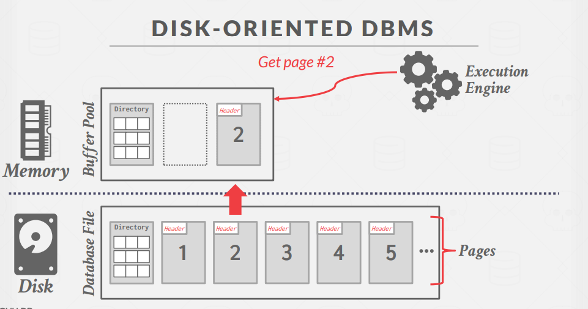
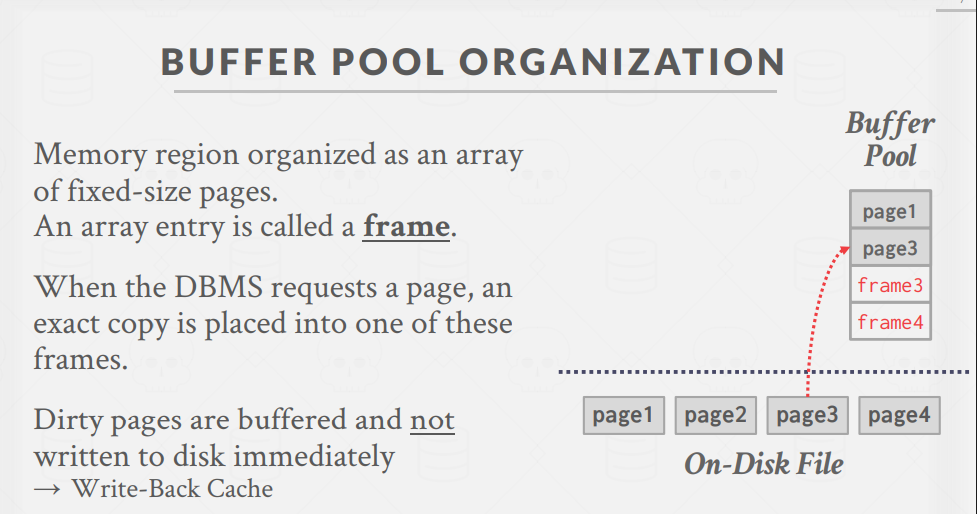
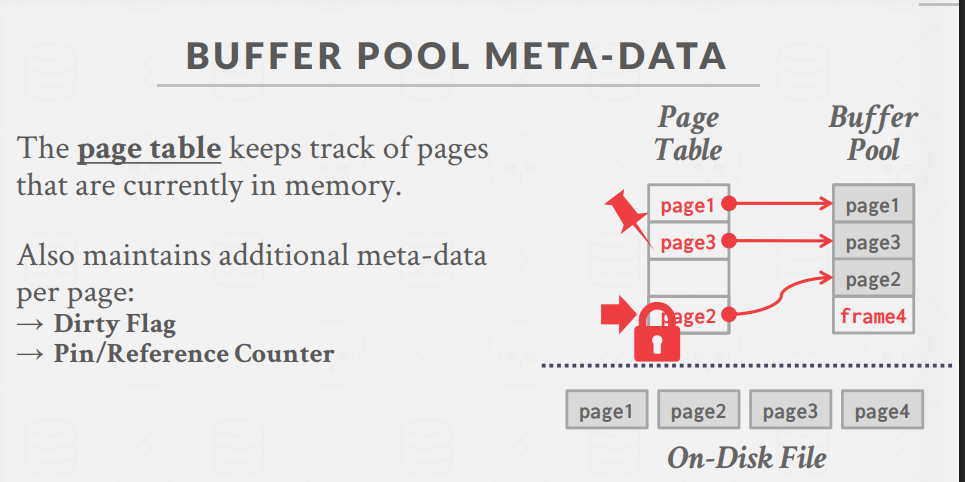
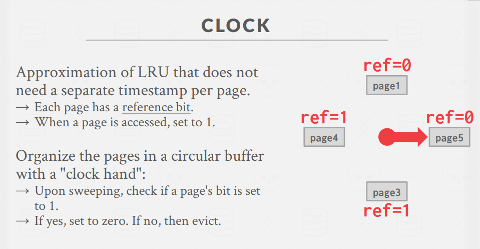

# BufferPool (缓冲池)

## 一、数据库存储管理基础

### 存储控制的两个维度

- **空间(spatial)控制**：决定在磁盘上何处写入页面

  - 目标是将经常一起使用的页面尽可能地物理存放在一起
  - 减少磁盘寻道时间，提高读取效率

- **时间(temporal)控制**：决定何时将页面读入内存以及何时将其写回磁盘
  - 目标是最小化因从磁盘读取数据而导致的等待时间
  - 通过智能调度读写操作提高性能

### 磁盘导向型DBMS工作流程

1. 数据库文件存储在磁盘上
2. 当执行引擎需要特定页面时，发出请求
3. 通过页目录查找页面位置
4. 将页面从磁盘加载到内存缓冲池中
5. 执行引擎操作内存中的页面副本

## 二、缓冲池机制与组织

### 缓冲池基本结构

- 缓冲池是一个组织为固定大小页面数组的内存区域
- 每个数组条目称为`"帧"(frame)`
- 当DBMS请求页面时，会将其精确副本放入帧中
- 脏页(修改过的页面)不会立即写回磁盘，采用回写缓存策略

### 缓冲池元数据

- **页表(page table)**：跟踪当前内存中的页面
- 每页维护额外元数据：
  - 脏标志(Dirty Flag)：标记页面是否被修改
  - 引用计数器(Pin/Reference Counter)：跟踪页面当前被多少操作使用

### 锁与闩锁的区别

- **锁(Locks)**：

  - 保护数据库的逻辑内容`不被其他事务访问`
  - 在整个事务期间持有
  - 需要支持回滚更改

- **闩锁(Latches)**：
  - 保护DBMS`内部数据结构的关键部分不被其他线程访问`
  - 仅在操作期间持有
  - 不需要支持回滚更改
  - 相当于互斥锁(Mutex)

### 页表(page table)与页目录(page directory)的区别

- **页目录**：映射页面`ID到数据库文件中的页面位置`
  - 所有变更必须记录在磁盘上，以便DBMS重启时能找到
- **页表**：映射页面ID到`缓冲池帧中的页面副本`
  - 这是内存中的数据结构，不需要存储在磁盘上

### 分配策略

- **全局策略**：为所有活动查询做决策
- **本地策略**：为特定查询分配帧，不考虑并发查询的行为
  - 仍需支持页面共享

## 三、缓冲池优化技术

Multiple Buffer Pools
Pre-Fetching
Scan Sharing
Buffer Pool Bypass

### 多缓冲池

- DBMS通常不只使用单个缓冲池，而是维护多个缓冲池实例：
  - 每个`数据库一个缓冲池`
  - 每种`页面类型一个缓冲池`
- 好处：减少闩锁竞争，提高局部性

### 多缓冲池实现方法

1. **对象ID方法**：

   - 在记录ID中嵌入对象标识符
   - 维护从对象到特定缓冲池的映射

2. **哈希方法**：
   - 对页面ID进行哈希来选择访问哪个缓冲池

### 预取(Pre-Fetching)

`类似CPU的预取指令`，DBMS可以预先加载页面到缓冲池中，以减少I/O延迟。

- DBMS可以基于查询计划预先加载页面
- 适用场景：
  - 顺序扫描：预知将扫描整个表
  - 索引扫描：预加载所需索引页面

### 扫描共享(Scan Sharing)

`类似离线查询的思路`

- 查询可以重用从存储中检索的数据或操作计算结果
- 允许多个查询附加到扫描表的单个游标上
  - 查询不必相同
  - 可以共享中间结果
- 优势：大幅减少I/O，提高并发查询的效率

### 缓冲池绕过(Buffer Pool Bypass)

`Light Scans`

- 顺序扫描操作`不会将获取的页面存储在缓冲池中，避免开销`
- 内存仅对运行的查询可用
- 适用于需要读取磁盘上连续大量页面的操作
- 也用于临时数据(排序、连接等)

### OS页面缓存

- 磁盘操作通常通过OS API进行
- 操作系统维护自己的文件系统缓存(页面缓存)
- **大多数DBMS使用直接I/O(O_DIRECT)绕过OS缓存**，原因是：
  - 避免页面的冗余副本
  - 避免不同的驱逐策略
  - 避免失去对文件I/O的控制

## 四、缓冲池替换(evict)策略

### LRU (Least-Recently Used)

- 维护每个页面最后访问时间的时间戳
- 当需要驱逐页面时，选择时间戳最老的页面
- 为减少驱逐时的搜索时间，保持页面按排序顺序

### CLOCK算法(近似的LRU)

- **LRU的近似实现，不需要为每个页面维护单独的时间戳**
- 每个页面有一个引用位(reference bit)
  - 页面被访问时，设置为1
- 页面组织在循环缓冲区中，有一个"时钟指针"
  - 扫描时，检查页面的引用位
  - 如果是1，设为0；如果是0，则驱逐

### 顺序扫描冲击(sequential flooding)问题

例如全表扫描

- LRU和CLOCK替换策略容易受到顺序扫描冲击
  - 查询执行顺序扫描，读取每个页面
  - 这会用`只读取一次且不再使用的页面污染缓冲池`
- 在某些工作负载中，最近使用的页面恰恰是最不需要的页面

### 改进的替换策略

1. **LRU-K**：

   通过过去K次来看是否为热点数据

   - 跟踪每个页面`最后K次引用的历史`
   - 计算后续访问之间的间隔
   - 使用这一历史**估计页面下次被访问的时间**

2. **本地化(Localization)替换策略**：

   一种智能的缓冲池管理方法，其核心思想是按照**查询或事务级别**来决定页面替换，而不是全局统一策略。

   ### 工作原理

   1. **查询隔离**：DBMS不再对整个缓冲池使用单一替换策略，而是基于**每个查询/事务**单独决定哪些页面应该被驱逐
   2. **页面追踪**：系统会跟踪并记住每个查询访问过的所有页面
   3. **优先替换**：当缓冲池需要空间时，会**优先驱逐当前查询自己加载的页面**，而不是随机选择可能对其他查询有用的页面

   ### PostgreSQL实现案例

   PostgreSQL的具体实现方式是：

   - 为每个查询维护一个**私有的小型环形缓冲区**
   - 这个环形缓冲区专门记录该查询最近访问的页面
   - 当系统需要腾出空间时，**查询自己的页面会先被考虑替换**
   - 环形缓冲区大小有限，采用先进先出的方式管理

   ### 为什么这种方法有效？

   1. **减少污染**：全表扫描类查询加载的大量一次性页面被限制在自己的"地盘"内，**不会大量驱逐其他查询的工作集**
   2. **工作集保护**：经常执行的核心查询的工作页面集有更高机会保留在缓冲池中
   3. **公平性**：每个查询主要负责管理自己的页面，避免个别查询垄断整个缓冲池资源

   本质上，本地化策略是通过"**谁污染谁负责清理**"的原则，让缓冲池管理更加智能和公平，特别适合混合工作负载环境。

3. **优先级提示(Priority Hints)**：

   `类似b+树的pathHints`

   - DBMS了解查询执行期间每个页面的上下文
   - 可以向缓冲池提供页面重要性的提示

## 五、脏页管理

### 脏页处理

- **快速路径**：如果缓冲池中的页面未被修改(非脏页)，DBMS可以简单地"丢弃"它
- **慢速路径**：如果页面是脏的，DBMS必须将其写回磁盘以确保更改被持久化`(刷脏)`
- 权衡：快速驱逐 vs. 写入未来不会再读取的脏页

### 后台写入(Background Writing)

- DBMS可以定期遍历页表并将脏页写入磁盘
- 当脏页安全写入后，DBMS可以驱逐页面或只取消脏标志
- 需要注意系统不会在其日志记录写入之前写入脏页，WAL

## 六、其他内存池

DBMS不仅需要内存存储元组和索引，还需要其他内存池：
读写磁盘的代价太大了！

- 排序和连接缓冲区
- 查询缓存
- 维护缓冲区
- 日志缓冲区
- 字典缓存

这些内存池不一定总是由磁盘支持，取决于具体实现。

## 结论

- DBMS几乎总是能比操作系统更好地管理内存
- 利用查询计划的语义做出更好的决策：
  - 驱逐策略
  - 内存分配
  - 预取操作

---

- **数据库存储两大关键问题**

  1. 静态：`如何在磁盘上的文件中表示数据库` -> **存储引擎**

  2. 动态：`如何管理内存，并在磁盘和内存之间高效地移动数据` -> **缓冲池** （We are here）
